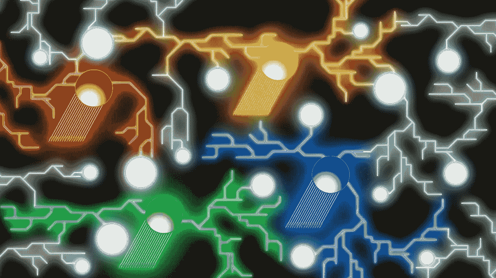

# 经济学的颜色

> 原文：<https://medium.com/coinmonks/colors-of-evernomics-c1d60d300699?source=collection_archive---------8----------------------->

SVET is Light, By Svet and Victor

马克思的“劳动力”是隐藏在所有工人内心的怪兽。当马克思的人来到他的工作场所时，这个野兽把他的身体变成了最终生产者的形状，这个生产者会使用任何手段来为生产目的发挥他的最大作用。

“以商品交换为基础，我们的第一个假设是，资本家和劳动者作为自由人，作为商品的独立所有者相遇；一个拥有金钱和生产资料，另一个劳动力。”卡尔·马克思。资本论第一卷。第十五章。第 3 节]

这种野兽在生产“绝对和相对剩余价值”方面简直是不可思议的，它在所有可以想象的情况下，特别是在由改进的工具提供的情况下，都以最快和最好的方式做到了这一点。然而，资本主义者似乎从野兽的爪子里拿走了剩余价值，使那个人只剩下微薄的收入来维持悲惨的生活。

自然，马克思阐述了，减少工作日，提出了“工厂检查员，内政大臣直属”[卡尔·马克思。资本论第一卷。第十章。第 2 节]无法保护野兽般的人对抗资本家的贪婪。神奇的野兽太好了。它总是设法把剩余价值挤压到它的生产活动的每一个时刻，这使一个人别无选择，只能在资本家出现在他面前的任何时候交出剩余价值。

因此，如果我们把人和兽分开，那么价值的形成就成了谜。当然，除非我们也把价值从一个男人身上分走。

让我们假设价值不是作为一个人内心的野兽而存在，而是作为一个人外部的野兽而存在。价值是关于所有事物相对于“一个普通人”大小的意义的共识。人的体型决定了他所有的生活必需品。缺少其中任何一种必需品都会导致这个人的痛苦。当一个人随着时间进化时，这种进化会调整他的情绪，下意识地避免必需品短缺的状态。

当一个人面对可能有助于他避免这种缺陷的事物时，调谐的情感器官向他的大脑提供积极的化学刺激。有意识地，男人将高价值与强烈的积极刺激联系起来，反之亦然。

然而，因为‘人天生是群居动物；一个天生不合群而非偶然不合群的个体，要么不在我们的注意之下，要么超过人类[亚里士多德，政治学，第一册，第 1253a 节]，他(人)主要不是受自己的情绪影响，而是受“集体标准情绪反应”的影响。这意味着一个男人倾向于更看重那些由多数人的“情感投票”或“价值共识”选择的东西。

此外，众所周知，新物种出现得非常缓慢，一个接一个，无论是在陆地上还是在水中。【查尔斯·达尔文《物种起源》第十章】。这使得人类的基本情感反应(以及随之而来的“价值共识”)在历史上相对一致。

价值不是神秘的野兽。

尽管李嘉图经济学家从工人在物质生产上花费的时间量中得出这个假设，但它与我们的常识和直觉相矛盾。大卫·李嘉图和他的继任者卡尔·马克思不会重视一个想法、一个灵感或一种热情。然而，我们都知道事实并非如此。

永恒经济学是永恒的经济学。人类倾向于为后代保存他们的情感，就像保存他们的黄金一样，比保存他们的金字塔更好。Evernomics 引入了 S.V.E.T .分析框架，将情绪分为 16 个深度或分析类别。

每个深度都与人类社会和商业活动或工作的一个特定领域相关，这往往会影响我们身体的相应部分的敏感性或脆弱性机制，从而在所有人类中产生类似的强烈情绪反应。

人类的工作或职业随着我们的聪明才智一代一代地改变，这是社会技术进步的原因，但情感保持不变。这就是价值观如何形成并从我们的祖先传递给我们的子孙。

# S.V.E.T .深度:

**第一层是“安全”。正是人类的活动激发了最强烈的情感，并因此成为人类最有价值的财富之一。在社会背景下，它有多种形式，包括“身体安全”、“家庭安全”、“国家安全”。它还与“储备”和“保护”等概念密切相关。**

**第二个深度是“速度”或“活力”。**它的联想词是“运动”、“日常”、“组织”和“健康”。这种活动帮助我们成长，并在我们的天性允许的范围内扩展我们的影响。在一个商业单位中，它表现为有能力在市场条件允许的情况下接触尽可能多的顾客。因此，当这些活动受到外界威胁时，我们会产生强烈的情绪反应。我们高度重视一切有助于我们保持成长能力的东西。

**第三层是“工程”或“环境”。我们触摸、看到或闻到的所有东西都是围绕在我们周围的，就在我们身边。因此，我们非常重视与物质环境互动所产生的情感。在我们商业活动的产品中，我们寻求所有部分的和谐。完全符合我们感官的产品比其他产品更有价值。**

**第四层是“透明度”或“传统”。**也与‘治理’有关。“谁管理我们，如何管理我们”这个问题对我们所有人来说一直是最重要的。我们向任何试图压制我们自然自由的人发出了强烈的情感信号。我们重视我们立即识别可能导致我们受压迫的因素的能力。这种能力很大程度上取决于我们能够获取的信息量。因此，该信息的可用性对我们来说具有很高的价值。

**第五个深度是“奇点”或“自我”。**我们像保护自己的生命一样保护自己的身份。我们不喜欢被复制。因此，在我们的商业交往中，我们对稀有产品的重视程度远远高于常见产品。

**第六深是‘音量’或‘声音’。**我们的感官受到我们接收到的冲动的大小以及我们与外部环境的互动量的高度影响。高而尖的声音会激怒我们，而低沉缓慢的声音会让我们放松和自信。人类之间最有价值的互动是通过声音。最频繁的语音通信提供了最丰富的情感背景。在物质方面，我们高度重视大物件或大量小物件。它与“财富”有关。

**第七深是‘移情’或‘伦理’。我们同情我们的部落成员——那些与我们有着相同信仰和道德观的人。我们通过共同的象征，包括语言、宗教和科学，在深层的精神和智力层面上与我们自己进行情感交流。我们的部落越大，它赋予我们的价值就越大。从商业上来说，我们最重视那些被我们部落的大多数人所重视的东西。**

**第八个深度是“时间线”或“明天”。我们对未来的感觉将我们与现实联系在一起。我们无法预测未来，这刺激了我们的幻想，从而产生了发明。那是人类情感最高层次的领域。在我们的经济互动过程中，定期获取生计需要准确的预测。我们非常重视我们想象中的计划和预测未来事件的能力。**

**第九深是‘溶液’或‘鞋底’。我们在行动中表现自己。我们传递积极结果的能力会影响我们每天的情绪，并自发地激发他人的积极情绪。在我们的长期企业中，我们高度重视它们的基础结构，这使它们能够为我们和我们的家庭成员持续产生收入。**

**第十深是‘有效期’或‘年份’。**人类确实相信他们根植于他们的传统。这就是我们错误地试图永远保存我们自己的方式。我们非常珍视我们的尊严和血统，并努力在法律中保护它。我们通过墨迹记录把我们的财产传给后代。我们高度重视有卓越记录的古老事物。

**第 11 深是‘股权’或‘退出’。**我们以一种资产的形式积累财产，以为年老时会得到照顾。这也在情感上把我们和后代联系在一起。

**第十二渊是‘团队’或‘部落’。我们家庭和部落的组成以及我们与他们的关系每天都影响着我们的情绪。这种价值观同样适用于我们的个人生活和社交生活。**

**第十三层是“可持续性”或“感觉”。**当我们的潜意识与我们的感官完美地相互作用时，这种“心流”状态允许我们无差错地自发行动，这对所有人都有重要的价值。一个可持续发展的企业通过对时间的执着来积累价值。

**第十四深是‘勇猛’或‘冒险’。侵略性被认为是人类主动抵抗熵的能力。冒险去征服比今天拥有的更多的明天的生存空间是一个商业公司的主要驱动力。在金融领域，征服也伴随着价格上涨。**

**十五深是‘订婚’或‘入伍’。**除了精神之外，纯粹的地理或结构关系显著地影响着我们与我们部落的情感关系。属于某个组织或与某个组织合作的官员有很大的商业价值。

**第十六深是‘交易’或‘人才’。**从情感上讲，人才具有巨大的人类价值，是人类社会和个人进步的特权。然而，在商业方面，它反映了大量的工匠大量生产流行的艺术作品，以满足当前消费者对它的需求，从经济角度来看，尽可能多的交易是可行的。

# 更多:[http://evernomics.com/](http://evernomics.com/)

> 加入 Coinmonks [电报频道](https://t.me/coincodecap)和 [Youtube 频道](https://www.youtube.com/c/coinmonks/videos)了解加密交易和投资

## 也阅读

 [## 最佳加密交易所| 2021 年十大加密货币交易所

### ICON _ PLACEHOLDEREstimated 预计阅读时间:28 分钟加密货币交易所的加密交易需要知识…

blog.coincodecap.com](https://blog.coincodecap.com/crypto-exchange)  [## 2021 年 10 大最佳加密贷款平台| CoinCodeCap

### 当谈到加密货币贷款时，大量因素等同于良好的收入状况。此外，借款的一部分…

blog.coincodecap.com](https://blog.coincodecap.com/crypto-lending)  [## 2021 年最佳免费加密交易机器人

### 2021 年币安、比特币基地、库币和其他密码交易所的最佳密码交易机器人。四进制，位间隙…

medium.com](/coinmonks/crypto-trading-bot-c2ffce8acb2a)  [## 最佳 4 个加密交易信号电报通道

### 这是乏味的找到正确的加密交易信号提供商。因此，在本文中，我们将讨论最好的…

medium.com](/coinmonks/best-crypto-signals-telegram-5785cdbc4b2b)  [## BlockFi 评论 2021:利弊和利率| CoinCodeCap

### 今天，我们提出了一个全面的 BlockFi 评论，这是一个成立于 2017 年的加密贷款平台，拥有其…

blog.coincodecap.com](https://blog.coincodecap.com/blockfi-review)  [## 如何在印度购买比特币？2021 年购买比特币的 7 款最佳应用[手机版]

### 如何使用移动应用程序购买比特币印度

medium.com](/coinmonks/buy-bitcoin-in-india-feb50ddfef94)  [## 加密税务软件——五大最佳比特币税务计算器[2021]

### 不管你是刚接触加密还是已经在这个领域呆了一段时间，你都需要交税。

medium.com](/coinmonks/best-crypto-tax-tool-for-my-money-72d4b430816b)  [## 存储比特币的最佳加密硬件钱包[2021] | CoinCodeCap

### 保管您的数字资产很容易，但找到正确的存储方式却是一项繁琐的任务。在线钱包有一个风险…

blog.coincodecap.com](https://blog.coincodecap.com/best-hardware-wallet-bitcoin)