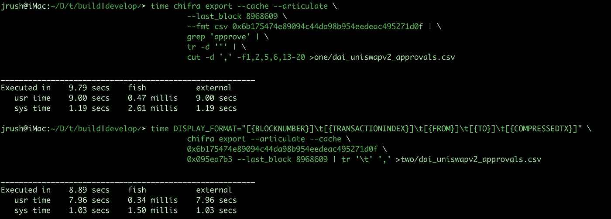

# 指挥队伍

> 原文：<https://medium.com/coinmonks/commanding-the-line-ca5fe3496ae1?source=collection_archive---------4----------------------->

## 我们许多人都在 Linux 命令行上生活和工作。

自 1986 年以来，我一直住在那个街区。大部分时间，命令行命令我。但最终，我开始指挥命令行。

在这篇文章中，我将与你分享一个命令命令行的例子。我要抓住命令行的衣领，摇晃它，直到它做我想要的。我攻击的目标将是我们的一个用户提供的 TrueBlocks 命令行。(感谢 [Pintail](https://medium.com/u/6d4922da4628?source=post_page-----ca5fe3496ae1--------------------------------) 。)

## 使用 Linux 管道

首先，我将向您展示一个用户与我们分享的命令:

```
chifra export --cache --articulate \
    --first_block 12550000 --last_block 13520000 \
    --fmt csv 0x6b175474e89094c44da98b954eedeac495271d0f | \
    grep 'approve' | \
    tr -d '"' | \
    cut -d ',' -f1,2,5,6,13-20 \
    > dai_uniswapv2_approvals.csv
```

翻译成英语，这表示:

> 根据 DAI stable coin(**0x6b 17…710f**)显示每笔交易，从块 **12，550，000** 开始，持续到块 **13，520，000** 为止，包括以 **CSV** 格式报告结果。此外，**清晰地表达**这些结果，并且**在进行过程中缓存**查询。然后…
> 
> 通过 **grep** 推送结果，只挑选令牌批准交易；删除引号；并且，使用逗号作为字段分隔符，提取第一、第二、第五、第六和第十三到第二十个字段(blockNumber、transactionIndex、from、to、compressed tx)；最后，将结果存储在一个名为 ***的文件中***

瞧——我告诉过你。命令行倾向于命令用户。这是个疯狂的命令。

## 我们能对此进行改进吗？

是的。

## 怎么会？

在上面的命令中有五种情况:

1.  生成与 **chifra export** 的交易清单
2.  用 **grep** 过滤*审批*的记录
3.  用 **cut** 只提取每个记录中的五个字段
4.  用 **tr** 删除引号
5.  使用重定向( **>** )将结果存储在文件中

我们将从简化事物开始。

我们删除了上面命令中与本文无关的任何部分(选项`—-cache`和选项`--first_block`和`--last_end`块选项)。我们将保留`--articulate`选项。我们还将删除管道，grepping，转换，并重新定向。

因此，我们只剩下这个命令:

```
chifra export --fmt csv \
    --articulate 0x6b175474e89094c44da98b954eedeac495271d0f
```

这个命令显示了 DAI Stablecoin 整个历史中的每一笔交易。我们将从这里添加回期权。注意:这是非常大的数据量。您可以使用`--first_block/--last_block`或`--first_record/--max_records`限制结果。参见[文档](https://trueblocks.io/docs/chifra/accounts/#chifra-export)。

## 筛选审批记录

如果你运行命令`chifra export --help`，你会看到这个摘要:

```
chifra export [flags] \
    <address> [address...] [topics...] [fourbytes...]
```

您可以看到，不仅可以向导出命令提供`addresses`，还可以提供一个或多个`topics`和/或一个或多个`fourbyte`签名。

为了找到我们感兴趣的`fourbyte`签名，我们可以执行以下命令:

```
chifra abis 0x6b175474e89094c44da98b954eedeac495271d0f | grep approve
```

它返回:

```
**fourbyte       type         name        signature**
-----------------------------------------------------------------
0x095ea7b3     function     approve     approve(address,uint256)
```

我们可以将这个`fourbyte`签名添加到我们不断增长的命令中:

```
chifra export --fmt csv --articulate \
    0x6b175474e89094c44da98b954eedeac495271d0f \
    0x095ea7b3
```

该命令显示针对 DAI 运行的每个`approve`事务。

上述命令取代了原命令中对`**grep**`的需要。这也比原来的命令快，因为许多事务(不是`approve`的事务)从来没有生成。没有必要把他们赶出去。

## 字段选择

**注:**以下部分描述了真砌块的实验特征。在未来的版本中，我可能会被删除或更改。慎用。

最初的命令使用`tr`从输出中删除引号，使用`cut`从数据中选择字段 1、2、5、6 和 13–20。这可以通过使用 TrueBlocks 的一个未记录的(因此是实验性的)特性“显示字符串”来实现。我不会解释显示字符串，因为这篇文章已经很长了，但是它们允许您选择字段并(实际上)描述您想要的数据的确切输出。

运行以下命令:

```
DISPLAY_FORMAT="[{BLOCKNUMBER}]" \
    chifra export --fmt txt --articulate \
    0x6b175474e89094c44da98b954eedeac495271d0f \
    0x095ea7b3 2>/dev/null
```

**注:**为了让显示的数据更清晰，我把导出格式从`csv`改成了`txt`。这也修复了原始命令的一个问题。`compressedTx`字段包含逗号，所以使用 CSV 实际上不起作用，因为字段会变得混乱。

上面的命令产生一行又一行，只显示每个事务的`**blockNumber**` 。

运行以下命令:

```
DISPLAY_FORMAT="[{BLOCKNUMBER}][{TRANSACTIONINDEX}]" \
    chifra export --fmt csv --articulate \
    0x6b175474e89094c44da98b954eedeac495271d0f \
    0x095ea7b3 2>/dev/null
```

一排排的`**blockNumber**`和`**transactionIndex**`。你明白了。

您可以使用环境变量告诉 TrueBlocks 显示哪些字段。

字段 1、2、5、6 和 13-20 对应于`**blockNumber**`、`**transactionIndex**`、`**from**`、`**to**`和`**compressedTx**`。您可以在这里看到导出的[字段](https://trueblocks.io/data-model/chaindata/#transaction)。

将此扩展到我们想要的字段，命令变成:

```
DISPLAY_FORMAT="[{BLOCKNUMBER}]\t[{TRANSACTIONINDEX}]\t[{FROM}]\t[{TO}]\t[{COMPRESSEDTX}]" \
    chifra export --articulate \
    0x6b175474e89094c44da98b954eedeac495271d0f \
    0x095ea7b3 2>/dev/null
```

**注意:** 你必须修复上面的命令，把它放在一行。

如果您通过`| head -1`运行上面的命令，您会看到只有我们感兴趣的字段被导出:

```
blocknumber    transactionindex   from   to   compressedtx
```

没有报价。这就是我们想要的。这个命令更快，因为你不需要通过`**cut**`命令传输无关数据。当您进行命令行数据处理时，每一个微小的调整都很重要。

## 将结果存储在文件中

到目前为止，我们已经排除了`**grep**`、`**cut**`和`**tr**`。我们能消除重定向吗？

是的。

Chifra 有一个名为`--output <filename>`的选项，让用户指定结果数据的目的地。

最后，改进后的命令是:

```
DISPLAY_FORMAT="[{BLOCKNUMBER}]\t[{TRANSACTIONINDEX}]\t[{FROM}]\t[{TO}]\t[{COMPRESSEDTX}]" \
    chifra export --articulate \
    0x6b175474e89094c44da98b954eedeac495271d0f \
    0x095ea7b3 --output dai_uniswapv2_approvals.csv
```

注:编辑成一行。

## 表演

下面是测试这两个命令速度的结果:



**9.79** 秒为原始命令。**用新命令 8.89** 秒。10%的增速。没有我希望的那么好，但至少有所收获。

上面的时间测试是针对 1，360 个事务运行的。DAI 智能合约(截至撰写本文时)已有 12，956，972 笔交易。我们找到了这个号码:

```
chifra list --count 0x6b175474e89094c44da98b954eedeac495271d0f`
```

这意味着，为了提取每一笔交易，我们将不得不等待比上述测试长`9,527.18`倍的时间。

对于第一个命令，这将是 9.79 秒* 9527.18 = 25.9 小时。

对于第二个命令，需要 8.89 * 9527.18 = 23.52 小时。

节省了两个多小时。差价带自己出去吃饭。

# 支持我们的工作

TrueBlocks 完全由我们自己的个人基金和一些赠款自筹资金，如以太基金会(2018 年)、Consensys (2019 年)、Moloch DAO (2021 年)和最近的 Filecoin/IPFS (2021 年)。

如果你喜欢这篇文章或者你只是想支持我们的工作，请访问我们的 git coin grant[https://gitcoin.co/grants/184/trueblocks](https://gitcoin.co/grants/184/trueblocks)。捐赠给下一轮比赛。我们得到了额外的好处，那就是更多的匹配资助。即使很少的量也会有很大的影响。

如果您愿意，可以随时将任何代币发送到我们的公共以太坊地址 **trueblocks.eth** 或 0xf 503017d 7 BAF 7 FBC 0 fff 7492 b 751025 c6a 78179 b。

> 加入 Coinmonks [电报频道](https://t.me/coincodecap)和 [Youtube 频道](https://www.youtube.com/c/coinmonks/videos)了解加密交易和投资

## 另外，阅读

*   [Blockfi vs 比特币基地](https://blog.coincodecap.com/blockfi-vs-coinbase) | [比特坎评论](https://blog.coincodecap.com/bitkan-review) | [币安评论](/coinmonks/binance-review-ee10d3bf3b6e)
*   [Coldcard 评论](https://blog.coincodecap.com/coldcard-review) | [BOXtradEX 评论](https://blog.coincodecap.com/boxtradex-review)|[uni swap 指南](https://blog.coincodecap.com/uniswap)
*   [阿联酋五大最佳加密交易所](https://blog.coincodecap.com/best-crypto-exchanges-in-uae) | [SimpleSwap 评论](https://blog.coincodecap.com/simpleswap-review)
*   购买 Dogecoin 的 7 种最佳方式
*   [iTop VPN 审查](https://blog.coincodecap.com/itop-vpn-review) | [曼陀罗交易所审查](https://blog.coincodecap.com/mandala-exchange-review)
*   [比特币基地 vs 瓦济克斯](https://blog.coincodecap.com/coinbase-vs-wazirx) | [比特鲁点评](https://blog.coincodecap.com/bitrue-review) | [波洛涅克斯 vs 比特克斯](https://blog.coincodecap.com/poloniex-vs-bittrex)
*   [美国最佳加密交易机器人](https://blog.coincodecap.com/crypto-trading-bots-in-the-us) | [经常性回顾](https://blog.coincodecap.com/changelly-review)
*   [A-Ads 审查](https://blog.coincodecap.com/a-ads-review) | [Bingbon 审查](https://blog.coincodecap.com/bingbon-review) | [Mudrex 投资](https://blog.coincodecap.com/mudrex-invest-review-the-best-way-to-invest-in-crypto)
*   [最好的卡达诺钱包](https://blog.coincodecap.com/best-cardano-wallets) | [Bingbon 副本交易](https://blog.coincodecap.com/bingbon-copy-trading)
*   [印度最佳 P2P 加密交易所](https://blog.coincodecap.com/p2p-crypto-exchanges-in-india) | [柴犬钱包](https://blog.coincodecap.com/baby-shiba-inu-wallets)
*   [八大加密附属计划](https://blog.coincodecap.com/crypto-affiliate-programs) | [eToro vs 比特币基地](https://blog.coincodecap.com/etoro-vs-coinbase)
*   [最佳以太坊钱包](https://blog.coincodecap.com/best-ethereum-wallets) | [电报上的加密货币机器人](https://blog.coincodecap.com/telegram-crypto-bots)
*   [交易杠杆代币的最佳交易所](https://blog.coincodecap.com/leveraged-token-exchanges)