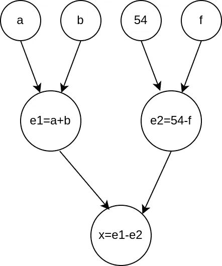
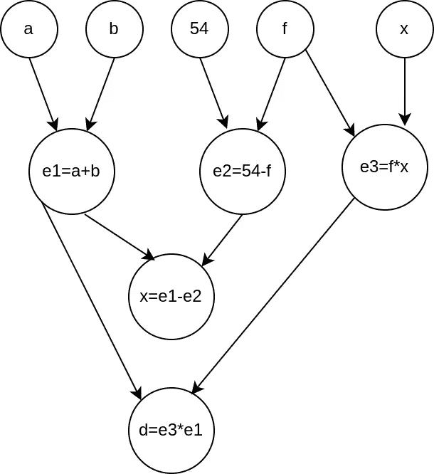
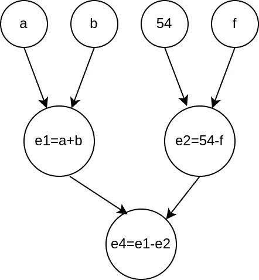
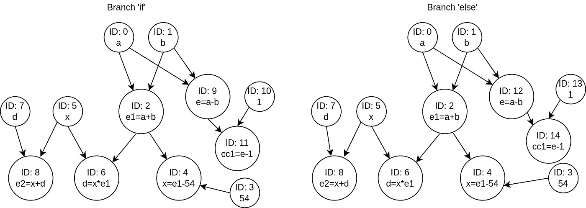

# Solang 编译器的公共子表达式消除

> 原文：<https://medium.com/coinmonks/common-subexpression-elimination-for-the-solang-compiler-c36884821578?source=collection_archive---------6----------------------->


Photo by [JJ Ying](https://unsplash.com/@jjying?utm_source=medium&utm_medium=referral) on [Unsplash](https://unsplash.com?utm_source=medium&utm_medium=referral)

这是我作为[索朗编译器](https://github.com/hyperledger-labs/solang)的学员的第二篇文章。如果你没有看过我的第一篇文章，请点击这里查看。简单介绍一下，2021 年 6 月，我申请了 Linux Foundation mentorhship，并获得了实现未定义变量检测、未使用变量消除和公共子表达式消除的许可。在本文中，我将解释从 Solang 的中间表示中删除重复表达式的算法。

这种消除在索朗的控制流图(CFG)上使用了两次传递。在第一种方法中，我们使用图形数据结构检测重复表达式，在第二种方法中，我们删除它们。第一遍跟踪每个 CFG 指令的可用表达式。Solang 在每个表达式中保存表达式。例如，下面显示的 *Set* 指令包含它的位置(指令在实体文件中的位置)，一个指示函数符号表中变量索引的数字和一个表达式，它是赋值的右边。

在 Solang 的中间表示中，其操作的顺序相当于对表示指令的每个表达式的树的有序遍历。一种容易跟踪我们已经计算过的表达式的方法是创建一个修改过的树的表示，其中我们添加了我们已经处理过的所有表达式，注意避免重复。这个表示包含了到目前为止计算的所有可能的操作。我们基本上将所有处理过的表达式树合并成一个图。例如，考虑以下代码:

```
x = a+b-(54-f);
int d = f*x*(a+b);
```

当我们解析包含表达式' *a+b-54* '的第一行时，我们得到了下面的图形:



变量和常量的入度等于零，因为它们不是来自任何运算。图形数据结构向我们展示了下一条指令可用的表达式，并允许我们快速识别重复的表达式。当我们处理`x*f*(a+b)`时，图形变成如下:



节点`e1=a+b`的出度为 2，这意味着表达式`a+b`在整个代码中使用了两次。重新分配变量时，变量的值可能会改变。如果发生这种情况，包含此类变量的所有表达式都将变得不可用。根据我们的图，这个操作转化为删除变量节点及其所有后代。当我们给`x`赋予另一个值时，图表变成如下:



请注意，不仅依赖于`x`的所有表达式都已从图中删除，而且节点`x=e1-e2`也已更改为`e4=e1-e2`，因为`x`不再代表表达式`e1-e2`。

值得一提的是，我们创建的日期结构还使我们能够跟踪部分表达式。在给定的例子中，我们能够跟踪`a+b`，它只是另一个表达式中的一个表达式。

现在我们已经展示了如何使用我们的图来识别可用的表达式，有一个新的问题我们必须解决:分支。考虑以下坚实度函数:

表达式`a-b`在两个分支上都可用，并在 return 语句中使用。我们的算法应该能够检测到`a-b`在分支之后可用。为了解决这个问题，我们为每个分支创建一个图的副本(如果则为*，否则为*则为*)，这样新的表达式将被独立地插入到每个副本中。在分支之后，我们必须相交两个图，但是必须有一种方法来区分分支之前可用的表达式、在两个分支内部创建的公共表达式和在分支内部创建的非公共表达式。*

我们为图中的每个节点分配一个唯一的标识符(ID)。这样，在分支之前可用的表达式在两个分支上都具有相同的 ID。添加到图中的每个新表达式，无论哪个副本都将有一个新的唯一 ID。我们可以识别出`a-b`在分支之后是可用的，因为`a`和`b`的 id 以及减法运算在我们交叉它们时在两个分支的图上是一致的。我们通过操作数的 ID 和操作的散列来标识图中的每个节点(下面显示了一个 *ExpressionType* 的散列)。使用这样的逻辑，我们可以快速识别一个操作在图中是否可用。下面的代码片段显示了我们如何在 Rust 中存储图形。

我们描述的推理只适用于包含分支前可用操作数的表达式。如果我们有以下情况:

我们的代码无法知道`e-1`在两个分支上都可用，因为它的操作数有不同的标识符。我们还假设开发人员能够意识到他们在所有分支上使用了两个等效的操作，并且会尝试更改他们的代码以获得更好的可读性。我们在下面展示了这两个分支的图形。尽管`a-b`在每个副本上有不同的 ID，但我们检测到它是相同的表达式，因为操作数的 ID 是一致的，减法运算也是如此。



我们设置了一系列规则来无缝交叉图表。保留具有相同标识符的节点，以及那些全局标识符不同，但其*表达式类型*相同的节点(本例中的`a-b`就是这种情况)。在这种情况下，我们必须从内存中删除这样一个节点的所有子节点，因为我们没有跟踪其操作数在分支之前不可用的表达式。

到目前为止，我们解释了如何进行可用表达式分析。我们现在将解释我们如何利用图形数据结构来消除常见的子表达式。在第一遍中，我们可以使用图表来识别重复的表达式，正如我们已经解释过的。我们创建了一个新的结构来跟踪公共子表达式。一旦我们发现一个重复的表达式，我们就把它保存在哈希表中(跟踪器本身)。哈希表的关键字是由操作数 ID 和操作组成的*表达式类型*。

跟踪器不仅保存重复的表达式本身，还保存应该实例化该表达式的块，如果已经有一个携带表达式值的局部变量。我们需要知道表达式应该在哪个块中被实例化，因为如果我们处理在分支内部可用并在分支之后使用的表达式，表达式必须在分支命令之后被解析。这种情况的一个例子如下所示:

表达式`a-b`应该在 *if* 条件之前被解析，这样在两个分支和返回语句中都有一个变量携带它的值。优化后的 CFG 如下所示:

```
block0: # entry
ty:int256 %a = (arg #0)
ty:int256 %b = (arg #1)
ty:int256 %x = undef
ty:int256 %1.cse_temp = ((arg #0) + (arg #1))
ty:int256 %x = (%1.cse_temp - int256 54)
ty:int256 %d = (%x * %1.cse_temp)
ty:int256 %2.cse_temp = ((arg #0) - (arg #1))
branchcond ((%x + %d) > int256 0), block1, block2
block1: # then
# cc1 and e1 are removed because they are unused
ty:int256 %e = %2.cse_temp
branch block3
block2: # else
# cc2 and e2 are removed because they are unused
ty:int256 %e.8 = %2.cse_temp
branch block3
block3: # endif
return ((%x - %d) + %2.cse_temp)
```

我们还跟踪一个表达式所赋的变量，以避免创建不必要的临时变量。在上面的例子中，如果`x*(a+b)`在分配后再次出现，我们将在`d`前交换它。

当我们的追踪器有了所有重复的表情，我们在 CFG 上执行第二遍。我们再次构建图形数据结构，因为它是确定性的，所以它保留了第一遍中节点的唯一标识符。在处理我们的跟踪器中的表达式时，我们通过它的 *ExpressionType* 的散列来识别它，并且，如果有一个变量包含已解析表达式的值，我们可以用这个变量交换整个表达式。它可以是临时的，也可以是现有的局部变量。

Solang 中的每条指令都包含表达式，必须对这些表达式求值才能执行这些指令。例如，如果指令是一个函数调用，我们必须在调用函数之前评估它的参数。因此，为了在第二遍期间执行公共子表达式消除，我们遍历每个指令的表达式树。如果没有可用的变量，我们的遍历递归地重新生成每个节点，如果有可用的变量，则用一个变量节点交换节点。

临时变量在它们所代表的表达式第一次使用之前的指令中被实例化。对于必须在分支内部可用的临时程序，它们是在分支块的第一个公共祖先块中创建的。

Solang 的到达定义还不适用于契约变量、结构成员和数组，所以我们常见的子表达式消除仅限于局部变量。到达定义对于整个算法来说非常重要。举以下例子:

表达式`x+d`在循环中显然是可用的。但是，由于`x`的值不断变化，我们无法通过局部变量`p`来交换`x+d`。到达定义告诉我们来自后代块的定义在 *while* 块的开始是可用的。这意味着我们必须在继续分析之前杀死`x`，即使我们还没有处理分配给`x`的任务。尽管如此，算法检测到在`x`被赋予新值之前`x+d`在循环中被计算了两次，因此表达式被优化，如下所示:

```
block0: # entry
ty:int256 %a = (arg #0)
ty:int256 %b = (arg #1)
ty:int256 %x = undef
ty:int256 %1.cse_temp = ((arg #0) + (arg #1))
ty:int256 %x = (%1.cse_temp - int256 54)
ty:int256 %d = (%x * %1.cse_temp)
ty:int256 %p = (%x + %d)
branch block1
block1: # cond
ty:int256 %2.cse_temp = (%x + %d)
branchcond (%2.cse_temp > int256 0), block2, block3
block2: # body
ty:int256 %t = ((arg #0) - (arg #1))
ty:int256 %x = %2.cse_temp
branch block1
block3: # endwhile
return (((%x - %d) + ((arg #0) - (arg #1))) - %p)
```

该算法已经显示出适合我们的用例。下面是一个函数及其优化 CFG 的好例子。

```
block0: # entry
ty:int256 %a = (arg #0)
ty:int256 %b = (arg #1)
ty:int256 %ret = int256 0
ty:int256 %x = (((arg #0) + (arg #1)) + int256 5)
branchcond ((%x + int256 5) < int256 0), block1, block2
block1: # then
ty:uint256 %p = uint256(%x)
branch block2
block2: # endif
ty:uint256 %p2 = uint256(%x)
ty:int256 %1.cse_temp = int256((%p2 + uint256 9))
ty:int256 %r1 = (%1.cse_temp - int256 4)
ty:int256 %r2 = (%1.cse_temp - int256 9)
ty:int256 %ret = -%r1
ty:int256 %ret = (%ret + %r2)
return %ret
```

从生成的 CFG 中，我们注意到该算法的一些优点。首先，它没有为`(((arg #0) + (arg #1)) + int256 5)`创建一个临时的，因为`x`已经可用于此目的。第二，在`int(p2+9)`它没有为`p2+9`创建一个变量，因为我们稍后只需要`int(p2+9)`。

普通子表达消除对索朗来说是一个全新的过程。在网上做了一些研究后，除了理论上的解释，我找不到任何关于其实现的文档，所以我设计了自己的方法来解决这个问题。Linux 导师计划是一次丰富的经历，在此期间，我深入编译器并建立了新的联系。

> 加入 Coinmonks [电报频道](https://t.me/coincodecap)和 [Youtube 频道](https://www.youtube.com/c/coinmonks/videos)了解加密交易和投资

## 另外，阅读

*   [3 商业评论](/coinmonks/3commas-review-an-excellent-crypto-trading-bot-2020-1313a58bec92) | [Pionex 评论](https://blog.coincodecap.com/pionex-review-exchange-with-crypto-trading-bot) | [Coinrule 评论](/coinmonks/coinrule-review-2021-a-beginner-friendly-crypto-trading-bot-daf0504848ba)
*   [莱杰 vs n rave](/coinmonks/ledger-vs-ngrave-zero-7e40f0c1d694)|[莱杰 nano s vs x](/coinmonks/ledger-nano-s-vs-x-battery-hardware-price-storage-59a6663fe3b0) | [币安评论](/coinmonks/binance-review-ee10d3bf3b6e)
*   [Bybit 交易所评论](/coinmonks/bybit-exchange-review-dbd570019b71) | [Bityard 评论](https://blog.coincodecap.com/bityard-reivew)
*   [3 commas vs crypto hopper](/coinmonks/3commas-vs-pionex-vs-cryptohopper-best-crypto-bot-6a98d2baa203)|[赚取秘密利息](/coinmonks/earn-crypto-interest-b10b810fdda3)
*   最好的比特币[硬件钱包](/coinmonks/hardware-wallets-dfa1211730c6) | [BitBox02 回顾](/coinmonks/bitbox02-review-your-swiss-bitcoin-hardware-wallet-c36c88fff29)
*   [BlockFi vs Celsius](/coinmonks/blockfi-vs-celsius-vs-hodlnaut-8a1cc8c26630)|[Hodlnaut 点评](/coinmonks/hodlnaut-review-best-way-to-hodl-is-to-earn-interest-on-your-bitcoin-6658a8c19edf) | [KuCoin 点评](https://blog.coincodecap.com/kucoin-review)
*   [Bitsgap 审查](/coinmonks/bitsgap-review-a-crypto-trading-bot-that-makes-easy-money-a5d88a336df2) | [Quadency 审查](/coinmonks/quadency-review-a-crypto-trading-automation-platform-3068eaa374e1) | [Bitbns 审查](/coinmonks/bitbns-review-38256a07e161)
*   [密码本交易平台](/coinmonks/top-10-crypto-copy-trading-platforms-for-beginners-d0c37c7d698c) | [Coinmama 审核](/coinmonks/coinmama-review-ace5641bde6e)
*   [币安 vs FTX](https://blog.coincodecap.com/binance-vs-ftx) | [最佳(SOL)索拉纳钱包](https://blog.coincodecap.com/solana-wallets)
*   [比诺莫评论](https://blog.coincodecap.com/binomo-review) | [斯多葛派 vs 3Commas vs TradeSanta](https://blog.coincodecap.com/stoic-vs-3commas-vs-tradesanta)
*   [Capital.com 评论](https://blog.coincodecap.com/capital-com-review) | [香港的加密借贷平台](https://blog.coincodecap.com/crypto-lending-hong-kong)
*   如何在 Uniswap 上交换加密？ | [A-Ads 评论](https://blog.coincodecap.com/a-ads-review)
*   [WazirX vs coin dcx vs bit bns](/coinmonks/wazirx-vs-coindcx-vs-bitbns-149f4f19a2f1)|[block fi vs coin loan vs Nexo](/coinmonks/blockfi-vs-coinloan-vs-nexo-cb624635230d)
*   [本地比特币审核](/coinmonks/localbitcoins-review-6cc001c6ed56) | [加密货币储蓄账户](https://blog.coincodecap.com/cryptocurrency-savings-accounts)
*   [什么是融资融券交易](https://blog.coincodecap.com/margin-trading) | [美元成本平均法](https://blog.coincodecap.com/dca)
*   [维护卡审核](https://blog.coincodecap.com/uphold-card-review) | [信任钱包 vs MetaMask](https://blog.coincodecap.com/trust-wallet-vs-metamask)