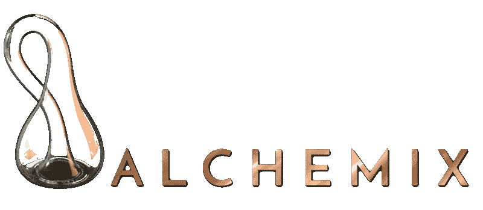
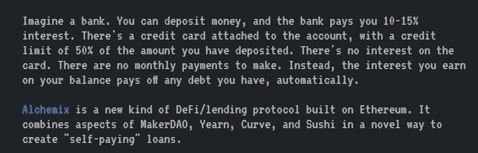
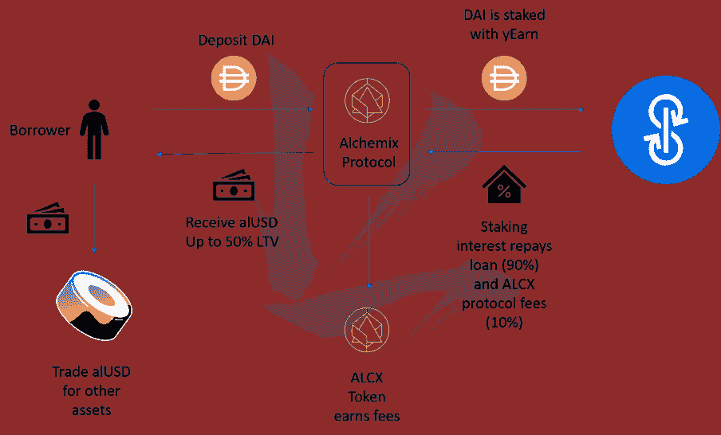
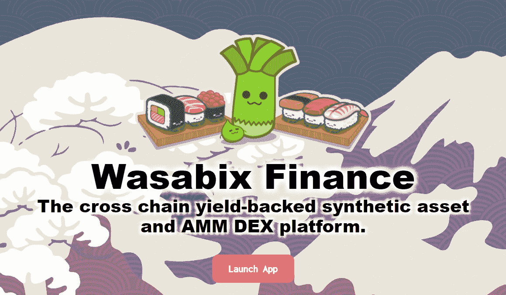
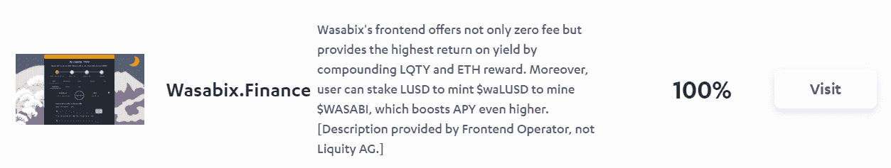

# 【公司观察】Alchemix 和 WasabiX:自付贷款和它们是什么？

> 原文：<https://medium.com/coinmonks/company-watch-alchemix-and-wasabix-self-paying-loans-and-what-are-they-143e69eb2059?source=collection_archive---------3----------------------->

如果加密货币有广告创意奖，应该颁给 Alchemix。从本质上来说，Alchemix 是一种服务，它允许人们将戴存入农场，并用自己的代币激励储户；但是听起来比“自付贷”枯燥很多。

在 Alchemix 的官网上，它被描绘成“银行账户+信用卡”的替代品。在任何人的心目中，银行账户利息惨，信用卡利率贵。有了 Alchemix，人们可以从储蓄 DAI 和零(实际上是负)信用卡利率中获得很高的利息。

Alchemix 的工作很简单:

*   取戴的存款，放入[向往的戴金库](https://yearn.finance/vaults)，现在 10%的收益率
*   存款人可以以 200%的抵押贷款 alUSD，例如每 DAI 0.5 alUSD。Alchemix 可以在任何时候用 1 alUSD 兑换 1 DAI，因为它有足够的超额抵押
*   来自渴望金库的收益的 90%被累积，10%归协议所有
*   从会计角度来看，累积收益属于储户。虽然有些协议会发放股息，但 Alchemix 只是做了一个簿记，将收益记入储户贷款的贷方。随着时间的推移，例如 5 年，1 DAI 的收益率将为 0.5 DAI，并扣除 0.5 alUSD 贷款。换句话说，贷款已经偿还了。(还好不是。实际情况是，存款人用他们的存款 DAI 收益来支付他们的 alUSD 贷款的本金。)
*   借用的 alUSD 可以用作 stablecoins。目前，它被用于以 30%的产量生产 Alchemix，将来，它也可能被用于其他地方。**这使得第一天的总收益率为 10%*90%+ 30%x50% = 24%**

*(图片来自* [*三体大写*](https://threebody.capital/blog/2021/4/30/self-paying-loans-and-the-magic-of-alchemix) *)*

你可能会问，把戴存放在另一个稳定的硬币上有什么意义呢？难道我们不能把戴存进我们自己的思念里吗？这一层冗余支持协议，因为 10%的收益归协议所有，支持 ALCX 的价值。然后，协议可以在一些有远见的东西上工作，比如有其他的配对，像 ETH/alETH，BTC/alBTC，这样的例子还可以继续下去。

有一天，所有的 alXXX 开始混合，像 ETH+alUSD 的 BTC，然后它变得有趣:这就是为什么这个协议被称为 Alchemix。

到目前为止，该项目是匿名的，但由 [Certik](https://alchemix.fi/a208baf6ca7e0d6b0116461f05e27cd9.pdf) 审计。

此外，当 Alchmix 还在谈论它的愿景时，另一个项目已经启动，让 Alchemix 的愿景成为现实，你可能会对 De-Fi 的创新速度感到惊讶。这是 WasabiX 金融。

这是另一个匿名项目(但也是由[审计的](https://wasabix-finance.gitbook.io/wasabix_finance/code/certik-audit-report))，现在让我们假设所有的伪日本 de-fi 项目都是由 [SBF](https://twitter.com/SBF_Alameda) 分叉的。

在其 Gitbook 页面的第一行，它说:“…灵感来自 Alchemix Finance。”

与 alUSD 类似，WasabiX 也有 waUSD，它由存款 DAI 和 200%抵押率的借款支持。整个过程与 Alchemix 相同，这里就不细说了。除此之外，WasabiX 还有 BTC/waBTC，和 ETH/waETH，都是 Alchemix 的幻象。它也在币安智能链上。WasabiX 的真正创新是它还集成了最新的流动性协议(见[我们的文章在这里](https://serenityfund.medium.com/company-watch-liquity-the-challenger-of-makerdao-db58c6b8cf1))，将 LUSD 转换成美元。

换句话说，WasabiX 是 Alchemix 更全面的版本，而且是免费的。WasabiX 协议不收取任何费用。如果你用 LUSD 投资 WasabiX，目前的收益率是 29% (LQTY 和 ETH 来自 Wasabi 的 Liquity 前端)，你可以借 50%的 waLUSD 来种植 Wasabi，现在的 APY 是 90%。这给出了 74%的总产率。

开心农场，同时观看这些协议演变成有趣的东西！

(宁静队，2021 年 6 月 3 日，推特:[https://twitter.com/SerenityFund)](https://twitter.com/SerenityFund))