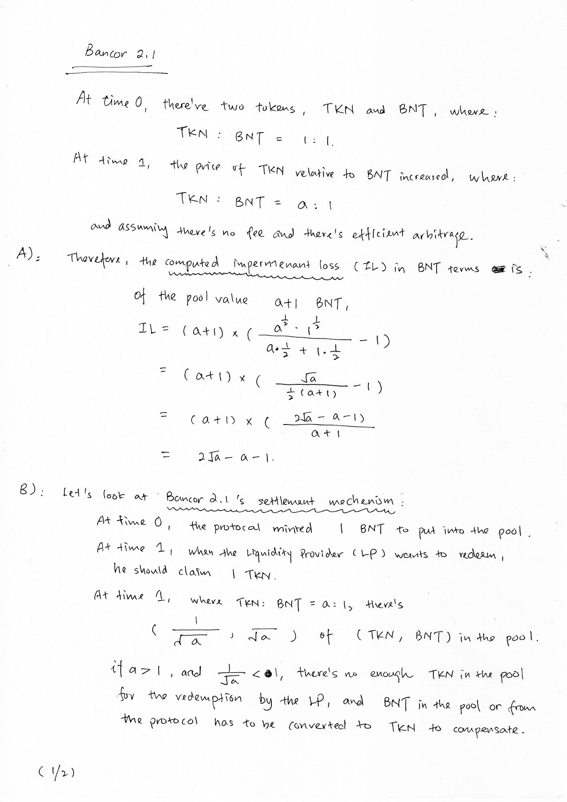

# [公司观察] Bancor 2.1 及其非永久性损失保险

> 原文：<https://medium.com/coinmonks/company-watch-bancor-2-1-and-its-impermanent-loss-insurance-71d87d092e9f?source=collection_archive---------2----------------------->

自 2018 年以来，我们一直是 Bancor 协议的用户，Bancor 是第一个具有 AMM 理念的平台。Bancor 一直是 defi 设计的先驱，2021 年初，Bancor 推出了 AMM 的增强版，其中非永久性损失被保险。

隐性损失(" **IL** ")是在任何价格变动情况下不变产品 AMM 的数学结果。它是数学的，所以它总是在那里，不能被消除。很多人不同意 AMM 的任何版本都不需要 IL 的观点。Bancor 2.1 提供的不是一个没有 IL 的 AMM，而是一个吸收了 IL 的，也就是说，用一种更友好的方式来说，就是“被保险的”。

自今年 1 月推出以来，该协议在 TVL 已经获得了 17 亿美元的资金。

Bancor 2.1 的 IL 保险基本如下:

1.  流动性提供者向 Bancor 2.1 中注入一方面的一些流动性(如代币 TKN)(相对于 Uniswap 上的双边流动性)，Bancor 协议铸造 BNT 以匹配 TKN，从而形成交易对
2.  资金池的工作方式类似于 Uniswap 资金池，将根据交易者和套利者进行平衡
3.  当流动性提供者提款时，他可以全额提取他的代币 TKN，其中:

3.a)当 TKN 相对于 BNT 的名义价格上升时，池中的 TKN 减少，BNT 增加；Bancor 将 BNT 转化为 TKN，以补偿流动性提供者，并烧毁 BNT 的其余部分；

3.b)当 TKN 的代币价格相对于 BNT 下降时，池中的 TKN 更多，BNT 更少；Bancor 全额支付流动性提供者，并将额外的 TKN 转换为 BNT 以弥补差额，并烧掉由此产生的 BNT

4.在这两种情况下，Bancor 协议将失去非永久性损失的金额。换句话说，通过具有弹性量的 BNT(在任何令牌的每个池中——BNT ), Bancor 2.1 协议吸收了非永久性损失。

5.Bancor 协议收取 0.1%至 0.5%的费用(如果您交易 2 个非 BNT 代币，则为 x2，因为交易从阿托肯-BNT 池路由至博托肯-BNT 池)。这些费用的 50%用于支付协议吸收的非永久性损失。

更多细节可以在官方博客的[提案文章](https://blog.bancor.network/proposing-bancor-v2-1-single-sided-amm-with-elastic-bnt-supply-bcac9fe655b)，尤其是[技术论文](https://drive.google.com/file/d/16EY7FUeS4MXnFjSf-KCgdE-Xyj4re27G/view)中找到。

下面是上面 3.a 的数学计算，表明流动性提取的 Bancor 2.1 结算流程将导致相当于协议非永久性损失的损失。

注意，在上面的工作中，当 a 大于 1 时，(2 sqrt a-a-1)是负的。所以这是协议的损失。

这是一个非常本土的设计，但也有局限性:

*   由于所有的资金池(有 IL 保险)都需要 BNT 来匹配，该协议的 TVL 受到 BNT 市值的限制
*   该协议赚取交易费，以补偿暂时的损失。如果交易费用很低，协议将会遭受损失。议定书的丧失反映在更多铸造的 BNT 上，将导致 BNT 不受欢迎的通货膨胀
*   该协议为大多数主要硬币提供了 BNT 对，如果主要硬币出现超级牛市，例如从 2020 年 12 月到 2021 年 1 月，BNT 价格可能会落后，并导致巨大的非永久性损失

在一月份的协议健康报告中，Bancor 报告说协议费用比 IL 高得多。我们期待来自该方案的进一步报告，以检查这一趋势是否继续:

最后，就我们的业务而言，Bancor 为稳定收入提供者提供了良好的[采矿奖励](https://docs.bancor.network/faqs#3-bnt-liquidity-mining)(详情见链接)。既然上了保险，回报就很诱人。然而，目前已经达到上限，流动性提供者必须保持耐心，或者尝试我们的对冲流动性提供策略(在这里购买一枚硬币并存入，在币安做空同一枚硬币)。

(宁静队，2021 年 3 月 18 日，推特:【https://twitter.com/SerenityFund 

> 加入 Coinmonks [Telegram group](https://t.me/joinchat/EPmjKpNYwRMsBI4p) 学习加密交易和投资

## 另外，阅读

*   [什么是融资融券交易](https://blog.coincodecap.com/margin-trading)
*   最好的[密码交易机器人](/coinmonks/crypto-trading-bot-c2ffce8acb2a) | [网格交易](https://blog.coincodecap.com/grid-trading)
*   [3 商业评论](/coinmonks/3commas-review-an-excellent-crypto-trading-bot-2020-1313a58bec92) | [Pionex 评论](/coinmonks/pionex-review-exchange-with-crypto-trading-bot-1e459d0191ea) | [Coinrule 评论](/coinmonks/coinrule-review-2021-a-beginner-friendly-crypto-trading-bot-daf0504848ba)
*   [AAX 交易所评论](/coinmonks/aax-exchange-review-2021-67c5ea09330c) | [德里比特评论](/coinmonks/deribit-review-options-fees-apis-and-testnet-2ca16c4bbdb2) | [FTX 交易所评论](/coinmonks/ftx-crypto-exchange-review-53664ac1198f)
*   [n rave 零点回顾](/coinmonks/ngrave-zero-review-c465cf8307fc) | [Phemex 回顾](/coinmonks/phemex-review-4cfba0b49e28) | [PrimeXBT 回顾](/coinmonks/primexbt-review-88e0815be858)
*   [Bybit Exchange 审查](/coinmonks/bybit-exchange-review-dbd570019b71) | [Bityard 审查](/coinmonks/bityard-review-7d104239be35) | [CoinSpot 审查](https://blog.coincodecap.com/coinspot-review)
*   [3 commas vs crypto hopper](/coinmonks/3commas-vs-pionex-vs-cryptohopper-best-crypto-bot-6a98d2baa203)|[赚取加密利息](/coinmonks/earn-crypto-interest-b10b810fdda3)
*   最好的比特币[硬件钱包](/coinmonks/the-best-cryptocurrency-hardware-wallets-of-2020-e28b1c124069?source=friends_link&sk=324dd9ff8556ab578d71e7ad7658ad7c) | [BitBox02 回顾](/coinmonks/bitbox02-review-your-swiss-bitcoin-hardware-wallet-c36c88fff29)
*   [莱杰 vs n 格拉夫](/coinmonks/ledger-vs-ngrave-zero-7e40f0c1d694) | [莱杰纳米 s vs x](/coinmonks/ledger-nano-s-vs-x-battery-hardware-price-storage-59a6663fe3b0)
*   [密码本交易平台](/coinmonks/top-10-crypto-copy-trading-platforms-for-beginners-d0c37c7d698c)
*   | [YouHodler 评论](/coinmonks/youhodler-4-easy-ways-to-make-money-98969b9689f2) | [BlockFi 评论](/coinmonks/blockfi-review-53096053c097)
*   最好的[加密税务软件](/coinmonks/best-crypto-tax-tool-for-my-money-72d4b430816b) | [硬币追踪评论](/coinmonks/cointracking-review-a-reliable-cryptocurrency-tax-software-5114e3eb5737)
*   最佳[加密借贷平台](/coinmonks/top-5-crypto-lending-platforms-in-2020-that-you-need-to-know-a1b675cec3fa) | [杠杆令牌](/coinmonks/leveraged-token-3f5257808b22)
*   [block fi vs Celsius](/coinmonks/blockfi-vs-celsius-vs-hodlnaut-8a1cc8c26630)|[Hodlnaut Review](/coinmonks/hodlnaut-review-best-way-to-hodl-is-to-earn-interest-on-your-bitcoin-6658a8c19edf)
*   [Bitsgap 审核](/coinmonks/bitsgap-review-a-crypto-trading-bot-that-makes-easy-money-a5d88a336df2) | [四倍审核](/coinmonks/quadency-review-a-crypto-trading-automation-platform-3068eaa374e1) | [Bitbns 审核](/coinmonks/bitbns-review-38256a07e161)
*   [Ellipal Titan Review](/coinmonks/ellipal-titan-review-85e9071dd029)|[SecuX Stone Review](/coinmonks/secux-stone-hardware-wallet-review-15-discount-coupon-2020-7577032faa6e)
*   [本地比特币回顾](/coinmonks/localbitcoins-review-6cc001c6ed56) | [密码货币储蓄账户](https://blog.coincodecap.com/cryptocurrency-savings-accounts)
*   最佳[块链分析](https://bitquery.io/blog/best-blockchain-analysis-tools-and-software)工具| [赚比特币](/coinmonks/earn-bitcoin-6e8bd3c592d9)
*   [密码套利](/coinmonks/crypto-arbitrage-guide-how-to-make-money-as-a-beginner-62bfe5c868f6)指导| [如何做空比特币](/coinmonks/how-to-short-bitcoin-568a2d0b4ae5)
*   最佳[加密制图工具](/coinmonks/what-are-the-best-charting-platforms-for-cryptocurrency-trading-85aade584d80) | [最佳加密交换](/coinmonks/crypto-exchange-dd2f9d6f3769)
*   [在印度如何购买比特币？](/coinmonks/buy-bitcoin-in-india-feb50ddfef94)|[waz rix 审核](/coinmonks/wazirx-review-5c811b074f5b)
*   [印度比特币交易所](/coinmonks/bitcoin-exchange-in-india-7f1fe79715c9) | [比特币储蓄账户](/coinmonks/bitcoin-savings-account-e65b13f92451)
*   [CoinDCX Review](/coinmonks/coindcx-review-8444db3621a2) | [加密融资融券交易所](https://blog.coincodecap.com/crypto-margin-trading-exchanges)

> [直接在您的收件箱中获取最佳软件交易](/coinmonks/newsletters/coinmonks)

