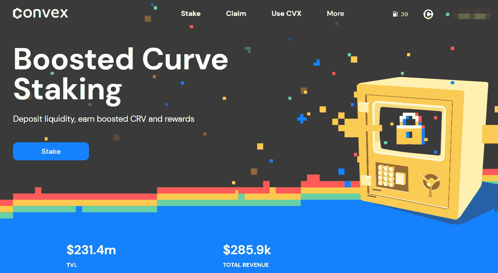
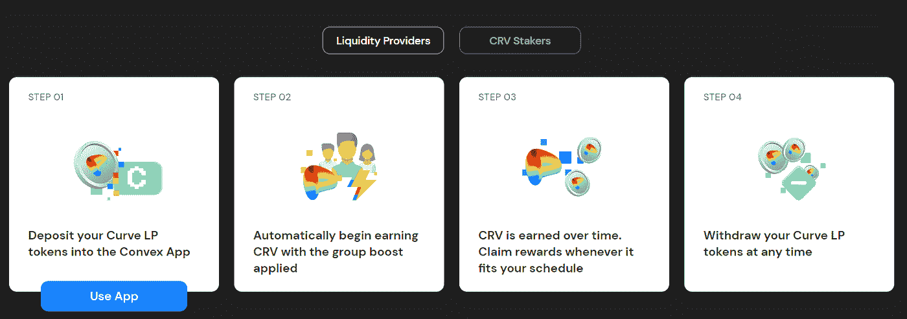
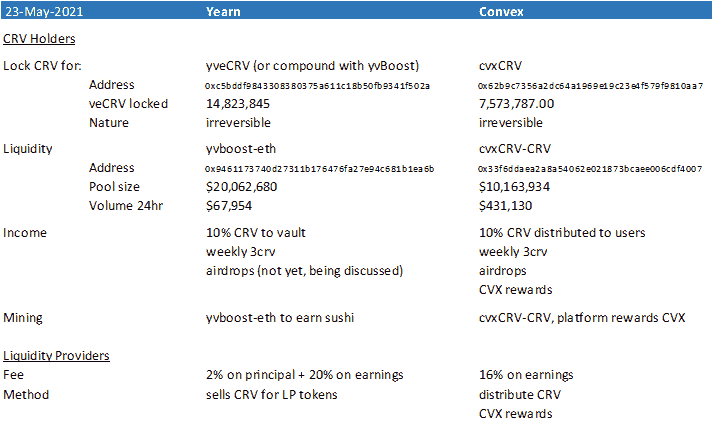
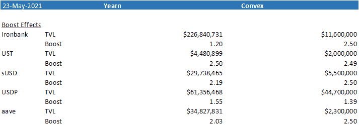

# [公司观察]Convex Financial——Curve 的伙伴助推器

> 原文：<https://medium.com/coinmonks/company-watch-convex-financial-curves-buddy-booster-a3388afefdd5?source=collection_archive---------5----------------------->

我们之前讨论过曲线金融，特别是一篇关于如何投资 CRV 的文章。其中一个方法是把它锁在渴望的金库里，留在那里赚取被动收入。虽然收益率不错，但在如何将 Ellipsis 的 EPS 等空投物资分发给用户的问题上，向往金库(或其背后的团队)没有取得太大进展。这代表了 CRV 持有者收入的很大一部分——对此保持沉默不是一个好办法。因此，如今有了一个 inward 的挑战者，Convex Financial，它基本上复制了 inward 的 CRV 相关产品，并越来越受欢迎。

## 凸面背景

4 月 30 日，Curve 将 convex Finance[列入白名单(这里是](https://dao.curve.fi/vote/ownership/44)[的提议](https://gov.curve.fi/t/cip-57-whitelist-the-convex-protocol/1654)，尽管该团队仍然是匿名的。将智能合同列入 Curve 的白名单并不意味着认可该项目，而是仅意味着 Curve 在 DAO 投票后，允许该合同参与 Curve，例如入股 CRV 以促进发展。关于不和谐，Curve 社区经理 Charlie 和 Kendrick 提到 Curve 将支持 Convex(没有进一步的细节说明支持的程度)；并且他们已经检查了 Convex 的代码，得出结论它是简单的，因此 rugpull 是不可能的。肯德里克和查理也作为社区经理出现在凸不和谐和电报频道。

Conext 是由 Sergey Prilutskiy 创立的俄罗斯智能合同审计公司 MixBytes() 审计的[。](https://github.com/convex-eth/platform/blob/main/audit/Convex%20Platform%20Security%20Audit%20Report.pdf)

## 凸的推进方式

Convex 的工作方式与《渴望》非常相似，只是奖励的使用方式有所不同。

对于流动性提供者来说，需要将稳定的硬币存入曲线金库，然后将 LP 代币存入凸金库。Convex 自动收获收益，并将其分配给流动性提供者。奖励要么是 CRV，要么是其他奖励代币，而且是直接发放的，不像向往的金库把收获的 CRV 卖给金库 LP 代币来复利。除此之外，流动性提供商还可以获得 CVX(Convex 的平台代币)作为额外奖励。

对于 CRV 的持有者来说，你可以把 CRV 和 Convex 一起放入 cvxCRV，这就像是渴望的 yveCRV，一个不可逆的、永久锁定的令牌。在此之后，人们可以为 Sushiswap 上的 cvxCRV-CRV 基金提供流动性，并从 Convex 那里获得 CVX 回报，或者干脆将 cvxCRV 与 Convex 一起入股以获得回报。赌注奖励包括金库收获的 CRV 的 10%份额；veCRV 管理费的份额；空投；额外的 CVX 奖励。

虽然 CRV 被永久锁定在合约中，但 cvxCRV 可以在 cvxCRV-CRV 对中交易，或者有一天它可能在一些加密交易所上市。

## 与渴望的区别

与渴望相比，Convex 的关键区别在于，它不将收获的 CRV 转换为 LP 令牌或 yveCRV，而是直接分发给用户。此外，它收取更便宜的 16%的费用。最后但并非最不重要的是，它现在有 CVX 激励措施，将金库收益率平均提高 10%至 20%。

截至本文发布之日，所选曲线拱顶的助推效果和比较助推效果如下所列。由于 Convex 还很小，所以它通常具有更好的增强效果:

## 令牌组学

总供应量为 1 亿 CVX，其中 75%将用于长期激励，以鼓励采用该平台。13.3%是给团队和投资者的，授予时间超过一年。其余的归财政部，以备将来之用，其中 2%用于早期空投。

(宁静队，2021 年 5 月 23 日，推特:[https://twitter.com/SerenityFund)](https://twitter.com/SerenityFund))