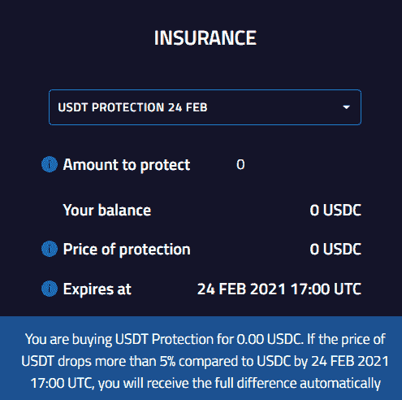
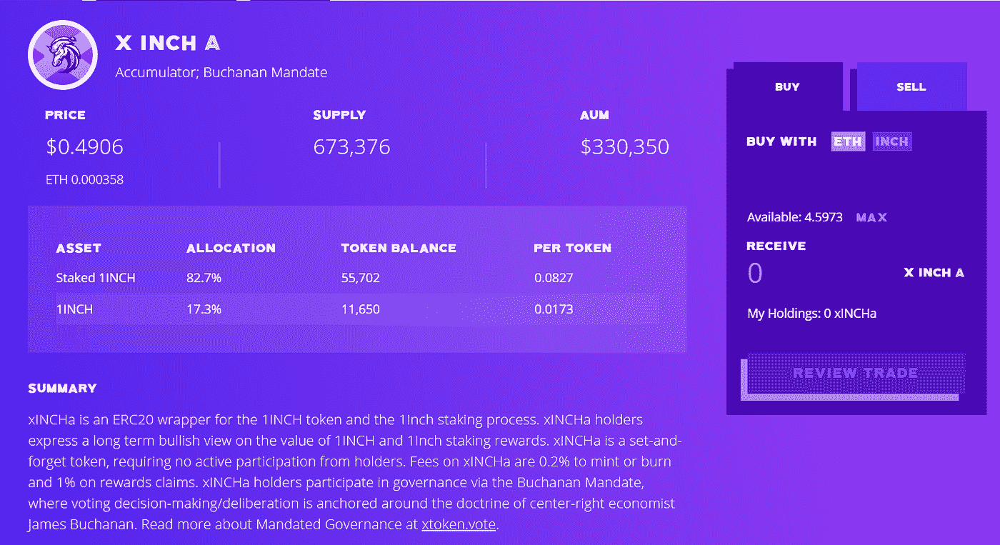

# [公司观察]超酷的新 Defi 产品

> 原文：<https://medium.com/coinmonks/company-watch-cool-new-defi-products-that-might-be-the-stars-next-month-a2871e0aed5f?source=collection_archive---------1----------------------->

Defi 很励志。几乎每天都有一些新品推出。我们认为与 2017 年相比，这是一个很好的发展。那时候，每天都会有一些白皮书发布，并筹集 ICO 资金。但是当时的白皮书是虚构的。我们今天看到的 Defi 项目，无论看起来多么天真或愚蠢，他们总是努力服务于一个目的，满足一个需求，或解决一个问题。

这感觉更像回到 2009 年，我是一个重度黑莓用户，看着 iPhone。这很酷，但我为什么需要这个？但是产品就在那里，它在发展。

老实说，我们仍然认为今天的大多数 Defi 项目只是发行新令牌，并设计不同的分发方式(采矿)。从这个意义上说，大多数 Defi 项目不可避免地会像 2017 年的 ICO 项目一样死去。这些项目对通货膨胀毫无贡献。然而，一些项目会继续生存和发展，并最终变得庞大，甚至具有破坏性和革命性。这些项目有一个共同点:人们在没有激励的情况下使用它们。以 Uniswap 为例。

考虑到这一点，我们着眼于这个领域，寻找能够在工作的 **Defi 项目。**

## Dhedge

Dhedge 不是一家策略类似于“渴望”的对冲基金；更确切地说，它是一个允许[任何人操作连锁对冲基金](https://app.dhedge.org/#)的平台。你可以用非常简单的步骤注册一个如下的基金，吸引投资者。目前，Dhedge 只能在 Synthetix 中交易虚拟资产。

值得注意的是，dHedge 有一个 SNX 债务池镜像，这是一个 0 费用池，由一个机器人运行，它不断镜像 Synthetix 协议中 Synthetix 的分布。它是由 dHEDGE DAO 作为 Synthetix 社区的服务运营的。这可用于对冲 SNX 风险。

此外，现在还有赌注和投资挖掘奖励。

## FuruCombo

FuruCombo 是一个平台，允许非程序员[在一个模块中建立一些交易，就像乐高积木](https://furucombo.app/combo)。实际上，每个人都可以做 flashloan，不需要编程，只需要简单的拖拽。这可能是最容易理解的 Defi 服务，你必须亲自尝试才能获得乐趣。

## 鸦片金融

Andrey Belyakov 领导的鸦片团队于 2020 年 4 月开始从事链上衍生产品交易。Andrey 的职业生涯始于一家欧洲资产管理公司的固定收益分析师，因此 Opium 团队的早期产品是复杂的交易相关服务(Opium Exchange 和 SwapRate Finance)，例如销售信用违约掉期。它没有流行起来。

现在，这个团队有了一个非常简单直接的事情:给 USDT 买保险。这个想法很简单。一些投资者汇集流动性(USDC)来覆盖低于 USDC 5%的 USDT 风险；需要这种保护的用户需要支付额外费用。

除此之外，该团队还在设计初级/高级分段债务链，这在固定收益领域非常常见。*“您以 0.00 cDAI 购买 cDAI 固定利率 5%(高级份额)。如果 cDAI 的有效利率在 2021 年 2 月 24 日 13:00 UTC 之前低于 5%,您的固定利率将由 stakers 补偿。否则，你高于固定利率的收益将被转移到赌注者。”*

显然比信用违约互换要好，也是 defi 领域非常需要的。

## xTokens

这个平台专门提供[自动打桩服务](https://xtoken.market/app/invest)。如果你有一些从流动性开采中收集到的代币，数量很少，不值得花汽油来入股-索赔-再收购，那么让 xTokens 来为你做这件事。

除了以上所述，我们之前还分析了一些其他平台，我们认为这些平台正在提供功能性服务(或至少打算提供)，而不仅仅是促进以太和以太坊生态系统的膨胀。这些是[覆盖协议](https://serenityfund.medium.com/strategy-paper-mining-cover-with-an-understanding-of-the-risk-e1bd446c996)、 [Hegic](/crypto-spotlight/company-watch-hegic-whats-the-magic-b5d8f8af4458) 和 [Alpha Homora](https://serenityfund.medium.com/company-watch-alpha-homora-leveraging-liquidity-providing-3b6de6923c98) 。请关注我们的推特和媒体了解更多详情。

(宁静队，2021 年 2 月 2 日，推特:[https://twitter.com/SerenityFund)](https://twitter.com/SerenityFund))

> 加入 coin monks[Telegram group](https://t.me/joinchat/EPmjKpNYwRMsBI4p)学习加密交易和投资

## 另外，阅读

*   什么是[闪贷](https://blog.coincodecap.com/what-are-flash-loans-on-ethereum)？
*   最好的[密码交易机器人](/coinmonks/crypto-trading-bot-c2ffce8acb2a) | [网格交易](https://blog.coincodecap.com/grid-trading)
*   [3 商业评论](/coinmonks/3commas-review-an-excellent-crypto-trading-bot-2020-1313a58bec92) | [Pionex 评论](/coinmonks/pionex-review-exchange-with-crypto-trading-bot-1e459d0191ea) | [Coinrule 评论](https://blog.coincodecap.com/coinrule-review-a-perfect-trading-bot)
*   [AAX 交易所评论](/coinmonks/aax-exchange-review-2021-67c5ea09330c) | [德里比特评论](/coinmonks/deribit-review-options-fees-apis-and-testnet-2ca16c4bbdb2) | [FTX 密码交易所评论](/coinmonks/ftx-crypto-exchange-review-53664ac1198f)
*   [n 零审核](/coinmonks/ngrave-zero-review-c465cf8307fc)
*   [Bybit Exchange 审查](/coinmonks/bybit-exchange-review-dbd570019b71) | [Bityard 审查](https://blog.coincodecap.com/bityard-reivew)|[inter tax 审查](https://blog.coincodecap.com/interdax-review)
*   3Commas vs Cryptohopper
*   最好的比特币[硬件钱包](/coinmonks/the-best-cryptocurrency-hardware-wallets-of-2020-e28b1c124069?source=friends_link&sk=324dd9ff8556ab578d71e7ad7658ad7c) | [BitBox02 回顾](/coinmonks/bitbox02-review-your-swiss-bitcoin-hardware-wallet-c36c88fff29)
*   [莱杰 vs n rave](https://blog.coincodecap.com/ngrave-vs-ledger)|[莱杰 nano s vs x](https://blog.coincodecap.com/ledger-nano-s-vs-x)
*   [密码拷贝交易平台](/coinmonks/top-10-crypto-copy-trading-platforms-for-beginners-d0c37c7d698c) | [比特码拷贝交易](https://blog.coincodecap.com/bityard-copy-trading)
*   [Vauld 审查](https://blog.coincodecap.com/vauld-review) | [YouHodler 审查](/coinmonks/youhodler-4-easy-ways-to-make-money-98969b9689f2) | [BlockFi 审查](/coinmonks/blockfi-review-53096053c097)
*   最好的[加密税务软件](/coinmonks/best-crypto-tax-tool-for-my-money-72d4b430816b) | [硬币追踪评论](/coinmonks/cointracking-review-a-reliable-cryptocurrency-tax-software-5114e3eb5737)
*   最佳[加密贷款平台](/coinmonks/top-5-crypto-lending-platforms-in-2020-that-you-need-to-know-a1b675cec3fa)
*   [莱杰纳米 S vs 特雷佐 1 vs 特雷佐 T vs 莱杰纳米 X](https://blog.coincodecap.com/ledger-nano-s-vs-trezor-one-ledger-nano-x-trezor-t)
*   [BlockFi vs 摄氏](/coinmonks/blockfi-vs-celsius-vs-hodlnaut-8a1cc8c26630) | [Hodlnaut 回顾](https://blog.coincodecap.com/hodlnaut-review)
*   [Bitsgap 审查](/coinmonks/bitsgap-review-a-crypto-trading-bot-that-makes-easy-money-a5d88a336df2) | [Quadency 审查](/coinmonks/quadency-review-a-crypto-trading-automation-platform-3068eaa374e1)
*   [埃利帕尔泰坦评论](/coinmonks/ellipal-titan-review-85e9071dd029) | [赛克斯斯通评论](https://blog.coincodecap.com/secux-stone-hardware-wallet-review)
*   [DEX Explorer](https://explorer.bitquery.io/ethereum/dex) 和[区块链 API](https://explorer.bitquery.io/graphql)
*   [最佳区块链分析工具](https://bitquery.io/blog/best-blockchain-analysis-tools-and-software)
*   [加密套利](/coinmonks/crypto-arbitrage-guide-how-to-make-money-as-a-beginner-62bfe5c868f6)指南:新手如何赚钱
*   最佳[加密制图工具](/coinmonks/what-are-the-best-charting-platforms-for-cryptocurrency-trading-85aade584d80) | [最佳加密交易所](https://blog.coincodecap.com/crypto-exchange)
*   了解比特币的[最佳书籍有哪些？](/coinmonks/what-are-the-best-books-to-learn-bitcoin-409aeb9aff4b)

> [直接在您的收件箱中获得最佳软件交易](/coinmonks/newsletters/coinmonks)

