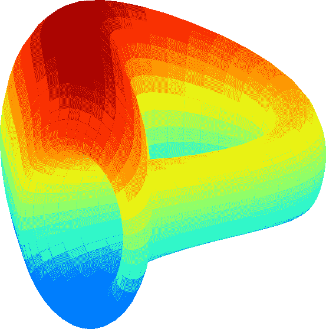
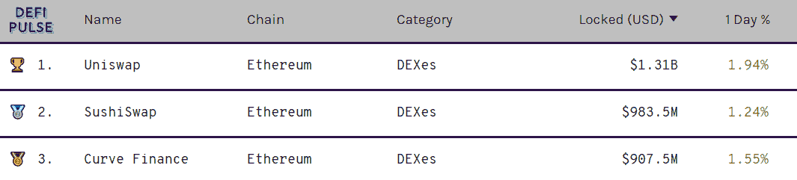
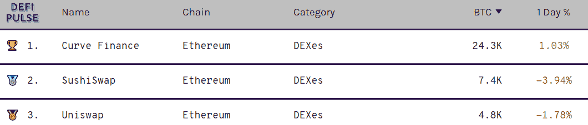
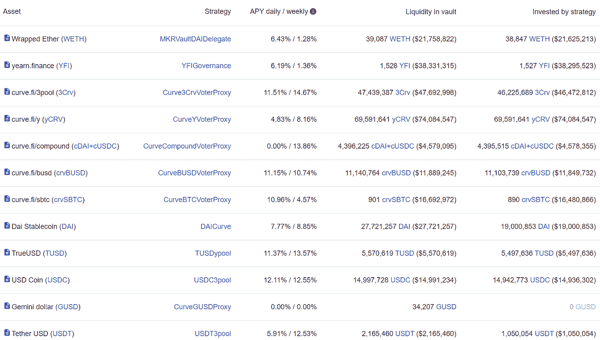
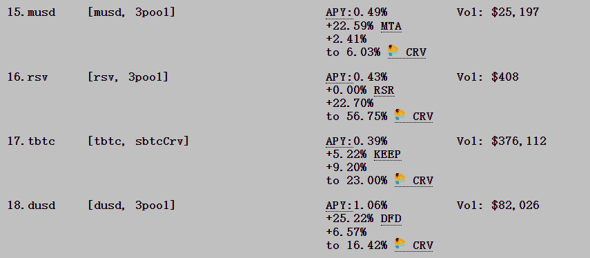
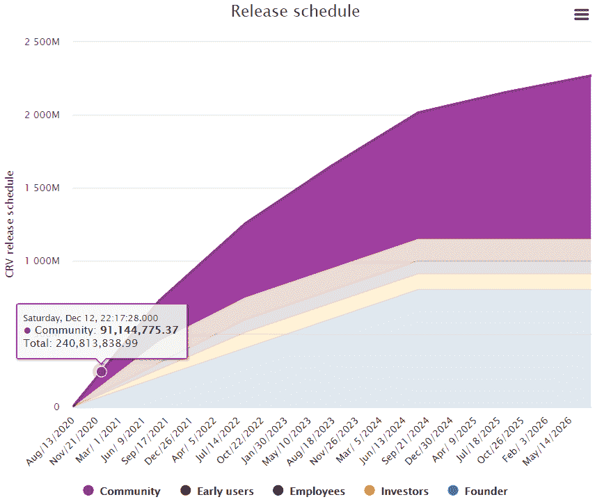
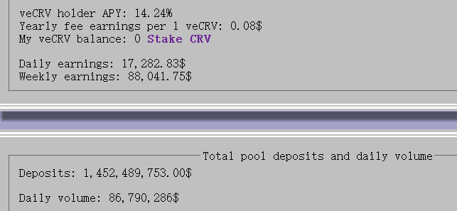

# 【公司观察】曲线及其投资价值

> 原文：<https://medium.com/coinmonks/company-watch-curve-and-its-investment-value-728f06e1b8fa?source=collection_archive---------1----------------------->

根据 Defipulse 的数据，Curve 是 stablecoins 的领先 AMM，截至 2020 年 12 月 12 日，总 TVL 为 13 亿美元(stablecoins 和 BTC 存款)。这使得 Curve 成为最大的 BTC 存管机构和第三大 stablecoins 存管机构。

Curve 的价值主张很简单。只需 0.04%的极低佣金，就可以将一种稳定币兑换成另一种稳定币(如戴兑换成)，或将一种合成币兑换成另一种(wBTC 兑换成 renBTC)。Curve 仅向具有相同基础的配对提供交换服务。0.04%是一个足够低的费用，甚至超过了像币安这样的 CEX，对于普通交易者来说是 0.075%(如果你有交易量的话会更低)。

市场上可能有 20 到 40 种有意义的稳定型卷烟和大约 10 种 BTC 合成型卷烟。鉴于 Defi 是一个开放的空间，它更容易建立其他人的工作——并且将会有更多种类的 stablecoins、BTC 甚至 eth 或 LTC 等。它们都需要进行交易，因此产生了对低成本、深度良好的 AMM 曲线的强劲和可持续需求，以满足这种特殊需求。Curve 具有先发优势，不仅积累了大量资本，而且在业内也有良好的信誉。

Curve 的定位是 stablecoins 的 AMM，目前巨大的 TVL 规模和低廉的费用使其不具挑战性。几个月前，Curve 转向了 Curve 的一个版本，但并不成功。

此外，Curve 与 early 紧密相连，并作为 early 生态系统的基石发挥了关键作用。一方面，几乎所有的钱都存进了 CRV，这构成了 YFI 的大部分收入。另一方面，Curve 的稳定收入被存了回来，渴望选择最好的借贷平台来获得最高的利率。

一个人如何从曲线中获益？

从曲线中获益的一个简单方法是在曲线上提供流动性。Curve 现在慷慨地发放 CRV，这是平台代币。每天，大约有 600，000 CRV 被分发出去，根据它的价格，为曲线提供稳定点的 APY 有 10%到 20%的收益率。我们已经将提供稳定的货币作为流动性曲线列为我们的基本策略之一。

虽然像 3pool 或 y 或 Compound 这样的大型资金池可以提供 10%的收益率，但人们可以通过投资新的稳定的资金池，如 [mUSD pool](https://www.curve.fi/musd) 或 stake CRV 来提高收益率，从而进一步提高收益率。请关注我们的 Twitter 或 Medium，了解关于风险和回报的进一步分析。

购买 CRV 也是一个可行的选择。

虽然这不是我们基金的策略，但我们确实看到了 Curve 的长期投资优势，如前所述。此外，CRV 不仅是一个治理令牌；赌注 CRV 允许一个人从整个平台获得 50%的交易费(0.04%)。目前，锁定 1 CRV 4 年可获得 1 veCRV，这是有权收取交易费并具有投票功能的令牌。锁定更短的持续时间将给予一个人更多的灵活性，但更少的 veCRV(因此更少的交易佣金权利)，例如锁定 1 年将给予 0.25 veCRV。

目前，在 2.408 亿 CRV(相当于 1.393 亿美元的市值)的流通供应量中，约 26%锁定在 veCRV 上，平均期限为 3.6 年。到 2021 年底，总发行量将达到 9.28 亿份，详见[曲线发布时间表](https://dao.curve.fi/releaseschedule)。

在收入方面，每日交易量为 8680 万美元，0.04%的 50%为 veCRV 持有人带来 17283 美元的收入。过去一周的收入为 88042 美元，折合成年率为 459 万美元。

基于此，我们可以快速计算市盈率:1)如果你是长期投资，锁定你的 CRV 4 年，那么假设 veCRV=CRV 价格，那么市盈率只有 7.9 倍(139.3m 美元 x 26%/4.59m 美元)；2)如果您没有锁定，并且我们假设 CRV 的价格也与平台的交易量相关，则市盈率为 30.3 倍(1.393 亿美元/459 万美元)。

这是一个有趣的案例，因为我们在传统金融领域找不到类似的案例。一家拥有迫使投资者在流动性和股息之间做出选择的机制的公司。投资者不得不牺牲一个来换取另一个。**但这给出了曲线项目的市盈率范围，因为理性的投资者可以选择将一定比例的 CRV 锁定为 veCRV，用于分红，其余用于流动性。根据他锁定的百分比，曲线的市盈率在 7.9 倍到 30.3 倍之间**

这对于一个新行业的新项目来说还不错。我们相信，鉴于 Curve 的定位和商业模式，它将蓬勃发展；但其发行新代币的时间表也对投资者非常不利。这是一个业务增长和稀释哪个更快的问题。从长远来看，为了保持上述市盈率，到 2021 年底，Curve 的交易量必须增长约 4 倍，相当于 3.44 亿美元的日交易量。

可能不是太难的事。

(宁静队，2020 年 12 月 12 日)

## 另外，阅读

*   最好的[密码交易机器人](/coinmonks/crypto-trading-bot-c2ffce8acb2a)
*   [Uniswap API](https://bitquery.io/blog/uniswap-pool-api) —如何获取 Uniswap 数据？
*   [Deribit 审查](/coinmonks/deribit-review-options-fees-apis-and-testnet-2ca16c4bbdb2) |选项、费用、API 和 Testnet
*   [FTX 密码交易所评论](/coinmonks/ftx-crypto-exchange-review-53664ac1198f)
*   [Bybit 交换评论](/coinmonks/bybit-exchange-review-dbd570019b71)
*   最好的比特币[硬件钱包](/coinmonks/the-best-cryptocurrency-hardware-wallets-of-2020-e28b1c124069?source=friends_link&sk=324dd9ff8556ab578d71e7ad7658ad7c)
*   [加密复制交易平台](/coinmonks/top-10-crypto-copy-trading-platforms-for-beginners-d0c37c7d698c)
*   [bits gap vs 3 commas vs quad ency](https://blog.coincodecap.com/bitsgap-3commas-quadency)
*   最好的[加密税务软件](/coinmonks/best-crypto-tax-tool-for-my-money-72d4b430816b)
*   [最佳加密交易平台](/coinmonks/the-best-crypto-trading-platforms-in-2020-the-definitive-guide-updated-c72f8b874555)
*   最佳[加密借贷平台](/coinmonks/top-5-crypto-lending-platforms-in-2020-that-you-need-to-know-a1b675cec3fa)
*   [莱杰纳米 S vs 特雷佐 one vs 特雷佐 T vs 莱杰纳米 X](https://blog.coincodecap.com/ledger-nano-s-vs-trezor-one-ledger-nano-x-trezor-t)
*   [block fi vs Celsius](/coinmonks/blockfi-vs-celsius-vs-hodlnaut-8a1cc8c26630)vs Hodlnaut
*   Bitsgap 评论——一个轻松赚钱的加密交易机器人
*   为专业人士设计的加密交易机器人
*   [PrimeXBT 审查](/coinmonks/primexbt-review-88e0815be858) |杠杆交易、费用和交易
*   [Altrady 审查](https://blog.coincodecap.com/altrady-reivew)
*   [埃利帕尔泰坦评论](/coinmonks/ellipal-titan-review-85e9071dd029)
*   [SecuX Stone 评论](https://blog.coincodecap.com/secux-stone-hardware-wallet-review)
*   [BlockFi 评论](/coinmonks/blockfi-review-53096053c097) |从您的密码中赚取高达 8.6%的利息
*   [面向开发人员的最佳加密 API](/coinmonks/best-crypto-apis-for-developers-5efe3a597a9f)
*   [最佳区块链分析工具](https://bitquery.io/blog/best-blockchain-analysis-tools-and-software)
*   [加密套利](/coinmonks/crypto-arbitrage-guide-how-to-make-money-as-a-beginner-62bfe5c868f6)指南:新手如何赚钱
*   顶级[比特币节点](https://blog.coincodecap.com/bitcoin-node-solutions)提供商
*   最佳[加密制图工具](/coinmonks/what-are-the-best-charting-platforms-for-cryptocurrency-trading-85aade584d80)
*   了解比特币的[最佳书籍有哪些？](/coinmonks/what-are-the-best-books-to-learn-bitcoin-409aeb9aff4b)

> [直接在您的收件箱中获得最佳软件交易](/coinmonks/newsletters/coinmonks)

