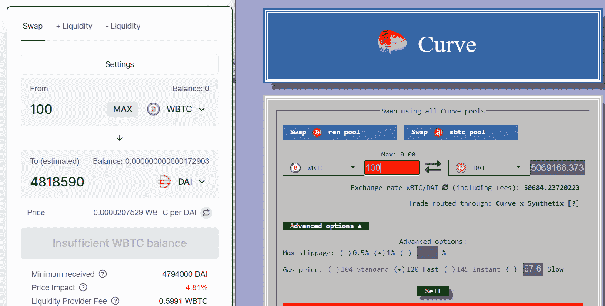
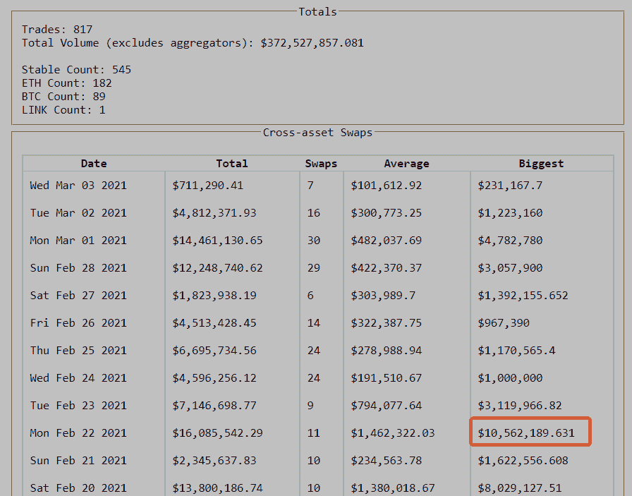
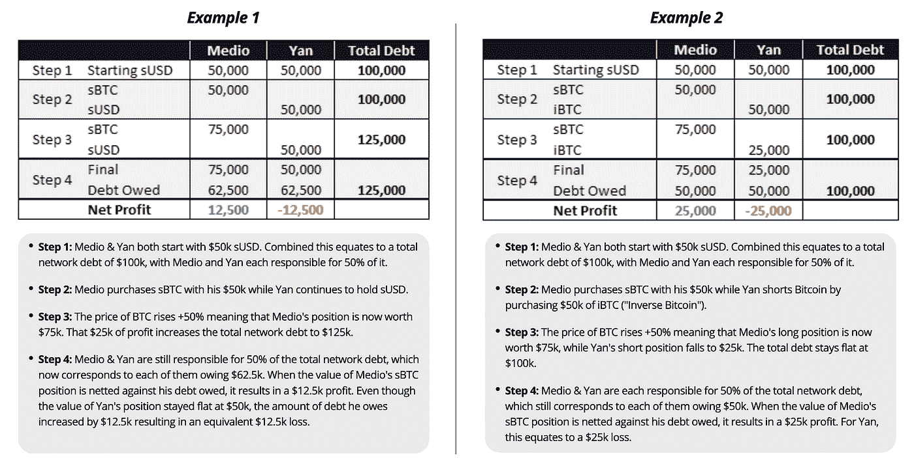
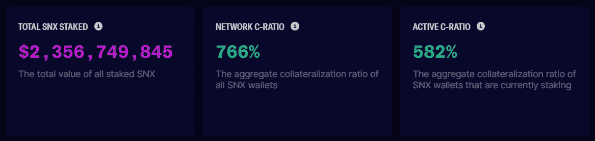
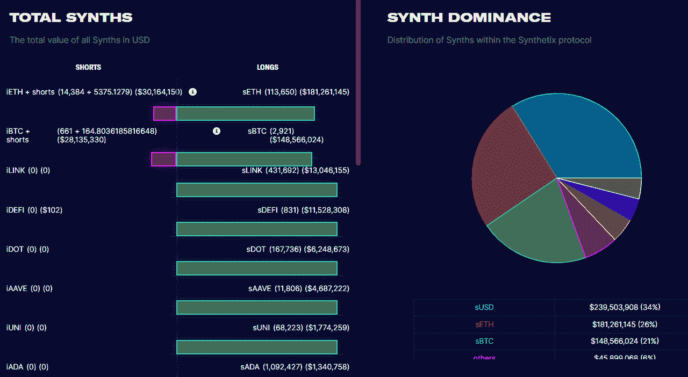

# [公司观察]曲线和 Synthetix 交叉资产互换(曲线系列 2/3)

> 原文：<https://medium.com/coinmonks/company-watch-curve-and-synthetix-cross-asset-swap-curve-series-2-3-ff2f33fa02a4?source=collection_archive---------2----------------------->

本文是我们关于曲线金融的三篇文章中的第二篇。关于 Curve 的平台令牌以及如何投资以实现价值最大化的第一篇文章，请参考此处的链接[。本文解释了 Curve 的一个独特特性，即与 Synthetix 合作的跨资产交换。](/coinmonks/company-watch-how-to-invest-your-crv-curve-series-1-3-2b85cf531a9a)

交叉资产互换允许一个人将大量的 BTC 或 ETH 换成稳定的债券，几乎没有或没有滑点。我们在这里谈论的金额是 1000 万美元级别的互换，在 Uniswap 或像币安这样的集中交易所中，几乎不可能出现或为零的滑点。

举个例子，现在的交易价是 51100 美元，如果你，作为一条鲸鱼，想用 100 换戴。Sushiswap 是目前所有指数中 WBTC 资金池最大的，每 BTC 提供 48196 英镑，即 4.8%的滑点。Curve 能够提供 50692 美元，大约 1%的滑点。两者都是即时互换。币安提供与 Curve 相似的利率，但其订单深度变化很大。

这项功能于今年 1 月中旬推出，已经有 3 . 7 亿美元的交易额，最大的交易额超过 1000 万美元。记住，Curve 只收取 0.04%的交易费(在这种情况下，两个池，0.08%)，这比 Uniswap 和其他指数便宜得多。如果你不是 CEX 的高交易量或 VIP 交易者，比 CEXes 还便宜。

交叉资产互换的特性不难理解。它分三步完成:

1.  将代币换成 Synthetix 的虚拟资产形式，例如，如果您想将换成戴，然后将换成 sBTC(或者将 ETH 换成 sETH，或者将任何 stablecoin 换成 sUSD)
2.  将虚拟资产换成您希望交易的另一项虚拟资产，例如 sBTC 换成 sUSD
3.  将交易的虚拟资产换回您想要的最终代币，例如 sUSD 换成 DAI

完成以上步骤后，您将通过两个平台 Curve 和 Synthetix 将换成戴。对 Curve 来说没什么新鲜的；更确切地说，是 Synthetix 的虚拟资产池创造了奇迹。话虽如此，Curve 的大量稳定资产和虚拟/包装资产正是 Synthetix 的完美匹配。

Curve 有一个关于它如何工作的简单指南:【https://resources.curve.fi/guides/cross-asset-swaps】[(阅读](https://resources.curve.fi/guides/cross-asset-swaps)[技术文档](https://curve.readthedocs.io/cross-asset-swaps.html)的第一部分可能会更清楚)，但更重要的是理解 Synthetix 如何工作。

Synthetix 就像 MakerDao，它允许用户抵押其平台令牌来借用其他资产，就像你可以抵押 ETH 来借用 MakerDao 中的 DAI 一样。其机制的细节是[这里是](https://docs.synthetix.io/litepaper)，概括起来:

*   用户可以抵押 SNX 来借用 Synthetix 的虚拟资产(sUSD，sBTC，sETH 等。)的碳比率为 750%。例如，抵押价值 7.5 美元的 SNX 可以铸造价值 1 美元的资产
*   用户不需要偿还 1 美元来赎回抵押的 SNX。相反，用户在还款时支付他在债务池中的份额。例如，当用户铸造$1000 sUSD，并且所有用户的总债务(铸造的所有用户的 Synthetix 虚拟资产的总和，作为当前市场价格)是$100，000 时，那么他需要偿还债务池的 1%来赎回他的 SNX。
*   债务池的价值各不相同，因为它是所有虚拟资产的总和，不仅包括 sUSD，还包括 sBTC 和其他资产。任何时候都可能超过 10 万美元或更少。所以借用 sUSD 不完全是借用；这更像是与其他借款人的交易。
*   有了这个特征，用户可以随时将他的虚拟资产交换到另一个虚拟资产，而没有任何滑动，例如从 sUSD 到 sBTC。零滑点是因为用户交换这些虚拟资产，而不是任何个人或做市商；而是用户自己偿还部分债务，然后在另一项资产中借入相同数额的资金。只有债务池的构成发生了变化；债务池的价值不会改变。

Synthetix 用表格解释了它的工作原理:

对于 Curve 的交叉资产互换，当有人在本文开头的例子中将换成戴时，第 2 步实质上导致了 Synthetix 的债务池构成发生了变化。当 Curve 的交叉资产互换的用户将改为戴时，债务 pook 减少相应数量的 sUSD，并增加相同数量的 s BTC。

在原子水平上，Synthetix 的债务池的价值没有改变，因为等量的 sDAI 被 sBTC 替代。未来，sBTC 的任何价格变动都会被债券持有人吸收——无论是否有利。

换句话说，Curve 的交叉资产互换是针对 Synthetix 的债务池进行交易的；或者这样理解可能更容易:Synthetix 的债务池正在为 Curve 的交叉资产互换创造市场。

目前，SNX 的赌注为 24 亿美元，Synthetix 的虚拟资产为 7 亿美元。

希望看到 Curve-Synthetix 发生 1 亿美元的互换。

(宁静队，2021 年 3 月 3 日，推特:[https://twitter.com/SerenityFund)](https://twitter.com/SerenityFund))

> 加入 Coinmonks [电报集团](https://t.me/joinchat/EPmjKpNYwRMsBI4p)，了解加密交易和投资

## 另外，阅读

*   什么是[闪贷](https://blog.coincodecap.com/what-are-flash-loans-on-ethereum)？
*   最好的[密码交易机器人](/coinmonks/crypto-trading-bot-c2ffce8acb2a) | [网格交易](https://blog.coincodecap.com/grid-trading)
*   [3 商业评论](/coinmonks/3commas-review-an-excellent-crypto-trading-bot-2020-1313a58bec92) | [Pionex 评论](/coinmonks/pionex-review-exchange-with-crypto-trading-bot-1e459d0191ea) | [Coinrule 评论](https://blog.coincodecap.com/coinrule-review-a-perfect-trading-bot)
*   [AAX 交易所评论](/coinmonks/aax-exchange-review-2021-67c5ea09330c) | [德里比特评论](/coinmonks/deribit-review-options-fees-apis-and-testnet-2ca16c4bbdb2) | [FTX 交易所评论](/coinmonks/ftx-crypto-exchange-review-53664ac1198f)
*   [n ave 零点回顾](/coinmonks/ngrave-zero-review-c465cf8307fc) | [Phemex 回顾](/coinmonks/phemex-review-4cfba0b49e28) | [PrimeXBT 回顾](/coinmonks/primexbt-review-88e0815be858)
*   [Bybit Exchange 审查](/coinmonks/bybit-exchange-review-dbd570019b71) | [Bityard 审查](https://blog.coincodecap.com/bityard-reivew) | [CoinSpot 审查](https://blog.coincodecap.com/coinspot-review)
*   [3 commas vs crypto hopper](/coinmonks/3commas-vs-pionex-vs-cryptohopper-best-crypto-bot-6a98d2baa203)|[赚取加密利息](/coinmonks/earn-crypto-interest-b10b810fdda3)
*   最好的比特币[硬件钱包](/coinmonks/the-best-cryptocurrency-hardware-wallets-of-2020-e28b1c124069?source=friends_link&sk=324dd9ff8556ab578d71e7ad7658ad7c) | [BitBox02 回顾](/coinmonks/bitbox02-review-your-swiss-bitcoin-hardware-wallet-c36c88fff29)
*   [莱杰 vs n rave](https://blog.coincodecap.com/ngrave-vs-ledger)|[莱杰 nano s vs x](https://blog.coincodecap.com/ledger-nano-s-vs-x)
*   [加密复制交易平台](/coinmonks/top-10-crypto-copy-trading-platforms-for-beginners-d0c37c7d698c) | [比特码复制交易](https://blog.coincodecap.com/bityard-copy-trading)
*   [沃德评论](https://blog.coincodecap.com/vauld-review) | [尤霍德勒评论](/coinmonks/youhodler-4-easy-ways-to-make-money-98969b9689f2) | [区块链评论](/coinmonks/blockfi-review-53096053c097)
*   最好的[加密税务软件](/coinmonks/best-crypto-tax-tool-for-my-money-72d4b430816b) | [硬币追踪评论](/coinmonks/cointracking-review-a-reliable-cryptocurrency-tax-software-5114e3eb5737)
*   最佳[加密借贷平台](/coinmonks/top-5-crypto-lending-platforms-in-2020-that-you-need-to-know-a1b675cec3fa) | [杠杆令牌](/coinmonks/leveraged-token-3f5257808b22)
*   [莱杰纳米 S vs 特雷佐 one vs 特雷佐 T vs 莱杰纳米 X](https://blog.coincodecap.com/ledger-nano-s-vs-trezor-one-ledger-nano-x-trezor-t)
*   [block fi vs Celsius](/coinmonks/blockfi-vs-celsius-vs-hodlnaut-8a1cc8c26630)|[Hodlnaut 审查](https://blog.coincodecap.com/hodlnaut-review)
*   [Bitsgap 审查](https://blog.coincodecap.com/bitsgap-review) | [Quadency 审查](/coinmonks/quadency-review-a-crypto-trading-automation-platform-3068eaa374e1) | [Bitbns 审查](https://blog.coincodecap.com/bitbns-review)
*   [埃利帕尔泰坦评论](/coinmonks/ellipal-titan-review-85e9071dd029) | [赛克斯斯通评论](https://blog.coincodecap.com/secux-stone-hardware-wallet-review)
*   [DEX Explorer](https://explorer.bitquery.io/ethereum/dex)|[w](https://explorer.bitquery.io/graphql)|[local bitcoins 评论](https://blog.coincodecap.com/localbitcoins-review)
*   最佳[区块链分析](https://bitquery.io/blog/best-blockchain-analysis-tools-and-software)工具| [赚比特币](https://blog.coincodecap.com/earn-bitcoin)
*   [加密套利](/coinmonks/crypto-arbitrage-guide-how-to-make-money-as-a-beginner-62bfe5c868f6)指南:新手如何赚钱
*   最佳[加密制图工具](/coinmonks/what-are-the-best-charting-platforms-for-cryptocurrency-trading-85aade584d80) | [最佳加密交易所](/coinmonks/crypto-exchange-dd2f9d6f3769)
*   [如何在印度购买比特币](https://blog.coincodecap.com/buy-bitcoin-app-india)？
*   [印度比特币交易所](/coinmonks/bitcoin-exchange-in-india-7f1fe79715c9) | [比特币储蓄账户](https://blog.coincodecap.com/bitcoin-savings-account)
*   了解比特币最好的[书籍有哪些？](/coinmonks/what-are-the-best-books-to-learn-bitcoin-409aeb9aff4b)

> [直接在您的收件箱中获得最佳软件交易](/coinmonks/newsletters/coinmonks)

