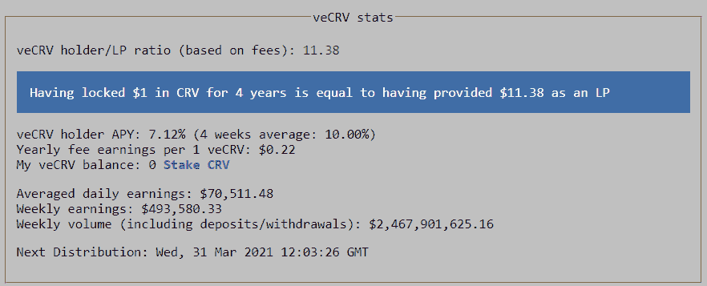
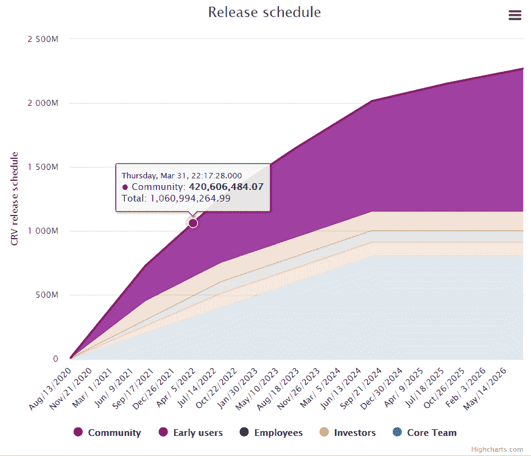
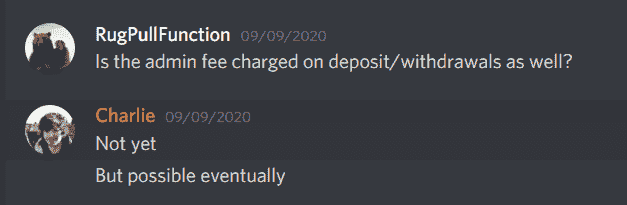
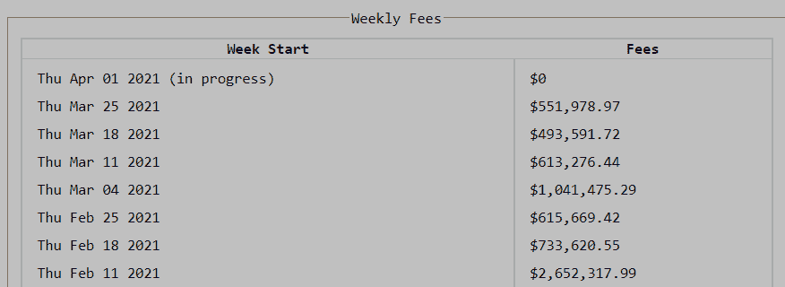
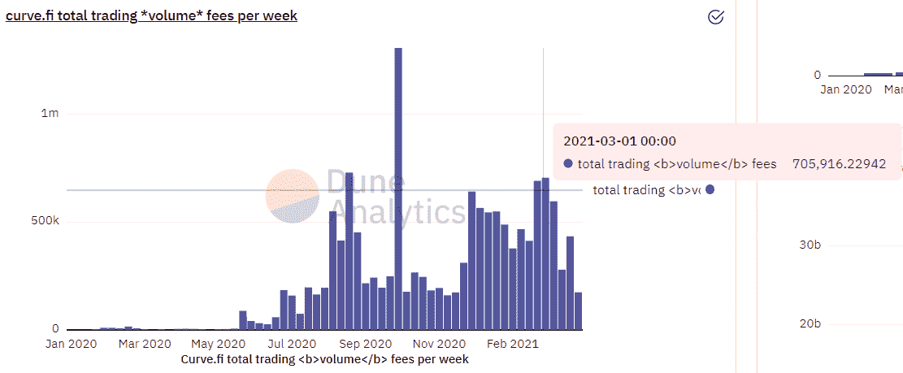
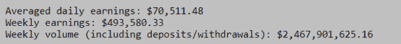
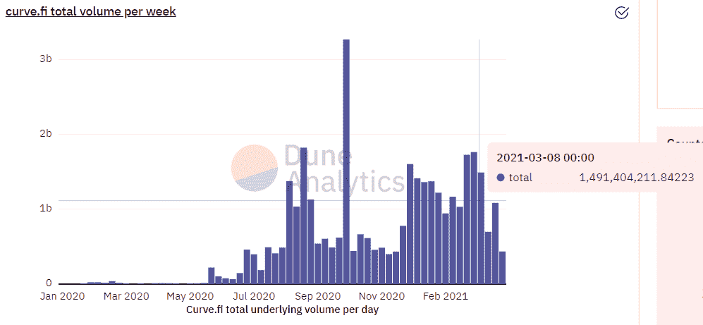
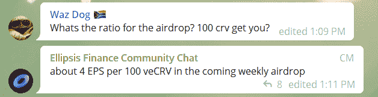
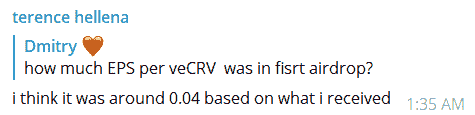
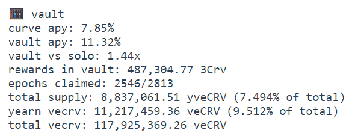

# [公司观察]曲线的估值(曲线系列 3/3)

> 原文：<https://medium.com/coinmonks/company-watch-curves-valuation-curve-series-3-3-a2d04443e98d?source=collection_archive---------1----------------------->

是的，去月球。

但是我们仍然需要给它一个数字；更重要的是，我们建立了一种方法，帮助我们监控曲线融资相对于其估值的增长。比如用于评估科技股的 PEG 比率(市盈率与每股收益之比)。

本文是我们曲线三部曲的最后一篇。前两个是:1) [如何投资你的 CRV](/coinmonks/company-watch-how-to-invest-your-crv-curve-series-1-3-2b85cf531a9a) 和 2) [曲线和 Synthetix 交叉资产互换](/coinmonks/company-watch-curve-and-synthetix-cross-asset-swap-curve-series-2-3-ff2f33fa02a4)。我们还有一篇关于曲线机理的讲解文章:[曲线的稳定铜互换公式和神奇放大系数](https://serenityfund.medium.com/company-watch-curves-formula-for-stablecoins-swap-and-the-magic-amplification-coefficient-d998ed1e184b)。

计算估值指标(如市盈率)最简单的方法是看 CRV 投资者(veCRV)赚了多少钱，以及它的市值(详见[曲线及其投资价值](/coinmonks/company-watch-curve-and-its-investment-value-728f06e1b8fa))。

根据 Coingecko 的数据，截至目前，最近一周的协议收入为 49.358 万美元，完全稀释市值和流通市值分别为 101.42 亿美元和 8.04 亿美元。按年度计算，协议收入为 2570 万美元，市盈率分别为 395 倍和 31 倍。**与 2020 年 12 月相比，Curve 的市盈率没有太大变化，这种快速而肮脏的方法。也就是说，CRV 通货膨胀和物价上涨是由收入增长支撑的。**

然而，我们希望在一些事情上更加科学:

1)评估与估价相关的曲线市值的适当方法

2)收益的构成

3)作为最近的发展，新的收入来源

4)CRV 的衍生产品及其相对估值是什么(交叉核对 CRV 的估值)

在本文中，我们解决这些问题，让我们从投资的角度更好地理解曲线金融。

## 1) Curve Finance 的市值— 1YV

通常，投资者要么着眼于完全稀释(FDV)，要么着眼于流通(ICV)。对曲线金融来说，两者都不准确，因为完全稀释对曲线来说太远，在流通中又太保守，因为曲线现在正脱离 CRV 的基调。所以我们用这个指标:一年后的市值。这不是科学，但它在 FDV 和 ICV 之间取得了平衡。

从 Curve 的[发行时间表](https://dao.curve.fi/releaseschedule)来看，从现在起一年内 CRV 的发行总量将达到 10.61 亿张。这比目前发布的 4.59 亿多了 131%。请注意，与 Coingecko 的计算相比，Curve 自己的计算有所不同。

**利用一年后发布的 CRV 和目前 3.13 美元的市场价格，我们得到的市值为 33.2 亿美元，姑且称之为 1YV。**

## 2)收益的构成

类似于考察一家上市公司的盈利质量，我们来看看 Curve 是如何计算其周费用的。Curve 从两大类型赚取费用，互换费 0.04%，两者各 50%归 Curve；0.02%的存/取款费，100%归曲线。(没有太多关于存款/取款的管理费是多少的解释，但我们注意到一位管理员的回答不一致。我们下面的计算进一步支持了这一点。)

我们来看一下[曲线支付](https://curve.fi/usecrv)的最后四周，即 3 月 4 日、11 日、18 日和 24 日的支付，代表曲线从 2 月 22 日到 3 月 21 日的收入。累计起来，这四周的总收入为 270 万美元。

为了了解多少来自交易，多少来自存款/取款，我们查看了 Dune Analytics 页面的同期交易收入。这总共为我们提供了 227 万美元，其中 50%即 114 万美元用于 Curve。然后，156 万美元的余额来自提款和存款，约占总收入的 58%。

为了验证这一点，我们在 Curve 官方网站和 Dune 上查看了最近一周的数据。当周总交易量为 24.67 亿美元，其中 14.91 亿美元为交易量，9.76 亿美元为存取款。交易的 0.04%的 50%和存款/取款的 0.02%的 100%产生了 493，580 美元的周总收入。

**最近，Curve 大约 40%的收入来自交易，60%来自存款/取款。当我们进入和退出池时，我们实际上是在对池进行交易。当曲线随着新资金池的增加而扩大时，我们预计存款取款的增长速度将快于交易费用。否则，交易费应该是主要的收入来源。**

## 3)新的收入流:省略号在币安智能链上的授权叉

此外，Curve 最近开发了一个新的收入渠道，通过将其技术授权给币安链上的 Ellipsis，[交换其平台令牌 EPS](https://docs.ellipsis.finance/how-to-earn-eps) 总供应量的 25%来产生版税费用。这些代币将在一年内交付。根据 EPS 的价格不同，收入可以是巨大的。虽然不清楚这 25%是否会线性分布，但从电报的反馈来看，似乎是这样。**因此，省略号得出曲线的总年收入为 2.5 亿 x 5 美元= 1.25 亿美元，或 3，320.1 亿美元的 37.6%(一年内的市值，如上定义)。**如果我们根据 veCRV 赌注者的收入来计算，这一数字要高出几倍，因为流通中的 CRV 只有 26%被押入 veCRV。然而，每股收益的价格是不稳定的，因此它不是一个有保证的回报率；此外，如果你现在撤回 EPS，有 50%的罚款。

我们希望省略号不是曲线的特例。自去年 Defi 夏季开始以来，Curve 的团队一直在开发其算法和产品，并在 TVL 的行业中名列前茅，没有任何重大负面事件。Curve 的代码和团队的专业知识，以及其行业声誉，对于任何在任何新链上提供相同产品的团队来说，都是一个巨大的优势。我们预见会不时出现新的区块链。因此，Curve 可以用下一个省略号重复相同的业务处理，以可持续的方式产生更多的收入。这将进一步增强 Curve 的行业领导地位。

## 4)CRV 衍生产品，作为投资选择

在我们三部曲的[第一篇中，我们已经列出了投资曲线的选项:](/coinmonks/company-watch-how-to-invest-your-crv-curve-series-1-3-2b85cf531a9a)

*   CRV，也许还有 CRV 理工大学
*   veCRV，赚取 3CRV 费用，省略空投，提高曲线池收益
*   yveCRV(靠渴望)，比 veCRV 挣的多 3CRV，可能 yveCRV-ETH LPing

请参考我们之前的文章，了解投资曲线的三种方法。从投资回报的角度来看，这三种方法并不具有可比性，因为每种方法都有不同的流动性和功能性:

*   CRV:大多数液体，但没有功能，没有产量
*   完全没有流动资金，但是金库收益增加并赚取协议费用
*   yveCRV:一些流动性，但对 CRV 折价交易；无功能，但有产量

我们截取了 yveCRV 的官方网站的截图:

单纯从收益率的角度来看，由于 3CRV 中分配的协议费，veCRV 的收益率为 7.85%。 **yveCRV 的收益率将达到 11.32%，比 veCRV** 高出约 44%，这有两个来源:

*   向往总共有 1120 万 veCRV，而只有 880 万(永久)存入 yveCRV，所以相差 27.2%
*   yveCRV(现为 2.73 美元)的交易价格比 CRV(现为 3.11 美元)低约 13.9%
*   113.9% x 127.2% = 144%

可以说，人们也可以将 yveCRV 放入 Sushiswap 的 ETH 对中，以获得超过 100%的收益率。但是由于 Sushiswap 现在的设计，不允许用户像 3CRV 和 EPS 一样接收和认领空投。

投资选项的选择取决于个人投资者的流动性需求，以及他是否在 Curve 的金库中有投资——所以这是一个资产配置策略的问题。

## 结论

作为一个稳定的货币基金，我们通常不会对任何平台持有任何观点。但对于 Curve 这种最大、最安全的稳定货币互换，我们长期持乐观态度。我们认为，CRV 的通胀问题是由其业务和收入增长支撑的，因此不会侵蚀 CRV 的价值。此外，Curve 具有支持跨链工作的潜力，并且超越了 stablecoin swap，这在其与 Synthetix 的[跨资产互换合作中显而易见。还有各种各样的 CRV 衍生产品，适合不同投资者的不同投资策略。](/coinmonks/company-watch-curve-and-synthetix-cross-asset-swap-curve-series-2-3-ff2f33fa02a4)

我们期待看到 Curve 成为 defi 最重要的基石，将加密货币行业带入新的高度。

(宁静队，2021 年 4 月 1 日，推特:【https://twitter.com/SerenityFund】T2)

> 加入 Coinmonks [电报集团](https://t.me/joinchat/EPmjKpNYwRMsBI4p)，了解加密交易和投资

## 另外，阅读

*   最好的[密码交易机器人](/coinmonks/crypto-trading-bot-c2ffce8acb2a) | [网格交易](https://blog.coincodecap.com/grid-trading)
*   [加密复制交易平台](/coinmonks/top-10-crypto-copy-trading-platforms-for-beginners-d0c37c7d698c) | [如何在 WazirX 上购买比特币](/coinmonks/buy-bitcoin-on-wazirx-2d12b7989af1)
*   [CoinLoan 审核](/coinmonks/coinloan-review-18128b9badc4)|[Crypto.com 审核](/coinmonks/crypto-com-review-f143dca1f74c) | [火币保证金交易](/coinmonks/huobi-margin-trading-b3b06cdc1519)
*   [尤霍德勒 vs 考尼洛 vs 霍德诺特](/coinmonks/youhodler-vs-coinloan-vs-hodlnaut-b1050acde55a) | [Cryptohopper vs 哈斯博特](https://blog.coincodecap.com/cryptohopper-vs-haasbot)
*   [杠杆代币](/coinmonks/leveraged-token-3f5257808b22) | [最佳密码交易所](/coinmonks/crypto-exchange-dd2f9d6f3769) | [Paxful 点评](/coinmonks/paxful-review-4daf2354ab70)
*   [加密套利](/coinmonks/crypto-arbitrage-guide-how-to-make-money-as-a-beginner-62bfe5c868f6)指南| [如何做空比特币](/coinmonks/how-to-short-bitcoin-568a2d0b4ae5)
*   [如何在印度购买比特币？](/coinmonks/buy-bitcoin-in-india-feb50ddfef94) | [WazirX 审查](/coinmonks/wazirx-review-5c811b074f5b)
*   [印度比特币交易所](/coinmonks/bitcoin-exchange-in-india-7f1fe79715c9) | [比特币储蓄账户](/coinmonks/bitcoin-savings-account-e65b13f92451)
*   [币安收费](/coinmonks/binance-fees-8588ec17965) | [僵尸加密审查](/coinmonks/botcrypto-review-2021-build-your-own-trading-bot-coincodecap-6b8332d736c7) | [热点审查](/coinmonks/hotbit-review-cd5bec41dafb)
*   [我的密码交易经验](/coinmonks/my-experience-with-crypto-copy-trading-d6feb2ce3ac5) | [购买硬币评论](https://blog.coincodecap.com/buycoins-review)
*   [逐位融资融券交易](/coinmonks/bybit-margin-trading-e5071676244e) | [币安融资融券交易](/coinmonks/binance-margin-trading-c9eb5e9d2116) | [超位审核](/coinmonks/overbit-review-9446ed4f2188)
*   [加密货币储蓄账户](/coinmonks/cryptocurrency-savings-accounts-be3bc0feffbf) | [YoBit 审核](/coinmonks/yobit-review-175464162c62) | [Bitbns 审核](/coinmonks/bitbns-review-38256a07e161)
*   [Botsfolio vs nap bots vs Mudrex](/coinmonks/botsfolio-vs-napbots-vs-mudrex-c81344970c02)|[gate . io 交流回顾](/coinmonks/gate-io-exchange-review-61bf87b7078f)
*   [最佳比特币保证金交易](/coinmonks/bitcoin-margin-trading-exchange-bcbfcbf7b8e3) | [萝莉点评](/coinmonks/lolli-review-e6ddc7895ad8) | [比特币保证金交易](https://blog.coincodecap.com/bityard-margin-trading)
*   [创造并出售你的第一个 NFT](https://blog.coincodecap.com/create-nft) | [本地比特币评论](/coinmonks/localbitcoins-review-6cc001c6ed56)
*   [加密保证金交易交易所](/coinmonks/crypto-margin-trading-exchanges-428b1f7ad108) | [赚取比特币](/coinmonks/earn-bitcoin-6e8bd3c592d9)
*   [如何在印度购买以太坊？](https://blog.coincodecap.com/buy-ethereum-in-india) | [如何在币安购买比特币](https://blog.coincodecap.com/buy-bitcoin-binance)
*   [顶级付费加密货币和区块链课程](https://blog.coincodecap.com/blockchain-courses) | [Pionex vs 币安](https://blog.coincodecap.com/pionex-vs-binance)

> [直接在您的收件箱中获得最佳软件交易](/coinmonks/newsletters/coinmonks)

