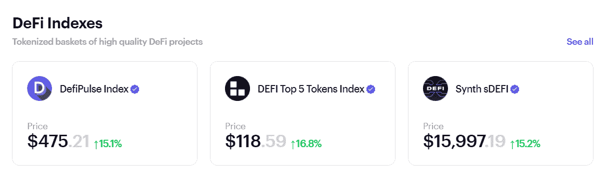
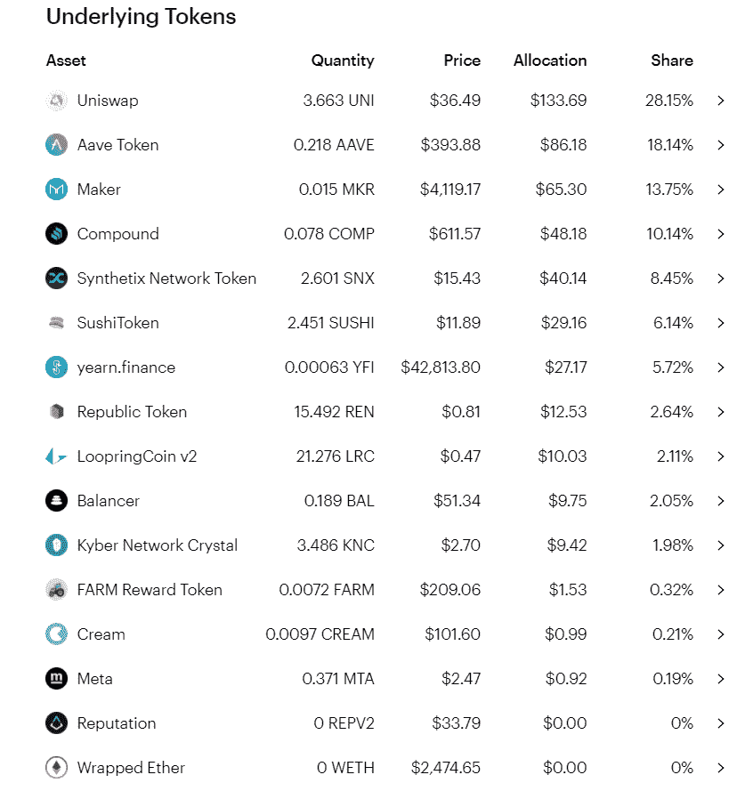
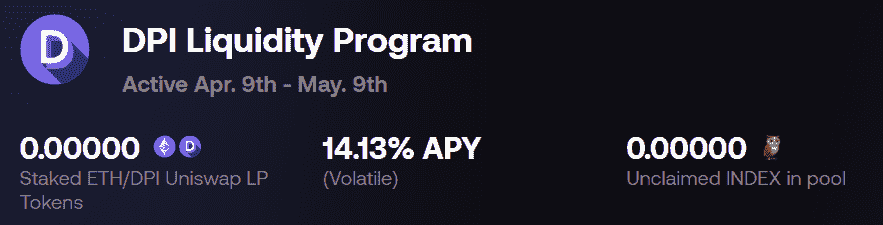
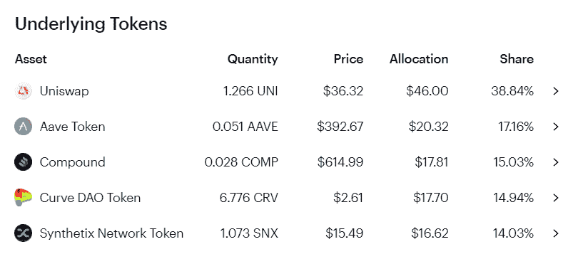
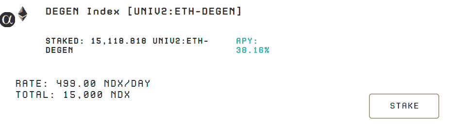
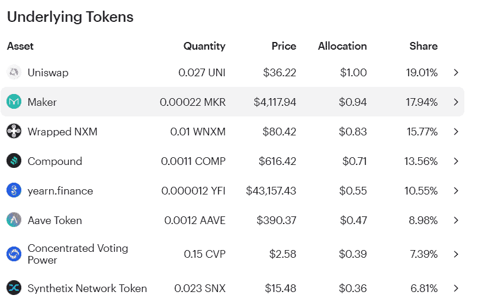
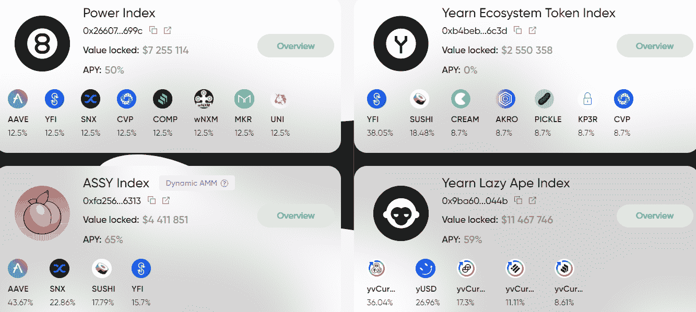

# [公司观察] Defi 指数(新的 Defi 系列 5/5)

> 原文：<https://medium.com/coinmonks/company-watch-defi-indexes-new-defi-series-5-5-2f5438da44e0?source=collection_archive---------5----------------------->

如果你认为 Defi 是一个惊人的领域，但不确定哪家公司会脱颖而出，Defi 指数可能是一条出路。首先，Zerion 列出了其中的一些:

## 按指数分类的 DPI coop

以 DefiPulse 指数为例，它拥有所有领先的 Defi 公司的投资组合，其中最大的是 Uniswap。该指数本身的市值为 1.43 亿美元，你可以在 Uniswap 或官方网站 [IndexCoop](https://www.indexcoop.com/dpi) 上购买 DPI，它代表投资组合的一部分。这大概是 Defi 最早的指数基金。

除了持有 DPI，您还可以通过将 DPI 与 Uniswap 上的 ETH 配对来为 DPI 提供流动性，然后将 LP 令牌存入 IndexCoop 的激励池。现在收益率 18%左右，费用加指数奖励。

DPI 有一个分叉版本， [BasketDAO](http://www.basketdao.org/dashboard) ，它遵循相同的原则，但现在有更高的激励机制和更强大的 DAO 机制。其平台令牌 BASK 的持有人可以决定投资组合的权重。目前，该平台的收益率超过 70%。

## 由指数化金融定义

如果你认为 DPI 指数过于多样化，那么 DEFI5 by Indexed Finance 更适合你。这是 Uniswap、Aave、Compound、Curve 和 Synthetix 的索引。该指数的市值要小得多，只有 1300 万美元，而且只包括 defi 的蓝筹股。目前该产品没有持续的激励计划。

指数金融提供一些其他指数产品，如 NFT 指数或甲骨文指数。与 defi 相关的是，有一个比 Defi5 更激进的版本，名为 CC10(加密货币的 10 大令牌)，由 defi majors 和 Chainlink 等一些 oracle 令牌组成。

指数金融也有一个 Degen defi 指数，由 1inch 或 Badger 等较新的令牌组成。官网上没有详细信息。目前，有一项激励计划正在进行中(但将于 5 月 2 日结束):

## PIPT 电力联营公司

Power Pool 的 PIPT 比 DEFI5 稍微多样化一些，包括保险平台 Nexum、向往和 Power Pool 自己的令牌 CVP。PIPT 理工大学的 Sushiswap pair 提供激励措施。

Power Pool 还有一些其他产品，主要集中在 Yearn 的生态系统周围。

## 其他人

还有一些其他较小或独立的指数，如 Synthetix 的 Defi 指数，或 dHedge 上一些以 Defi 为中心的基金，或 [PieDAO](https://pools.piedao.org/) 的较小指数基金。

## **结论**

持有其中一个指数并从 defi 的上涨中受益，是驾驭 Defi 热潮的最简单方式。此外，人们可以通过 ETH 为 defi 指数提供流动性，因为 Defi 指数通常与 ETH 保持一致，目前的收益率也是合理的。我们认为这是一种提高 ETH 产量的方法，并将此作为 ETH 产品的策略。

(宁静队，2021 年 4 月 26 日，推特:[https://twitter.com/SerenityFund)](https://twitter.com/SerenityFund))

> 加入 Coinmonks [电报集团](https://t.me/joinchat/PmKOYQ9NNKZlZGNl)，了解加密交易和投资

## 另外，阅读

*   最好的[加密交易机器人](/coinmonks/crypto-trading-bot-c2ffce8acb2a) | [网格交易机器人](https://blog.coincodecap.com/grid-trading)
*   [加密副本交易平台](/coinmonks/top-10-crypto-copy-trading-platforms-for-beginners-d0c37c7d698c) | [五大 BlockFi 替代方案](https://blog.coincodecap.com/blockfi-alternatives)
*   [CoinLoan 审核](/coinmonks/coinloan-review-18128b9badc4)|[Crypto.com 审核](/coinmonks/crypto-com-review-f143dca1f74c) | [火币保证金交易](/coinmonks/huobi-margin-trading-b3b06cdc1519)
*   [尤霍德勒 vs 考尼洛 vs 霍德诺特](/coinmonks/youhodler-vs-coinloan-vs-hodlnaut-b1050acde55a) | [Cryptohopper vs 哈斯博特](https://blog.coincodecap.com/cryptohopper-vs-haasbot)
*   [杠杆代币](/coinmonks/leveraged-token-3f5257808b22) | [最佳密码交易所](/coinmonks/crypto-exchange-dd2f9d6f3769) | [Paxful 点评](/coinmonks/paxful-review-4daf2354ab70)
*   [如何在印度购买比特币？](/coinmonks/buy-bitcoin-in-india-feb50ddfef94) | [WazirX 评论](/coinmonks/wazirx-review-5c811b074f5b) | [BitMEX 评论](https://blog.coincodecap.com/bitmex-review)
*   [双子座 vs 比特币基地](https://blog.coincodecap.com/gemini-vs-coinbase) | [比特币基地 vs 北海巨妖](https://blog.coincodecap.com/kraken-vs-coinbase)|[coin jar vs coin spot](https://blog.coincodecap.com/coinspot-vs-coinjar)
*   [币安 vs 北海巨妖](https://blog.coincodecap.com/binance-vs-kraken) | [美元成本平均交易机器人](https://blog.coincodecap.com/pionex-dca-bot)
*   [印度比特币交易所](/coinmonks/bitcoin-exchange-in-india-7f1fe79715c9) | [比特币储蓄账户](/coinmonks/bitcoin-savings-account-e65b13f92451)
*   [币安收费](/coinmonks/binance-fees-8588ec17965) | [Botcrypto 审查](/coinmonks/botcrypto-review-2021-build-your-own-trading-bot-coincodecap-6b8332d736c7) | [Hotbit 审查](/coinmonks/hotbit-review-cd5bec41dafb) | [KuCoin 审查](https://blog.coincodecap.com/kucoin-review)
*   [我的密码副本交易经验](/coinmonks/my-experience-with-crypto-copy-trading-d6feb2ce3ac5) | [购买硬币评论](https://blog.coincodecap.com/buycoins-review)
*   [加密货币储蓄账户](/coinmonks/cryptocurrency-savings-accounts-be3bc0feffbf) | [YoBit 审查](/coinmonks/yobit-review-175464162c62) | [Bitbns 审查](/coinmonks/bitbns-review-38256a07e161)
*   [最佳比特币保证金交易](/coinmonks/bitcoin-margin-trading-exchange-bcbfcbf7b8e3) | [比特币保证金交易](https://blog.coincodecap.com/bityard-margin-trading)
*   [加密保证金交易交易所](/coinmonks/crypto-margin-trading-exchanges-428b1f7ad108) | [赚取比特币](/coinmonks/earn-bitcoin-6e8bd3c592d9) | [Mudrex 投资](https://blog.coincodecap.com/mudrex-invest-review-the-best-way-to-invest-in-crypto)
*   [BlockFi 信用卡](https://blog.coincodecap.com/blockfi-credit-card) | [如何在币安购买比特币](https://blog.coincodecap.com/buy-bitcoin-binance)
*   [顶级付费加密货币和区块链课程](https://blog.coincodecap.com/blockchain-courses) | [币安评论](/coinmonks/binance-review-ee10d3bf3b6e)
*   [MXC 交易所评论](/coinmonks/mxc-exchange-review-3af0ec1cba8c) | [Pionex vs 币安](https://blog.coincodecap.com/pionex-vs-binance) | [Pionex 套利机器人](https://blog.coincodecap.com/pionex-arbitrage-bot)
*   [在美国如何使用 BitMEX？](https://blog.coincodecap.com/use-bitmex-in-usa) | [BitMEX 回顾](https://blog.coincodecap.com/bitmex-review) | [币安 vs Bittrex](https://blog.coincodecap.com/binance-vs-bittrex)