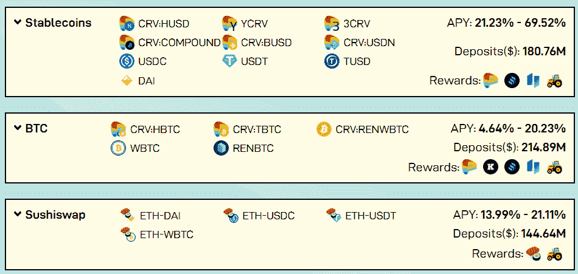
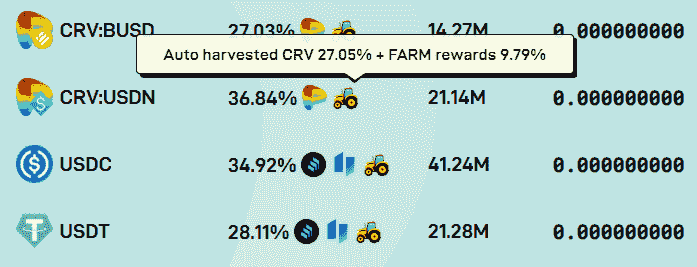
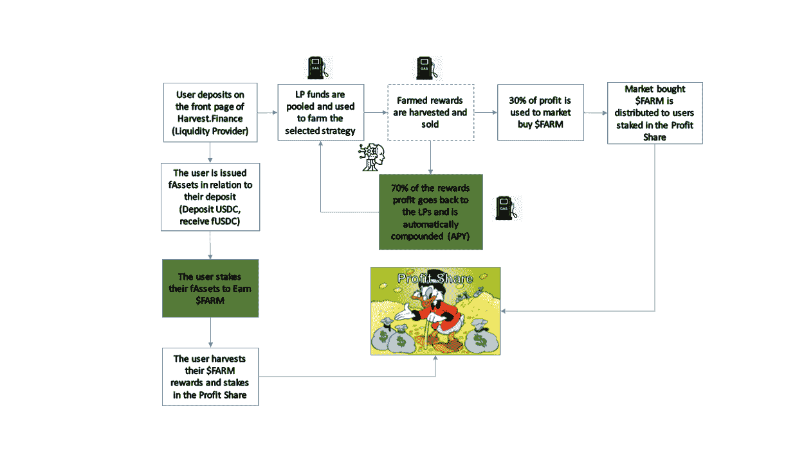
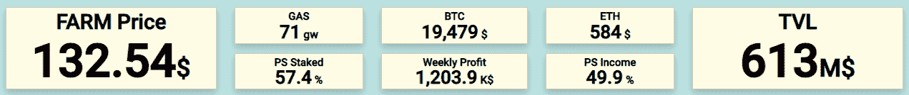
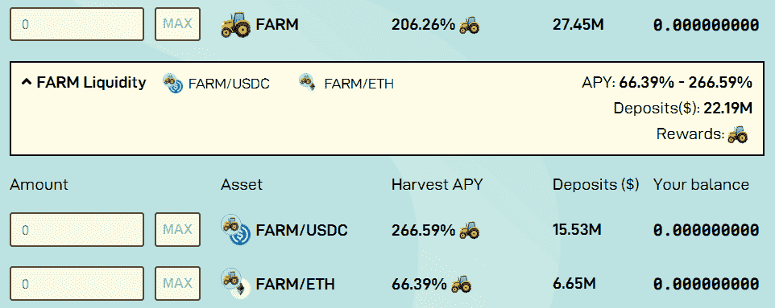

# [公司观察]收获金融，被动的 Defi 基金赚取冒险者的钱

> 原文：<https://medium.com/coinmonks/company-watch-harvest-finance-the-passive-defi-fund-earning-the-risk-takers-money-76193f496a4b?source=collection_archive---------3----------------------->

*免责声明:Serenity Fund 在 FARM 中没有头寸，但使用 Harvest 作为其资产管理策略的补充。*

[嘉实金融](https://harvest.finance/)是一个新的 DeFi 项目，本质上是一个被动基金。2020 年 8 月由一个匿名团队创建，Harvest 不是任何一个大平台的叉子。这是一个类似于渴望的收益聚合器，只是它没有明星创始人。今天，[是 AUM](https://defillama.com/home) 大于向往。它曾经拥有 10 亿 AUM，市值超过 1 亿美元，但在 10 月份被砍掉了 2400 万美元。这给了市场，以及它的 AUM 和农场，它的本土令牌，一个很大的冲击。从那以后，Harvest 蹒跚而行，仍然是一项有吸引力的服务，同时也是一个有趣的投资目标。

## **嘉实的业务**

作为一个收益汇集者，Harvest 的服务是直接的。从投资者那里获得稳定收益和 LP 代币，放入领先的 DeFi 平台的智能合约中，收取部分收益，但用农场代币补偿投资者。

目前，投资者可以存款和入股 stablecoins，合成版 BTC，以及 Sushiswap 的 LP 代币。

稳定玉米的收成率大约在 30%到 40%之间。收益来自于承担更多的风险，例如，曲线上新的稳定收益具有更高的 CRV 回报，如 BUSD 或美国国债；或者农场其他平台比如 Idle。最后，用自己的平台令牌农场来激励投资者。例如，如果你承担复利、闲置和收获的风险，那么基于今天的农场价格，你今天的 USDC 收益率是 34.92% ( [减去 30%](https://farm.chainwiki.dev/en/calculationAPY))。

Harvest 收取 30%的收益，并以农场代币补偿投资者。每个池的农场代币的数量是预先确定的，因此奖励 APR 与池的大小成反比。对于一个简单的投资者来说，数学很简单:如果你有一枚硬币，比如 crvUSDN，并且你对复利和曲线的风险没有问题，那么你的计算将是 Harvest 提供的 CRV +农场的 70%是否大于 Curve 提供的 CRV 的 100%。(在这种情况下，你需要一些 CRV 桩来达到这个产量。)如果更大，你还需要考虑额外的收益是否值得承担平台的收获风险。

## 农场令牌及其价值

就像向往的 YFI 代币，农场是现金流支持的。80%流通中的农场代币押在平台上，他们有权获得 30%收入的每周分配。农场股东的 30%收入由市场回购执行，并根据其持有的农场代币按比例分配。下图显示了整个[收获/农场价值逻辑](https://redmption.medium.com/flight-of-the-aggregator-1a687a1662ed):

这看起来可能很复杂，但一句话:丰收从投资者那里拿走 30%的收益，并返还农场作为回报；然后 30%用于在市场上回购农场，分发给农场股东。**从这里我们可以算出一个农场的理论最低价格，让投资者接受这个 30%的交换:农场价格> (AUM x 预期收益率 x 30%) /每周排放给收割流动性提供者。目前是 51 美元。我们称之为预期价格风险，在这一点以下，它的令牌经济学在宏观层面上是站不住脚的。**

在农场所有者方面，如网站首页所述，目前 staking FARM 的 APY 超过 220%(包括一周的利润分成)。

如果我们使用其[统计页面](https://farmdashboard.xyz/)上的数据来计算 Harvest 的周收益，我们将获得 2490 万美元的年收益(周利润 120.39 万美元 x 52 周/130% x 30%，加上 1561.71 农场的[农场赌注奖励)。该农场的股份总额为 2920 万美元(5080 万美元 x 57.4%)。**对于农场股东来说，这意味着 85.2%的年利率(或大约 232%的 APY，如果每周复利)。**](/harvest-finance/week-15-make-it-rain-grain-9b56af6df118)

此外，农场价格由池 2 方案支持。您可以将农场存入池中，或者只是下注以赚取更多农场，大约 100% APY。(这里的 APY 差异很大，我们还不确定为什么。)一般来说，我们会建议对农场进行投资，而不是为农场提供流动性，以便在风险敞口相似的情况下获得更好的收益。

## 农场令牌的长期价值

让我们回顾一下上面的分析:

*   AUM 总额为 6.13 亿美元。不包括农场赌注和流动资金池，其金库 AUM 为 5.62 亿美元；
*   利润(削减 30%前)为每周 93 万美元，年化为 4810 万美元。这意味着 AUM 金库的年利率为 8.6%；
*   农场股东获得 30%，即 1440 万美元。考虑到农场市值为 5080 万美元，这意味着市盈率为 3.5 倍；

这并不坏。在我们对曲线的[分析中，如果锁定 CRV 4 年，曲线的 PE 是 7.9 倍，如果不锁定，是 30.3 倍。以《渴望》为例，如果我们看一下 YFI 0.87%的收益率，我们可以估算出 114.9 倍的市盈率。换句话说，如果我们只是看赚钱能力，FARM 是一个不错的选择。](/coinmonks/company-watch-curve-and-its-investment-value-728f06e1b8fa)

从长远来看，我们从现在开始看一年，这是加密货币行业的长期趋势，流通中的总农场将是 663，826，大约是现在流通 384，042 的 1.73 倍。为了维持目前的市场价值或价格，FARM 的 AUM 必须在一年内增长 73%，达到略高于 10 亿美元，或者在 AUM 的收益增长 15%，或者两者兼而有之。**如果收成超出预期，其 AUM 很可能达到 10 亿美元，或其市盈率从 3.5 倍上升，这也很可能是由于市场对 Defi 的普遍情绪，那么农场价格将会上涨。然而，AUM 的上涨确实对农场有负面影响，因为农场的价格必须高到足以吸引投资者交易他们 30%的收益。因此，这是农场持有人应该警惕的 tokenomic 模型风险(预期价格风险)。**

丰收组织为其农场所有者赚了多少钱？

如上所述，Harvest 寻找风险稍高的项目，如曲线中的新稳定点，或闲置和保留，以获得更好的收益。但 FARM 不承担这些风险，这些风险是由这些池的投资者承担的。这就是为什么这篇文章的标题，农场屈服于密码行业的冒险者；鉴于这个行业的动物精神，Harvest 做得很对。另一部分是套利，对于一些池，收获是带走 30%的约 40%的产量，而只返回几个百分点的农场产量作为回报。这可能是一个信息不对称的例子，而 Harvest 又一次做对了。

Harvest 的风险将是传统的安全风险、第三方智能合同集成风险，在 Havest 的情况下，它的预期价格风险(价格应该下降到某个点以下，以便令牌经济学能够维持。)没有付出，就没有收获。所以，doHardwork()。

(宁静队，2020 年 12 月 16 日)

## 另外，阅读

*   [密码交易机器人](/coinmonks/crypto-trading-bot-c2ffce8acb2a)
*   [Uniswap API](https://bitquery.io/blog/uniswap-pool-api) —如何获取 Uniswap 数据？
*   [Deribit 审查](/coinmonks/deribit-review-options-fees-apis-and-testnet-2ca16c4bbdb2) |选项、费用、API 和 Testnet
*   [FTX 密码交易所评论](/coinmonks/ftx-crypto-exchange-review-53664ac1198f)
*   [Bybit 交换审查](/coinmonks/bybit-exchange-review-dbd570019b71)
*   最好的比特币[硬件钱包](/coinmonks/the-best-cryptocurrency-hardware-wallets-of-2020-e28b1c124069?source=friends_link&sk=324dd9ff8556ab578d71e7ad7658ad7c)
*   [密码本交易平台](/coinmonks/top-10-crypto-copy-trading-platforms-for-beginners-d0c37c7d698c)
*   [bits gap vs 3 commas vs quad ency](https://blog.coincodecap.com/bitsgap-3commas-quadency)
*   最好的[加密税务软件](/coinmonks/best-crypto-tax-tool-for-my-money-72d4b430816b)
*   [最佳加密交易平台](/coinmonks/the-best-crypto-trading-platforms-in-2020-the-definitive-guide-updated-c72f8b874555)
*   最佳[密码借贷平台](/coinmonks/top-5-crypto-lending-platforms-in-2020-that-you-need-to-know-a1b675cec3fa)
*   [莱杰 Nano S vs 特雷佐 one vs 特雷佐 T vs 莱杰 Nano X](https://blog.coincodecap.com/ledger-nano-s-vs-trezor-one-ledger-nano-x-trezor-t)
*   [block fi vs Celsius](/coinmonks/blockfi-vs-celsius-vs-hodlnaut-8a1cc8c26630)vs Hodlnaut
*   [bits gap review](/coinmonks/bitsgap-review-a-crypto-trading-bot-that-makes-easy-money-a5d88a336df2)——一个轻松赚钱的加密交易机器人
*   为专业人士设计的加密交易机器人
*   [PrimeXBT 审查](/coinmonks/primexbt-review-88e0815be858) |杠杆交易、费用和交易
*   [其他准备评审](https://blog.coincodecap.com/altrady-reivew)
*   [埃利帕尔泰坦评论](/coinmonks/ellipal-titan-review-85e9071dd029)
*   [赛克斯石评论](https://blog.coincodecap.com/secux-stone-hardware-wallet-review)
*   [BlockFi 评论](/coinmonks/blockfi-review-53096053c097) |从您的密码中赚取高达 8.6%的利息
*   开发人员的最佳加密 API
*   [最佳区块链分析工具](https://bitquery.io/blog/best-blockchain-analysis-tools-and-software)
*   [加密套利](/coinmonks/crypto-arbitrage-guide-how-to-make-money-as-a-beginner-62bfe5c868f6)指南:新手如何赚钱
*   顶级[比特币节点](https://blog.coincodecap.com/bitcoin-node-solutions)提供商
*   最佳[加密制图工具](/coinmonks/what-are-the-best-charting-platforms-for-cryptocurrency-trading-85aade584d80)
*   了解比特币最好的[书籍有哪些？](/coinmonks/what-are-the-best-books-to-learn-bitcoin-409aeb9aff4b)

> [在您的收件箱中直接获得最佳软件交易](/coinmonks/newsletters/coinmonks)

