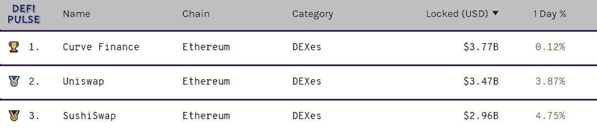
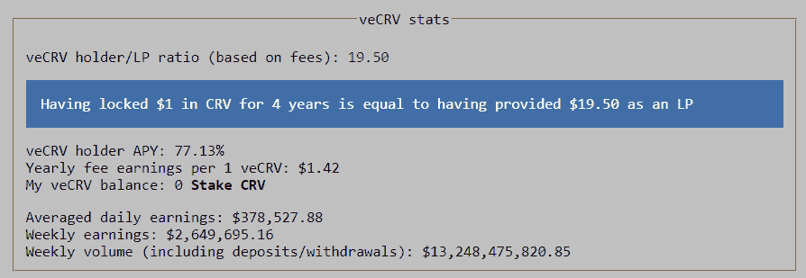
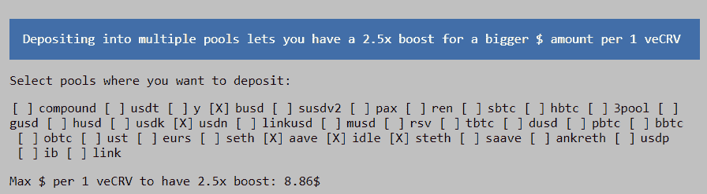
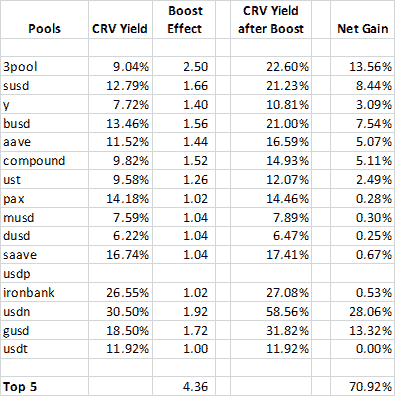
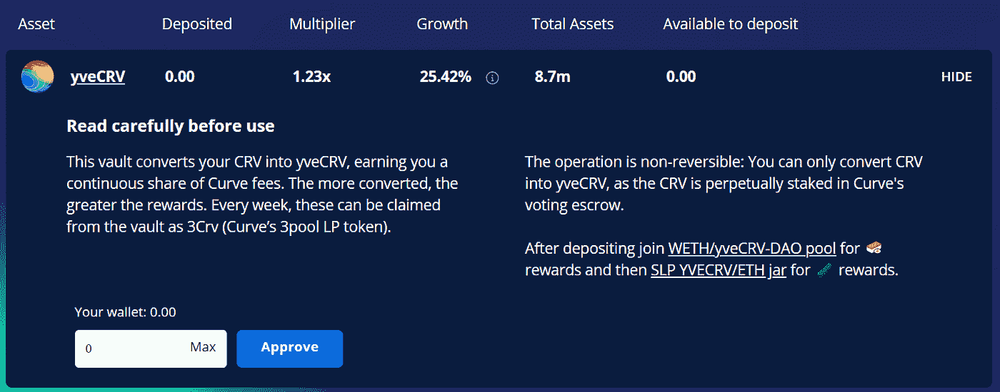
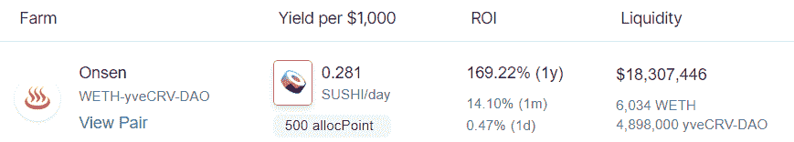
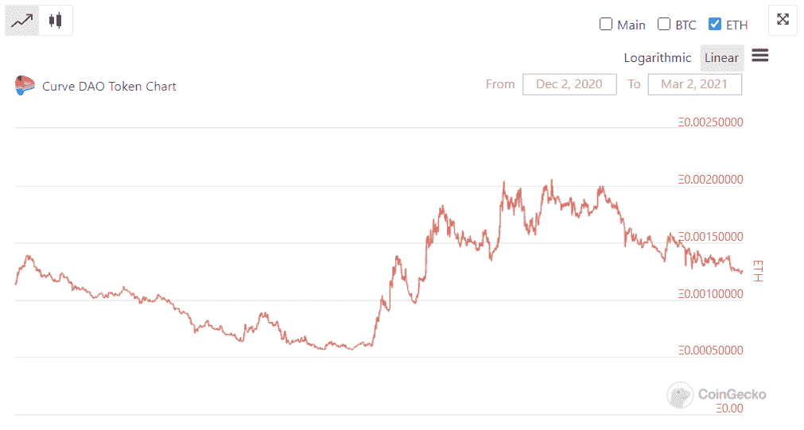

# 【公司观察】如何投资你的 CRV？(曲线系列 1/3)

> 原文：<https://medium.com/coinmonks/company-watch-how-to-invest-your-crv-curve-series-1-3-2b85cf531a9a?source=collection_archive---------1----------------------->

Curve Finance 现在是 TVL 最大的自动做市商，平台锁定了 38 亿美元。每个曲线池接收一些 CRV，其平台令牌作为奖励。根据梅萨里的数据，截至目前，CRV 的发行量为 4.3 亿美元。

CRV 是一个产生价值的令牌，正如我们在前面的文章中分析的[曲线及其投资价值](/coinmonks/company-watch-curve-and-its-investment-value-728f06e1b8fa)。我们在[的《稳定硬币互换的曲线公式](https://serenityfund.medium.com/company-watch-curves-formula-for-stablecoins-swap-and-the-magic-amplification-coefficient-d998ed1e184b)一文中也详细解释了曲线稳定硬币互换的机理。以上文章，请参考我们的 twitter 或 Medium。

CRV 的经济价值是双重的:

*   管理费的份额:大多数曲线池收取 0.04%的交易费，其中 50%给 CRV 的赌注者；
*   资金池提升:如果你也是任何资金池的流动性提供者，CRV 可以被锁定以提升资金池收益率。

无论是哪种情况，你都要把你的 CRV 锁定一段时间，从 1 周到 4 年，在曲线刀页面下。1 个 veCRV 对应 1 个锁定 4 年的 CRV，给出的 veCRV 数量与锁定期成比例，例如 0.25 个 veCRV 对应 1 个锁定 1 年的 CRV。veCRV 可用于在曲线 DAO 中对管理事务进行投票，其中之一是每周投票决定给每个池分配多少 CRV 奖励。

## 管理费份额

veCRV 持有人自动获得管理费份额。这是流动性与收益的权衡。Curve Finance 从每个池中收取交易费和存取款费用，并将其转换为 3CRV token，即 Curve 最大的池 3pool 的 LP token。3CRV 大致是、、戴在 3pool 的成交量加权平均价格，因此其价格约为 1 美元。

交易费为 0.04%的存款费和 0.02%的取款费，其中 50%归 veCRV 持有人所有。

截至目前，CRV 总量为 1.068 亿(占流通 CRV 总量的 45.76%)，平均周期为 3.63 年。在那里，CRV 有权获得 50%的交易费。截至今天，Curve 报告的周收入为 265 万美元，年化收入为 1.382 亿美元，由 veCRV 持有人按比例分享。这大约是 77.13%的收益率(基于 3.63 年的平均锁定期)。

换句话说，你锁定 CRV 的时间越长，你收到的交易费就越多。如果你喜欢流动性和收益率的平衡，例如锁定 CRV 1 年，你的收益率将是 77.13% / 3.63 年 x 1 年= 21.2%。

费用按周发放；虽然此处的周截图可能偏高(由于该周发生的漏洞事件)，但 Curve 在此处提供了周收入分布记录[，在此处](https://www.curve.fi/usecrv)提供了每日交易费用收入[。](https://www.curve.fi/dailystats)

## 提高池产量

除了在 3CRV 中收取交易费用，veCRV 的持有人还可以使用 veCRV 来提高资金池中的 CRV 回报(如果有流动性的话)。这可以通过锁定你的 CRV 来实现，在官方网站上有详细的指南[这里](https://resources.curve.fi/guides/boosting-your-crv-rewards)。

您锁定的 CRV 将应用于您提供流动性的每个资金池。因此，对于给定的 CRV 锁定量，您拥有的池越多，总体提振效果就越高。

具有助推效果并不会否定或消除你的管理费份额。

如果你有 10，000 CRV，然后锁定一年，下面是每个池中每 10，000 美元可以产生的当前提振效应:

如果你在 5 个资金池中拥有流动性，通过锁定 10，000 CRV 1 年(这将给你 2，500 veCRV)你可以实现的最大提升将是 70.92%。

每个 10，000 美元和 70.92%的组合将转化为每年 7，092 美元的额外收益。此时，10000 CRV 的成本为 19000 美元，因此收益率约为 37.3%。

## 锁定渴望

向往使用大量的 CRV 来提高其池，它也有一个 y-veCRV 池，用户可以永久锁定 CRV(是的，永久)到池中。向往将锁定所有的 CRV 到 4 年和滚动 veCRV。然后，渴望将每周收获其应得的 3CRV 奖励，并让用户可以申请。

yveCRV 还获得 yveCRV 池提升的其他渴望金库收获的 CRV 的 10%。这意味着资金池中的 veCRV 是 CRV 用户存款和 CRV 其他金库捐款的总和。由于向往金库不接受 3CRV，用户谁贡献了 yveCRV 将有超过 1 CRV 份额的 3CRV 每 CRV。这个比例还会随着时间的推移而增加，因为越来越多的渴望金库贡献给了 yveCRV 金库。

目前，这个池的收益率(你锁定的 CRV 增长的速度)大约是每年 25%。

当这些 CRV 被永久锁定时，你实际上可以交易这个池的 LP 令牌，在 Sushiswap 中的 yveCRV。也可以为这一对提供流动性，赚取更多。(注意:根据《不和谐的渴望》管理员的说法，如果你有一个 amm 中的 yveCRV 代币，那么你不能要求 3crv 奖励。)

另请注意，Sushiswap 奖励的 2/3 将在 6 个月后发放。

## 在 Uniswap 中提供流动性

最后，在 Uniswap 中为 CRV-ETH 提供流动性也是一个选择，因为 ETH 和 CRV 或多或少都在朝着同一个方向前进(尽管并不总是同时)。最近收益率在 40%到 60%左右。

(宁静队，2021 年 3 月 2 日，推特:[https://twitter.com/SerenityFund)](https://twitter.com/SerenityFund))

> 加入 Coinmonks [电报集团](https://t.me/joinchat/EPmjKpNYwRMsBI4p)，了解加密交易和投资

## 另外，阅读

*   什么是[闪贷](https://blog.coincodecap.com/what-are-flash-loans-on-ethereum)？
*   最好的[密码交易机器人](/coinmonks/crypto-trading-bot-c2ffce8acb2a) | [网格交易](https://blog.coincodecap.com/grid-trading)
*   [3 商业评论](/coinmonks/3commas-review-an-excellent-crypto-trading-bot-2020-1313a58bec92) | [Pionex 评论](/coinmonks/pionex-review-exchange-with-crypto-trading-bot-1e459d0191ea) | [Coinrule 评论](https://blog.coincodecap.com/coinrule-review-a-perfect-trading-bot)
*   [AAX 交易所评论](/coinmonks/aax-exchange-review-2021-67c5ea09330c) | [德里比特评论](/coinmonks/deribit-review-options-fees-apis-and-testnet-2ca16c4bbdb2) | [FTX 交易所评论](/coinmonks/ftx-crypto-exchange-review-53664ac1198f)
*   [n ave 零点回顾](/coinmonks/ngrave-zero-review-c465cf8307fc) | [Phemex 回顾](/coinmonks/phemex-review-4cfba0b49e28) | [PrimeXBT 回顾](/coinmonks/primexbt-review-88e0815be858)
*   [Bybit Exchange 审查](/coinmonks/bybit-exchange-review-dbd570019b71) | [Bityard 审查](https://blog.coincodecap.com/bityard-reivew) | [CoinSpot 审查](https://blog.coincodecap.com/coinspot-review)
*   [3 commas vs crypto hopper](/coinmonks/3commas-vs-pionex-vs-cryptohopper-best-crypto-bot-6a98d2baa203)|[赚取加密利息](/coinmonks/earn-crypto-interest-b10b810fdda3)
*   最好的比特币[硬件钱包](/coinmonks/the-best-cryptocurrency-hardware-wallets-of-2020-e28b1c124069?source=friends_link&sk=324dd9ff8556ab578d71e7ad7658ad7c) | [BitBox02 回顾](/coinmonks/bitbox02-review-your-swiss-bitcoin-hardware-wallet-c36c88fff29)
*   [莱杰 vs n rave](https://blog.coincodecap.com/ngrave-vs-ledger)|[莱杰 nano s vs x](https://blog.coincodecap.com/ledger-nano-s-vs-x)
*   [加密拷贝交易平台](/coinmonks/top-10-crypto-copy-trading-platforms-for-beginners-d0c37c7d698c) | [比特码拷贝交易](https://blog.coincodecap.com/bityard-copy-trading)
*   [Vauld Review](https://blog.coincodecap.com/vauld-review)|[you hodler Review](/coinmonks/youhodler-4-easy-ways-to-make-money-98969b9689f2)|[BlockFi Review](/coinmonks/blockfi-review-53096053c097)
*   最好的[加密税务软件](/coinmonks/best-crypto-tax-tool-for-my-money-72d4b430816b) | [硬币追踪评论](/coinmonks/cointracking-review-a-reliable-cryptocurrency-tax-software-5114e3eb5737)
*   最佳[加密借贷平台](/coinmonks/top-5-crypto-lending-platforms-in-2020-that-you-need-to-know-a1b675cec3fa) | [杠杆代币](/coinmonks/leveraged-token-3f5257808b22)
*   [莱杰纳米 S vs 特雷佐 one vs 特雷佐 T vs 莱杰纳米 X](https://blog.coincodecap.com/ledger-nano-s-vs-trezor-one-ledger-nano-x-trezor-t)
*   [block fi vs Celsius](/coinmonks/blockfi-vs-celsius-vs-hodlnaut-8a1cc8c26630)|[Hodlnaut Review](https://blog.coincodecap.com/hodlnaut-review)
*   [Bitsgap 审查](https://blog.coincodecap.com/bitsgap-review) | [Quadency 审查](/coinmonks/quadency-review-a-crypto-trading-automation-platform-3068eaa374e1) | [Bitbns 审查](https://blog.coincodecap.com/bitbns-review)
*   [埃利帕尔泰坦评论](/coinmonks/ellipal-titan-review-85e9071dd029) | [赛克斯斯通评论](https://blog.coincodecap.com/secux-stone-hardware-wallet-review)
*   [DEX 探索者](https://explorer.bitquery.io/ethereum/dex) | [w](https://explorer.bitquery.io/graphql) | [本地比特币评论](https://blog.coincodecap.com/localbitcoins-review)
*   最佳[区块链分析](https://bitquery.io/blog/best-blockchain-analysis-tools-and-software)工具| [赚比特币](https://blog.coincodecap.com/earn-bitcoin)
*   [加密套利](/coinmonks/crypto-arbitrage-guide-how-to-make-money-as-a-beginner-62bfe5c868f6)指南:新手如何赚钱
*   最佳[加密制图工具](/coinmonks/what-are-the-best-charting-platforms-for-cryptocurrency-trading-85aade584d80) | [最佳加密交易所](/coinmonks/crypto-exchange-dd2f9d6f3769)
*   [如何在印度购买比特币](https://blog.coincodecap.com/buy-bitcoin-app-india)？
*   [印度比特币交易所](/coinmonks/bitcoin-exchange-in-india-7f1fe79715c9) | [比特币储蓄账户](https://blog.coincodecap.com/bitcoin-savings-account)
*   了解比特币的[最佳书籍有哪些？](/coinmonks/what-are-the-best-books-to-learn-bitcoin-409aeb9aff4b)

> [直接在您的收件箱中获得最佳软件交易](/coinmonks/newsletters/coinmonks)

