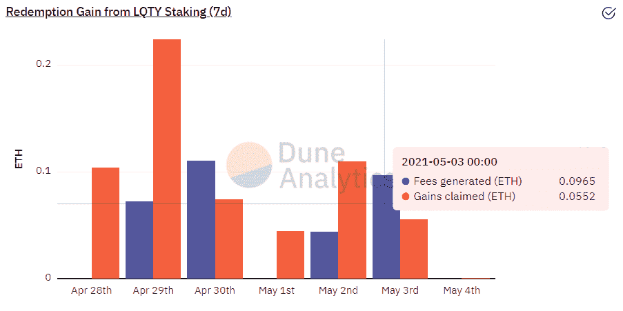

# 【公司观察】MakerDao 的挑战者 Liquity

> 原文：<https://medium.com/coinmonks/company-watch-liquity-the-challenger-of-makerdao-db58c6b8cf1?source=collection_archive---------1----------------------->

最近的 ETH 价格上涨，在一定程度上是由于 MakerDao 增加了其戴的上限。这基本上意味着通过抵押 ETH 可以铸造更多的 DAI。有些人用新铸造的戴来购买 ETH。正如我们现在看到的:有 3800 亿美元的 ETH，但所有稳定的收入加在一起还不到 800 亿美元。

因此，我们看到更多的 ETH，当然还有 BTC，以及其他资产，可以在 defi 世界中抵押。理想的情况是，BTC 和联邦储蓄银行可以在现实世界中为借入的法定债务提供担保；但如果它不会很快大规模发生，它至少会先被轻松抵押。当它在链条上时——我们希望有一个有意义的过程；但如果这不会很快大规模发生，它至少会被用来购买更多的瑞士联邦理工学院或 BTC。看起来，这预示着一个动荡的市场在我们面前。

退一步说，MakerDAO 的利润和价格自今年年初以来已经翻了三倍，这吸引了其他玩家。Liquity 就是其中之一。

Liquity 的卖点是无息贷款，因为它承诺向瑞士信贷借，这是它与戴类似的稳定货币版本。MakerDao 现在收取 3.5%到 10%的费用。Liquity 也只要求 110%的抵押率，而 MakerDao 的最低要求是 130%(相当于每年 10%的费用)。

## Liquity 是如何工作的？

Liquity 的基本流程类似于 MakerDao。如果你是 MakerDAO 用户，这对你来说很容易。对其他人来说，基本上你必须抵押一些 ETH 作为抵押来借 LUSD；一段时间后偿还 LUSD 收回 ETH。

Liquity 和 MakerDao 之间有很多不同之处，主要有两个:

*预付借款费用无利息*

Liquity 收取 0.5%至 5%的借款费用，这取决于借款时协议中的活动。假设如果协议拥塞，每个人都使用 ETH，借用或购买，那么费用会更高。否则，费用降至最低 0.5%。

*不需要清算人提供资金，但需要一笔稳定基金*

与 MakerDao 相比，Liquity 有一个类似的清算概念，当抵押品比率低于一定水平时，清算可以由任何第三方触发。对于个人 Trove(相当于马克尔道的 CDP)，担保比例为 110%。当全球抵押品比率在 Liquity 协议的恢复模式下降至 150%以下时，也可以触发清算。清算功能的调用方不需要提供资本，而是由稳定基金提供清算资本。稳定基金是用户存放 LUSD 用于清算目的，并分享清算奖励的地方，就像 KeeperDAO 一样。大部分清算奖励归该基金所有，认购者保留 200 LUSD 和清算所得抵押品的 0.5%。

## Liquity 的其他创新

除了 MakerDAO 上的上述变化，Liquity 还有一个赎回功能，持有 LUSD 的用户可以以市场价从其他网站购买 ETH。购买从抵押率最低的仓库开始，直到仓库被清空。

赎回将导致出售 ETH 的公司增加其抵押品比率。因此，如果赎回发生，协议的总体抵押品比率将增加，从而提高其稳定性。

然而，有一项类似于赎回借款成本的费用，最低为 0.5%，高于在掉期交易中购买 ETH 的成本。因此，迄今为止的赎回量很小，每天不到 0.1 ETH，相比之下，每天的借款费用为 7 万~ 9 万美元。

## 与流动性相关的新风险

Liquity 将面临与 MakerDAO 相同的风险，例如清算或价格波动等。这取决于您在系统中的角色。

除此之外，Liquity 没有在极端情况下的后备储备，也没有全球清算机制。相反，它有一个重新分配的机制。当稳定基金中没有资金时，就会发生这种情况，然后清算将触发一个清算基金的债务和抵押品重新分配给其他基金，按比例分配给它们的抵押品。

虽然这是一个创新的设计，但潜在的风险是，如果 ETH 价格突然大幅下跌，它可能会引发连锁反应。

## **协议状态现在**

信息可以从[沙丘分析页面](https://duneanalytics.com/dani/Liquity)获得。总共有 110 万 ETH 在 Liquity 中被抵押，14 亿美元 LUSD 在流通中，大部分现在在稳定基金中。

该协议有一个流动性挖掘事件，以激励采用 LUSD。奖励进入 Uniswap LUSD-ETH 池，下注 LQTY 平台令牌和稳定基金。现在收益率分别超过 100%、45%和 27%。

此外，Curve Finance 和 Wasabi Finance 都有专门的 LUSD 池，目前收益率分别为 40%和 100%。

## 团队和治理

Liquity 团队由首席执行官 Robert Lauko 领导，他曾是 DFINITY 的研究员。欲了解更多信息，该公司的媒体工具包是[可在这里](https://drive.google.com/file/d/14LhG5U4qtW9S2rZWyZXr7y-UdximS-eR/view)。

有趣的是，与 defi 世界的许多道相反，Liquity 根本没有治理。它基本上说:*没有治理！*

然而，该团队也不运行任何协议，他们只是设计它，任何人都可以运行它的前端——开源和许可更少。在这里尝试一些:[https://eth.liquity.fi/stake](https://eth.liquity.fi/stake)体验 Liquity 的特性，在官方网站上可以找到完整的列表。

(宁静队，2021 年 5 月 4 日，推特:[https://twitter.com/SerenityFund)](https://twitter.com/SerenityFund))

> 加入 [Coinmonks 电报小组](https://t.me/joinchat/Trz8jaxd6xEsBI4p)，了解加密交易和投资

## 另外，阅读

*   [尤霍德勒 vs 科恩洛安 vs 霍德诺特](/coinmonks/youhodler-vs-coinloan-vs-hodlnaut-b1050acde55a) | [Cryptohopper vs 哈斯博特](https://blog.coincodecap.com/cryptohopper-vs-haasbot)
*   [币安 vs 北海巨妖](https://blog.coincodecap.com/binance-vs-kraken) | [美元成本平均交易机器人](https://blog.coincodecap.com/pionex-dca-bot)
*   [如何在印度购买比特币？](/coinmonks/buy-bitcoin-in-india-feb50ddfef94) | [WazirX 审核](/coinmonks/wazirx-review-5c811b074f5b) | [BitMEX 审核](https://blog.coincodecap.com/bitmex-review)
*   [比特币主根](https://blog.coincodecap.com/bitcoin-taproot) | [Bitso 评论](https://blog.coincodecap.com/bitso-review) | [排名前 6 的比特币信用卡](/coinmonks/bitcoin-credit-card-bc8ab6f377c6)
*   [双子座 vs 比特币基地](https://blog.coincodecap.com/gemini-vs-coinbase) | [比特币基地 vs 北海巨妖](https://blog.coincodecap.com/kraken-vs-coinbase) | [硬币罐 vs 硬币点](https://blog.coincodecap.com/coinspot-vs-coinjar)
*   [印度比特币交易所](/coinmonks/bitcoin-exchange-in-india-7f1fe79715c9) | [比特币储蓄账户](/coinmonks/bitcoin-savings-account-e65b13f92451) | [Paxful 审核](/coinmonks/paxful-review-4daf2354ab70)
*   [杠杆令牌](/coinmonks/leveraged-token-3f5257808b22) | [最佳密码交易所](/coinmonks/crypto-exchange-dd2f9d6f3769) | [密码交易机器人](https://blog.coincodecap.com/best-crypto-trading-bots)
*   [Crypto.com 费用](/coinmonks/binance-fees-8588ec17965) | [Botcrypto 审查](/coinmonks/botcrypto-review-2021-build-your-own-trading-bot-coincodecap-6b8332d736c7) | [替代方案](https://blog.coincodecap.com/crypto-com-alternatives)
*   [MXC 交易所评论](/coinmonks/mxc-exchange-review-3af0ec1cba8c) | [Pionex vs 币安](https://blog.coincodecap.com/pionex-vs-binance) | [Pionex 套利机器人](https://blog.coincodecap.com/pionex-arbitrage-bot)
*   [我的密码交易经验](/coinmonks/my-experience-with-crypto-copy-trading-d6feb2ce3ac5) | [比特币基地评论](/coinmonks/coinbase-review-6ef4e0f56064)
*   [加密货币储蓄账户](/coinmonks/cryptocurrency-savings-accounts-be3bc0feffbf) | [赌注加密](https://blog.coincodecap.com/staking-crypto) | [CEX。木卫一评论](https://blog.coincodecap.com/cex-io-review)
*   [最佳比特币保证金交易](/coinmonks/bitcoin-margin-trading-exchange-bcbfcbf7b8e3) | [比特币保证金交易](https://blog.coincodecap.com/bityard-margin-trading)
*   [加密保证金交易交易所](/coinmonks/crypto-margin-trading-exchanges-428b1f7ad108) | [赚取比特币](/coinmonks/earn-bitcoin-6e8bd3c592d9) | [Mudrex 投资](https://blog.coincodecap.com/mudrex-invest-review-the-best-way-to-invest-in-crypto)
*   [BlockFi 信用卡](https://blog.coincodecap.com/blockfi-credit-card) | [如何在币安购买比特币](https://blog.coincodecap.com/buy-bitcoin-binance) | [网格交易机器人](https://blog.coincodecap.com/grid-trading)
*   [加密副本交易平台](/coinmonks/top-10-crypto-copy-trading-platforms-for-beginners-d0c37c7d698c) | [五大 BlockFi 替代方案](https://blog.coincodecap.com/blockfi-alternatives)
*   [CoinLoan 点评](/coinmonks/coinloan-review-18128b9badc4)|【Crypto.com】点评 | [火币保证金交易](/coinmonks/huobi-margin-trading-b3b06cdc1519)
*   [顶级付费加密货币和区块链课程](https://blog.coincodecap.com/blockchain-courses) | [币安评论](/coinmonks/binance-review-ee10d3bf3b6e)
*   [在美国如何使用 BitMEX？](https://blog.coincodecap.com/use-bitmex-in-usa) | [BitMEX 回顾](https://blog.coincodecap.com/bitmex-review) | [币安 vs Bittrex](https://blog.coincodecap.com/binance-vs-bittrex)
*   [最佳免费加密信号](https://blog.coincodecap.com/free-crypto-signals) | [YoBit 评论](/coinmonks/yobit-review-175464162c62) | [Bitbns 评论](/coinmonks/bitbns-review-38256a07e161)
*   [比特币基地跑马圈地](https://blog.coincodecap.com/coinbase-staking) | [Hotbit 评论](/coinmonks/hotbit-review-cd5bec41dafb) | [KuCoin 评论](https://blog.coincodecap.com/kucoin-review)