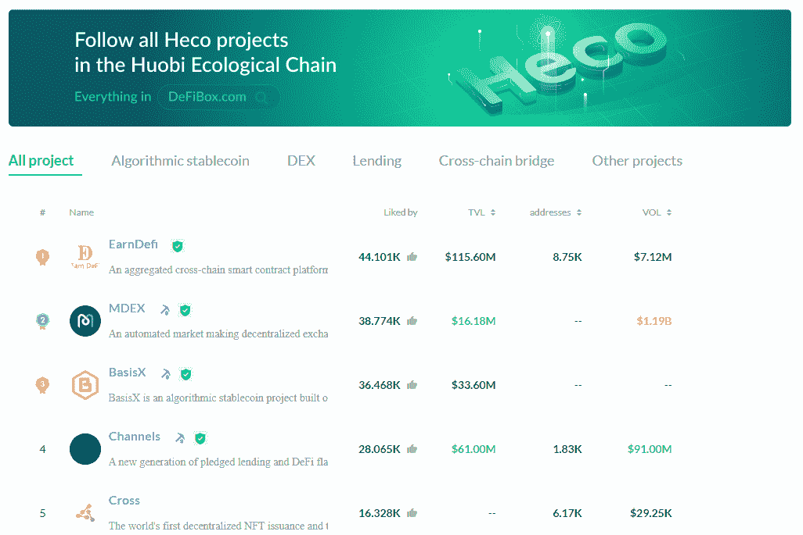
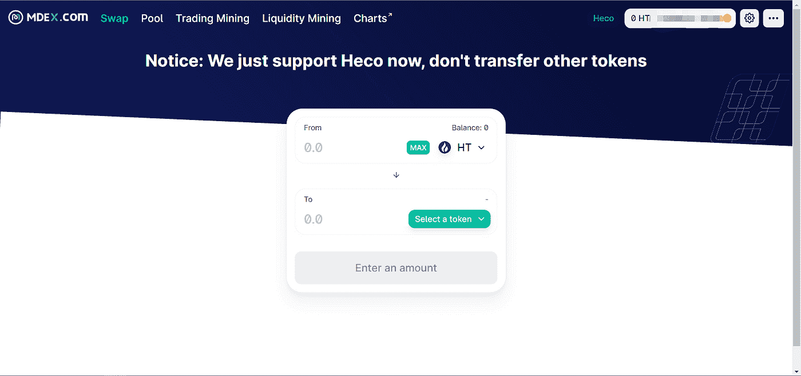
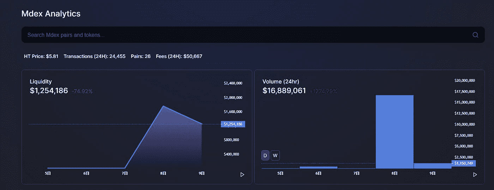
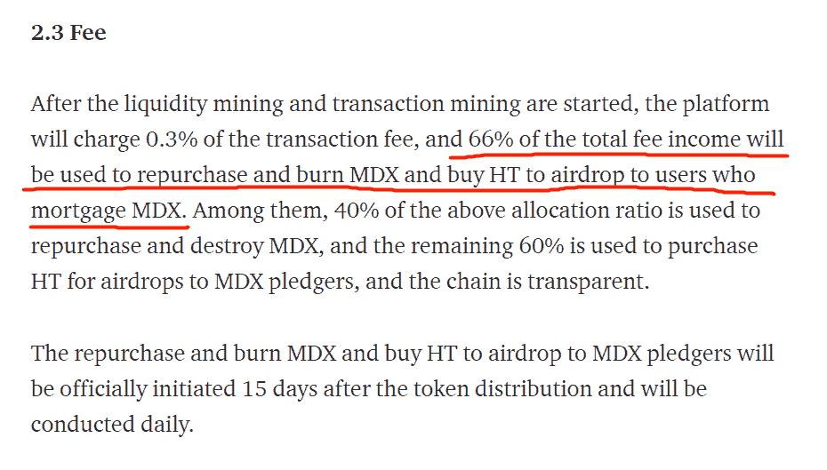
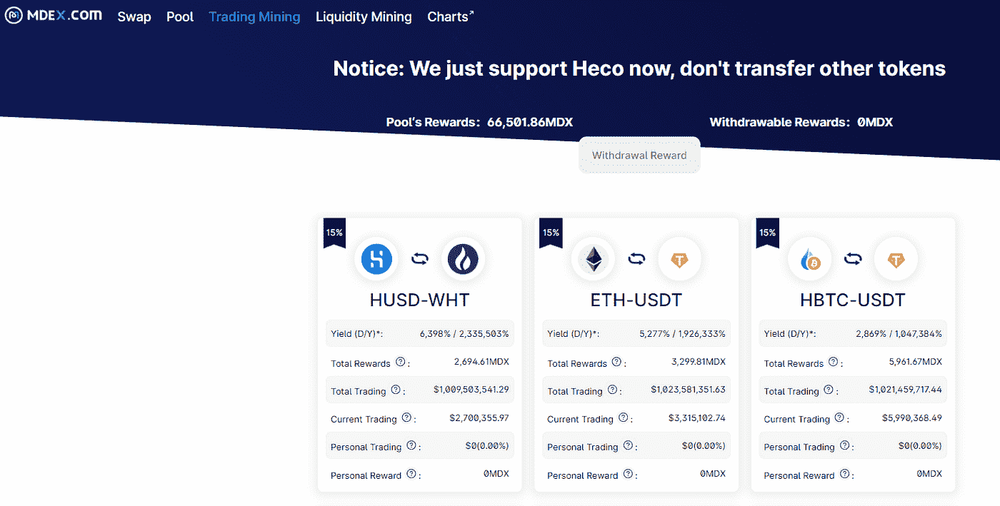
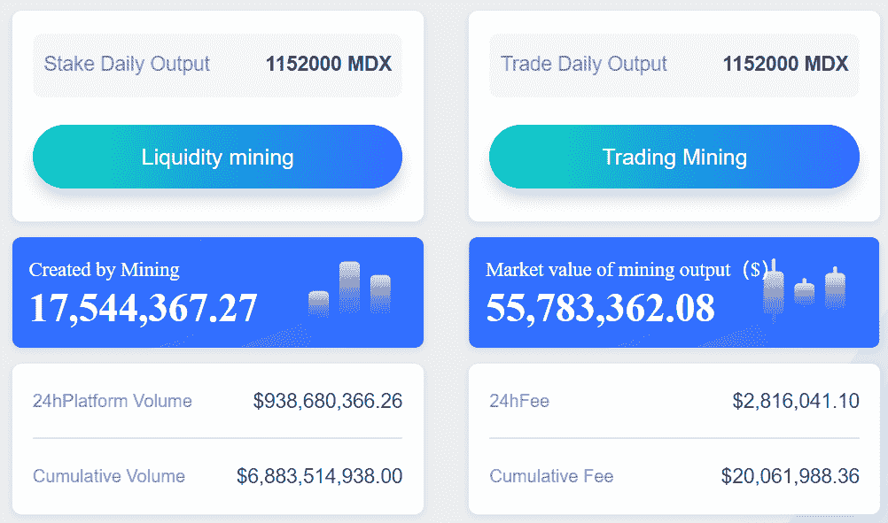
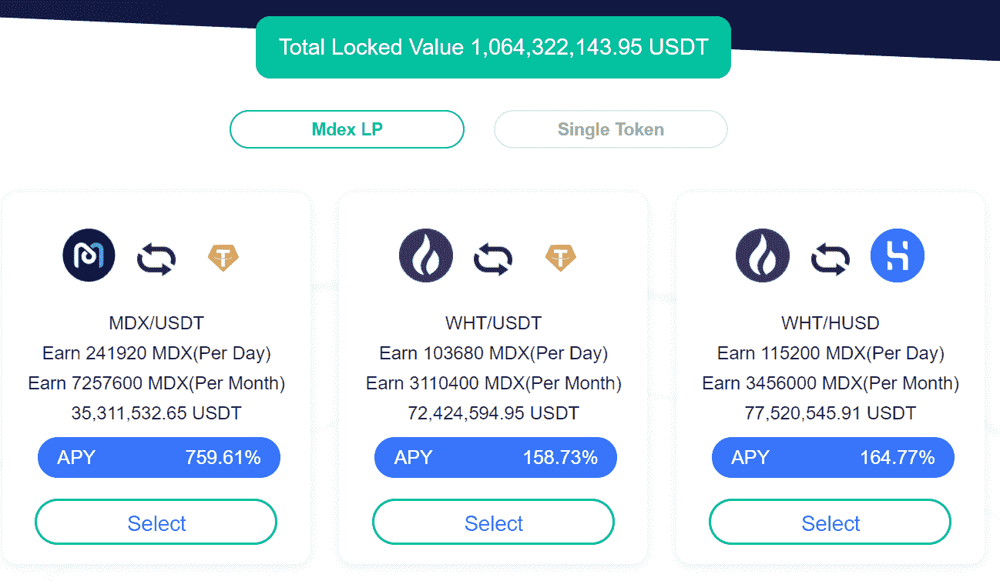

# 【公司观察】火币生态链上的 MDEX

> 原文：<https://medium.com/coinmonks/company-watch-mdex-on-huobi-eco-chain-12b9efa421af?source=collection_archive---------0----------------------->

Defi 在过去几个月的流行激发了很多项目，在这种情况下，它激发了整个系统。中国领先的加密交易所 Huobi 最近推出了区块链 huo bi Eco——或者说它已经存在了一段时间，只是最近才流行起来。从设计和外观上看，它很像 scan.hecochain.com，看起来像以太坊。它成功了，就像创一样。HT，火币令牌被用作气体，它的成本现在可以忽略不计。你可以在这里阅读更多关于区块链的信息。**它的使用其实很简单——在 Metamask 中设置一个定制的链，剩下的就像以太坊一样。**

在很短的时间内，整个生态系统得到了发展，从贷款到 DEX，以及更多(信息来自 [DefiBox](https://www.defibox.com/hecoPrefecture) ，一个不错的信息门户，看起来像 Debank)。

因为我们是稳定的 coin-focus，我们可以让你自己探索整个系统；享受尝试所有交易的乐趣，只需几分之一的油费。哈里路亚。

我们将进一步了解 Heco Chain 生态系统的核心，它是 Uniswap 的版本， [MDEX](https://ht.mdex.com/#/swap) 。

MDEX 的运作方式就像 Uniswap 一样，你可以通过其自动做市系统，通过资金池交换任何一对资产，费用为 0.3%。它也有点类似于 Sushiswap，在其平台令牌 MDX 中提供奖励，以吸引投资者和交易者。

这里不要运用任何常识，假设这个美好的 APY 流向了流动性提供者。[根据白皮书](https://mdex.medium.com/mdex-economic-whitepaper-1bdc882e20c9)摘要，也是在我们实验之后，**来自 AMM 的交易佣金归项目团队所有——是的，归项目团队所有，而不是流动性提供者。**

然后，项目团队将拿出 66%来补偿在 MDEX 中花钱的交易员。我们已经试过了，结果是，基于现在的价格，你立即得到了你的交易费用，0.3%，无论是什么货币，都是相当于$MDX 的金额。例如，如果你用$1000 USDT 换$HT，费用是 3 USDT，你将得到 1 $MDX 的回报，如果它的价格是$3。

相当于什么？

对于每一笔交易，你都是用 0.3%的费用购买 MDX。但是，由于只有 66%的总费用用于交易补偿，该团队必须再发行 34%的 MDX，才能完全覆盖 0.3%的费用。这里的数学可能有点偏离——因为它是基于观察，而不是对合同的挖掘——但你得到了想法。

或者你可以这样想:项目组把交易收入的 34%装进了自己的口袋，把 MDX 给了别人——他们在卖 MDX。现在已经有几百万美元的费用了。我们没有在 Uniswap 或 Sushiswap 中看到这种情况。

那么流动性提供者有什么好处呢？同样，MDX 也有回报，因为没有交易费收入。

总之，MDEX 在功能上类似于 Uniswap，但在经济上有所不同。我们不确定这是否可行，对寿司的关注程度相同，甚至可能更严重。**这里的一般逻辑是，如果我们远离这里纠缠在一起的令牌经济学的论点，如果项目团队随着业务量的增加从生态系统中拿走一些价值，就好像是 34%的税，这是 MDX 的价值破坏系统。**

然而，由于 MDX 在中国领先的交易所 Huobi 和 Gate.io 上市，价格可能会波动——正如人们猜测的那样，在任何方向上波动。

除了 MDX，鉴于 Huobi 的声誉和过往记录，我们倾向于认为该连锁店将是安全和功能性的。

所以，让我们看看。

(宁静队，2021 年 1 月 27 日，推特:【https://twitter.com/SerenityFund】T2)

> 加入 Coinmonks [电报集团](https://t.me/joinchat/EPmjKpNYwRMsBI4p)，了解加密交易和投资

## 另外，阅读

*   什么是[闪贷](https://blog.coincodecap.com/what-are-flash-loans-on-ethereum)？
*   最好的[密码交易机器人](/coinmonks/crypto-trading-bot-c2ffce8acb2a)
*   [3 商业评论](/coinmonks/3commas-review-an-excellent-crypto-trading-bot-2020-1313a58bec92) | [Pionex 评论](/coinmonks/pionex-review-exchange-with-crypto-trading-bot-1e459d0191ea) | [Coinrule 评论](https://blog.coincodecap.com/coinrule-review-a-perfect-trading-bot)
*   [AAX 交易所评论](/coinmonks/aax-exchange-review-2021-67c5ea09330c) | [德里比特评论](/coinmonks/deribit-review-options-fees-apis-and-testnet-2ca16c4bbdb2) | [FTX 密码交易所评论](/coinmonks/ftx-crypto-exchange-review-53664ac1198f)
*   [n 零审核](/coinmonks/ngrave-zero-review-c465cf8307fc)
*   [Bybit Exchange 审查](/coinmonks/bybit-exchange-review-dbd570019b71) | [Bityard 审查](https://blog.coincodecap.com/bityard-reivew)|[inter tax 审查](https://blog.coincodecap.com/interdax-review)
*   [3Commas vs Cryptohopper](/coinmonks/3commas-vs-pionex-vs-cryptohopper-best-crypto-bot-6a98d2baa203)
*   最好的比特币[硬件钱包](/coinmonks/the-best-cryptocurrency-hardware-wallets-of-2020-e28b1c124069?source=friends_link&sk=324dd9ff8556ab578d71e7ad7658ad7c)
*   [总账 vs 平均](https://blog.coincodecap.com/ngrave-vs-ledger)
*   [加密复制交易平台](/coinmonks/top-10-crypto-copy-trading-platforms-for-beginners-d0c37c7d698c) | [比特码复制交易](https://blog.coincodecap.com/bityard-copy-trading)
*   [莱杰 nano s vs x](https://blog.coincodecap.com/ledger-nano-s-vs-x)
*   [Vauld Review](https://blog.coincodecap.com/vauld-review)|[you hodler Review](/coinmonks/youhodler-4-easy-ways-to-make-money-98969b9689f2)|[BlockFi Review](/coinmonks/blockfi-review-53096053c097)
*   最好的[加密税务软件](/coinmonks/best-crypto-tax-tool-for-my-money-72d4b430816b) | [硬币追踪评论](/coinmonks/cointracking-review-a-reliable-cryptocurrency-tax-software-5114e3eb5737)
*   最佳[加密贷款平台](/coinmonks/top-5-crypto-lending-platforms-in-2020-that-you-need-to-know-a1b675cec3fa)
*   [莱杰纳米 S vs 特雷佐 one vs 特雷佐 T vs 莱杰纳米 X](https://blog.coincodecap.com/ledger-nano-s-vs-trezor-one-ledger-nano-x-trezor-t)
*   [block fi vs Celsius](/coinmonks/blockfi-vs-celsius-vs-hodlnaut-8a1cc8c26630)|[Hodlnaut Review](https://blog.coincodecap.com/hodlnaut-review)
*   [Bitsgap 审查](/coinmonks/bitsgap-review-a-crypto-trading-bot-that-makes-easy-money-a5d88a336df2) | [Quadency 审查](/coinmonks/quadency-review-a-crypto-trading-automation-platform-3068eaa374e1)
*   [埃利帕尔泰坦评论](/coinmonks/ellipal-titan-review-85e9071dd029) | [赛克斯斯通评论](https://blog.coincodecap.com/secux-stone-hardware-wallet-review)
*   [BlockFi 评论](/coinmonks/blockfi-review-53096053c097) |在您的密码中赚取高达 8.6%的利息
*   [DEX Explorer](https://explorer.bitquery.io/ethereum/dex) 和[区块链 API](https://explorer.bitquery.io/graphql)
*   [加密套利](/coinmonks/crypto-arbitrage-guide-how-to-make-money-as-a-beginner-62bfe5c868f6)指南:新手如何赚钱
*   最佳[加密制图工具](/coinmonks/what-are-the-best-charting-platforms-for-cryptocurrency-trading-85aade584d80)
*   了解比特币的[最佳书籍有哪些？](/coinmonks/what-are-the-best-books-to-learn-bitcoin-409aeb9aff4b)

> [直接在您的收件箱中获得最佳软件交易](/coinmonks/newsletters/coinmonks)

