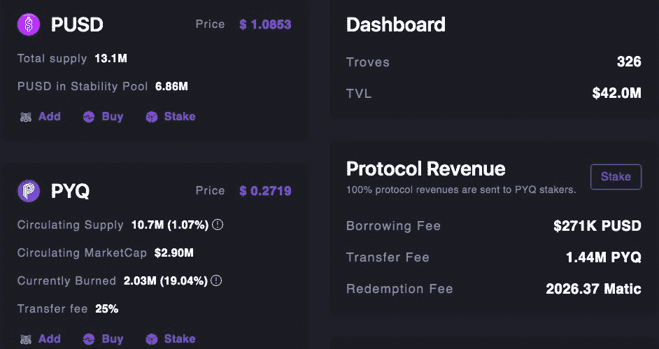

# 【公司观察】PolyQuity，多边形的液化

> 原文：<https://medium.com/coinmonks/company-watch-polyquity-the-liquity-of-polygon-caaaa7e3cb85?source=collection_archive---------5----------------------->

PolyQuity 是 Liquity 协议的一个分支，Liquity 协议是以太坊上的一个分散借用协议，在多边形网络中。PolyQuity 具有与 Liquity 协议一致的特性和优势。此外，基于流动性的概念，设计了一种新的适应多边形网络的记号组学。

像 Liquity 一样，前端应该由第三方运行。在 Polyquity 的情况下，它是由 Liquity.fi 运行的，Liquity 前端运行程序之一。在撰写本文时，PolyQuity 在 TVL 拥有 4200 万美元。

## 记号和记号组学

关于 liquiy 协议，请参考我们之前的文章:[liquiy，MakerDao 的挑战者](/coinmonks/company-watch-liquity-the-challenger-of-makerdao-db58c6b8cf1)。

*铸币局:PUSD*

PUSD 是多边形的固有稳定点，可以通过在多边形中添加点来铸造，就像在以太坊中添加液体中的以太一样。PUSD 与美元挂钩，目前可以通过多边协议借入和偿还。虽然它的市场价格可能不总是 1 美元，但它可以随时以面值赎回基础抵押品。大多数时候，由于协议中的农业激励措施，它的价格高于 1 美元。

通过套利机会，以面值(即 1 美元的 Matic 兑换 1 PUSD)和 110%的最低抵押品比率(分别)兑换 PUSD 的能力创造了价格下限和价格上限。这些是“硬挂钩机制”，因为它们是基于直接过程。PUSD 还受益于不太直接的美元平价机制，即所谓的“软挂钩机制”。这些机制之一是作为谢林点的宇称。由于 PolyQuity 将 PUSD 视为等于美元，因此两者之间的平价是协议的隐含平衡状态。这些机制中的另一个是新债务的借款费用。随着赎回的增加(意味着 PUSD 低于 1 美元)，基础利率也在增加——使得借款的吸引力下降，这使得新 PUSD 不会冲击市场，将价格压低到 1 美元以下。

*平台令牌:PYQ*

PYQ 是由 PolyQuity 发行的二级令牌。它获取系统产生的费用收入，并激励早期采用者。PYQ 的总供应上限为 10 亿个代币。PYQ 可以在 Polyquity 的 PYQ 池中下注，并有权从以下项目获得协议收入:

*   借款费用(迄今为止 27.4 万美元 PUSD):铸造 PUSD 的费用
*   转让费(159 万 PYQ):交易 PYQ 收取的费用，从 10%开始，逐渐减少到 1%
*   赎回费用(2027 Matic):赎回 Matic 所收取的费用

开始时，PYQ 的交易将产生 25%的成本，其中 10%是 PYQ 池的费用，15%被烧掉。在 3m 的 PYQ 燃烧后，这将减少到 4%+1%。因此，此时，交易 PYQ 需要将滑点容差更改为 33.4%以上，交易才能通过。

**如何使用 Polyquity**

*借款(和还款):*

PolyQuity 协议提供无息贷款和。目前 PolyQuity 只支持 Matic 作为抵押品。要借钱，你必须打开一个类似于金库或其他平台的 CDP 的宝库，并向其中存入一定数量的抵押品(Matic)。然后你可以把 PUSD 的抵押率提高到 110%，而马克道的最低抵押率是 130%。要求最低债务为 100.00 PUSD。

每次你从你的金库中提取 PUSD，都会被收取一次性借款费用，并加入你的债务中。手续费率被限制在 0.5%至 5%之间，并乘以借款人提取的流动性金额。10 PUSD 清算准备金费用也将适用，但会在偿还债务后退还给您。该协议发放的贷款没有还款时间表。只要你保持 110%的最低抵押比率，你可以随时开放你的宝库并偿还你的债务。

*救赎:*

用户可以随时无限制地将他们的 PUSD 兑换成 Matic。但是，赎回金额可能会收取赎回费。在正常操作下，赎回费由公式 baseRate * Matic 得出。基本利率随着每次赎回而增加，并根据自上次费用事件(即 PUSD 的上次赎回或发行)以来经过的时间而衰减。

如果你的财富被赎回，你*不会*遭受净损失。兑换是将 PUSD 按面值兑换成 Matic 的过程，就好像 1 PUSD 正好值 1 美元一样。也就是说，对于 x PUSD，你得到的回报是价值 x 美元的 Matic。然而，你会损失一些 Matic 敞口。赎回后，你的抵押品比率也会提高。避免被赎回的最好方法是相对于系统中的其他有价证券保持较高的抵押品比率。赎回发生时，风险最高的债券(即最低抵押债券)排在第一位。

## 投资 PUSD 稳定币的两种方式:

*1)稳定池*

稳定池由将 PUSD 转移到其中的用户(称为稳定提供者)提供资金。随着时间的推移，稳定提供者失去了按比例分配的 PUSD 存款，同时获得了按比例分配的清算抵押品。当任何一个 Trove 被清算时，与该 Trove 的剩余债务相对应的 PUSD 量从稳定池的余额中被烧掉以偿还其债务。作为交换，来自宝库的全部抵押品被转移到稳定池。APY 目前为 45.68%。

稳定性提供者也从早期采用者奖励中获益。在你打开一个宝库，借 PUSD，并把它存入稳定池后，你将开始不断积累与你的存款规模成比例的奖励(PYQ)。奖励是根据奖励计划和您用于存款的前端的回扣率计算的。该系统的早期采用者将获得最高的奖励。在任何时候，您都可以将您的奖励提取到您的 Matic 地址。您可以随时提取存入稳定池的存款。没有最短锁定持续时间。然而，只要有抵押品比率低于 110%的可变现财产尚未变现，提款就会被暂时中止。

2)农业:

您也可以通过下注 LP 代币赢得 PYQ。首先，你需要在国债上增加流动性。

目前年利率为 26.40%。然而，目前 PYQ 的任何交易都要收取 25%的费用。这在 PYQ 烧到 300 万的时候会很快下降到 5%。

这意味着扣除转会费后的实际年利率可能是 19.8%。这比麦金融目前的报价要低。此刻 Polyquity 的竞争对手 Qi Protocol(马克尔道的多边形分叉)APR 更高，为 26.43%。

此外，还可以在像 [Autofarm](https://autofarm.network/polygon/) 这样的平台上进行自动配种，收取少量费用即可获得自动配种服务。

## 我们担心的风险

首先，这是一个匿名的团队。正如我们上面提到的，它是由 Liquity 前端跑步者之一的 Liquity.fi 运行的。虽然 Liquity 是 run 但是很多前端的 runners，Liquity.fi 是 Polyquity 的唯一；而且都是匿名的。这两个协议之间可能有一些联系，但公开的证据不足以做出任何声明。

此外，我们担心的另一个风险与 PUSD 的价格有关。目前，它的价格是 1.0583 美元。这是目前 PYQ 收益率高的结果。由于 Polyquity 的设计是将 PUSD 维持在 1 美元，这种挂钩将导致用户亏损。

(YQ，宁静队，2021 年 8 月 4 日，推特:【https://twitter.com/SerenityFund】T4)

> 加入 [Coinmonks 电报频道](https://t.me/coincodecap)，了解加密交易和投资

## 另外，阅读

*   [什么是融资融券交易](https://blog.coincodecap.com/margin-trading) | [成本平均法](https://blog.coincodecap.com/dca)
*   [BigONE 交易所点评](/coinmonks/bigone-exchange-review-64705d85a1d4) | [电网交易 Bot](https://blog.coincodecap.com/grid-trading)
*   [3 商业评论](/coinmonks/3commas-review-an-excellent-crypto-trading-bot-2020-1313a58bec92) | [Pionex 评论](/coinmonks/pionex-review-exchange-with-crypto-trading-bot-1e459d0191ea) | [Coinrule 评论](/coinmonks/coinrule-review-2021-a-beginner-friendly-crypto-trading-bot-daf0504848ba)
*   [莱杰 vs n rave](/coinmonks/ledger-vs-ngrave-zero-7e40f0c1d694)|[莱杰 nano s vs x](/coinmonks/ledger-nano-s-vs-x-battery-hardware-price-storage-59a6663fe3b0) | [币安评论](/coinmonks/binance-review-ee10d3bf3b6e)
*   [by bit Exchange Review](/coinmonks/bybit-exchange-review-dbd570019b71)|[bit yard Review](https://blog.coincodecap.com/bityard-reivew)|[coin spot Review](https://blog.coincodecap.com/coinspot-review)
*   [3 commas vs crypto hopper](/coinmonks/3commas-vs-pionex-vs-cryptohopper-best-crypto-bot-6a98d2baa203)|[赚取加密利息](/coinmonks/earn-crypto-interest-b10b810fdda3)
*   最好的比特币[硬件钱包](https://blog.coincodecap.com/best-hardware-wallet-bitcoin) | [BitBox02 回顾](/coinmonks/bitbox02-review-your-swiss-bitcoin-hardware-wallet-c36c88fff29)
*   [BlockFi vs 摄氏度](/coinmonks/blockfi-vs-celsius-vs-hodlnaut-8a1cc8c26630) | [Hodlnaut 审核](/coinmonks/hodlnaut-review-best-way-to-hodl-is-to-earn-interest-on-your-bitcoin-6658a8c19edf) | [KuCoin 审核](https://blog.coincodecap.com/kucoin-review)
*   [Bitsgap 审查](/coinmonks/bitsgap-review-a-crypto-trading-bot-that-makes-easy-money-a5d88a336df2) | [Quadency 审查](/coinmonks/quadency-review-a-crypto-trading-automation-platform-3068eaa374e1) | [Bitbns 审查](/coinmonks/bitbns-review-38256a07e161)
*   [密码本交易平台](/coinmonks/top-10-crypto-copy-trading-platforms-for-beginners-d0c37c7d698c) | [Coinmama 评论](/coinmonks/coinmama-review-ace5641bde6e)
*   [印度的加密交易所](/coinmonks/bitcoin-exchange-in-india-7f1fe79715c9) | [比特币储蓄账户](/coinmonks/bitcoin-savings-account-e65b13f92451)
*   [麻雀交换评论](https://blog.coincodecap.com/sparrow-exchange-review) | [纳什交换评论](https://blog.coincodecap.com/nash-exchange-review)
*   最好的[加密税务软件](/coinmonks/best-crypto-tax-tool-for-my-money-72d4b430816b) | [硬币追踪评论](/coinmonks/cointracking-review-a-reliable-cryptocurrency-tax-software-5114e3eb5737)
*   [Stackedinvest 评论](https://blog.coincodecap.com/stackedinvest-review) | [北海巨妖评论](/coinmonks/kraken-review-6165fc1056ac) | [期货交易机器人](/coinmonks/futures-trading-bots-5a282ccee3f5)
*   [n ave 零点回顾](/coinmonks/ngrave-zero-review-c465cf8307fc) | [Phemex 回顾](/coinmonks/phemex-review-4cfba0b49e28) | [PrimeXBT 回顾](/coinmonks/primexbt-review-88e0815be858)
*   最佳[区块链分析](https://bitquery.io/blog/best-blockchain-analysis-tools-and-software)工具| [赚比特币](/coinmonks/earn-bitcoin-6e8bd3c592d9) | [Swapzone 评论](/coinmonks/swapzone-review-crypto-exchange-data-aggregator-e0ad78e55ed7)
*   [加密套利](/coinmonks/crypto-arbitrage-guide-how-to-make-money-as-a-beginner-62bfe5c868f6)指南| [如何做空比特币](/coinmonks/how-to-short-bitcoin-568a2d0b4ae5) | [Prokey 回顾](/coinmonks/prokey-review-26611173c13c)
*   [币安交易机器人](/coinmonks/binance-trading-bots-d0d57bb62c4c) | [OKEx 审查](/coinmonks/okex-review-6b369304110f) | [Atani 审查](https://blog.coincodecap.com/atani-review)
*   [最佳加密交易信号电报](/coinmonks/best-crypto-signals-telegram-5785cdbc4b2b) | [MoonXBT 评论](/coinmonks/moonxbt-review-6e4ab26d037)
*   [Godex.io 审核](/coinmonks/godex-io-review-7366086519fb) | [邀请审核](/coinmonks/invity-review-70f3030c0502) | [BitForex 审核](https://blog.coincodecap.com/bitforex-review)
*   [火币交易机器人](https://blog.coincodecap.com/huobi-trading-bot) | [如何购买 ADA](https://blog.coincodecap.com/buy-ada-cardano) | [Geco？一次审查](https://blog.coincodecap.com/geco-one-review)