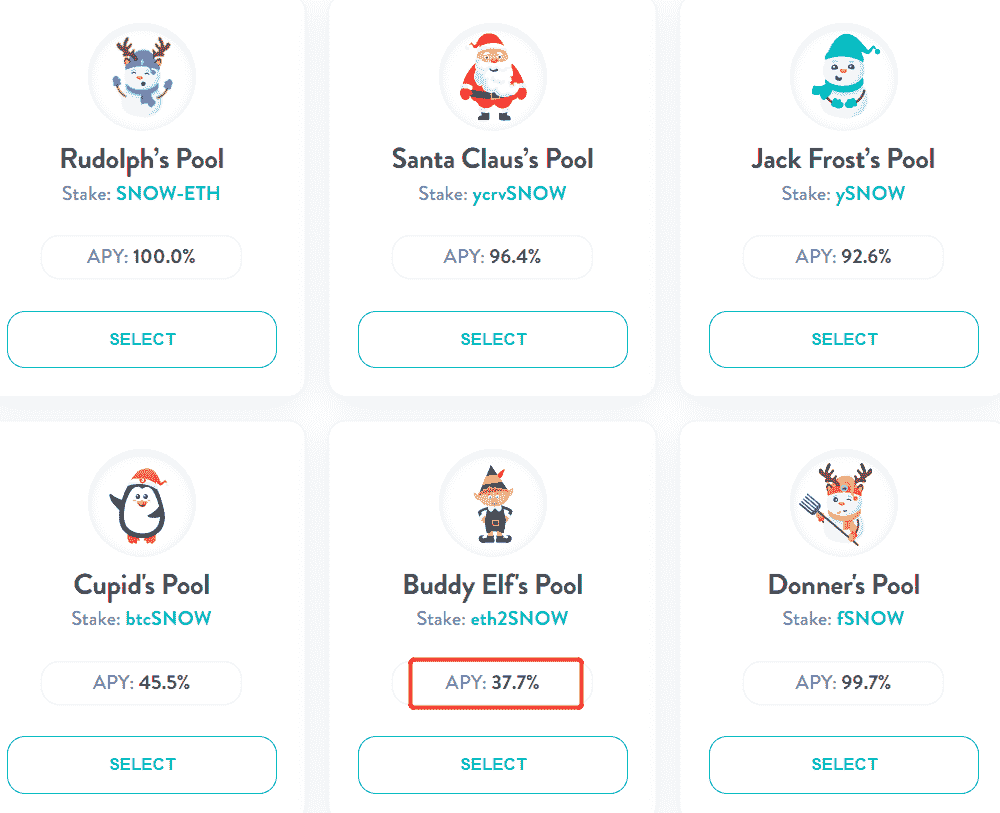

# [公司观察]为 Eth2.0 股东提供流动性(新 Defi 系列 3/5)

> 原文：<https://medium.com/coinmonks/company-watch-providing-liquidity-for-eth2-0-stakers-new-defi-series-3-5-6bd100146b2d?source=collection_archive---------6----------------------->

自推出 ETH 2.0 staking 以来，已有超过 380 万个 ETH 被纳入合同，根据今天的价格，价值约为 82 亿美元。随着这些流动性的锁定和 defi 行业收益率的上升，为 ETH 2.0 股东提供流动性解决方案的需求非常强烈。

相当多的平台已经推出解决方案来解决 ETH 2.0 的非流动性问题:

(来源:[https://beaconcha.in/stakingServices)](https://beaconcha.in/stakingServices))

对于任何赌注服务提供商，通常一个人存放一些 ETH(通常少于要求的最低 32 个 ETH，但不是必须的),并收到相同数量的令牌作为赌注的证明，例如 Lido Finance 的 ETH 赌注的 stETH。然后，该平台代表用户将这些 ETH 存放到 ETH 2.0 堆栈合同中。

与 stETH 一样，这些赌注凭证可以交易，并具有与 ETH 挂钩的价值，因为它们可以在 ETH2 推出后兑换 1 ETH(通常加上利息)。根据费用、流动性和其他因素，staking proof tokens 相对于 ETH 有一定的折扣，通常为 1%到 20%。例如，1 ETH 现在可以换成 1.079 ankrETH。

为 ETH2 股东提供流动性解决方案是一项不错的业务。大多数平台还提供平台令牌作为对用户的激励，进一步提高用户的收益率。简单地看一下这个领域，我们介绍几种利用您的 ETH 产生收益的方法:

## 赌注服务提供商的奖励

早些时候，我们已经报道了奶油金融公司的 ETH2 staking 服务，以及如何从中获取奶油。现在，另外两个平台有吸引投资者的动机:

*Ankr 和 Onx*

在 [Onx Finance](https://app.onx.finance/farm) 上，ankrETH(又名 aETH，aETHb)的股东可以获得 ONX 14.7%的 APY。

*共享拍摄*

在[股票交易](https://www.sharedstake.org/earn)中，vETH2 的投资者可以获得 27.3% APY 的 SGT 奖励。

这两个收益率都高于从 ETH2 获得的回报和对 ETH 的凭证折扣(如果有的话)。

## 曲线融资 ETH 池

目前，Curve 上有三个 ETH 池，其中一个是 Synthetix 的 sETH，另外两个 ETH2 产品分别来自 Ankr Finance 和 Lido Finance。

在曲线资金池中提供流动性将使供应商有权获得资金池的基本交易费，CRV 从曲线中获得回报。此外，在这种情况下，流动性提供者还可以从利多获得斯泰斯-ETH 池的 LDO 奖，从 ANKR 金融公司获得 ankrETH 池的 ONX 奖。

## 稳定金融

[Stabilize Finance](https://www.stabilize.finance/) 是一个池协议，类似于 mStable 的概念。对于 ETH2，它提供了一个用户可以存放 WETH、stETH 和 ankrETH 的池。用户不能交换，只能让策略来执行。策略很简单:假设所有 ETH 赌注证明令牌返回到 1 ETH 的价格，因此该策略将在任何时间点交换到最便宜的令牌。

该收益率由 87.93%的策略回报和 44.89%的 STBZ 代币平台奖励组成。风险在于，如果池中的任何令牌明显不分段，该池将受到最大程度的影响。

值得强调的是，Stabilize 还有一个币安智能链版本。

## 雪地互换

[Snow Swap](https://snowswap.org/) 是一个类似于 Curve 的协议，在其他产品中，它提供 ETH stake proof 令牌池。这个资金池现在由 WETH、SharedStake 的 vETH2、aETHb(这是 ankrETH 更名后的新名称)和 Cream Finance 的 crETH2 组成。

流动性提供者可以用 Snow Swap 进一步持有 LP 代币，以获得 Snow 奖励，大约 38%的 APY。

我们将推出一款以 ETH 命名的产品，请跟进了解如何提升您的 ETH 价值的更全面概述。

(宁静队，2021 年 4 月 14 日，推特:【https://twitter.com/SerenityFund 

> 加入 Coinmonks [Telegram group](https://t.me/joinchat/Trz8jaxd6xEsBI4p) 学习加密交易和投资

## 另外，阅读

*   最好的[加密交易机器人](/coinmonks/crypto-trading-bot-c2ffce8acb2a) | [网格交易机器人](https://blog.coincodecap.com/grid-trading)
*   [加密复制交易平台](/coinmonks/top-10-crypto-copy-trading-platforms-for-beginners-d0c37c7d698c) | [如何在 WazirX 上购买比特币](/coinmonks/buy-bitcoin-on-wazirx-2d12b7989af1)
*   [CoinLoan 点评](/coinmonks/coinloan-review-18128b9badc4)|[Crypto.com 点评](/coinmonks/crypto-com-review-f143dca1f74c) | [火币保证金交易](/coinmonks/huobi-margin-trading-b3b06cdc1519)
*   [尤霍德勒 vs 考尼洛 vs 霍德诺特](/coinmonks/youhodler-vs-coinloan-vs-hodlnaut-b1050acde55a) | [Cryptohopper vs 哈斯博特](https://blog.coincodecap.com/cryptohopper-vs-haasbot)
*   [杠杆代币](/coinmonks/leveraged-token-3f5257808b22) | [最佳密码交易所](/coinmonks/crypto-exchange-dd2f9d6f3769) | [Paxful 点评](/coinmonks/paxful-review-4daf2354ab70)
*   [加密套利](/coinmonks/crypto-arbitrage-guide-how-to-make-money-as-a-beginner-62bfe5c868f6)指南| [如何做空比特币](/coinmonks/how-to-short-bitcoin-568a2d0b4ae5)
*   [如何在印度购买比特币？](/coinmonks/buy-bitcoin-in-india-feb50ddfef94) | [WazirX 审核](/coinmonks/wazirx-review-5c811b074f5b) | [BitMEX 审核](https://blog.coincodecap.com/bitmex-review)
*   [印度比特币交易所](/coinmonks/bitcoin-exchange-in-india-7f1fe79715c9) | [比特币储蓄账户](/coinmonks/bitcoin-savings-account-e65b13f92451)
*   [币安费](/coinmonks/binance-fees-8588ec17965) | [Botcrypto 评论](/coinmonks/botcrypto-review-2021-build-your-own-trading-bot-coincodecap-6b8332d736c7) | [Hotbit 评论](/coinmonks/hotbit-review-cd5bec41dafb) | [KuCoin 评论](https://blog.coincodecap.com/kucoin-review)
*   [我的密码副本交易经验](/coinmonks/my-experience-with-crypto-copy-trading-d6feb2ce3ac5) | [购买硬币评论](https://blog.coincodecap.com/buycoins-review)
*   [逐位融资融券交易](/coinmonks/bybit-margin-trading-e5071676244e) | [币安融资融券交易](/coinmonks/binance-margin-trading-c9eb5e9d2116) | [超位审核](/coinmonks/overbit-review-9446ed4f2188)
*   [加密货币储蓄账户](/coinmonks/cryptocurrency-savings-accounts-be3bc0feffbf) | [YoBit 审查](/coinmonks/yobit-review-175464162c62) | [Bitbns 审查](/coinmonks/bitbns-review-38256a07e161)
*   [Botsfolio vs nap bots vs Mudrex](/coinmonks/botsfolio-vs-napbots-vs-mudrex-c81344970c02)|[gate . io 交流回顾](/coinmonks/gate-io-exchange-review-61bf87b7078f)
*   [最佳比特币保证金交易](/coinmonks/bitcoin-margin-trading-exchange-bcbfcbf7b8e3) | [萝莉点评](/coinmonks/lolli-review-e6ddc7895ad8) | [比特币保证金交易](https://blog.coincodecap.com/bityard-margin-trading)
*   [创造并出售你的第一个 NFT](https://blog.coincodecap.com/create-nft) | [本地比特币评论](/coinmonks/localbitcoins-review-6cc001c6ed56)
*   [加密保证金交易交易所](/coinmonks/crypto-margin-trading-exchanges-428b1f7ad108) | [赚取比特币](/coinmonks/earn-bitcoin-6e8bd3c592d9) | [Mudrex 投资](https://blog.coincodecap.com/mudrex-invest-review-the-best-way-to-invest-in-crypto)
*   [如何在印度购买以太坊？](https://blog.coincodecap.com/buy-ethereum-in-india) | [如何在币安购买比特币](https://blog.coincodecap.com/buy-bitcoin-binance)
*   [顶级付费加密货币和区块链课程](https://blog.coincodecap.com/blockchain-courses) | [币安评论](/coinmonks/binance-review-ee10d3bf3b6e)
*   [MXC 交易所评论](/coinmonks/mxc-exchange-review-3af0ec1cba8c) | [Pionex vs 币安](https://blog.coincodecap.com/pionex-vs-binance) | [Pionex 套利机器人](https://blog.coincodecap.com/pionex-arbitrage-bot)
*   [在美国如何使用 BitMEX？](https://blog.coincodecap.com/use-bitmex-in-usa) | [BitMEX 评论](https://blog.coincodecap.com/bitmex-review)