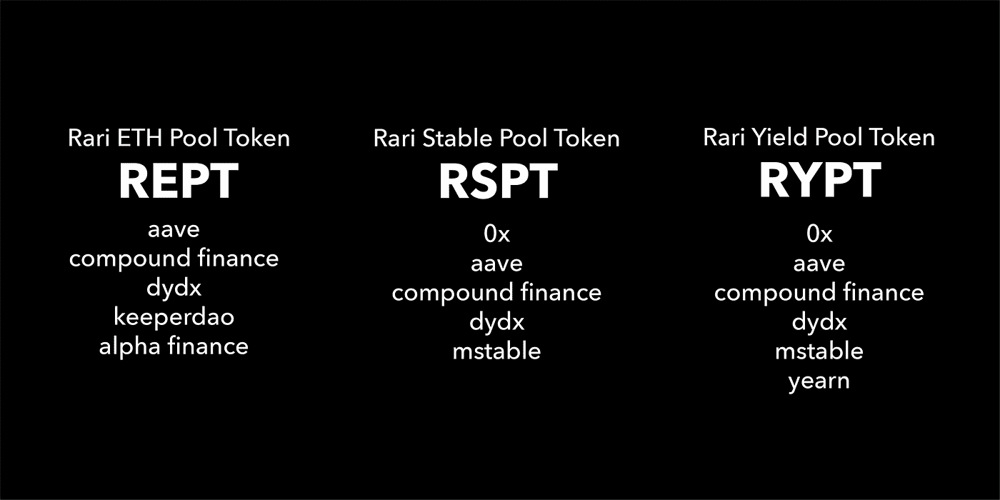
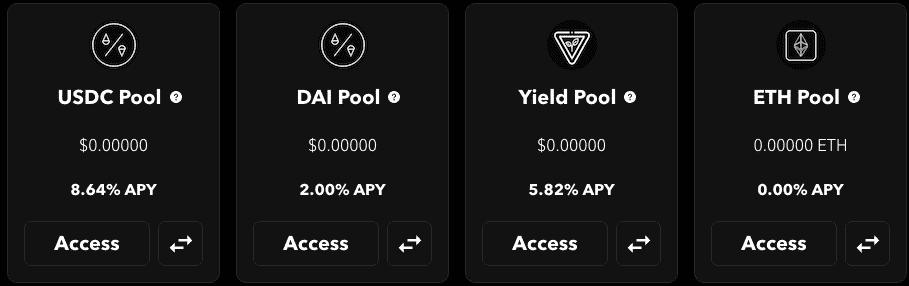
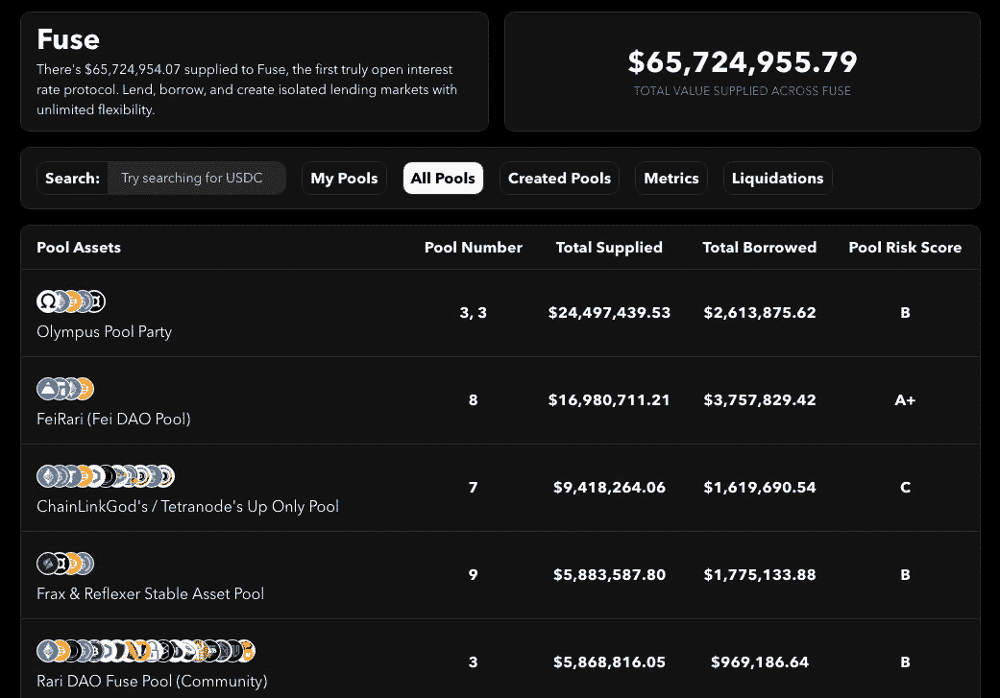
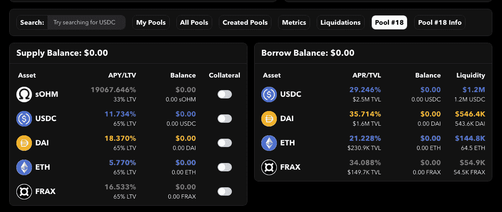
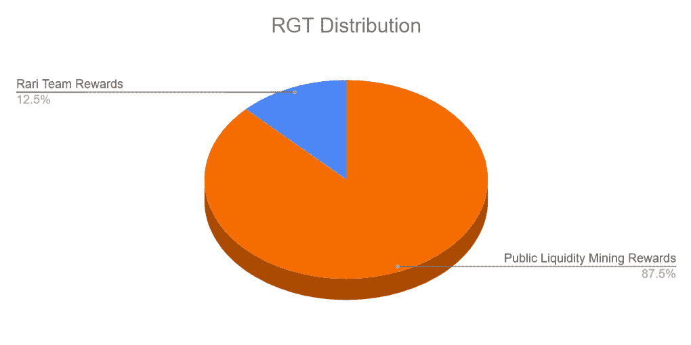
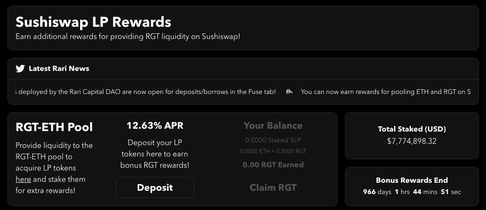

# 【公司观察】Rari Capital，从收益率池到熔断，以及超越

> 原文：<https://medium.com/coinmonks/company-watch-rari-capital-from-yield-pool-to-fuse-and-beyond-cdec13594070?source=collection_archive---------0----------------------->

Rari Capital 提供了一种相对安全的方式，使个人能够以无损的方式自主轻松地从其稳定的资产中获得收益。从那时起，它转变为一个利用产量农业策略来增加用户回报的解决方案。现在，Rari Capital 是一个自主解决方案，可以在任何风险偏好范围内赚取收益。

目前，该产品针对稳定和收益池中的一系列稳定资产(通过 0x 交换)以及 ETH 池中的以太坊进行了收益优化。它通过各种 DeFi 协议(如 Compound、dYdX、KeeperDAO、mStable、Earn 和 Aave)进行借贷和耕作来获得收益。

## 泳池

*Rari 稳定池*

Rari Capital Stable Pool 允许用户存入 ETH 或任何 ERC20 令牌，以铸造本地令牌$RSPT。所有 ERC20s 将被交换到 USDC(这意味着除 USDC 以外的所有存款都有滑点)。一旦成为令牌持有者，Rari 协议就会自动工作，为用户提供最高的 USDC。

*   以复利借给 USDC
*   租借给 USDC
*   借 dYdX 给 USDC
*   向 mStable 提供流动性

## *Rari 产量池*

Rari Capital Yield Pool 为用户提供了通过存款 ETH 或任何 ERC20 代币来铸造本地代币$RYPT 获得高收益的机会。一旦令牌持有者，Rari 协议在算法上通过“风险”策略找到用户的最高收益。它会自动在稳定的玉米之间重新平衡，以进一步实现更高的产量。一些战略包括:

*   借戴、、上复利
*   将戴、、、、苏思德、借出
*   借戴，于 dYdX
*   向 mStable 提供流动性
*   通过渴望和在保险库之间切换(WIP)在 dForce 上提供流动性

 [## 最佳免费加密交易机器人——前 16 名比特币交易机器人[2021]

### 2021 年币安、比特币基地、库币和其他密码交易所的最佳密码交易机器人。四进制，位间隙…

medium.com](/coinmonks/crypto-trading-bot-c2ffce8acb2a) 

## *Rari ETH 池*

Rari Capital ETH Pool 允许 Rari 用户存入 ETH 或任何 ERC20 代币，通过$REPT 立即开始赚取利息。在保持暴露于 ETH 价格的同时，用户通过各种方式获得收益，如:

*   从清算中获得收益(由 KeeperDAO 提供帮助)
*   复合贷款
*   借出以太网
*   在 dYdX 上出借 ETH
*   向阿尔法金融公司贷款

这些池的当前 apy 如下所示，

Rari Capital 整合的每个协议都为用户提供了一个波动的 APY。每个数据块的这一比率会有所变化，因为重新平衡器会不断寻找最高的净收益，并将重新平衡池以满足最高的 APY。Rari Capital 集成的协议越多，预期 APY 越高。

 [## 最佳 6 个加密交易信号电报通道

### 这是乏味的找到正确的加密交易信号提供商。因此，在本文中，我们将讨论最好的…

medium.com](/coinmonks/best-crypto-signals-telegram-5785cdbc4b2b) 

## *熔断池(借贷池)*

有 51，379，359.53 美元提供给 Fuse，这是第一个真正开放的利率协议。借出、借入和创造具有无限灵活性的孤立的借贷市场。Fuse 平台使任何人都能立即创建自己的借贷池。每个 Fuse 池本质上都是复合协议的一个分支。

例如，下面显示的 18 号池是所有池中最大的。

## RGT ( Rari 治理令牌)

$RGT 是 Rari 治理令牌。它可用于对任何持有令牌的群体成员提出的提案进行提议和投票。用户也可以很快将他们的投票权委托给另一个地址，以集中投票权。DAO 没有出售$RGT，所有这些都是作为我们公平发布的一部分挖掘的流动性或给予创始团队的。它可以在分发计划期间通过 Rari 门户网站进行挖掘，也可以从下面列出的几个交易所购买。

*令牌分发*

*   总供应量:1000 万
*   公共流动性挖掘回报:60 天内 87.5%
*   Rari 团队奖励:2 年内 12.5%

## *提供流动性*

RGT 代币持有者可以选择向 Sushiswap 上的 RGT-ETH 资金池提供流动性，以赚取 LP 代币。然后，他们可以在 Rari 上存入 LP 代币，以赢取更多 RGT 奖励。

## Rari 协议收入

Rari Capital robo-advisor 对协议收取一些费用，包括表演费、退出费和平台费。早期的$RGT 转账也有基于时间的转账费用。

这些费用增加了 Rari 的收入，并在以下情况下从 Rari 协议中产生:

稳定资产池:利润的 17.5%

收益池:12.5%的利润+ 0.5%的提款

(要求提取费用是为了防止该池内的套利，因为它由各种稳定的货币组成，这些货币可能会有微小的价格波动)

ETH 池:利润的 17.5%

融合池:所有利息的 10%

截至 2021 年 7 月 9 日，已产生约 316858 美元的费用。(74.5%来自稳定池，25.1%来自融合池，0.4%来自产出池)

*费用明细*

Rari 协议的所有收入始终分成两部分:

*   50% —每周随机一天发生的$RGT 回购和燃烧机制
*   50% —捐赠给一个由捐赠者建议的基金(DAF)，Rari 基金会。Rari 基金会将由 RGT 持有者管理，他们将决定资金的流向。

这个部门确保团队尽最大努力推进协议，并为未来提供一个积极的框架。

 [## BlockFi 评论 2021 —通过您的加密获得 8.6%的利率

### 让你的密码发挥作用，获得比特币和其他加密货币的最佳利率

medium.com](/coinmonks/blockfi-review-53096053c097) 

## 风险

*智能合约风险*

2021 年 5 月 8 日，Alpha Finance 的 ibETH 池中负责存放 ETH 的智能合约被黑。虽然该漏洞没有威胁到阿尔法基金，但 Rari ETH 池的流动性提供商(LP)总共损失了 2，600 个 ETH，总计超过 1000 万美元。黑客通过使用 dYdX 的快速贷款，人为夸大了 Rari 上 ETH 池的价值。然后，他们使用一个黑客不应该访问的功能将 ETH 从池中取出。

所有协议贡献者决定放弃他们在 RGT 的令牌分配，以补偿任何受黑客攻击影响的人。200 万 RGT 被送到道，负责赔偿损失的资金和奖励那些帮助 Rari 抵抗攻击的人。

Rari Capital 已于 2020 年 12 月通过 Quantstamp 审计。

[https://certificate.quantstamp.com/full/rari-capital](https://certificate.quantstamp.com/full/rari-capital)

## **核心团队**

首席执行官 [Jai Bhavnani](https://www.linkedin.com/in/jaibhavnani) ，一名来自南加州大学的学生，是一款名为 Ambo 的应用程序的开发者，该应用程序已被 MyCrypto 收购。他在 MyCrypto 工作了一段时间，然后离开去创办了 Rari Capital。

首席运营官和 Rari Capital 的联合创始人 Jack Lipstone ，之前是 Ambo 的联合创始人和 CMO，并在 MyCrypto 担任业务发展总监，直到 2020 年 4 月。

[Rari Capital 的首席技术官兼联合创始人 David Lucid](https://www.linkedin.com/in/davidlucid/) ，是一名以太坊智能合约工程师、全栈 web 开发人员、跨平台(iOS 和 Android)应用程序开发人员、Windows 软件工程师和安全专家。

(YQ，宁静队，2021 年 7 月 9 日，推特:[https://twitter.com/SerenityFund](https://twitter.com/SerenityFund))

 [## 加密税务软件——五大最佳比特币税务计算器[2021]

### 不管你是刚接触加密还是已经在这个领域呆了一段时间，你都需要交税。

medium.com](/coinmonks/best-crypto-tax-tool-for-my-money-72d4b430816b) 

> 加入 [Coinmonks 电报频道](https://t.me/coincodecap)，了解加密交易和投资

## 另外，阅读

*   [密码本交易平台](/coinmonks/top-10-crypto-copy-trading-platforms-for-beginners-d0c37c7d698c) | [Coinmama 审核](/coinmonks/coinmama-review-ace5641bde6e)
*   [印度的加密交易所](/coinmonks/bitcoin-exchange-in-india-7f1fe79715c9) | [比特币储蓄账户](/coinmonks/bitcoin-savings-account-e65b13f92451)
*   [CoinDCX 评论](/coinmonks/coindcx-review-8444db3621a2) | [加密保证金交易交易所](https://blog.coincodecap.com/crypto-margin-trading-exchanges)
*   [CoinLoan 评论](/coinmonks/coinloan-review-18128b9badc4) | [YouHodler 评论](/coinmonks/youhodler-4-easy-ways-to-make-money-98969b9689f2) | [BlockFi 评论](/coinmonks/blockfi-review-53096053c097)
*   最好的[加密税务软件](/coinmonks/best-crypto-tax-tool-for-my-money-72d4b430816b) | [CoinTracking 评论](/coinmonks/cointracking-review-a-reliable-cryptocurrency-tax-software-5114e3eb5737)
*   [Stackedinvest 评论](https://blog.coincodecap.com/stackedinvest-review) | [北海巨妖评论](/coinmonks/kraken-review-6165fc1056ac) | [期货交易机器人](/coinmonks/futures-trading-bots-5a282ccee3f5)
*   最佳[加密借贷平台](/coinmonks/top-5-crypto-lending-platforms-in-2020-that-you-need-to-know-a1b675cec3fa) | [杠杆代币](/coinmonks/leveraged-token-3f5257808b22)
*   最佳[加密制图工具](/coinmonks/what-are-the-best-charting-platforms-for-cryptocurrency-trading-85aade584d80) | [最佳加密交易所](/coinmonks/crypto-exchange-dd2f9d6f3769)
*   [比特币基地僵尸程序](/coinmonks/coinbase-bots-ac6359e897f3) | [AscendEX 审查](/coinmonks/ascendex-review-53e829cf75fa) | [OKEx 交易僵尸程序](/coinmonks/okex-trading-bots-234920f61e60)
*   [如何在印度购买比特币？](/coinmonks/buy-bitcoin-in-india-feb50ddfef94) | [瓦济克斯评论](/coinmonks/wazirx-review-5c811b074f5b) | [俱吠罗评论](/coinmonks/coinswitch-kuber-review-1a8dc5c7a739)
*   [CryptoHopper 替代品](/coinmonks/cryptohopper-alternatives-d67287b16d27) | [HitBTC 评论](/coinmonks/hitbtc-review-c5143c5d53c2) | [Kucoin 交易机器人](/coinmonks/kucoin-trading-bot-automate-your-trades-8cf0ca2138e0)
*   [WazirX vs CoinDCX vs bit bns](/coinmonks/wazirx-vs-coindcx-vs-bitbns-149f4f19a2f1)|[block fi vs coin loan vs Nexo](/coinmonks/blockfi-vs-coinloan-vs-nexo-cb624635230d)
*   [本地比特币审核](/coinmonks/localbitcoins-review-6cc001c6ed56) | [加密货币储蓄账户](https://blog.coincodecap.com/cryptocurrency-savings-accounts)
*   [比特币基地评论](/coinmonks/coinbase-review-6ef4e0f56064) | [德里比特评论](/coinmonks/deribit-review-options-fees-apis-and-testnet-2ca16c4bbdb2) | [FTX 评论](/coinmonks/ftx-crypto-exchange-review-53664ac1198f) | [StealthEX 评论](/coinmonks/stealthex-review-396c67309988)
*   [n 平均零点评审](/coinmonks/ngrave-zero-review-c465cf8307fc) | [Phemex 评审](/coinmonks/phemex-review-4cfba0b49e28) | [PrimeXBT 评审](/coinmonks/primexbt-review-88e0815be858)
*   最佳[区块链分析](https://bitquery.io/blog/best-blockchain-analysis-tools-and-software)工具| [赚比特币](/coinmonks/earn-bitcoin-6e8bd3c592d9) | [Swapzone 评论](/coinmonks/swapzone-review-crypto-exchange-data-aggregator-e0ad78e55ed7)
*   [加密套利](/coinmonks/crypto-arbitrage-guide-how-to-make-money-as-a-beginner-62bfe5c868f6)指南| [如何做空比特币](/coinmonks/how-to-short-bitcoin-568a2d0b4ae5) | [Prokey 回顾](/coinmonks/prokey-review-26611173c13c)
*   [币安交易机器人](/coinmonks/binance-trading-bots-d0d57bb62c4c) | [OKEx 审查](/coinmonks/okex-review-6b369304110f) | [Atani 审查](https://blog.coincodecap.com/atani-review)
*   [最佳加密交易信号电报](/coinmonks/best-crypto-signals-telegram-5785cdbc4b2b) | [MoonXBT 评论](/coinmonks/moonxbt-review-6e4ab26d037)
*   [Godex.io 审核](/coinmonks/godex-io-review-7366086519fb) | [邀请审核](/coinmonks/invity-review-70f3030c0502) | [BitForex 审核](/coinmonks/bitforex-review-c4bb28d9e271)