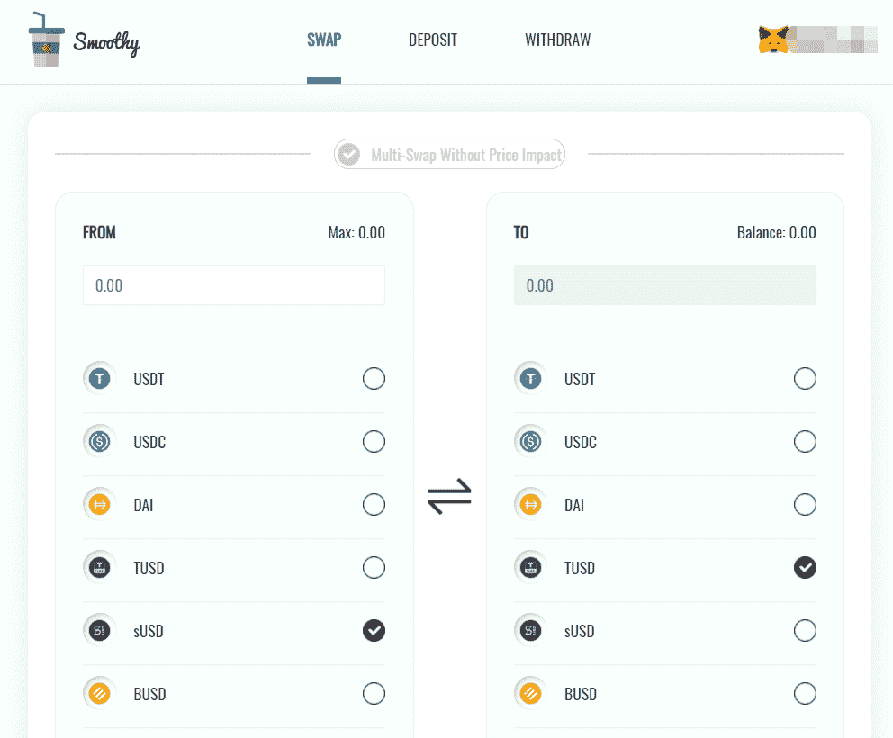
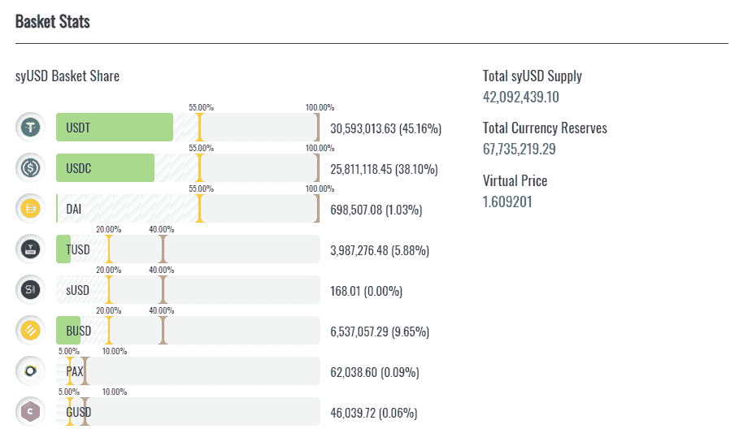
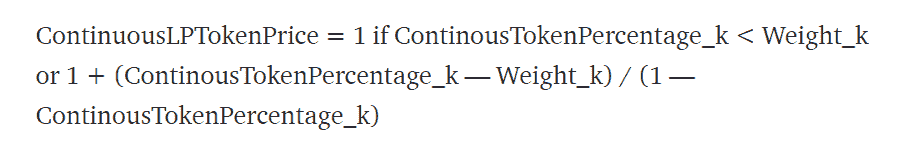
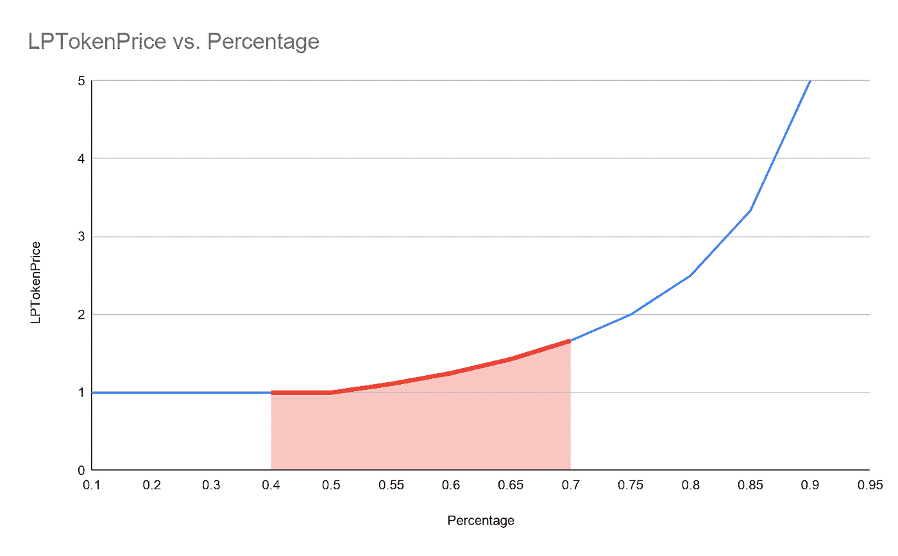
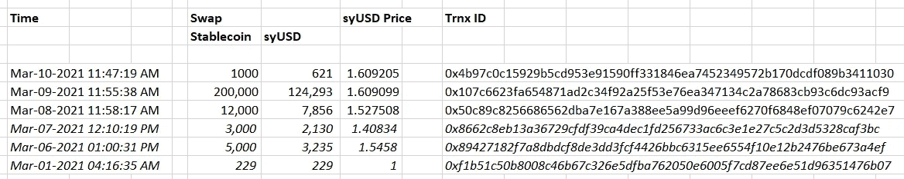
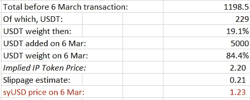

# [公司观察] Smoothy，曲线挑战者(新 Defi 系列 1/5)

> 原文：<https://medium.com/coinmonks/company-watch-smoothy-a-curve-challenger-new-defi-series-1-5-8a7ff054d0f4?source=collection_archive---------4----------------------->

Curve Finance 如今已成为稳定的货币互换的主导平台，拥有近 40 亿美元的存款和数亿美元的日交易量。到目前为止，Curve 已被证明是稳健的，虽然它拥有一系列相对较新的稳定的积分，但其中大多数从未失去挂钩；Curve 也没有被黑。请参考我们在 Medium 中的文章系列，以了解关于曲线的更多信息。然而，总是有曲线的挑战者，去年急转弯，现在平稳。

与带有激进激励的 fork 不同，Smoothy 提供了一种本土的解决方案。Smoothy 拥有一篮子 8 只稳定的硬币，并努力确保它们在大多数时间以 1:1 的比例交易。设计类似于 mStable，但有所改进:

*   **软帽的引入。** mStable 只设置硬封顶。一旦达到稳定硬币的硬上限，就不可能添加或出售这种稳定硬币。Smoothy 也有同样的特点(但对于、、戴来说，硬性上限是 100%，这意味着整个篮子都可以是这三个人中的一个)。此外，Smoothy 引入了一个软上限，超过这个上限，添加或出售稳定币将受到惩罚。这种设计旨在平衡每个稳定硬币的所需重量，并防止篮子因任何稳定硬币失去其挂钩而被排空。
*   **利息储蓄功能。**篮子里的 80%用于赚取利息(现在有了渴望)，篮子里剩下 20%用于交换需求。
*   **节省汽油费用。**该合同经过了气体优化，因此比 Curve 和 mStable 更便宜。它的交易费用是 0.04%，像曲线。

现在，篮子里的稳定硬币的成分(绿色条)、软帽(黄线)和硬帽(红线)如上。篮子里的硬币总数是 6770 万美元。

Smoothy(流动性提供商)的存款人将收到平台的计息令牌 syUSD。由于掉期费、滑点费和利息收入，syUSD 将随着时间的推移而增值。

特别是，滑点费(或在白皮书中称为罚款)是用户在出售或添加到篮子中的稳定币超出软上限时必须支付的成本。惩罚就是他得到的金额少于，他投入的稳定货币除以当时的美元价格，所以这是美元的应计值。在白皮书中，该公式解释如下:

例如，当 USDT 的软上限为 50%，而 USDT 在篮子中的实际权重为 70%时，用户仍然可以将 USDT(交易或添加)放入篮子，但他将根据 syUSD 价格获得较少的 syUSD。如果新美元的价格是 1.6 美元，他投入 1600 USDT，他将得到不到 1000 新美元。差额是滑点或罚款，通过使用新的 syUSD 价格计算，新的 syUSD 价格将增加(70%—50%)/(1–70%)= 0.67。实际上，美元价格的增量是连续的，这是通过微积分计算的。

(关于 Smoothy 设计的更多细节可以在官方手册中找到。)

目前，由于 syUSD 令牌的历史较短，没有详细的费用明细，但我们估计了 syUSD 自推出以来的变化:

我们注意到，在 Smoothy 于 3 月 8 日开始营销之前，有一些交易可能是测试性质的；然而，在此期间，美元价格起伏不定。对此没有官方解释。

*   从 1 美元到 1.5458 美元可能是由于测试人员添加了不成比例的 USDT，导致其超出软上限并导致罚款，例如，在上述示例中，一笔导致 USDT 权重为 70%的交易可能导致罚款 0.60 美元。
*   我们不清楚为什么从 3 月 6 日到 3 月 7 日新加坡元的价格下降了，尽管在这期间只有少量的交易。(3 月 12 日的修订:我们在 3 月 6 日将新美元的价格重新调整为大约 1.23 美元，请参见文章末尾的注释)

基于过去 48 小时的 syUSD 价格，在资金涌入后，syUSD 价格在最后两天分别上涨了 0.01%和 5.34%。

这个比率不包括 Smoothy 向早期采用者提供的潜在采矿奖励。奖励基于从发行到 3 月底提供的互换和流动性，并且仅在 21 天后发布。

我们相信 Smoothy 提供了一个稳定的可替换物，并且是 mStable 和 Curve 的中间点。鉴于其低廉的汽油成本和 1:1 的置换报价，它对一些用户颇具吸引力。我们也希望看到 Smoothy 的进一步改进和创新，并期待看到它成为 defi 世界的重要组成部分。

— — — — — — — — -

**对 3 月 6 日美元价格的修改:**

在我们 3 月 10 日的帖子之后，Smoothy 团队通过 twitter 回复说:“syUSD 价格=(总存款-滑动成本)/收到的 syUSD，这样，3 月 6 日就不会有更高的价格了”。我们承认了这个错误，并将价格修改如下:

本质上，3 月 6 日 3234 USDT 的存放将篮子的 USDT 重量从 19%增加到 78%(在发射前测试期间)，因此导致了处罚，如上所述。虽然有效的交易代币是 5000 USDT 兑换 3235 日元，但最终的日元价格(根据团队提供的公式)应该是 5000 减去滑点，然后除以 3235。当 USDT 的权重从 50%移动到 84.4%时，通过结合曲线在 1 美元以上的面积来估计滑点。我们估计它是每一美元 USDT 0.21 美元(假设它是一个三角形)。此后，3 月 6 日美元兑日元的价格应为 1.23 美元。

(宁静队，2021 年 3 月 10 日，推特:[https://twitter.com/SerenityFund)](https://twitter.com/SerenityFund))

**也读作:**

*   最好的[密码交易机器人](/coinmonks/crypto-trading-bot-c2ffce8acb2a)
*   [印度比特币交易所](/coinmonks/bitcoin-exchange-in-india-7f1fe79715c9)
*   [比特币储蓄账户](/coinmonks/bitcoin-savings-account-e65b13f92451)
*   最好的[加密税务软件](/coinmonks/best-crypto-tax-tool-for-my-money-72d4b430816b)
*   [电网交易](https://blog.coincodecap.com/grid-trading)
*   [最佳加密交易所](/coinmonks/crypto-exchange-dd2f9d6f3769)