# 【公司观察】Sushiswap 的赔率及其投资价值

> 原文：<https://medium.com/coinmonks/company-watch-sushiswaps-odds-and-its-investment-value-baf1dd97e73b?source=collection_archive---------0----------------------->

SushiSwap 是加密货币历史上最成功的分叉(如果不考虑当时的比特币现金的话)。由一个匿名的人或团队开始，现在在不到 6 个月的时间里，它已经成为 AMM 前三名。关于这个传奇有很多可以说的，梅萨里也有很好的记录。现在，SushiSwap 成为了 Yearn 生态系统的一部分，并与许多 defi 平台合作，推动行业创新。

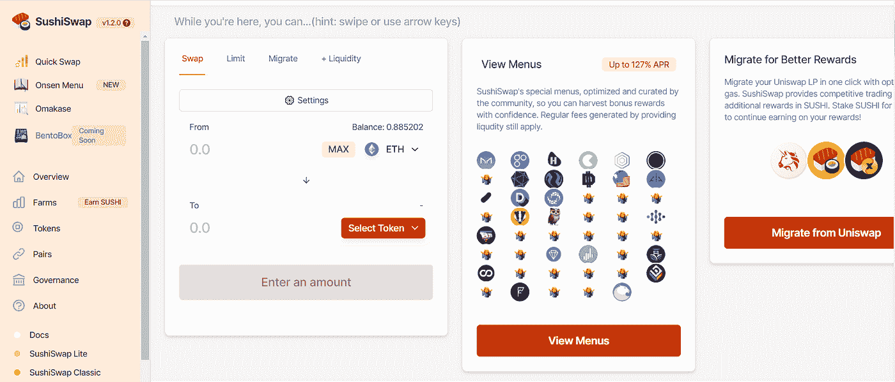

寿司，它的平台令牌，和 UNI 有着本质的区别。它从交易中获得 0.3%的费用中的 0.05%；它有一个固定的排放时间表。UNI 仅仅是一个治理令牌，不管出于什么原因，监管还是营销。现在预测 SushiSwap 的未来甚至 AMM 的监管风险还为时过早；所以现在我们只看一下寿司的经济利益。

## 寿司的产量及其市盈率

如果你买入寿司(并把它变成 xSUSHI)，你有权从每笔交易中获得 0.05%的佣金。从 https://sushiswapanalytics.com/,[的数据来看，除非最近的 defi 炒作，否则寿司的月交易量将在每天 1 . 2 亿美元左右。](https://sushiswapanalytics.com/,)

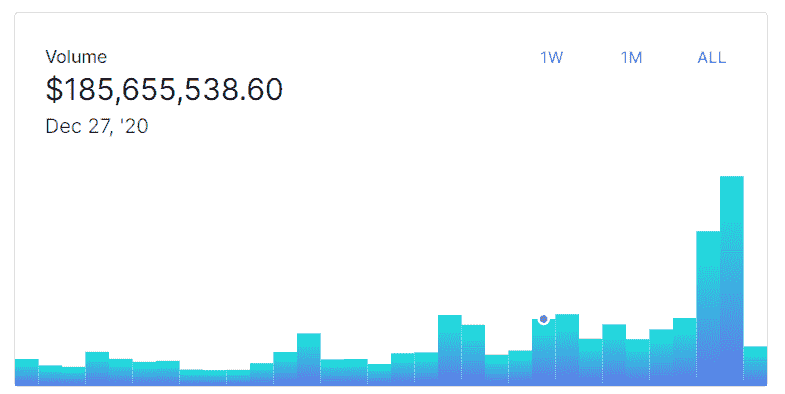

按照目前的交易量，这相当于每天收入约 6 万美元，或每年 2190 万美元。

寿司的总供应量上限为 2.5 亿份，流通总量为 1.797 亿份。考虑到今天 3.55 美元的价格，市值约为 6.379 亿美元(完全稀释后为 8.875 亿美元)。这使得市盈率为 29.1 倍(或完全稀释后为 40.5 倍)。反之，则意味着 3.4%的收益率。一般，可能偏高。

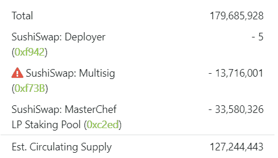

xSUSHI 的收益将会更高，正如大多数人所赌的那样(寿司池中有大量寿司)。

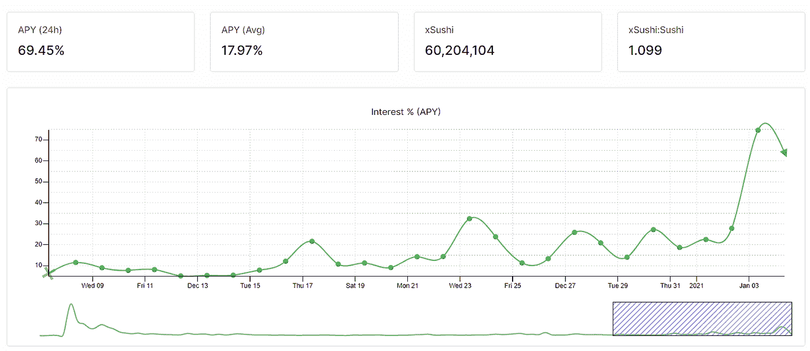

## 流动性提供者更喜欢 SushiSwap 还是 Uniswap？

尽管不符合 SushiSwap 的采矿激励措施，Uniswap 的流动性和交易量仍然很高。

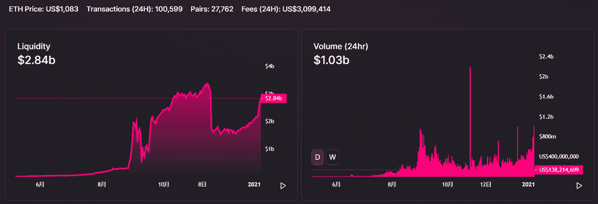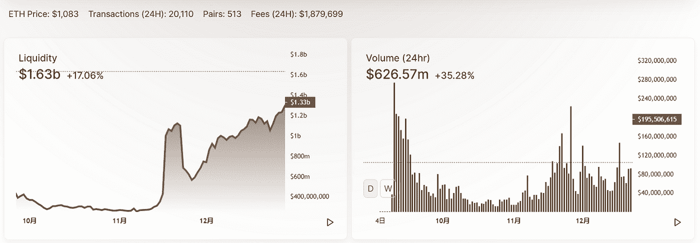

流动性提供者通常对 SushiSwap 和 Uniswap 不抱任何看法。大多数时候，Uniswap 顶级对的交易费收益等于 SushiSwap 的交易费收益和对应的 Sushi 挖矿奖励之和。

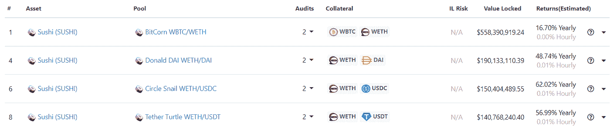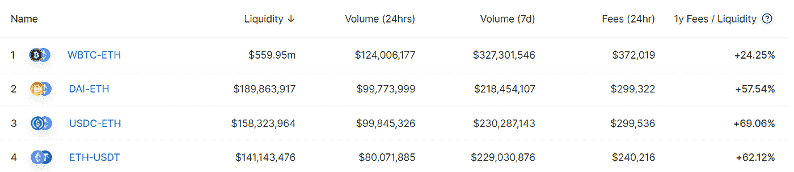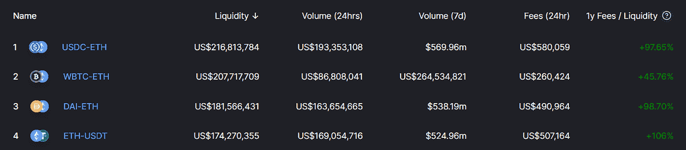

## SushiSwap 对 Uniswap 的胜算有多大？

WBTC-ETH 对在 Sushiswap 中的流动性比 Uniswap 高，为大宗交易提供了更少的滑点。前四对中的另外三对，Sushiswap 几乎与 Uniswap 不相上下，这是因为它的采矿激励措施。我们认为，即使当采矿回报结束或大幅减少时，这些顶级组合的流动性仍将在 Sushiswap 和 Uniswap 之间保持平衡。

Uniswap 的优势在第二梯队，因为 Uniswap 在 defi dev 社区很受欢迎。Uniswap 比 SushiSwap 有着更悠久的历史和更好的声誉。相比之下，瑞士银行的第二梯队通常规模较小(YFI-瑞士联邦理工学院除外)。

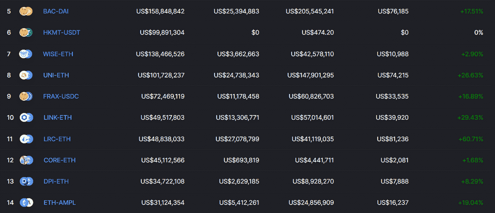

同样值得注意的是 Uniswap 中的稳定币对有着不错的流动性和交易量。稳定硬币对和稳定硬币对一样，是连接新硬币和稳定硬币的桥梁。例如，如果你想和戴交易，你必须走到，然后是到。因此，USDC-USDT 组合的规模对滑点很重要。

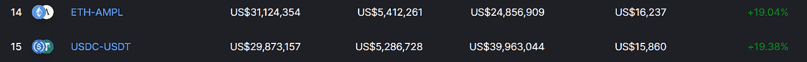

对 SushiSwap 来说，创新是与现任竞争的关键。SushiSwap 与 Yearn 的合作受到高度重视，这不仅给了它额外的一层安全保障，还让它有可能与期权提供商 Hegic 或利基贷款平台 Cream 等其他平台合作。

温泉菜单，一项赞助新硬币流动性的倡议，是吸引发展中国家的一种方式。尽管选择有前途的新项目是集中的努力，温泉项目取得了良好的发展，并获得了社区的兴趣。

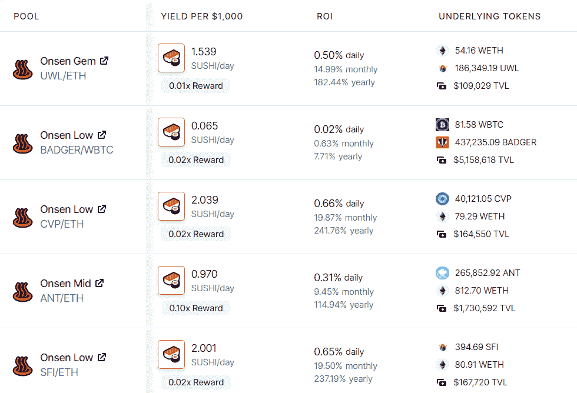

备受期待的便当盒仍在开发中(https://boring crypto . medium . com/Bento Box-to-launch-and-beyond-d2d 5d c 2350 BD)，这将使 SushiSwap 成为 AMM 和贷款的综合服务提供商。在 defi 中，贷款是一个更大的市场。

## 该吃饭了

社区投票赞成减少寿司的排放，寿司奖励将每月减少。大部分痛苦将在今年早些时候感觉到，直到 5 月，那时减少 1/3，从 30 到 20。如果到那时 SushiSwap 能够保持其流动性水平，它就有很大的机会继续推动 defi 行业的创新，甚至彻底改变它。

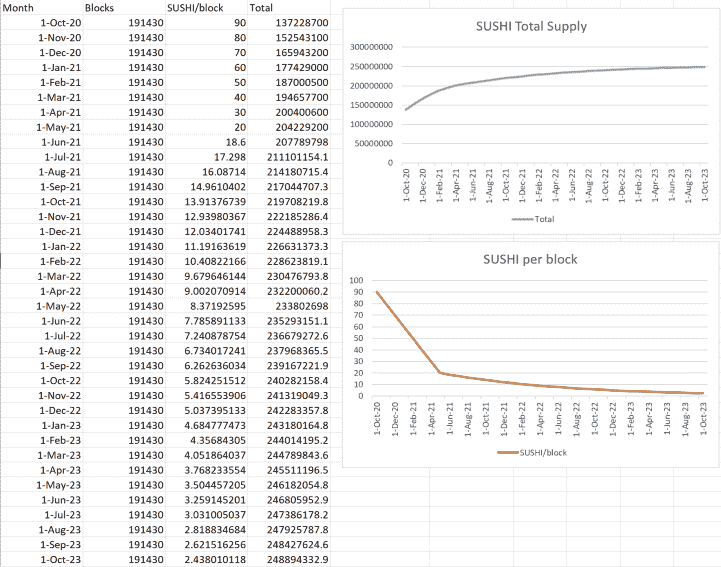

创新往往以最期待的形式发生，在混沌的边缘。让我们拭目以待 SushiSwap 能进化成什么样！

(宁静队，2021 年 1 月 5 日，推特:[https://twitter.com/SerenityFund)](https://twitter.com/SerenityFund))

## 另外，阅读

*   [学习以太坊和 Web3 开发](http://blog.coincodecap.com/go/learn)
*   最好的[密码交易机器人](/coinmonks/crypto-trading-bot-c2ffce8acb2a)
*   [3 商业评论](/coinmonks/3commas-review-an-excellent-crypto-trading-bot-2020-1313a58bec92)
*   [Pionex 审查](/coinmonks/pionex-review-exchange-with-crypto-trading-bot-1e459d0191ea)
*   [AAX 交易所评论](/coinmonks/aax-exchange-review-2021-67c5ea09330c) |推荐代码、交易费用、利弊
*   [Deribit 审查](/coinmonks/deribit-review-options-fees-apis-and-testnet-2ca16c4bbdb2) |选项、费用、API 和 Testnet
*   [FTX 密码交易所评论](/coinmonks/ftx-crypto-exchange-review-53664ac1198f)
*   [n 零审核](/coinmonks/ngrave-zero-review-c465cf8307fc)
*   [Bybit 交换审查](/coinmonks/bybit-exchange-review-dbd570019b71)
*   [3Commas vs Cryptohopper](/coinmonks/3commas-vs-pionex-vs-cryptohopper-best-crypto-bot-6a98d2baa203)
*   最好的比特币[硬件钱包](/coinmonks/the-best-cryptocurrency-hardware-wallets-of-2020-e28b1c124069?source=friends_link&sk=324dd9ff8556ab578d71e7ad7658ad7c)
*   [密码本交易平台](/coinmonks/top-10-crypto-copy-trading-platforms-for-beginners-d0c37c7d698c)
*   最佳 [monero 钱包](https://blog.coincodecap.com/best-monero-wallets)
*   [莱杰 nano s vs x](https://blog.coincodecap.com/ledger-nano-s-vs-x)
*   [bits gap vs 3 commas vs quad ency](https://blog.coincodecap.com/bitsgap-3commas-quadency)
*   最好的[加密税务软件](/coinmonks/best-crypto-tax-tool-for-my-money-72d4b430816b)
*   [最佳加密交易平台](/coinmonks/the-best-crypto-trading-platforms-in-2020-the-definitive-guide-updated-c72f8b874555)
*   最佳[加密借贷平台](/coinmonks/top-5-crypto-lending-platforms-in-2020-that-you-need-to-know-a1b675cec3fa)
*   [莱杰纳米 S vs 特雷佐 one vs 特雷佐 T vs 莱杰纳米 X](https://blog.coincodecap.com/ledger-nano-s-vs-trezor-one-ledger-nano-x-trezor-t)
*   [block fi vs Celsius](/coinmonks/blockfi-vs-celsius-vs-hodlnaut-8a1cc8c26630)vs Hodlnaut
*   Bitsgap 评论——一个轻松赚钱的加密交易机器人
*   为专业人士设计的加密交易机器人
*   [硬币追踪审查](/coinmonks/cointracking-review-a-reliable-cryptocurrency-tax-software-5114e3eb5737)
*   [优霍德勒评论](/coinmonks/youhodler-4-easy-ways-to-make-money-98969b9689f2)
*   [埃利帕尔泰坦评论](/coinmonks/ellipal-titan-review-85e9071dd029)
*   [SecuX Stone 评论](https://blog.coincodecap.com/secux-stone-hardware-wallet-review)
*   [BlockFi 评论](/coinmonks/blockfi-review-53096053c097) |从您的密码中赚取高达 8.6%的利息
*   [共同规则审查](https://blog.coincodecap.com/coinrule-review-a-perfect-trading-bot)
*   [最佳区块链分析工具](https://bitquery.io/blog/best-blockchain-analysis-tools-and-software)
*   [加密套利](/coinmonks/crypto-arbitrage-guide-how-to-make-money-as-a-beginner-62bfe5c868f6)指南:新手如何赚钱
*   最佳[加密制图工具](/coinmonks/what-are-the-best-charting-platforms-for-cryptocurrency-trading-85aade584d80)
*   了解比特币的[最佳书籍有哪些？](/coinmonks/what-are-the-best-books-to-learn-bitcoin-409aeb9aff4b)

> [直接在您的收件箱中获得最佳软件交易](/coinmonks/newsletters/coinmonks)

