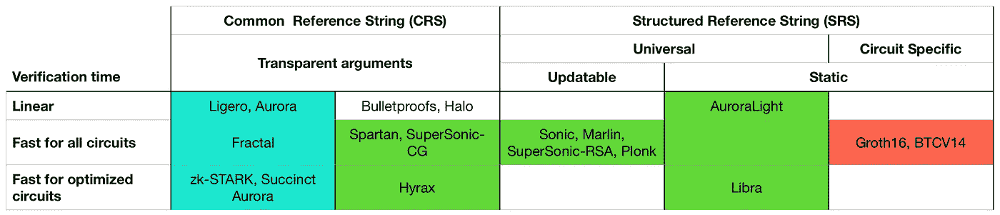
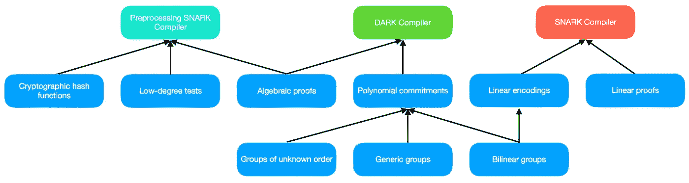
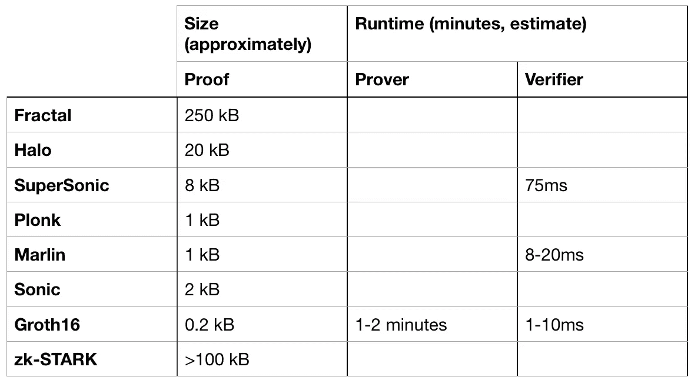

# 比较通用 zk-SNARKs

> 原文：<https://medium.com/coinmonks/comparing-general-purpose-zk-snarks-51ce124c60bd?source=collection_archive---------0----------------------->

T *何 zk-SNARK 空间移动太快，很难跟上。就在过去的两个月里，宣布了许多新的突破性的 zk-SNARK 结构。新的是臭名昭著的“可信设置”现在是多余的，这意味着现在可以使用任何任意计算(你好，智能合同！).然而，很难找到关于这些新结构的容易理解的信息。在这篇博文中，我比较了这些新的结构。这些结构背后的多个团队已经分享了即将到来的进一步改进。当我收到新信息时，我会更新这篇博文*

Z 像 zk-SNARKs 这样的 ero 知识证明有着广泛的应用:Zcash 使用零知识来保护隐私，Coda 和 Mir 将整个区块链压缩到只有几千字节，0x 和 Matter 将许多交易汇总到以太坊上的单个证明中。(不熟悉零知识证明的，见[本解释](https://towardsdatascience.com/what-are-zero-knowledge-proofs-7ef6aab955fc))

# 可信设置

传统的 zk-SNARKs，如 Groth16，有一个主要缺点:它们依赖于一个公共引用字符串，该字符串是使用一次性[可信设置](/qed-it/diving-into-the-snarks-setup-phase-b7660242a0d7)创建的。这个设置创建了一个由证明者和验证者使用的参考字符串。有三个主要问题:

1.  该装置产生了“有毒废物”，如果泄露，可以用来生成无法检测的伪造证据。多方计算(通常称为仪式)在很大程度上否定了这个问题，但是协调这样的仪式是极其复杂的。
2.  可信设置创建的参考字符串总是绑定到一个电路(基本上是程序)。任何任意的计算都不可能有一个单一的设置。这使得许多应用变得不可能，比如智能合同。
3.  该设置是一次性事件，产生的引用字符串不可升级。这意味着，例如，如果 Zcash 需要修复他们的 zk-SNARK 电路中的一个小错误，那么就需要一个新的仪式来部署错误修复。

# 通用 zk-SNARKs

新的 zk-SNARK 构造修复了设置限制，这意味着像智能合约这样的任意代码都可以作为 ZK-SNARK 运行。有两种不同的方法:

1.  透明设置:该设置创建了一个*公共参考字符串*，是公共的，不会产生有毒废物。这与 zk-STARK(带 T)的工作方式相似。分形，光晕和超音速 CG 使用透明设置。这种方法的缺点是证明大小可能很大。分形和 zk-STARK 证明可能高达 250kB，这对于区块链应用程序来说是不切实际的。分形小组告诉我，他们正在努力减少证明的大小。Halo 和 SuperSonic 具有 10 kB 或更小的验证大小。(注意:zk-STARK 是一个特定的零知识结构的名称，类似于 Groth16 或 Fractal。另一方面，zk-SNARKs 是一类结构的名称。这就是为什么分形被称为 zk-SNARK，而不是 zk-STARK)
2.  通用设置:该设置创建了一个*结构化参考串*，确实产生了有毒废物，但该设置不再局限于只有一个单一电路。相反，一个参考串可以用于无限数量的任意电路(具有某一最大尺寸)。例如 Marlin、超音速 RSA 和 Plonk。这三个结构的参考字符串可以在仪式后更新以提高安全性:在当前有毒废物泄漏的情况下，只需要更新设置以再次保护系统。(一些通用的 zk-SNARKs，如 AuroraLight 和 Libra 使用静态的不可更新的通用设置。我们在这篇博文中不涉及这些)。

# ZK-斯纳克分类法

新款 zk-SNARKs 相比如何？在证明者方面，为每个 zk-SNARK 构造创建一个证明需要 O(n log n)时间。区别主要是证明大小、验证时间和参考字符串的大小。

以下分类基于 [Alessandro Chiesa](https://medium.com/u/129b617a1ac4?source=post_page-----51ce124c60bd--------------------------------) 在旧金山[ZK summit zk0x 04](https://www.youtube.com/watch?v=-EkUn4iD8Z8)上的发言。Leading 是在设置中创建的引用字符串的类型。(请注意，基于静态电路特定参考字符串的 Zk-SNARK 构造不是通用的，而是用于比较。)

Classification of zk-SNARKs based on the type of reference string

The three types of zk-SNARK compilers (colors match the zk-SNARKs in above table).

在幕后，所有这些 ZK-SNARK 使用三种类型的编译器之一:预处理、黑暗和传统(非通用)SNARK。**评论者注意:三个编译器的命名可以改进。欢迎建议。**

# 现有的结构

作为参考，我将包括三个现有构造的描述。一个(Groth16)是非通用的，依赖于特定电路的一次性不可更新设置。第二个，Sonic 是通用 zk-SNARK。

# Groth16

目前已知最快最小的 zk-SNARK。它在 Zcash 和其他地方被使用。Groth16 是非通用的；该设置总是与一个特定的电路相关联。由于速度和较小的验证大小，新的 zk-SNARKS 的性能经常与 Groth16 进行比较。

论文:【https://eprint.iacr.org/2016/260 

# 音速的

S onic 是早期的通用 zk-SNARK 协议。论文发表于 2019 年 1 月，比这篇博文早了 10 个月，这在 zk-SNARK 时间里是一个永恒。Sonic 支持通用和可更新的公共引用字符串。声波样张大小不变，但是验证很贵。理论上，可以批量验证多个证明，以达到更好的性能。下面列出的许多新 zk-SNARKs 都是基于 Sonic 的。

论文:[https://eprint.iacr.org/2019/099](https://eprint.iacr.org/2019/099)

# 新的结构

# 不规则碎片形

ractal 是一个 zk-SNARK，它允许递归而不需要配对友好的椭圆曲线。通过预处理电路，透明设置的简洁验证成为可能。证明大小目前高达 250 kB，明显大于其他构造。在即将到来的更新中，大小将会减小。

论文:[https://eprint.iacr.org/2019/1076](https://eprint.iacr.org/2019/1076)

# 晕

H alo 是一个 zk-SNARK，支持递归证明合成，无需可信设置。递归使用“嵌套摊销”工作:在椭圆曲线的循环中重复地将多个证明折叠在一起。

与其他新构造不同，Halo 的验证时间是线性的，这使得它成为唯一一个不简洁的新构造。然而，改进即将到来。

论文:[https://eprint.iacr.org/2019/1021](https://eprint.iacr.org/2019/1021)

# 超声波

正如你已经猜到的，超音速是对音速的改进。超音速是第一个透明的 zk-SNARK，它既有实际的证明时间，也有渐近对数的证明大小和验证时间。

论文:[https://eprint.iacr.org/2019/1229](https://eprint.iacr.org/2019/1229)

# 马林鱼

Marlin 是 Sonic 的一个改进，证明时间缩短了 10 倍，验证时间缩短了 4 倍。

论文:[https://eprint.iacr.org/2019/1047](https://eprint.iacr.org/2019/1047)

# 砰的一声

Plonk 是 Sonic 的改进，校准时间提高了 5 倍。

论文:[https://eprint.iacr.org/2019/953](https://eprint.iacr.org/2019/953)

# 表演

T 最大的问题是:这些构造在性能方面相比如何？不幸的是，我不知道 zk-SNARKs 的任何基准，即使有，也不是所有的新构造都有参考实现。有引用实现的构造毫无例外都是未优化的。因此，下表中的数字不能全信。它们基于论文中的基准，或者基于发明者提供的估计。

查看证据大小、大致证明者运行时间和大致验证运行时间，有几点值得注意:

1.  具有透明设置的构造通常具有更大的校样尺寸
2.  与其他新构造不同，Halo 中的验证时间不是恒定的
3.  Groth16 在证明大小和运行时间方面仍然是无与伦比的

# 下一步是什么？

我会在新的信息或改进的构想出现时更新这篇博文。我很想听听你对 zk-SNARKs 的看法。工程师对 zk-SNARKs 的介绍？递归 zk-SNARKs？请在评论中告诉我或者给我发邮件。

# 由于

非常感谢加州大学伯克利分校的 Dev Ojha 不知疲倦地解释分形和其他项目的细节。感谢 [Howard Wu](https://twitter.com/1howardwu) 、 [J Ayo Akinyele](https://medium.com/u/5af7acaa2380?source=post_page-----51ce124c60bd--------------------------------) 和 [Lorenz Breidenbach](https://twitter.com/ethlorenz) 的校对和反馈。

# 我们在招人！

如果你是一个对学习 zk-SNARKs 感兴趣的 Rust 开发者(但不一定有 zk-SNARKS 的经验):Starling Protocol 正在招人。Starling 是一个可编程的简洁的第一层协议，位于加州伯克利。斯塔林协议是一个多元化和包容性的工作场所。我们鼓励有色人种、LGBTQ 个人和女性申请。电子邮件[ronald@starlingprotocol.com](mailto:ronald@starlingprotocol.com)了解更多信息。

> [直接在您的收件箱中获得最佳软件交易](https://coincodecap.com/?utm_source=coinmonks)

