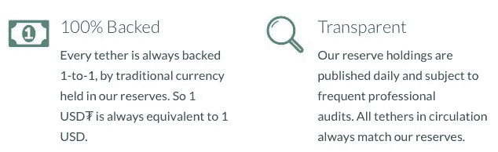
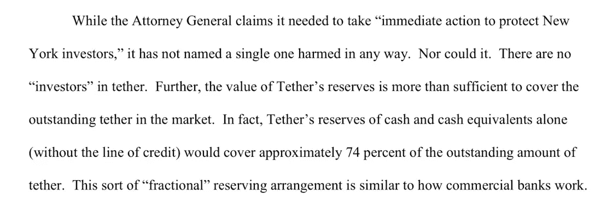

# 将系绳比作银行:停

> 原文：<https://medium.com/coinmonks/comparing-tether-to-a-bank-stop-e14408a70918?source=collection_archive---------1----------------------->

看到人们经常将 Tether 的非完全支持的美元衍生品与银行的运营方式进行比较令人挠头——不仅因为 Tether 和银行非常不同，还因为银行对其储备(或缺乏储备)相对开放和透明。

# 为什么造币者把系绳比作银行(正面)

总的来说，加密货币的支持者倾向于憎恨法定货币和银行业。如果你像我一样是个门外汉，这可能会让你疑惑，“为什么？”

所以，让我们快速分析一下，为什么造币者讨厌菲亚特和银行业，但仍然支持 Tether。

1.  法定货币一般是**。纸币是设计用来立即使用的，而不是存起来的。这是有原因的:政府、公司和私人企业不希望你尽可能长时间地持有现金——他们希望你花钱。这本质上并不坏。通胀的目标是迫使人们将部分现金投资于一系列不同的资产:股票、债券、贷款、大宗商品、教育、房地产和个人财产(汽车、办公桌、与工作相关的物品)。希望这能给你提供一个持续的收入来源，让你的钱“为你工作”，同时对冲市场某个部门的彻底失败。但是铸币者更喜欢“**通货紧缩**”通货紧缩限制了持有者获得贷款的能力，限制了消费，也限制了风险——这本身也不是坏事。铸币者倾向于认为，我们生活在一个过度放纵消费主义的世界，银行(借出通胀货币)承担的风险太大、范围太广。**
2.  **可供开采的比特币供应有限。可以进入市场的美元数量是无限的，因为美联储控制着印钞机，决定什么时候有足够的美元。这意味着比特币是“稀缺的”，而美元是“供应驱动的”。(*目前比特币的供应量是有限的，只有 2100 万枚。如果有广泛的共识，没有什么能阻止这个限制有一天被改变。)**
3.  **至少直到最近，美国的银行都被要求持有 10%的存款准备金。这就是所谓的“部分准备金银行”10%不算多，但银行倾向于遵循这一规则，除非发生某种灾难，否则这一规则是有效的。Tether 承诺 100%支持，然后宣布 74%支持。这仍比银行高出 64%。**

****

**100% backed by traditional currency transforms into…**

****

**74% backed by…???**

**4.尽管银行将储户的现金贷出给抵押贷款支持证券和新兴市场等风险资产，但至少在一开始(据推测)，Tether 根本没有贷出 Tether。**

# **听起来系绳现在是银行了，兄弟**

**也许听起来是这样，考虑到在 8 . 5 亿美元被波兰政府没收后，他们直接将 26%的现金借给了自己。但请理解，那从来不是泰瑟许下的承诺。如上图所示，泰瑟承诺每印一张 USDT，银行账户就会有 1 美元的“全额储备”。从来没有这种情况。**

**充其量，你可以说，也许(因为没有审计或适当的证明)，Tether 把钱存在一些普通银行账户、一些 ife([国际金融实体](https://www.dlapiper.com/en/us/insights/publications/2017/01/international-financial-entities-in-puerto-rico/))和一些加密货币中。他们从未得到完全的支持。因为银行账户中的美元只有 10%的担保！).**

**将 Tether 与 banks 区分开来的是两个基本概念:**

*   **许下的诺言**
*   **规程**

# **系绳和银行的区别**

**让我们比较一下 Tether 最初的承诺和银行的承诺。**

**我们从系绳开始:**

*   **100%由传统货币支持**
*   **“全额准备金”银行账户中的所有资金**
*   **频繁审计/证明**
*   **没有保险单，所有的损失都是你自己的**

**现在，一家银行:**

*   **10%由货币支持**
*   **仅在公开交易时进行审计/证明(以公开方式)**
*   **联邦存款保险公司承保高达 25 万美元**

**我希望人们能够确定系绳代表什么和银行代表什么之间的巨大差异。不管 Tether 的律师、加密货币交易员或加密货币 Twitter 上的 thot 领导人怎么宣称，它们都不一样。**

# **TL；速度三角形定位法(dead reckoning)**

**无聊？结论是这样的:**

**Tether 不是一家银行，因为它是一家私人实体，向其用户群做出了非常明确的承诺。它违背了这些承诺。所做的承诺是 100%的传统货币支持(lie)，全额储备银行账户中持有的资金(lie)，以及频繁的审计(lie)。**

**在美国，银行承诺 10%的准备金(通常是真的)，高达 25 万美元的基金由联邦存款保险公司(FDIC)担保(真的)，但没有关于审计的承诺(真的)。**

**别再比较了。保持怀疑，朋友们。**