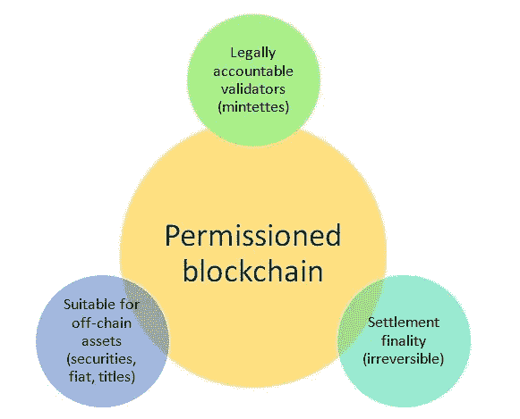
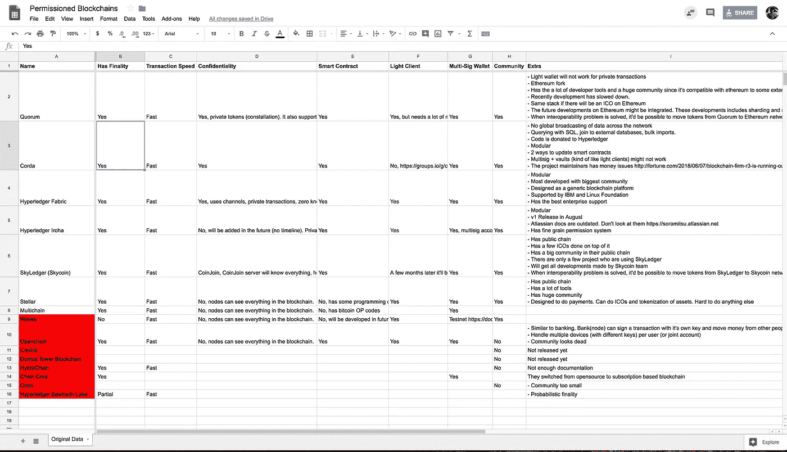

# 许可区块链的比较

> 原文：<https://medium.com/coinmonks/comparison-of-permissioned-blockchains-6537a0694df0?source=collection_archive---------3----------------------->

这篇文章的目标是帮助为不同的用例选择一个许可的区块链项目。我比较了不同的许可区块链。尽管大多数项目看起来相似，但它们都以不同的方式闪耀。

作为先决条件，您需要知道什么是许可的区块链以及用例是什么。首先，我推荐[这个](/blockchain-review/private-blockchain-or-database-whats-the-difference-523e7d42edc)和[这个](http://qr.ae/TUIIBV)帖子。

当您的组织中存在以下情况时，私有区块链非常有用

1.  该组织的成员在地理上是分散的，并且不能完全信任彼此，
2.  有记录在案的腐败历史，特别是多年未被发现的腐败，
3.  不可能建立一个所有人都信任的集中控制，比如“总部”、“总裁”或“公司服务器”。

许可的区块链有不同的用例，如供应链、支付、托管、信用互换、商品、小额贷款、托管、慈善、音乐出版等。

换句话说，像比特币这样的公共区块链的安全性来自于工作证明，这使得数学上不可能在没有勾结矿工的情况下伪造或逆转交易。另一方面，分布式分类帐和私有区块链的安全承诺与验证交易的实体的诚实程度一样好。在私人区块链中，交易的不可逆性背后没有数学上的保证。

Private Blockchain / Permissioned Blockchain

我研究了 15 个项目，并根据 7 个参数对它们进行了评级。

1.  **有终结:**10 秒内是否有交易终结。在等待 45 个确认块后，比特币的概率终结率约为 99.99%，而 Stellar 具有即时交易终结性，其中不能有分叉，因此交易不能恢复。
2.  **事务速度:**与其写每秒最大事务(tps)，我决定分成 2 组。(1)快和(2)慢。快是 100 tps 以上，慢是 100 tps 以下。如果对协议进行一些修改，总有可能增加 tps。此参数基于其默认配置。
3.  **保密性:**对于商家来说，隐私真的很重要。一些支持机密性的项目可能会泄漏信息，例如总事务计数。
4.  **智能合约:**项目允许[图灵完成](https://hackernoon.com/smart-contracts-turing-completeness-reality-3eb897996621)编程。
5.  **轻客户端:**是否可以在不需要手机或浏览器等完整节点的情况下进行交易。
6.  **多签名钱包:**能否支持[多签名](https://en.bitcoin.it/wiki/Multisignature)钱包？
7.  **社区:**项目有足够大的社区吗？有没有可能向社区提一个问题，不到一天就得到答案？

我为我发现的被许可的区块链必须具备的属性设定了最低要求。这些要求是:

1.  最低 100 tps
2.  活跃社区
3.  项目的积极发展
4.  在不到 10 秒的时间内完成交易
5.  至少有一家价值超过 500 万美元的公司在使用这个项目

如果项目不满足这些要求，我将项目颜色标记为红色。空单元格意味着项目不满足要求，所以我停止了研究。

 [## 被许可的区块链

### 原始数据名，有默认货币，有终局性，交易速度，保密性，智能合约，轻…

docs.google.com](https://docs.google.com/spreadsheets/d/12PPUxqDaTSR2K2gNQJ7EqIN1ezCiwwa51GZTcN3O6T8/edit?usp=sharing) 

对于企业来说，选择正确的技术至关重要。这对于区块链项目来说更是如此。如果选择了错误的区块链技术，将很难甚至不可能迁移数据。我的研究只是一个起点，但是，我强烈建议在选择之前深入研究这些技术。

如果您碰巧需要更多关于为您的用例选择正确的许可区块链的详细信息，请告诉我。

你可以通过[thellimist.com](http://thellimist.com)或者[推特](https://twitter.com/thellimist)联系我。

*披露者:我建议公司使用许可的区块链。*