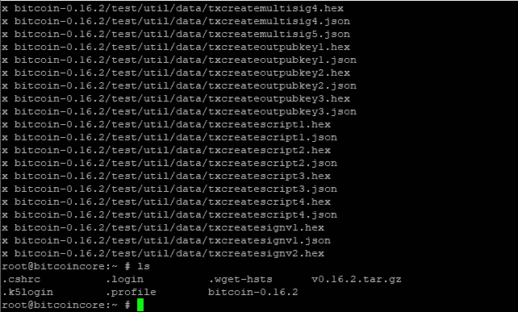

# 在 FreeNAS 11.2 上编译比特币核心 0.17.1

> 原文：<https://medium.com/coinmonks/compile-bitcoin-core-0-17-0rc3-with-tor-hidden-service-ncurses-tui-on-freenas-11-2-iocage-jail-4a0c4c5c9111?source=collection_archive---------0----------------------->

# 此文章不再维护。请在我的 github 页面上查看最新说明:

[https://github.com/seth586/guides/tree/master/FreeNAS](https://github.com/seth586/guides/tree/master/FreeNAS)

# **本文是系列文章的一部分:**

接下来:[在弗里纳斯监狱安装 electrum 个人服务器](/@seth586/freenas-jail-install-electrum-personal-server-9ca9eea96046)

# 目标:

本文概述了如何在 FreeNAS 11.2 iocage jail 上编译和运行比特币核心 0.17.1(或您可能希望的其他版本)，为公共 IP 和 tor 连接提供服务，使用 ncurses2 终端用户界面。在以后的文章中，这将被配置为与闪电实验室的 LND 一起工作。

# 先决条件:

因此，在这一点上，我们可以假设您构建了您的家庭服务器。希望你足够聪明去遵循[硬件推荐指南](https://forums.freenas.org/index.php?resources/hardware-recommendations-guide.12/)。我的基本建议是:确保你得到一个服务器级主板，它有互联网协议管理接口(IPMI) &支持错误代码纠正(ECC)内存。我强烈推荐 RAIDZ2 配置中的 6 个硬盘，这是最好的空间和冗余。当硬盘出现故障时，RAIDZ1 中的任何数量的驱动器都会失去冗余，而 RAIDZ2 中的 4 个驱动器的存储容量只有 RAIDZ2 中 6 个驱动器的一半。如果价值主张越来越贵，从较小的硬盘开始。一旦卷设置完毕，您就不能向卷中添加驱动器，但是您可以用更大的驱动器替换驱动器，一旦所有 6 个驱动器都是更大的驱动器，您就可以增加卷的大小。

我假设你知道你的路由器。我的示例路由器是运行 OpenWRT 的 Linksys WRT1900ACv1。您的路由器配置用户界面可能与此处解释的不同。

我们还假设您在家庭服务器上安装了 FreeNAS，浏览了 [FreeNAS 论坛](https://forums.freenas.org/index.php)，阅读了 [FreeNAS 文档](http://doc.freenas.org/11/freenas.html)，并设置了一个 ZFS 卷。

# 创建监狱:

把监狱想象成更高效的虚拟机。你可以在 FreeNAS 上安装一堆虚拟机，在这些虚拟机上运行 linux，并在网上提供的各种 linux 指南中做出选择。但是运行一个虚拟机需要比监狱更多的资源，为虚拟机分配内存等等。另外，如果我们搞砸了，我们可以删除监狱，重新开始。我们在监狱里做的任何事情都不应该破坏主机上的任何东西。毕竟，我们为正常运行时间构建了具有服务器级硬件的计算机！

FreeNAS 11.2 使用 iocage 来管理监狱。以前的版本使用 warden，现在已被弃用。要创建监狱，请登录到您的 FreeNAS 用户界面，并在左侧菜单中选择监狱。单击右上角的“+”符号，并为您的监狱命名。我决定叫我的`bitcoin_node`。在释放下，选择`11.2-RELEASE`。点击“下一步”。


单击“DHCP 自动配置 IPv4”，应该会自动选择 VNET。动态主机配置协议允许你的主机(你的家庭路由器)分配一个 IP 地址给你的监狱。VNET 将为你的监狱创建一个虚拟以太网适配器。不需要额外的电缆。现在，您的家庭路由器会将您的 FreeNAS 服务器和您的监狱视为两个独立的设备。当我们可以根据分配的 IP 地址在您的路由器上引导流量时，这将非常方便！点击“下一步”


最后，“提交”。


接下来，我们要确定这个监狱的最大运行时间。如果你有一个服务器重启，我们希望监狱也能自动启动。单击新监狱旁边的“ **⋮'** 符号，然后单击“编辑”。点击“自动启动”，然后点击“保存”。再次点击“ **⋮'** 符号，并点击“开始”。一旦开始动画消失，刷新你的浏览器，你应该看到你的路由器分配给你的新监狱的 IP 地址。


恭喜你，你刚刚建立了你的第一个监狱！

# 定义:IP 范围/子网/网络掩码/MAC/WAN/LAN

随着新设备连接到您的路由器或从您的路由器分离，您的路由器将分配不同的 IP 地址。我们想专门为我们的监狱保留一个 IP 地址。我们的路由器可以根据其[“媒体访问控制”(MAC)地址](https://techterms.com/definition/macaddress)唯一地识别不同的以太网设备，并为该 MAC 地址保留一个 IP 地址。

大多数路由器将 192.168.1.0/24 指定为私有网络的[默认子网。一个](https://www.iana.org/assignments/iana-ipv4-special-registry/iana-ipv4-special-registry.xhtml)[子网](https://en.wikipedia.org/wiki/Subnetwork)是一组共享一个 IP 地址空间的计算机。/24 被称为[网络掩码](https://www.computerhope.com/jargon/n/netmask.htm)。网络掩码代表一系列 IP。例如，192.168.1.0/24 代表 254 个 IP 地址，从 192.168.1.1 到 192.168.1.254。有时/24 表示为子网掩码 255.255.255.0。你可以在这里玩一个子网掩码计算器。

此子网 192.168.1.0/24 代表您的路由器与互联网逻辑隔离的所有设备。您只有一个互联网服务提供商(ISP)分配给您的 IP 地址。您的路由器在逻辑上转换您的家庭子网和互联网之间的流量。通常，您的路由器将互联网称为“广域网”(WAN)，将您的家庭子网称为“局域网”(LAN)。

# 可选:分配唯一的主子网范围

在后面的指南中，我们将设置一个 VPN，以便您可以安全地远程访问您的家庭网络，所以现在我们将把您家庭的子网更改为一个不太常用的 IP 范围，以防止干扰远离家庭的远程子网。我们现在这样做是因为这样可以避免重新配置我们将要做的更改。登录到您的路由器，并转到网络/接口/局域网


将 IPv4 地址更改为类似 192.168.XXX.1 的地址，其中 XXX 不是 0 或 1。我选了 84。你可能需要重新启动你的电脑来检测新的子网，并获得一个新的 IP 地址分配。

# 我们监狱的 IP 静态租赁

现在选择网络/DHCP 和 DNS。在这里，您可以看到连接到路由器的所有 LAN 设备。你应该看到你的比特币节点监狱也列在这里。向下滚动到“静态租赁”，并为我们的比特币节点监狱创建一个。


点击“保存并应用”。

# 从公共互联网地址转发端口 8333 到我们的监狱

您的路由器还提供了一个“防火墙”，限制哪些端口可以在您的家庭子网和互联网之间通信。可以把端口想象成通向每个 IP 地址的无数扇门。默认情况下，您的路由器会尽可能关闭这些门。对于连接到您的节点的其他节点，它们需要连接到您的公共 IP 地址和端口，通过路由器，到监狱的子网 IP 和端口。开放口岸就像打开了一扇通往世界的大门，所以我们要小心我们开放什么口岸。考虑下面的例子，我只是为你的互联网 IP 地址和分配给你的监狱的家庭子网 IP 抛出随机数。

(互联网 IP):(端口)—路由器→(家庭子网 bitcoincore jail IP):(端口)

123.234.165.254:8333—路由器— ->192.168.1.123:8333

为了在您的路由器防火墙中制定这一例外规则，我们将把端口 8333 转发到我们的 bitcoincore 监狱。登录到您的 openWRT 路由器，并选择网络/防火墙/端口转发。


制定一个新规则，我就叫它比特币 _ 节点，使用 TCP 协议，从外部 WAN 区端口 8333 到我们比特币 _ 节点监狱的内部区域 LAN ip 地址在端口 8333。确保你选择正确的 IP 地址分配给你的监狱！


点击“保存并应用”。

您的监狱网络现已配置完毕。让我们安装一些软件！

# 安全套接字外壳(SSH)进入监狱&编译比特币&安装

SSH 是一种通过网络远程管理服务器的方式。当您不将显示器和键盘直接插入服务器时，它被称为“无头”服务器。最流行的 SSH 客户端叫做 [PuTTY，在这里下载](https://www.putty.org/)。连接到您的 FreeNAS 的 IP 地址，并使用您的凭据登录。

类型:

```
# iocage list
```

你应该看到你的比特币节点监狱列表。

```
iocage console bitcoin_node
```

你被录取了。让我们开始安装东西吧！

```
# pkg install autoconf automake boost-libs git gmake libevent libtool libzmq4 openssl pkgconf wget nano tor python3
```

去[https://github.com/bitcoin/bitcoin/releases](https://github.com/bitcoin/bitcoin/releases)，找到我们想要安装的 tar.gz 版本。https://github.com/bitcoin/bitcoin/archive/v0.17.1.tar.gz[的最新版本是 0 . 17 . 1](https://github.com/bitcoin/bitcoin/archive/v0.17.0.1.tar.gz)

```
# wget [https://github.com/bitcoin/bitcoin/archive/v0.17.1.tar.gz](https://github.com/bitcoin/bitcoin/archive/v0.17.0.1.tar.gz)
# tar xzvf v0.17.1.tar.gz
```

要查看当前目录中的内容，请键入`ls`(缺少/意味着在根目录中，您可以通过键入`cd /root`导航到根目录)



你可以看到我们下载的文件，`v0.17.1.tar.gz`和解压缩的目录`bitcoin-0.17.1`，让我们改变到比特币目录，并配置编译。

```
# cd bitcoin-0.17.1
# sh 
# ./contrib/install_db4.sh `pwd`
# export BDB_PREFIX='/root/bitcoin-0.17.1/db4'
# ./autogen.sh
# ./configure MAKE=gmake BDB_LIBS="-L${BDB_PREFIX}/lib -ldb_cxx-4.8" BDB_CFLAGS="-I${BDB_PREFIX}/include" --without-gui --without-miniupnpc
# gmake check
# gmake install
```

这个过程可能需要一段时间。完成并安装后，我们需要添加一个 rc.d 脚本，以便在启动时自动启动比特币守护进程。点击阅读更多关于 FreeBSD rc.d 脚本[的信息。FreeBSD ports 维护了一个启动脚本，我们可以在](https://www.freebsd.org/doc/en_US.ISO8859-1/articles/rc-scripting/index.html)[https://github . com/FreeBSD/FreeBSD-ports/blob/master/net-P2P/bitcoin/files/bitcoind . in](https://github.com/freebsd/freebsd-ports/blob/master/net-p2p/bitcoin/files/bitcoind.in)中使用该脚本(单击原始链接可以获得文件的直接链接)

```
# cd /etc/rc.d/
# wget [https://raw.githubusercontent.com/freebsd/freebsd-ports/master/net-p2p/bitcoin/files/bitcoind.in](https://raw.githubusercontent.com/freebsd/freebsd-ports/master/net-p2p/bitcoin/files/bitcoind.in)
# mv bitcoind.in bitcoind
# chmod +x bitcoind
```

让我们编辑本地环境的启动脚本:

```
nano bitcoind
```

%%PREVIX%%变量需要改为本地路径，用户需要改为`_tor`:

```
command="/usr/local/bin/bitcoind"
: ${bitcoind_user:="_tor"}
: ${bitcoind_group:="_tor"}
: ${bitcoind_config_file:="/root/.bitcoin/bitcoin.conf"}
```

现在我们已经安装了启动脚本，让我们在/etc/rc.conf 中启用它:

```
sysrc 'bitcoind_enable=yes'
```

让我们制作比特币的[配置文件](https://jlopp.github.io/bitcoin-core-config-generator/):

```
mkdir /var/db/bitcoin
mkdir /root/.bitcoin
nano /root/.bitcoin/bitcoin.conf
```

添加以下几行:

```
datadir=/var/db/bitcoin
server=1
txindex=1
```

要保存在 nano 中，按 CTRL+O，退出，CTRL+X

# 隐藏服务的位编码

IP 地址就像街道地址，它们不提供匿名。Tor 是一种网络，它通过加密和反弹网络中的数据来伪装您的实际 IP 地址，从而防止追踪。我们将配置 bitcoind 作为隐藏服务在 Tor 网络上进行通信，以及通过 IP 进行通信。

```
# sysrc 'tor_enable=yes'
# nano /usr/local/etc/tor/torrc
```

将下列行添加到 tor 的配置文件中

```
ControlPort 9051
CookieAuthentication 1
CookieAuthFileGroupReadable 1
```

保存并退出。

# 重启监狱并验证

回到你的监狱的 freenas GUI。停下来，然后开始你的比特币监狱。SSH 回到您的监狱，并检查运行的进程:

```
# ps auxww
```

你应该看到 tor 和 bitcoind 在运行。使用 bitcoin-cli 通过其远程过程调用(RPC)接口从 bitcoind 调用一些信息。RPC 是软件与节点交互和操作的方式。getnetworkinfo 会显示你的 tor 地址。

```
# bitcoin-cli getblockchaininfo
# bitcoin-cli getnetworkinfo 
```

# 可选项:Bitcoind-ncurses2 终端用户界面

这个是一个非常酷的终端用户界面(TUI ),它通过 RPC 接口与您的节点通信。除了其他特性之外，它还显示了关于您的节点正在做什么的有趣数据。


```
# cd /root
# pkg install py36-pip python3
# git clone [https://github.com/esotericnonsense/bitcoind-ncurses2](https://github.com/esotericnonsense/bitcoind-ncurses2)
# pip-3.6 install -r bitcoind-ncurses2/requirements.txt
# python3 /root/bitcoind-ncurses2/main.py --datadir /var/db/bitcoin
```

使用 CTRL+Z 暂停

编辑:2018 年 9 月 18 日:版本 0.17.0rc3 被 0.16.3 取代

编辑:2019 年 12 月 18 日:更新至版本 0.17.0.1，并使用 ZeroMQ 编译，以兼容 Lightning Lab 的 lnd。

> [在您的收件箱中直接获得最佳软件交易](https://coincodecap.com/?utm_source=coinmonks)

[](https://coincodecap.com/?utm_source=coinmonks)