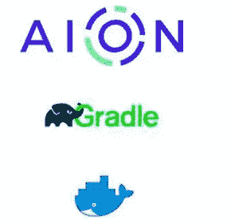

# 在非 Ubuntu 操作系统上为 AION 编译 Solidity Smart 契约

> 原文：<https://medium.com/coinmonks/compile-solidity-smart-contract-for-aion-on-a-non-ubuntu-os-8aa5dba21dd8?source=collection_archive---------7----------------------->

AION 区块链节点目前仅在 Ubuntu 16.04 或更高版本上受支持。



因此，如果您是智能合约开发人员，并且使用其他操作系统，如 Mac OS、Windows 或其他 Linux 版本，您必须使用 web3 或 Java RPC 调用进行智能合约编译。

另一个选择是，泰坦套件 IDE【https://titan-suite.com/】[(T3)，它提供了一个基于浏览器的编辑器。这是一个 nodeJS 应用程序，您需要提供一个指向 AION 内核的 web3 rpc 端点。](https://titan-suite.com/)

但是，如果您喜欢在不受支持的平台上从命令行编译您的智能合约，并且不连接到 AION 内核，有一种方法可以做到这一点。

你可以使用 docker image 来实现。我用 Ubuntu 16.04 和 aion fastvm (0.3.1) + solidity 创建了一个轻量级 docker 映像。
让我来解释一下怎么做。

**先决条件:**
>安装 Docker 引擎
>启动 Docker 守护进程。

**步骤:(一次流程)**

>从 docker Hub 获取 AION fastvm 和 solidity 编译器所需的 Docker 映像。

```
$> docker pull satran004/aion-fastvm:0.3.1
```

>为 docker 命令创建一个别名，该命令将用于编译 solidity 源代码。所以你不需要在将来输入一个很长的命令。

```
$> alias solc='docker run --rm -v "$(pwd):/src" satran004/aion-fastvm:0.3.1 solc'
```

***注:*** *我在 Mac 和 Linux 上测试过这个。但是 windows 测试仍然悬而未决，因为我现在没有 Windows 系统的机器。但是对于 windows，您可能需要对上面用于 windows 环境的命令中的“${pwd}”做一个小的更改。将它替换为 windows 等效路径或工作文件夹的绝对路径。*

现在有趣的部分:)

>转到合同源文件文件夹，尝试像使用标准 solc 命令一样编译合同源文件。

```
$> solc --abi --bin -o <output_path> <solidity_file>
```

**例如:**

```
$> solc --abi --bin -o .  Math.sol
```

***注意:*** *源文件可以存在于你工作目录下的一个嵌套文件夹中。在这种情况下，您需要传递源文件的相对路径。此外，输出目录应该是工作目录中的嵌套目录。*

这是一个可用于测试的样本可靠性契约的源代码。(数学求解)

```
pragma solidity ^0.4.10;

contract Math {

    function sum(uint n) returns (uint) {
        uint s = 0;
        for (uint i = 1; i <= n; i++) {
            s += i;
        }
        return s;
    }
}
```

如果您尝试编译没有" **-o"** 选项的文件，编译输出将直接打印在控制台中。

```
$> solc --abi --bin Math.sol**Output :**$> ======= Math.sol:Math =======
Binary: 
605060405234156100105760006000fd5b610015565b60cb806100236000396000f30060506040526000356c01000000000000000000000000900463ffffffff16806357a7744b14603157602b565b60006000fd5b3415603c5760006000fd5b605060048080359060100190919050506066565b6040518082815260100191505060405180910390f35b60006000600060009150600190505b8381111515609157808201915081505b80806001019150506075565b8192506098565b50509190505600a165627a7a72305820c77f0903a9175d19c703e8dcc1c546a9db9bea00b647bb07ea4b867d298018f00029
Contract JSON ABI 
[{"constant":false,"inputs":[{"name":"n","type":"uint128"}],"name":"sum","outputs":[{"name":"","type":"uint128"}],"payable":false,"type":"function"}]
```

# 那么下一步是什么？

Java 开发人员大多依赖 IDE (Intellij，Eclipse 等)。)并构建像 Maven、Gradle 这样的开发工具。这些工具为 java 开发生态系统提供了巨大的开发者体验和价值。

那么，为什么不使用这些经过验证的工具，尝试在 java 开发和 solidity 契约开发之间架起一座桥梁呢？因此，如果你像我一样是企业 java 背景的开发人员，你会对熟悉的工具感到如鱼得水。

我刚刚开始开发一个 [**Gradle**](https://gradle.org/) 插件，它可以自动完成上述所有步骤。唯一的先决条件是 docker 安装。

所以这里的想法是支持一个类似于 maven 约定的项目结构。并使用 Gradle 作为基于智能合同的项目的构建工具。

```
- project_folder
  - src
      - main
          - solidity
               - Math.sol
               - Mycontract.sol
      - test build.gradle
   ... 
```

gradle 插件将支持类似于 **compileJava** 的 **compileSolidity** 等任务。额外的任务，如创建一个发行版，并将其推送到像 nexus 这样的存储库，也可以通过使用一些现有的插件来实现。这可以在以后通过像 Jenkins 这样的 CI / CD 工具进行扩展。

我们还需要探索是否可以提供一个测试/沙盒环境(区块链的精简版本或仅 fastvm 环境)，该环境可用于以可预测和最快的方式在开发人员工作站上测试智能合同。我确信那也是可能的。所以我会继续在插件中寻找支持的方法。类似以太坊生态系统使用的 [Tuffle](https://truffleframework.com/) 中的 Ganache。

因此，请继续关注这个空间，获取更多更新。用于智能合同编译的 Gradle 插件的初始版本应该很快就会出来。

*资源:*

https://github.com/satran004/aion-fastvm-docker

> [直接在您的收件箱中获得最佳软件交易](https://coincodecap.com/?utm_source=coinmonks)

[](https://coincodecap.com/?utm_source=coinmonks)