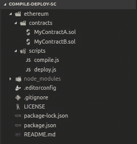

# 用纯 JavaScript 编译和部署以太坊智能合约。

> 原文：<https://medium.com/coinmonks/compiling-and-deploying-ethereum-smart-contracts-with-pure-javascript-4bee3bfe99bb?source=collection_archive---------0----------------------->


以太坊智能合约的发展在 2018 年呈指数级增长，2019 年似乎也将遵循这一趋势。有一些框架，如 [Truffle](https://truffleframework.com/truffle) ，在构建和维护我们的智能合约的过程中帮助我们，但是如果您喜欢动手，我将解释如何编译您的智能合约，并使用您自己的脚本将其部署到以太坊网络(Rinkeby、Ropsten 或 Mainnet)。

*注意:我将使用简单的智能合约，因为这篇文章的目的只是展示如何编译和部署脚本。*

## 之前的步骤

如果你卡住了，完整的代码可以在这个 [Github repo](https://github.com/daniellara/compile-deploy-SC) 中找到。

该项目的结构如下:



Project structure

文件夹`Contracts` 包含我们的合同(您可以根据需要拥有任意多的合同)。在这篇文章中，我们将使用两个简单的契约:


MyContractA.sol


MyContractB.sol

如您所见，我们有两个文件，其中一个包含两个合同，证明我们可以拥有任意多的合同。

## 编译脚本

现在，一旦我们有了最初的项目结构和合同，是时候开始构建编译脚本了。

该脚本的目的是为每个契约生成一个 JSON(在本例中，我们将使用三个 JSON 来完成编译过程)，每个 JSON 都包含已编译的契约信息。这些 JSON 将存储在一个名为`build/`的输出路径中

构建脚本的步骤如下:

1.  创建`build/`目录。
2.  找到我们合同的来源。
3.  编译合同并将输出写入文件。

**步骤 1 -创建** `**build/**` **文件夹。这一步是最简单的，因为我们只需要知道一些 JavaScript 的基础知识(这里不需要以太坊的概念)。**

**步骤 2 -获取合同来源** 现在是时候获取合同文件夹中所有文件的来源了。在这一步中，就像在第一步中一样，不需要以太坊的概念，只需要 JavaScript，但是它稍微复杂一点(不用担心；)).

对于我们的`contracts`文件夹中的每个文件，我们在`sources`对象中添加一个新字段(我们将在第三步中看到这个`sources`的用途)，其中键是文件名，值是`.sol`文件的内容。

**步骤 3 -编译并编写输出** 现在我们已经有了输出文件夹和合同的内容，是时候编译它们了(是的！最后以太坊部分出现)。

首先，我们必须定义一个对象，作为 Solidity 编译器的信息输入。

*   我们合同的编程语言是 Solidity，但是你可以选择其他语言(Viper，assembly…)
*   `sources`:我们合同的内容。
*   `settings`:这个选项告诉编译器我们想要生成输出的哪些字段。对于这个例子，我选择为我们在`sources`中的所有文件生成`abi`和`evm.bytecode`。这两条信息在部署阶段是必需的。

一旦我们有了编译器的配置对象，我们就可以执行它了。

第一行获取一个包含我们编译的脚本的对象。两级的`for`循环允许我们将单个`.sol`文件中的合同存储在不同的 JSON 文件中(就像我们的例子中的 MyContractA.sol)。

最后一步应该是把这三部分粘在一起

至此，我们已经完成了编译脚本。如果我们运行它，项目结构应该如下所示:


我们忽略了`build`文件夹，因为在 Git 下跟踪它没有意义。

现在我们已经完成了合同，是时候将它们部署到区块链了。

*点击* [*这里*](https://solidity.readthedocs.io/en/v0.5.3/using-the-compiler.html) *如果你想了解更多关于编译器的信息。*

## **部署脚本**

是时候将我们的合同部署到以太坊区块链了(在这种情况下，部署将针对 Rinkeby，因此不会花费任何真正的以太，但该过程与其他以太坊区块链类似)。

首先，我们需要两样东西来将合同部署到区块链:

*   一个解锁帐户:由于我们需要花费天然气发送交易，将创建智能合同。
*   连接到区块链的节点:我们正在向网络发送交易，因此我们需要连接到它的东西。

首先，我们将使用 [HDWalletProvider](https://github.com/trufflesuite/truffle-hdwallet-provider) ，这个工具(感谢 Truffle:)允许我们使用一个十二字助记短语解锁账户，并连接到以太坊节点(uoh！这似乎是我们在第二点中需要的)。但是…那个节点在哪里？我们可以做两件事，运行我们自己的以太坊节点(这是我不推荐的事情，至少对于为 hobbie 开发 dApps 来说)或者使用 [Infura](https://infura.io/) 。Infura 是一项服务，允许我们连接到以太坊网络，而无需运行自己的以太坊节点。那么，看起来我们已经讨论了我们的两点。

*注意:在其他帖子中，我将介绍 Rinkeby testnet 的帐户创建。但是，现在，让我们继续假设我们在 Rinkeby 至少有一个帐户。*

**解锁账户，连接节点。** 使用 Infura 我们需要在它的页面注册。它将生成一个 API 密钥，我们需要使用它的服务(它是完全免费的)

我们将使用 [Web3JS](https://web3js.readthedocs.io/en/1.0/) 与区块链进行交互。Web3 需要一个提供者来连接节点并与之交互。耶！你是对的！这个提供者是 HDWalletProvider，所以让我们配置它和 Web3。

HDWalletProvider 的第一个参数是我们的十二个单词助记短语。这个短语允许提供者解锁帐户(默认情况下，它解锁多个帐户，但我们现在只需要第一个)，第二个参数告诉提供者以太坊节点在哪里，在这个例子中，我们通过 Infura 连接(如果您使用自己的节点，它应该类似于 ws://localhost:4535 或您的节点在哪里)。

最后，我们在 web3 中设置提供者。

正确配置 web3 后，我们最终可以部署契约了。

首先，我们需要编译好的脚本(我们只部署一个，但是其他的过程是一样的，或者你可以构建一些逻辑来一个接一个地编译和部署所有的脚本)。

然后，在第 8 行中，我们使用 web3 API 创建了我们的契约，并将契约的接口传递给它。接下来，我们需要用合同信息创建一个部署事务:

*   `data`:合同的字节码。它以 0x 开头，表示是十六进制的。
*   `arguments`:我们契约构造函数的参数(如果构造函数没有参数就不需要)。

交易创建后，我们会将其发送到以太坊区块链，以便为节点进行处理:

*   `from`:签署交易并发送交易的账户。在第 4 行中，我们得到了 HDWalletProvider 生成并解锁的帐户和十二个单词短语。
*   `gas`:我们发送交易要花费的最大 gas 量。

第 18 行的 console.log 对于获取已经部署了契约的地址非常重要，这样我们就可以在将来将它用于我们的 dApp，供其他契约使用，等等。

脚本的最后一行告诉提供者结束与以太坊节点的连接。

如果我们执行该脚本，过一会儿，我们将获得如下所示的跟踪:

```
Contract deployed at address: 0x64d30b804BC706dd54FF899127e39C687706ae4D
```

现在我们可以去 [EtherScan](https://rinkeby.etherscan.io/address/0x64d30b804BC706dd54FF899127e39C687706ae4D) 查看我们在区块链中部署的合同。

最后，我们部署了合同，每个人都可以访问。我希望这篇文章有所帮助。

***你喜欢你读到的东西吗？点击心形按钮推荐这篇文章，这样其他人就可以看到了！***

> 加入 Coinmonks [电报频道](https://t.me/coincodecap)和 [Youtube 频道](https://www.youtube.com/c/coinmonks/videos)获取每日[加密新闻](http://coincodecap.com/)

## 另外，阅读

*   [复制交易](/coinmonks/top-10-crypto-copy-trading-platforms-for-beginners-d0c37c7d698c) | [加密税务软件](/coinmonks/crypto-tax-software-ed4b4810e338)
*   [网格交易](https://coincodecap.com/grid-trading) | [加密硬件钱包](/coinmonks/the-best-cryptocurrency-hardware-wallets-of-2020-e28b1c124069)
*   [密码电报信号](http://Top 4 Telegram Channels for Crypto Traders) | [密码交易机器人](/coinmonks/crypto-trading-bot-c2ffce8acb2a)
*   [币安交易机器人](/coinmonks/binance-trading-bots-d0d57bb62c4c) | [OKEx 评论](/coinmonks/okex-review-6b369304110f) | [阿塔尼评论](https://coincodecap.com/atani-review)
*   [最佳加密交易信号电报](/coinmonks/best-crypto-signals-telegram-5785cdbc4b2b) | [MoonXBT 评论](/coinmonks/moonxbt-review-6e4ab26d037)
*   如何在 Bitbns 上购买柴犬(SHIB)币？ | [买弗洛基](https://coincodecap.com/buy-floki-inu-token)
*   [CoinFLEX 评论](https://coincodecap.com/coinflex-review) | [AEX 交易所评论](https://coincodecap.com/aex-exchange-review) | [UPbit 评论](https://coincodecap.com/upbit-review)
*   [十大最佳加密货币博客](https://coincodecap.com/best-cryptocurrency-blogs) | [YouHodler 评论](https://coincodecap.com/youhodler-review)
*   [最佳加密交易所](/coinmonks/crypto-exchange-dd2f9d6f3769) | [印度最佳加密交易所](/coinmonks/bitcoin-exchange-in-india-7f1fe79715c9)
*   [开发人员的最佳加密 API](/coinmonks/best-crypto-apis-for-developers-5efe3a597a9f)
*   最佳[密码借贷平台](/coinmonks/top-5-crypto-lending-platforms-in-2020-that-you-need-to-know-a1b675cec3fa)
*   [免费加密信号](/coinmonks/free-crypto-signals-48b25e61a8da) | [加密交易机器人](/coinmonks/crypto-trading-bot-c2ffce8acb2a)
*   杠杆代币的终极指南