# 在以太坊开发、Ropsten 和 MainNet #HowToBUIDL (3/n)上部署智能合同

> 原文：<https://medium.com/coinmonks/complete-walkthrough-deploy-a-smart-contract-to-development-ropsten-and-mainnet-howtobuidl-a7d1a89fa75a?source=collection_archive---------0----------------------->

## #BUIDL::如何在没有完整节点的情况下部署 SmartContracts。

> 当人们开始智能合约开发时，有一种倾向是掩盖如何将他们正在玩的示例代码实际部署到公共区块链。这是软件开发的关键部分，理解这一点很重要。毕竟，一个永远得不到观众的聪明的契约有什么好处呢？在我们开始宣传它的存在之前，我们应该确保座位和场地的存在！该部署了。

我们将引用我们在# HowToBUIDL 系列的上一篇文章中开始的`ComeOneComeAll`项目中的同一个`GreatestShow`契约，标题为[‘您的第一个智能契约’](/coinmonks/howtobuidl-2ofn-come-one-come-all-8a3e0ee706b1)，因此如果您还没有自己构建它，请在继续之前获取一个[示例项目](https://github.com/emmonspired/ComeOneComeAll)的副本。

> [发现并回顾最佳区块链软件](https://coincodecap.com)


到目前为止，我们已经建立了我们的`GreatestShow`智能合同，但是我们甚至还没有在本地运行它。我们先这样做一会儿。在项目的基础上打开一个控制台窗口，运行一个区块链模拟器，名为`testrpc`。TestRPC

> **testrpc** 是一个基于 Node.js 的以太坊客户端，用于测试和开发。它使用 ethereumjs 来模拟完整的客户端行为，并使开发以太坊应用程序变得更快。它还包括所有流行的 RPC 功能和特性(如事件)，并且可以确定性地运行，使开发变得轻而易举。

确保您已经在命令行上安装了 testrpc。

```
npm install -g ethereumjs-testrpc
```

然后，启动一个`testrpc`实例，这是在*模拟*采矿时运行符合以太坊*协议*的测试区块链的好方法，因此进行函数调用和提交事务是快速而高效的。帐户可以重复使用和重置。不用于生产，但肯定用于开发&测试阶段。

```
testrpc -m “warrior minimum breeze raven garden express solar flavor obvious twenty alpha actress”
```

以`-m`标志开始`testrpc`允许你指定一个 12 个字的助记符，该程序生成的所有账户将使用该助记符作为创建*私钥*和账户*地址*的种子。这是一个我们现在将跳过的细节，但是不，每次开始使用相同的助记符允许我们确定性地知道将创建什么帐户。一旦这个过程开始运行，我们就会知道，因为我们将得到类似于 10 个可用帐户及其私钥列表的输出。

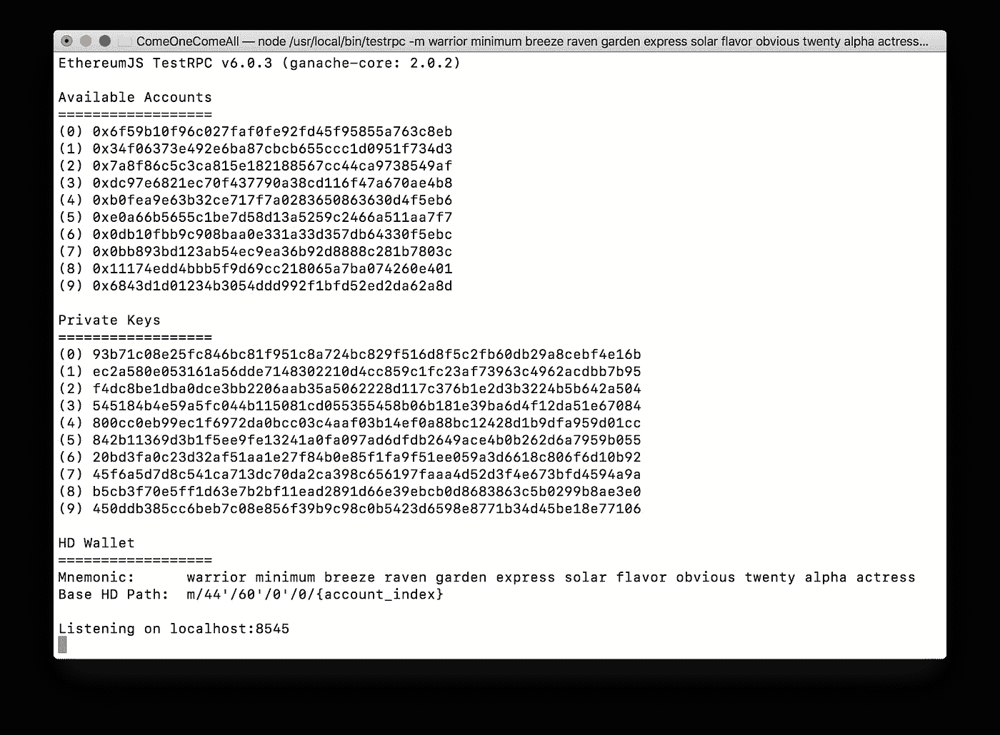

现在我们已经有一个模拟的区块链在本地主机的端口 8545 上运行，客户端可以连接到它。我们的第一个客户将是作为`truffle`框架一部分的`truffle console`。继续，打开一个新的标签，并启动控制台。

`truffle console`

你会被提示一个可怕的错误。别担心。

```
No network available. Use `truffle develop` or add network to truffle.js config.
```

不要像消息建议的那样使用`truffle develop`,因为我们需要完成这一步，以便在将来继续连接其他网络。这是了解如何连接到其他网络的必要步骤。

打开你的编辑器(我用的是 sublime，所以我可以在提示符下输入`subl .`。在配置的根目录下打开一个名为`truffle.js`的文件。让我们定义三种不同的网络:`development`、`ropsten`和`mainnet`。稍后我们将为 ropsten 和 mainnet 填充细节。现在让我们用`development`开始吧。我喜欢让`gas`限制尽可能接近`ropsten`测试网络，但这只是个人偏好，也有一些实际目的。我可以保证我的合同从来没有要求测试网络的限制，这在这个时候低于`mainnet`。保持在这个限度之内，你也是生产的黄金。

```
let ropstenProvider, mainNetProvider;module.exports = {
  networks: {
    development: { host: "localhost", port: 8545, 
                   network_id: "*", gas: 4465030 },    
    ropsten: { provider: ropstenProvider, 
                   network_id: "3", gas: 4465030 },
    mainnet: { provider: mainNetProvider, 
                   network_id: "1", gas: 7500000 }
  }
};
```

请务必保存您的文件，然后让我们回到控制台。这一次键入`truffle console`将连接到您的本地`testrpc`，输出中将出现几行，在那里读入版本和帐户。

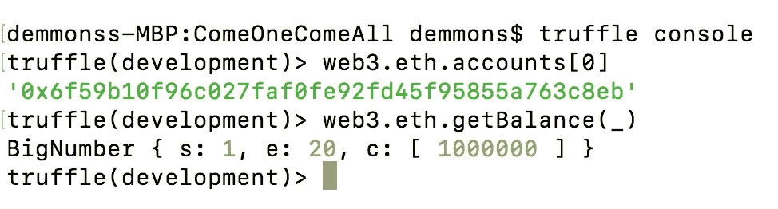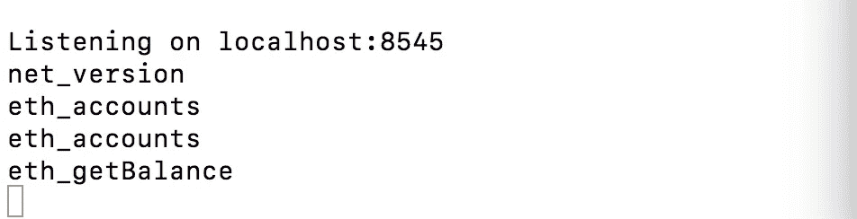

web3.js 库中的函数和属性在控制台中可用。在`testrpc`窗口中，记录了所有与本地主机网络的交互。我们可以看到它配置正确。

让我们找点乐子。将`GreatestShow`合同部署到`development`网络的时间到了。这只是我们的本地机器，但无论如何是时候获得一些使用合同的经验了。在`truffle console:`


The first time we’re deploying our `**GreatestShow**` contract is to a very tiny audience: ourselves.

```
GreatestShow.new("PT Barnum")
```

您将在屏幕上看到大量的输出，基本上只是在您的`development`环境中创建的对象的 JSON 文本表示。请注意，`Transaction`实际上发生了，将您的代码部署到本地区块链。现在，在日志中显示的地址创建了一个您的`GreatestShow`智能契约的实例。注意，相同的`address`和`transactionHash`出现在您的 JSON 对象中。

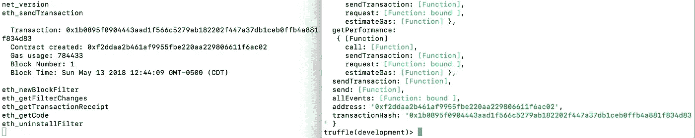

On the left, you’ll see a series of RPC logs that transpired as a result of creating the new GreatestShow contract, including a Transaction hash.

使用这个地址，我们可以获得对刚刚创建的契约的引用。一旦我们有了一个引用，我们就可以开始使用它，调用函数并查看它与区块链的交互:

```
show = GreatestShow.at('0xf2ddaa2b461af9955fbe220aa229806611f6ac02')
show.setAvailableSeats( 125 );
show.getAvailableSeats();
```

不言自明。我们设置了 125 个座位，并检查了数据。
在我们的契约中改变数据的行为产生了一个新的`transaction`！
**理解这一点很重要。**对 ***状态*** 的任何改变都将要求一个有效的事务转移到一个新的状态。在真实的区块链中，在将新状态存储在区块链上之前，节点将通过代码的执行和验证来实现**。**

> **以太坊状态转换功能:`*APPLY(S,TX) -> S'*`**

**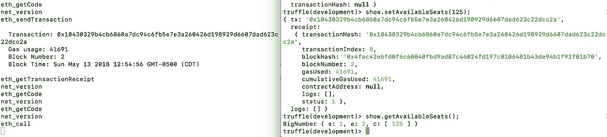**

**Example of an Ethereum state transition. Calling a function that changes state requires a valid Transaction to be mined.**

**在本教程中，我们不会对我们的`GreatestShow`智能契约的每个函数进行调用，但是您可以通过在变量名后点击`<tab>`键，然后点号来自行探索。因为我们将引用命名为`show`，所以它将是`show.<tab>`，控制台将帮助提示您契约上可用的属性和功能。请注意，`show.ringMaster`引用了一个*公共视图函数*，它不会*改变*状态，*因此用`show.ringMaster.call()`调用它*不*需要`Transaction`。**

**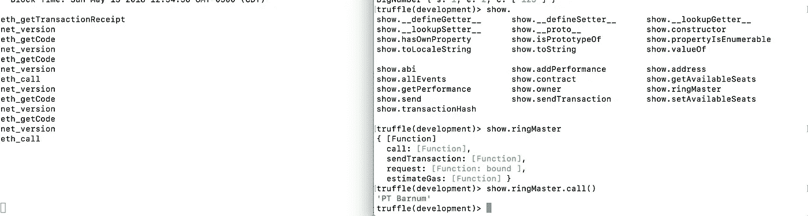**

**现在，让我们通过点击`ctrl-c`来终止`truffle console`进程。再次启动它。请注意，由于契约的状态存储在我们唯一的节点中，并且该节点已经死亡，在没有旧区块链的任何上下文的情况下启动它将意味着我们失去对本地契约的引用。这就是为什么`development`和`testrpc`对于快速的一次性测试和*单元测试*(我们将在以后的文章中讨论)这样的小目的是有用的。请注意，当我们试图重新获取杀死`testrpc`之前创建的合同的引用时，它不再可用。我们必须重新创建并重新部署它。**

**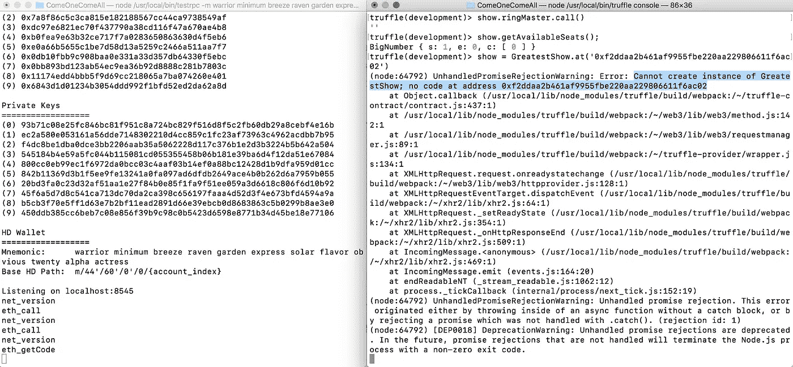**

**如果我们把代码留给我们自己和我们自己的机器，我们可以看到它，但其他人看不到。为了我们自己的眼睛和享受在当地部署不是我答应你的。差远了。**

****

**It’s empty and dark in our private Blockchain. Let’s deploy somewhere the rest of the world can see it.**

**对于跨越多人的开发团队的测试，或者对于必须持续很多天的状态，一个可用的选择是使用真实的、持久的区块链。你可以通过点燃`geth`来启动你自己的私人以太坊区块链，也可以启动几个矿工，但这会让你陷入其他问题，比如服务器基础设施成本，并且需要你开始考虑谁来负责维护。不知不觉中，现在您不再担心您的核心业务，也不再在核心产品或服务之外的事情上浪费大量时间。**

**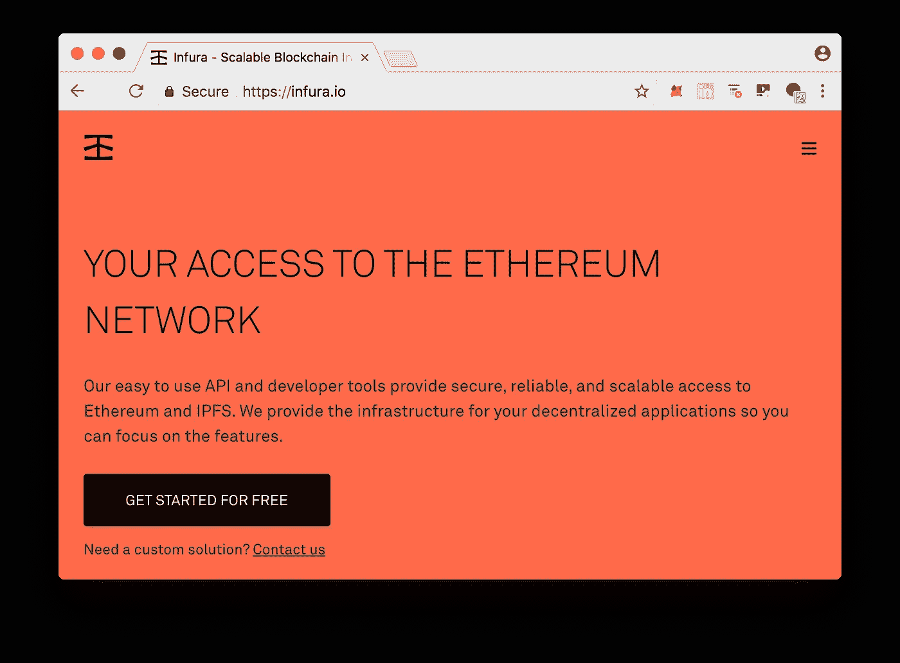**

**Infura.io provides a way to connect to the popular Ethereum networks for *FREE***

**如果我告诉你有一种方法可以免费连接和部署到以太坊`ropsten`和`mainnet`会怎么样？您不必担心自己的运行节点，也不必担心维护或停机，您可以专注于您的`GreatestShow`？有。**

> **进入 **infura.io.** 点击“免费开始”&输入信息。你会得到一个 API 密匙。**

**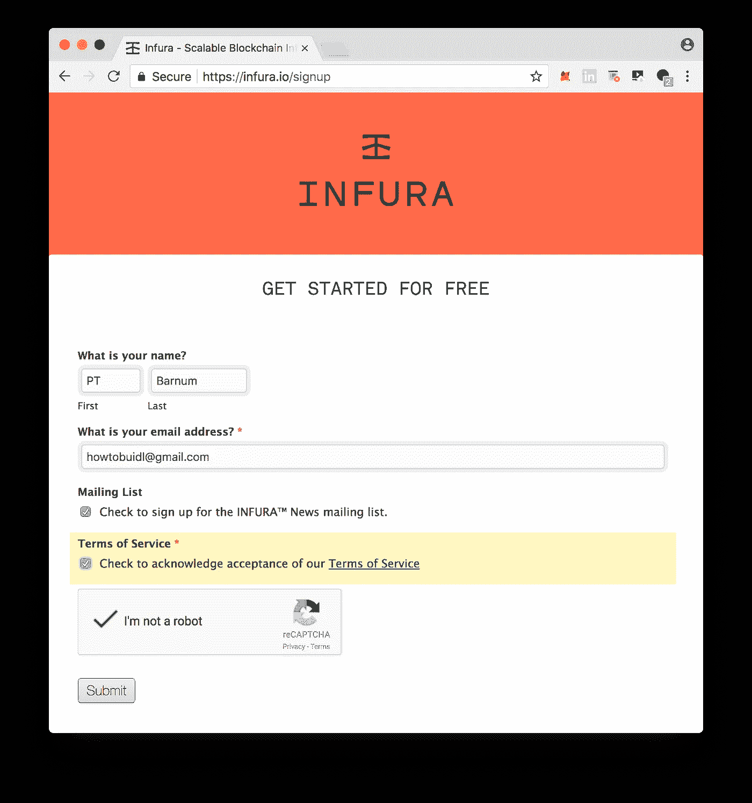**

**Step 1: Fill Out Your Information to Request API Access**

**邮件列表是可选的，但是可以让您了解来自 Infura 的最新消息。需要同意服务条款，但是协议中的法律术语相当标准。您同意使用一项无需您自己的硬件即可将您连接到以太坊网络的服务。您同意不以恶意方式使用服务。如果你问我的话，我认为免费使用这款产品的条款非常公平，风险/回报也不对称。**

**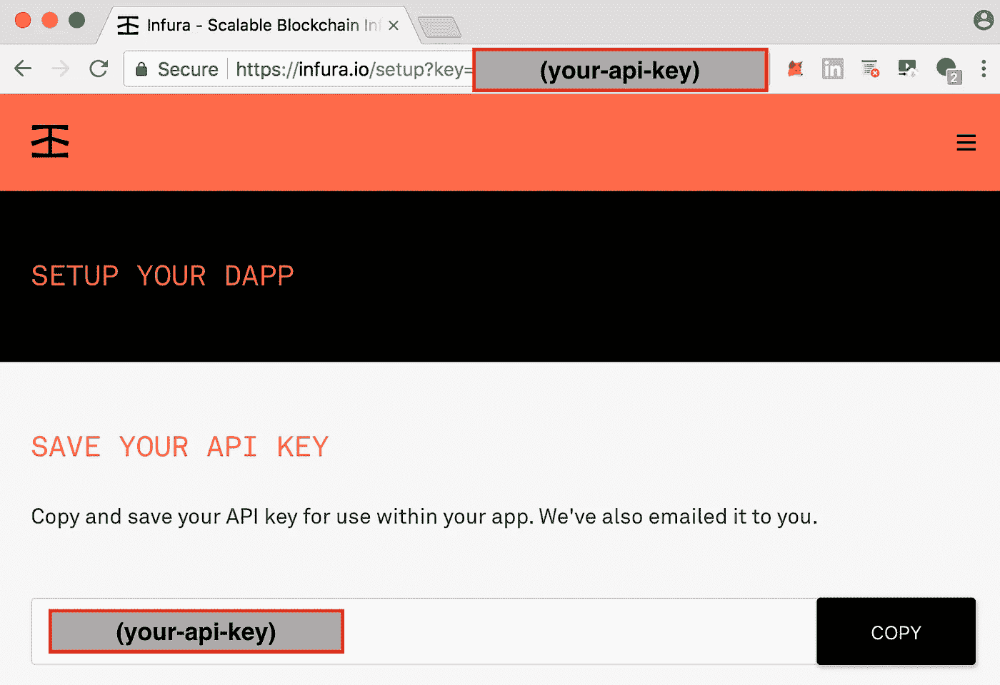**

**Step 2: Copy and Secure your API Key Safely**

**记下(your-api-key ),它将是一串随机的字母和数字。一定要保密。您的 API 密钥与您的帐户相关联，它用于将您的应用程序与各种测试网络和 MainNet 连接起来。请安全存放。**

**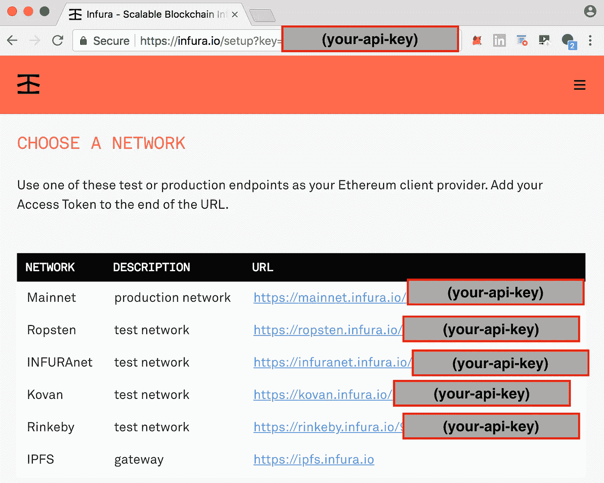**

**Step 3: Scroll down and make note of the URLs followed by your API Key**

**当你向下滚动时，你会注意到无论你使用的是`mainnet`还是像`ropsten`或`rinkeby`这样的测试网络，你都会在 url 后面加上`/`和`your-api-key`。这就是我们注册所要做的一切。现在让我们配置我们的`truffle.js`文件来使用这个键。**

****

**Let’s prepare the project for it’s first launch onto the Ropsten test network.**

## **让我们为部署准备最棒的表演**

**因为我们想让 privateKey 和 Infura.io API key 这样的东西保密，所以让我们在项目的根目录下创建一个`secrets.js`文件。**为了举例，我使用了一个众所周知的私有密钥，但是不要在生产中使用相同的密钥。你的数据和钱会被偷。****

```
**var infuraKey = "<your-infura-key>";
var accountPK = "**7879d28218d7b2339ec492a6f6ba73c0ea9544080703c4823c9d85b54d165d54**";
var mainnetPK = accountPK;
var ropstenPK = accountPK;module.exports = {infuraKey: infuraKey, mainnetPK: mainnetPK, ropstenPK:ropstenPK};**
```

**我们将数据从`secrets.js`中分离出来，因为它们将存储在我们的计算机上，而不是 github 项目中。向您的`.gitignore`文件添加一个条目，这样我们就不会意外地将它签入到您的开源项目中。**

```
**secrets.js**
```

**我们将不得不安装一些依赖项来完成这项工作。**

```
**npm install --save-dev truffle-wallet-provider**
```

**现在回到`truffle.js`,我们需要写一些引入这些变量的东西。这将充实我们用全球公认的 network _ id“3”和`mainnet`(network _ id:“1”)连接到`ropsten`所需的一切。**

```
**let secrets = require('./secrets');
const WalletProvider = require("truffle-wallet-provider");
const Wallet = require('ethereumjs-wallet');let mainNetPrivateKey = new Buffer(secrets.mainnetPK, "hex");
let mainNetWallet = Wallet.fromPrivateKey(mainNetPrivateKey);
let mainNetProvider = new WalletProvider(mainNetWallet, "[https://mainnet.infura.io/](https://mainnet.infura.io/)");let ropstenPrivateKey = new Buffer(secrets.ropstenPK, "hex");
let ropstenWallet = Wallet.fromPrivateKey(ropstenPrivateKey);
let ropstenProvider = new WalletProvider(ropstenWallet,  "[https://ropsten.infura.io/](https://ropsten.infura.io/)");module.exports = {
  networks: {
    development: { host: "localhost", port: 8545, 
                   network_id: "*", gas: 4465030 },    
    ropsten: { provider: ropstenProvider, 
                   network_id: "3", gas: 4465030 },
    live: { provider: mainNetProvider, 
                   network_id: "1", gas: 7500000 }
  }
};**
```

****

**Everything is in place. We’re ready for the GreatestShow**

## ****部署合同到底意味着什么？****

**部署一个契约，在表面下，会从某个特定的地址向以太网*发送一个*签名的* `Transaction`。*外部拥有的账户(EOA)* 的所有者控制着*私钥*，该私钥能够花费以太网以便执行网络所请求的操作。一个*函数*调用内的每个操作都需要*气体*才能被处理。在要部署的事务中发送的*数据*包含所有已经编译成汇编的代码，供*以太坊虚拟机(EVM)* 存储。部署之后，所有存储的数据都将可用于将来通过`function`调用进行的`Transaction`状态更改。由于在交易中没有指定的*到* 地址，网络会将这种特定类型的*交易*识别为将*数据*作为以太坊智能合约存储在具有新地址的新生成的*合约账户*中的请求。甚至*部署*的行为也涉及与请求相关的交易*成本*和*气体*费用。本质上，我们需要将一些 ***乙醚*** 存入我们的账户，我们知道*私钥*的用途，这样我们的 EOA 就可以花掉它。***

*您将需要知道您的**公共地址**(不是您的*私有密钥)*以便进行下一步。如果您知道您的私钥，那么您很可能也已经知道了您的公共地址。但是如果您不知道，您可以使用几个工具来查找您的公钥。这里有一个方法。从控制台:*

```
*npm install --save-dev bluebirdtruffle console --network ropsten*
```

*我们安装了一个方便的 javascript 库，让我们可以轻松地异步创建对象上的方法版本，并兼容在控制台中调用。
我们要加载`bluebird`库，利用它找到我们对应的以太坊账号地址。记下来。在下面的示例中，它将是 0x2a 578 cbcc 561 AE 8 b 13 cccb 0c 1212 a 2262 EAA 610*

```
*Promisify = require("bluebird")
Promisify.promisifyAll(web3.eth)
web3.eth.getAccountsAsync()>> [ '**0x2a578cbcc561ae8b13cccb0c1212a2262eaa61e0**' ]*
```

## *由于我们不想使用`mainnet`要求的真实货币(乙醚)，我们需要着手在测试网络上获取一些。*

*前往以下网址，这是一个为`ropsten`测试网络提供“免费”乙醚的*龙头*。这个以太网没有实际的货币价值，因为谁拥有`ropsten`网络上的每个以太网的记录存储在与`mainnet`完全分开的区块链网络上。当人们谈论 ETH/USD 的价格或乙醚的美元价值时，他们指的是存储在`mainnet`上的乙醚，而不是任何其他测试网络。*

```
*[http://faucet.ropsten.be:3001/](http://faucet.ropsten.be:3001/)*
```

*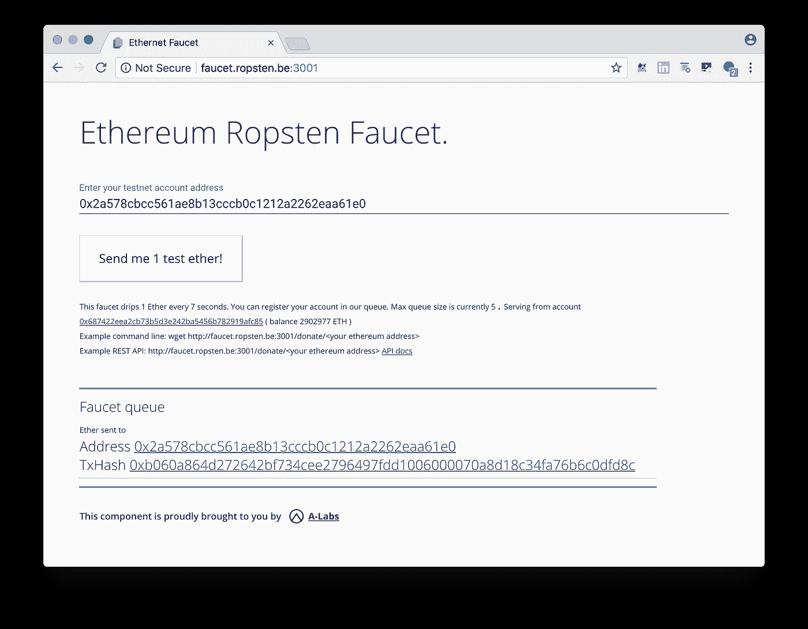*

*点击*“给我发送 1 个测试以太网”*，等待交易处理。然后单击 TxHash 并验证它是否通过。你也可以直接前往`ropsten.etherscan.io`，输入你的账户地址，查看最近的交易，并验证`Transaction`是否已处理*

*本帖描述的`Transaction`可以在这里查看。
[https://ropsten . ethers can . io/tx/0xb 060 a 864d 272642 BF 734 CEE 2796497 FDD 1006000070 a 8d 18 c 34 fa 76 b 6 c 0 DFD 8 c](https://ropsten.etherscan.io/tx/0xb060a864d272642bf734cee2796497fdd1006000070a8d18c34fa76b6c0dfd8c)*

## *女士们先生们，这是你们期待已久的时刻*

*是时候在`ropsten`上尝试一切了。如此之近，你几乎可以尝到它！*

**

*我们就要完成了。`truffle framework`提供`migration`步骤来协助部署。惯例是在`./migrations`文件夹中的每个步骤前面加上它的步骤，所以我们将创建一个`2_deploy_greatest_show.js`文件，以便使用`deployer`对象的`deploy`方法。完整的文件如下所示。我们需要藏物并部署。真的只有一句台词有魔力。`deployer.deploy(...)`*

```
*const GreatestShow = artifacts.require("./GreatestShow.sol");module.exports = (deployer, network, accounts) => { let deployAddress = accounts[0]; // by convention console.log('Preparing for deployment of GreatestShow...');

    if( network == "mainnet" ) {            
        throw "Halt. Sanity check. Not ready for deployment to mainnet. Manually remove this throw and try again.";
    } console.log('deploying from:' + deployAddress);

    **deployer.deploy(GreatestShow, 
        'Dan Emmons', {from: deployAddress});**};*
```

> *您可能会注意到“mainnet”的 if 检查。这只是一个额外的健全性检查，这样我们就不会意外地部署到真实的网络上，浪费真正的金钱。*

*在命令行中，执行一行来部署到`ropsten`。*

*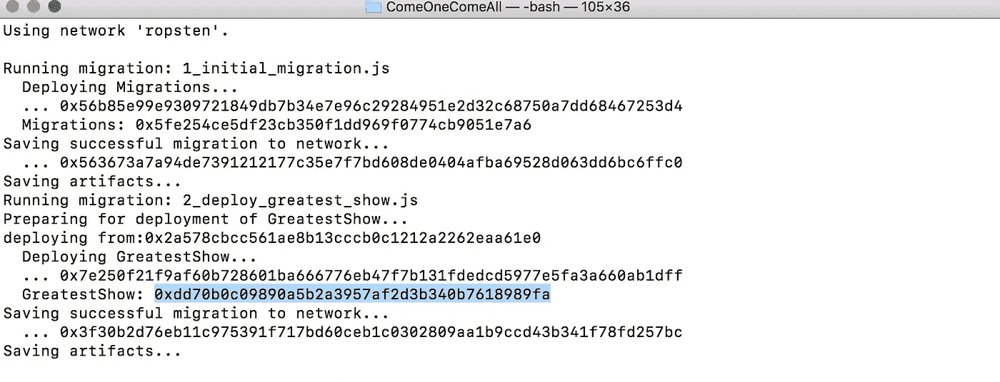*

*GreatestShow contract deployed to **ropsten** address **0xdd70b0c09890a5b2a3957af2d3b340b7618989fa***

*我们可以从`Externally Owned Account` [https://ropsten . ethers can . io/address/0x 2a 578 cbcc 561 AE 8 b 13 cccb 1212 a 2262 EAA 610 e 0](https://ropsten.etherscan.io/address/0x2a578cbcc561ae8b13cccb0c1212a2262eaa61e0)在`Contract Address`[https://ropsten . ethers can . io/address/0x DD 70 b 0c 09890 a5 B2 a 3957 af 2d 3 b 340 b 7618989 fa](https://ropsten.etherscan.io/address/0xdd70b0c09890a5b2a3957af2d3b340b7618989fa)验证该合同是否部署在`ropsten.etherscan.io`
上*

*请注意，`data`部分与`ABI`或`./build/contracts/GreatestShow.json` `byteCode`的应用二进制接口相匹配。*

## *表演时间到了。这就是`GreatestShow`。*

*去以太扫描看看吧。*

*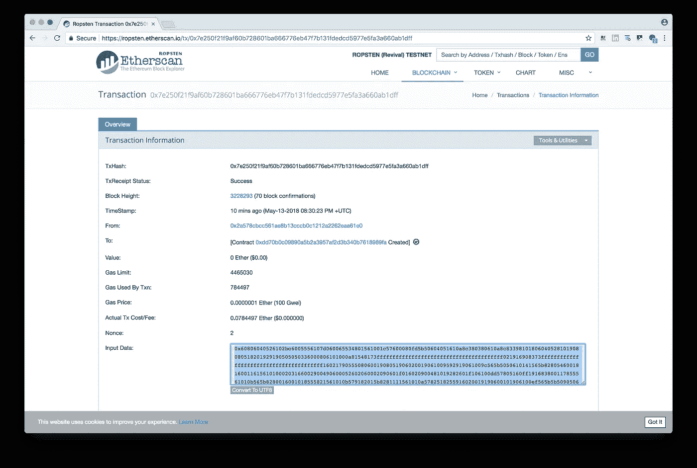*

*我们甚至可以通过控制台与我们的`ropsten`部署契约进行交互。*

```
*truffle console --network ropsten*
```

*当控制台加载时，获取对它的引用并获取`ringMaster`。*

```
*GreatestShow.at("0xdd70b0c09890a5b2a3957af2d3b340b7618989fa")
show = _
show.ringMaster.call()>> 'Dan Emmons'*
```

> *看看能不能加个表演进去。*

```
*show.addPerformance( "Knife Thrower", 2, 0, 0, 0, 180, false );*
```

*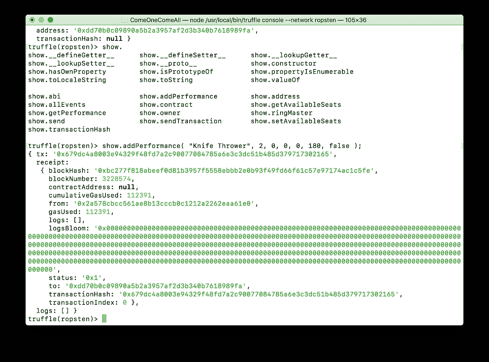*

*我们得到一个包含一个`TransactionHash`的`TransactionReceipt`，我们可以在`ropsten.etherscan.io`上检查它是否成功。[https://ropsten . ethers can . io/tx/0x 679 DC 4a 8003 e 94329 f 48 FD 7 a2 c 90077084785 a 6 E3 C3 DC 51 b 485d 379717302165](https://ropsten.etherscan.io/tx/0x679dc4a8003e94329f48fd7a2c90077084785a6e3c3dc51b485d379717302165)*

*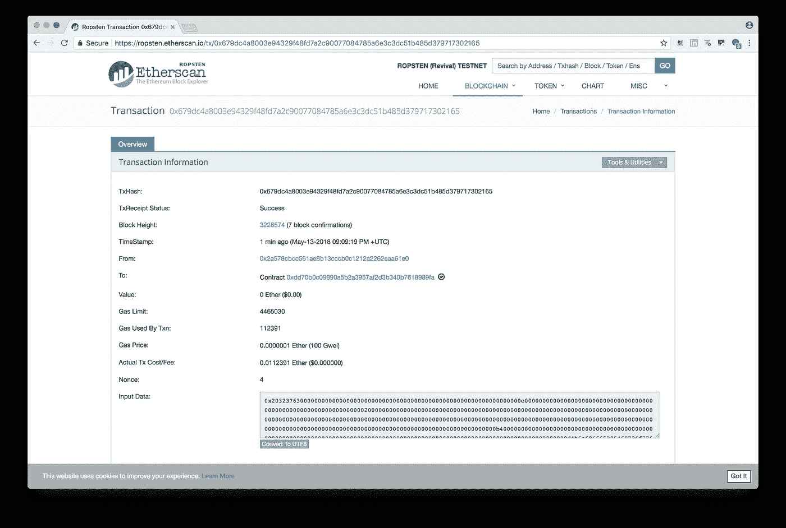*

*Amazing. **ropsten** shows that the **transaction** was successful and the state was modified.*

**

*Our “Knife Thrower” performance has been added to the Ethereum blockchain on **ropsten**.*

****咻。那是许多工作。但是回报是值得的！你现在确切地知道了你需要执行什么步骤来让一切在这个世界上被称为以太坊的计算机上启动和运行。****

*既然你部署了它，没人能阻止它，也没人能审查它。你的智能合约程序将无限期地在区块链上运行，而这个世界已经被永远地改变了。*

## *MainNet 呢？*

*这就是它的美妙之处。您为`ropsten`部署执行的所有相同步骤也将适用于`mainnet`,但是有两个小的不同。首先，您将使用 ***真实以太*** ，这意味着 ***真实货币。*** 这里没有水龙头可以让你获得你需要的乙醚量来部署你的合同给`mainnet`，所以你必须通过不同的方式获得，比如通过`Coinbase.com`或`localbitcoins.com`。您可以在`ropsten`测试网络上玩一玩，随心所欲地重新部署，直到您准备好原始版本的合同，而不会有任何后果。但是当涉及到`mainnet`时，你会想要非常确定你已经准备好将你的代码存储在`mainnet`区块链上`**PERMANENTLY**`。*

*在以后的文章中，我们将讨论在 *部署到* `*mainnet*`之前你想要采取的 ***的其他步骤，比如用`mocha`框架创建一整套单元测试，并获得你的代码的完全独立的`audit`。请记住，您存储在区块链上的数据是`immutable`，因此尽您所能解决所有问题非常重要。****

***最后，当您准备好迎接黄金时间，并且拥有真正的以太时，注释掉** `**2_deploy_greatest_show.js**` **中的健全性检查，以便部署不会失败，并启动它。***

```
*truffle deploy --network mainnet*
```

# *这是最棒的表演！*

**

*This is the Greatest Show!*

**Dan Emmons 是*[*Emmonspired LLC*](http://www.emmonspired.com/)*的所有者，一名* [*认证比特币专业人士*](http://cryptoconsortium.org/lookup/6f0d14) *，认证以太坊开发者，全栈开发者，加密货币项目顾问。他还是一个名为*[*# ByteSizeBlockchain*](https://www.youtube.com/watch?v=SVBZ7mdgGcA)*的 Youtube 频道和 iTunes 播客的创作者。**

*有很多一次性的方法来试验 Remix，这是一个用于 Solidity 的在线 IDE，但是在 Truffle 框架中有一个更专业的工具可供我们使用。*