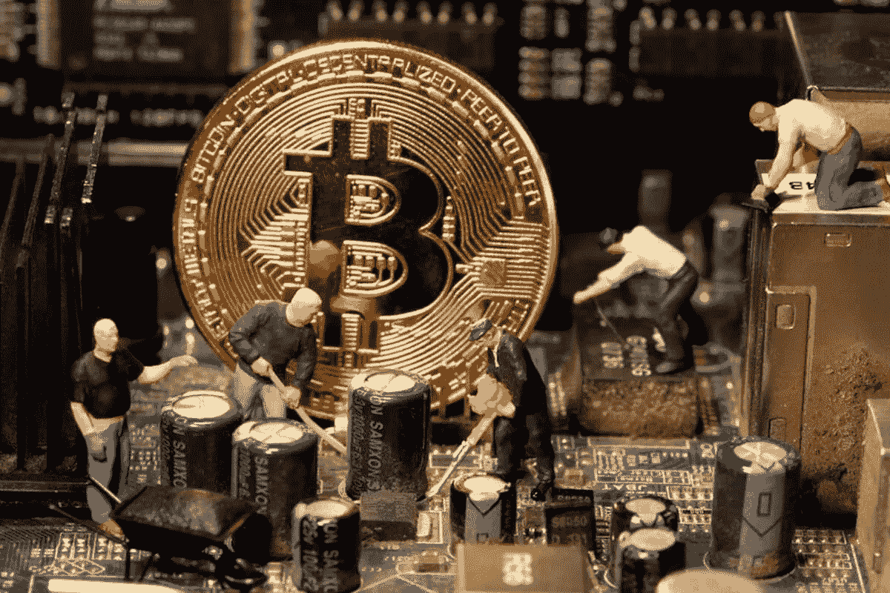
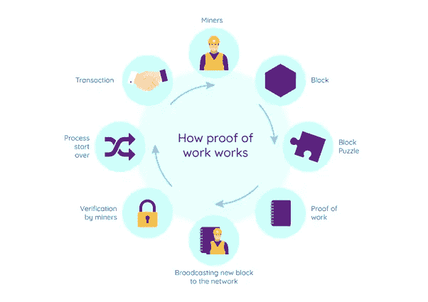
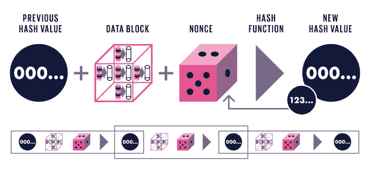

# 比特币挖矿中的复杂难题不再复杂！

> 原文：<https://medium.com/coinmonks/complex-puzzle-in-bitcoin-mining-aint-complex-no-more-9035b25b2a10?source=collection_archive---------2----------------------->

Image : Reuters

在我们开始解读比特币挖掘的复杂性之前，我觉得有必要快速了解以下术语:

**散列**:它是使用算法将任意长度的输入转换成固定大小的字符串或数字的过程

Image : Wikipedia

**工作证明**:是区块链网络中最初的共识算法。该算法用于确认交易并为链创建新的块。在这种算法中，未成年人相互竞争以确认网络上的交易

Image : gitconnected

**随机数**:在密码学中，随机数是一个任意的数字，在加密通信中只能使用一次。它通常是在认证协议中发布的随机或伪随机数，以确保旧的通信不能在重放攻击中被重用。

SHA 256 : SHA-256 是一种获得专利的加密哈希函数，它输出一个 256 位长的值。

**比特币核心**:用于运行管理比特币区块链的计算机/节点的软件。它能够执行下述任务:

1.  与比特币网络中的其他参与者联系
2.  从其他参与者处下载区块链
3.  存储区块链
4.  监听新的事务
5.  验证并存储这些交易
6.  将有效事务转发给其他节点
7.  倾听并验证新数据块
8.  将这些块存储为其区块链的一部分
9.  中继有效块
10.  开采新的区块
11.  管理地址
12.  创建和发送交易记录

**Blocks** : Blocks 只不过是一捆或一批事务，有助于解决事务排序问题。块创建减慢了簿记系统的“数据输入”过程，因此全世界的未成年人/簿记员有更多的时间来同意交易块的排序。因为有更多的时间就块的顺序达成一致，所以关于块排序的意见分歧更少，因此网络范围内达成一致的机会更大。

**在比特币中，平均每 10 分钟就有一个区块被创建。**不同的加密货币有不同的区块创建目标时间。

好吧，现在让我们深入了解比特币的实际工作原理。比特币挖矿不过是一种碰运气的游戏，整个网络都参与其中，创造区块，并获得区块创造的回报。这确保了所有块创建者在下述参数内获得创建块的平等机会:

1.  游戏必须给所有积木创造者平等的获胜机会(积木创造)
2.  游戏不能有捷径
3.  游戏必须有公开显示的证据，以便赢家可以证明他们已经赢了
4.  这个游戏不能作弊

这个碰运气的游戏叫做“工作证明”。每个块创建者获取一组他们知道的、但是没有包含在任何先前的块中的事务，并以特定的格式从它们中构建一个块。然后，创建者从该块的数据中计算出一个加密散列。记住哈希只是一个数字。

比特币的工作证明概率游戏的规则是，**如果块的哈希小于一个目标数，**那么这个块被认为是所有簿记员都应该接受的有效块。

**如果块的 hash 大于这个目标数怎么办？**

很简单，块创建者需要改变进入散列函数的数据，并再次尝试散列块。他们可以通过删除、添加或改变块中的交易顺序来做到这一点，但这些并不优雅，最终你可能会用完所有的排列。此外，您不会真的想在 block 中处理事务。

这个问题的解决方案是，每个比特币区块都有一个特殊的部分，区块创建者可以用一个任意的数字来填充。它唯一的目的是允许块创建者用一个数字填充它，如果散列块不满足“散列小于目标数”的规则，就改变这个数字。因此，如果第一次尝试没有产生成功的哈希，那么他们可以只改变这部分块中的数字。这个数字被称为“**”nonce“**”，与该区块的金融交易完全分离。它唯一的工作是改变散列函数的输入数据。

Image : IEEE

因此，每个块创建者将一个块放在一起，用数字填充 nonce 字段，并对该块进行哈希运算。如果结果符合有效块的“散列值小于目标值”规则，那么他们就创建了一个有效块，并可以将其发送给簿记员，并开始处理下一个块。如果结果不符合规则，那么他们改变随机数并再次散列。他们重复这样做，直到找到一个有效的块。这是一个被称为采矿的过程。

创建有效块的权限不是由第三方给出的，而是通过重复一些乏味的数学算法而自我分配的，所有计算机都可以做到这一点。请注意，挖掘是一项单调乏味的重复性工作。取一些带有随机数的事务，对其进行哈希运算，看看哈希是否小于某个数字，如果不是，就用不同的随机数重复。**“不是解决复杂的数学问题”**如媒体广泛描述的那样。

> 那都是乡亲们！
> 
> 《信用:比特币的基础&区块链》作者安东尼·路易斯

> 加入 Coinmonks [电报频道](https://t.me/coincodecap)和 [Youtube 频道](https://www.youtube.com/c/coinmonks/videos)了解加密交易和投资

## 另外，阅读

*   [Godex.io 审核](/coinmonks/godex-io-review-7366086519fb) | [邀请审核](/coinmonks/invity-review-70f3030c0502) | [BitForex 审核](https://blog.coincodecap.com/bitforex-review)
*   [Crypto.com 费用](/coinmonks/binance-fees-8588ec17965) | [僵尸加密审查](/coinmonks/botcrypto-review-2021-build-your-own-trading-bot-coincodecap-6b8332d736c7) | [替代品](https://blog.coincodecap.com/crypto-com-alternatives)
*   [有哪些交易信号？](https://blog.coincodecap.com/trading-signal) | [Bitstamp vs 比特币基地](https://blog.coincodecap.com/bitstamp-coinbase) | [买索拉纳](https://blog.coincodecap.com/buy-solana)
*   [ProfitFarmers 点评](https://blog.coincodecap.com/profitfarmers-review) | [如何使用 Cornix 交易机器人](https://blog.coincodecap.com/cornix-trading-bot)
*   [MXC 交易所评论](/coinmonks/mxc-exchange-review-3af0ec1cba8c) | [Pionex vs 币安](https://blog.coincodecap.com/pionex-vs-binance) | [Pionex 套利机器人](https://blog.coincodecap.com/pionex-arbitrage-bot)
*   [我的密码交易经验](/coinmonks/my-experience-with-crypto-copy-trading-d6feb2ce3ac5) | [《比特币基地评论》](/coinmonks/coinbase-review-6ef4e0f56064)
*   [CoinFLEX 评论](https://blog.coincodecap.com/coinflex-review) | [AEX 交易所评论](https://blog.coincodecap.com/aex-exchange-review) | [UPbit 评论](https://blog.coincodecap.com/upbit-review)
*   [AscendEx 保证金交易](https://blog.coincodecap.com/ascendex-margin-trading) | [Bitfinex 赌注](https://blog.coincodecap.com/bitfinex-staking) | [bitFlyer 点评](https://blog.coincodecap.com/bitflyer-review)
*   [麻雀交换评论](https://blog.coincodecap.com/sparrow-exchange-review) | [纳什交换评论](https://blog.coincodecap.com/nash-exchange-review)
*   [拥护卡审核](https://blog.coincodecap.com/uphold-card-review) | [信任钱包 vs MetaMask](https://blog.coincodecap.com/trust-wallet-vs-metamask)
*   [Exness 评测](https://blog.coincodecap.com/exness-review)|[moon xbt Vs bit get Vs Bingbon](https://blog.coincodecap.com/bingbon-vs-bitget-vs-moonxbt)
*   [如何开始通过加密贷款赚取被动收入](https://blog.coincodecap.com/passive-income-crypto-lending)
*   [加密货币储蓄账户](/coinmonks/cryptocurrency-savings-accounts-be3bc0feffbf) | [加密交易机器人](https://blog.coincodecap.com/best-crypto-trading-bots)
*   [BigONE 交易所评论](/coinmonks/bigone-exchange-review-64705d85a1d4) | [CEX。IO 审查](https://blog.coincodecap.com/cex-io-review) | [Swapzone 审查](/coinmonks/swapzone-review-crypto-exchange-data-aggregator-e0ad78e55ed7)
*   [最佳比特币保证金交易](/coinmonks/bitcoin-margin-trading-exchange-bcbfcbf7b8e3) | [比特币保证金交易](https://blog.coincodecap.com/bityard-margin-trading)
*   [加密保证金交易交易所](/coinmonks/crypto-margin-trading-exchanges-428b1f7ad108) | [赚取比特币](/coinmonks/earn-bitcoin-6e8bd3c592d9) | [Mudrex 投资](https://blog.coincodecap.com/mudrex-invest-review-the-best-way-to-invest-in-crypto)
*   [WazirX vs CoinDCX vs bit bns](/coinmonks/wazirx-vs-coindcx-vs-bitbns-149f4f19a2f1)|[block fi vs coin loan vs Nexo](/coinmonks/blockfi-vs-coinloan-vs-nexo-cb624635230d)
*   [BlockFi 信用卡](https://blog.coincodecap.com/blockfi-credit-card) | [如何在币安购买比特币](https://blog.coincodecap.com/buy-bitcoin-binance)
*   [火币交易机器人](https://blog.coincodecap.com/huobi-trading-bot) | [如何购买 ADA](https://blog.coincodecap.com/buy-ada-cardano) | [Geco。一次复习](https://blog.coincodecap.com/geco-one-review)
*   [加密复制交易平台](/coinmonks/top-10-crypto-copy-trading-platforms-for-beginners-d0c37c7d698c) | [五大 BlockFi 替代方案](https://blog.coincodecap.com/blockfi-alternatives)
*   [CoinLoan 点评](https://blog.coincodecap.com/coinloan-review)|[Crypto.com 点评](/coinmonks/crypto-com-review-f143dca1f74c) | [火币保证金交易](/coinmonks/huobi-margin-trading-b3b06cdc1519)
*   [Bybit vs 币安](https://blog.coincodecap.com/bybit-binance-moonxbt)|[stealth x 回顾](/coinmonks/stealthex-review-396c67309988) | [Probit 回顾](https://blog.coincodecap.com/probit-review)