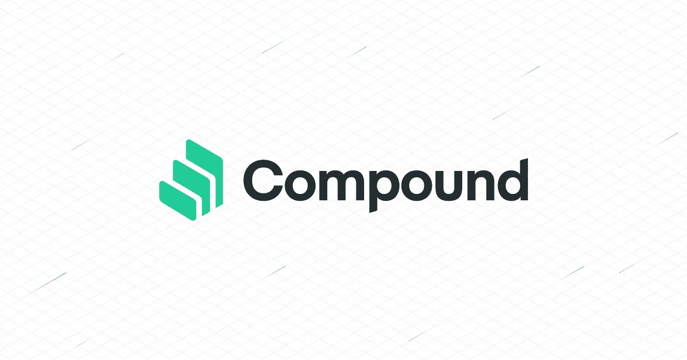

# 复合金融—简化

> 原文：<https://medium.com/coinmonks/compound-protocol-simplified-bf3da198f8ba?source=collection_archive---------0----------------------->

## 一个分散的复合货币市场

Photo Courtesy : compound.finance

这篇文章试图解释由 Compound Labs，Inc .开发的“[复合协议](https://compound.finance/)，他们在 2019 年 2 月发布了白皮书(v1)，其 v2 在去年 5 月正式推出。由于该协议对社区来说是新事物，我将尝试用更简单的术语来分解这个概念。

# 货币市场

货币市场是短期、高流动性债务证券的交易。个人在任何货币市场中的作用都是投资于短期存单(CDs)或短期国库券以及其他此类工具，目的是以利息的形式获得短期回报。这有助于那些流动性资金过剩的人在很短的时间内以较低的风险获得合理的回报。同时，它也是一个经济体的银行、公司和金融机构短期现金流需求的主要来源。还有批发货币市场，它实际上只限于公司和金融机构以大面额贷款或借款。

由于加密市场在过去几年中吸引了许多投资者、投机者和交易者，对加密资产的交易时间价值的需求也开始显现。与传统金融市场不同，这个新市场受到区块链技术的两个主要限制:

1.  有限的借贷机制导致了加密环境下资产的错误定价。由于区块链技术的分散性，很难对像“诈骗币”这样本质上是伪造的证券进行估价。
2.  此外，密码资产的存储(硬件钱包)和维护(安全保证)成本非常高，如果保持闲置或 HODL，资产本身就会产生负收益。

为了确保创造非零和财富，社区尝试了替代解决方案，以创建货币市场，从个人投资者持有的流动资产中产生边际收入。

1.  像 Poloniex 这样的集中交易引入了内部“借贷市场”,使其客户能够通过保证金交易他们的加密资产。由于这些交易所本质上是集中的，它纯粹是基于信任和假设交易所不会被黑客攻击而失去你的资产。换句话说，你没有机会在链条上移动仓位。
2.  引入点对点分散协议是为了促进市场参与者(如贷方和借方)之间的抵押贷款和非抵押贷款。由于该协议只能由其参与者操作，所以所有这些工作，如发布、管理和监督贷款要约和活动贷款，以及确认贷款履行也需要由他们完成，这使得过程更加繁忙和缓慢。

与我们在传统金融市场获得的技术相比，这些替代方法并不那么有效。Compound 实际上回答了所有这些问题。

# 复合:货币市场协议

Compound 是一个建立在以太坊生态系统上的协议，在其去中心化的节点上诞生了不同的基于以太坊资产的货币市场。这些市场实际上是一个资产池，根据特定资产类别的供给和需求，通过算法得出利率。这些资产的贷款人和借款人直接与协议交互，以便(分别)赚取和支付浮动利率，而不必协商任何类型的条款，如到期日、利率或抵押品。

## 供应资产

因为传统的和分散的对等货币市场需要将用户的资产需求与可用的贷方相匹配，以便发起交易。在 Compound 中，协议将贷方提供的类似资产组合成一个可替代的资源。与它们在直接贷款协议中的地位相比，这实际上增加了这些集合资产的流动性。此外，它使每个贷款人可以随时提取他们的资产，而不必等待针对该池发放的任何贷款到期。

当贷方向该协议提供其资产时，他将被发放一个名为“ **cToken** ”的 ERC-20 令牌。基于市场中特定资产类型的需求和供应，复合协议的功能将计算所有那些已发行 cTokens 的应计利息。激励过程是通过将 cTokens 转化为持有人基础资产的递增量来实现的。

## 借入资产

在其他点对点协议中，用户需要与贷方协商贷款的期限、利率和其他条款。但是当我们采用复合时，用户只需要选择他们想要的资产，其他什么都不需要。同样的借贷成本将由协议指定，根据纯粹的市场力量计算。

该组合中的每个市场都有一个范围从 0 到 1 的抵押系数，代表可以从其借入的基础资产价值部分。像在任何其他市场一样，与那些流动性和高市值资产相比，非流动性和低市值资产的抵押系数最低。

> 借贷能力=σ(基础代币余额的价值)x 抵押品系数

为了保护协议免于违约风险，用户只能借入他们的**借款能力**，并且不能转让或赎回抵押品(在用抵押品借款之后)。

## 利率模型

复合协议在其每个货币市场中遵循均衡利率模型，基于同一市场中特定资产的需求和供应。根据价格理论，这里的价格(利率)将作为需求和供给的函数，导致需求低时利率下降，需求高时利率下降。

利用率( *U* )是各个市场( *a* )的单一统一变量。这可以表示为:

> Uₐ(市场‘a’的利用率)=borrowingsₐ/(cashₐ+borrowingsₐ)

既然我们有了利用率，需求曲线就可以被编码并表示为利用率的函数。这有助于绘制每个市场的借贷利率。例如，它可以计算为一个函数:

> 借款利息 Rateₐ = 2% + (Uₐ *x* 20%)

同样，贷款人赚取的利率可以计算为借款利率与同一货币市场资金利用率的比率。这可以用下面的例子来说明:

> 借贷利息 Rateₐ =借贷利息 Rateₐ *x* Uₐ

复合协议不保证其代币的流动性，而是使用利率模型来激励其流动性头寸。当对资产的需求很高时，协议/令牌的流动性肯定会下降。当这种情况发生时，利率将上升，从而刺激供应，抑制借贷。

# 大院里发生了什么

认识到该协议的潜在影响， [Dharma](https://www.dharma.io/) 开放了他们的 compound 平台，他们将在他们的 V2 中推出该平台，目前该平台处于测试版。

2nd tweet from Dharma’s tweet-thread about their v2 beta release

由于该协议已经获得了社区的足够关注， [Ameen Soleimani](https://medium.com/u/20186ca83a48?source=post_page-----bf3da198f8ba--------------------------------) 撰写了一篇[中期文章](https://link.medium.com/6QxxuncTHZ)解释了复利贷款的风险。考虑到他的观点， [Robert Leshner](https://medium.com/u/54f6f223cd12?source=post_page-----bf3da198f8ba--------------------------------) 回复了他关于 [Compound](https://medium.com/u/70eaed7677f9?source=post_page-----bf3da198f8ba--------------------------------) 将如何解决这些风险的推文。你可以在这里阅读全文:

Thread of [Robert Leshner](https://medium.com/u/54f6f223cd12?source=post_page-----bf3da198f8ba--------------------------------)’s reply

由于该协议正处于非常成长的阶段，因此对于更好的分散化金融市场环境来说，该协议还有未被探索的用途。社区非常兴奋地探索各种可能性，并充分利用一切。这里有一个例子:

让我们拭目以待，看看 Compound 本身如何像团队设想的那样变得无管理和去中心化。此外，我们希望该协议保持不受管制，以获得更好的 DeFi 体验。太棒了。

# 参考

1.  复合协议白皮书[[https://compound.finance/documents/Compound.Whitepaper.pdf](https://compound.finance/documents/Compound.Whitepaper.pdf)
2.  培养基上的化合物[【https://medium.com/compound-finance】T2
3.  investopedia[【https://www.investopedia.com/terms/m/moneymarket.asp】T4
4.  罗伯特·莱什纳[[https://medium.com/@rleshner](/@rleshner)

> [直接在您的收件箱中获得最佳软件交易](https://coincodecap.com/?utm_source=coinmonks)

