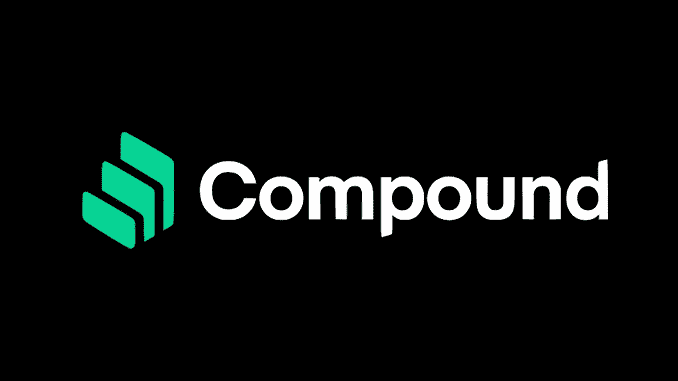

# 化合物受到攻击——下一步是什么？

> 原文：<https://medium.com/coinmonks/compound-under-fire-whats-next-10c11d478f6f?source=collection_archive---------7----------------------->

由于代码错误，DeFi platform compound 面临损失 1.5 亿美元的风险。

不过在我们进入当前的问题之前， [**肥猪发出信号**和](https://www.fatpigsignals.com/)我将向你解释一下令牌化合物的一个更接近的说法！

# 什么是 COMP？

COMP 也称为 Compound，是作为分散金融系统的贷款协议而开发的。它允许用户接收兴趣…