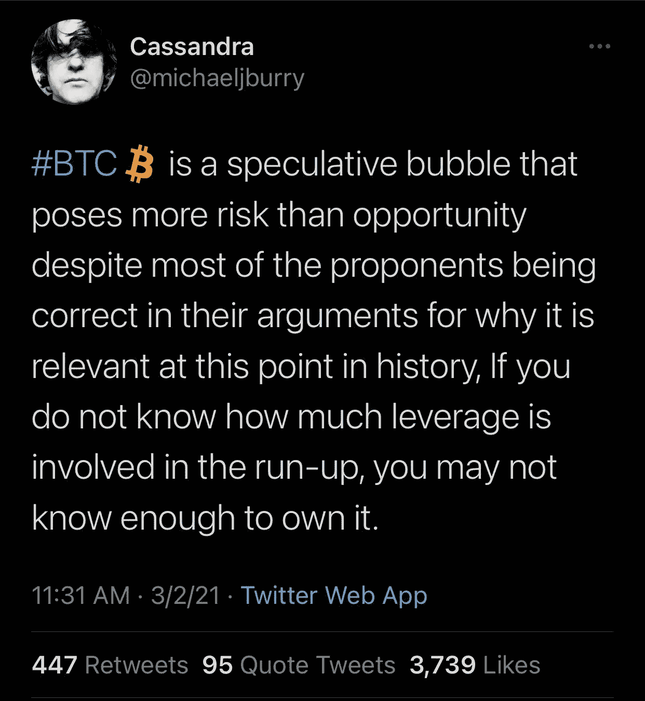

# 人们没有谈到的对比特币的担忧

> 原文：<https://medium.com/coinmonks/concerns-about-bitcoin-that-people-arent-talking-about-a1a18df4b949?source=collection_archive---------13----------------------->

Photo by [Nik Shuliahin](https://unsplash.com/@tjump?utm_source=medium&utm_medium=referral) on [Unsplash](https://unsplash.com?utm_source=medium&utm_medium=referral)

# 它是不可替代的

可替代项目是指可以相互替换的项目。它们都是不可区分的，彼此相同。我们今天使用的货币具有高度的可替代性，例如——(几乎)每一美元都等价于其他每一美元。

不幸的是，比特币是不可替代的，比美元更不可替代。这是因为每一枚比特币都有可能拥有与之相关的独特历史，这使得每一个货币单位本身都是独一无二的。

你怎么会问这个问题？假设你在易趣上卖东西换比特币，无意中接受了罪犯的付款。如果你试图在未来使用比特币进行合法交易，它可能会被阻止，你的所有活动都可能被置于扫描仪下，因为你钱包中的钱似乎与犯罪活动有关。

现在想象一下，在最终同意接受付款之前，每个收款人都必须检查汇款人的任何可疑活动的历史，交换媒介的全部目的是促进贸易，但这可能会引起许多摩擦。比特币有足够的可替代性吗？

# 采矿奖励减半可能最终会降低安全性

比特币矿工主要通过两种方式获得报酬——1)大宗奖励和 2)交易费。截至目前，区块奖励构成了矿工收入的大部分。整体奖励每 4 年减半，这意味着，最终，整体奖励将低于交易费。交易费会增加以填补块奖励减少留下的缺口吗？

在写这篇文章的时候，[交易费用的中位数是 1.4%](http://cryptofees.net/) ，我看到它有时会上升到 7%。人们会愿意支付比这更高的价格吗？如果不是这样，那么大多数矿工最终将停止开采比特币，这将降低[散列率](https://www.blockchain.com/charts/hash-rate)，这将最终使比特币网络更不安全。

# 比特币交易者可能使用了过多的杠杆

截至撰写本文时，BTC 的价格约为 4.2 万美元，你可以在[(2009 年 9 月 22 日到期)](https://www.deribit.com/main#/options?tab=BTC-30SEP22)以 25 万美元(当前价格的 6 倍)的执行价格购买看涨期权。如果你以前交易过股票期权，那么你就知道这提供了多大的杠杆作用。$AAPL 的通话费用最高只有 260 美元(1.8 倍)。

高杠杆率会导致市场调整演变成崩盘。明天 5%的意外下跌可能会引发一系列保证金通知，这将导致交易员出售他们的比特币，这将导致进一步下跌，这将引发更多的保证金通知，等等。

*   **附属链接包括**

> 加入 Coinmonks [电报频道](https://t.me/coincodecap)和 [Youtube 频道](https://www.youtube.com/c/coinmonks/videos)了解加密交易和投资

## 另外，阅读

*   [尤霍德勒 vs 科恩洛 vs 霍德诺特](/coinmonks/youhodler-vs-coinloan-vs-hodlnaut-b1050acde55a) | [Cryptohopper vs 哈斯博特](https://blog.coincodecap.com/cryptohopper-vs-haasbot)
*   [币安 vs 北海巨妖](https://blog.coincodecap.com/binance-vs-kraken) | [美元成本平均交易机器人](https://blog.coincodecap.com/pionex-dca-bot)
*   [新加坡十大最佳加密交易所](https://blog.coincodecap.com/crypto-exchange-in-singapore) | [购买 AXS](https://blog.coincodecap.com/buy-axs-token)
*   [投资印度的最佳密码](https://blog.coincodecap.com/best-crypto-to-invest-in-india-in-2021) | [HitBTC 评论](/coinmonks/hitbtc-review-c5143c5d53c2)
*   [加拿大最好的加密交易机器人](https://blog.coincodecap.com/5-best-crypto-trading-bots-in-canada) | [赌注加密](https://blog.coincodecap.com/staking-crypto)