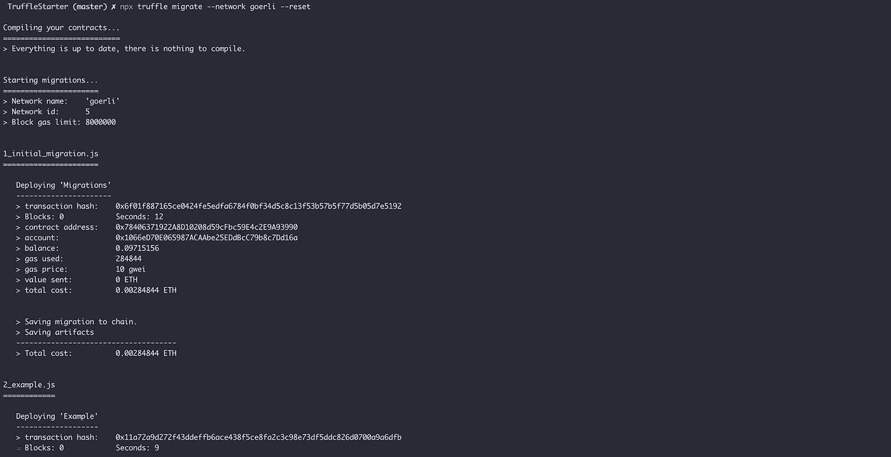
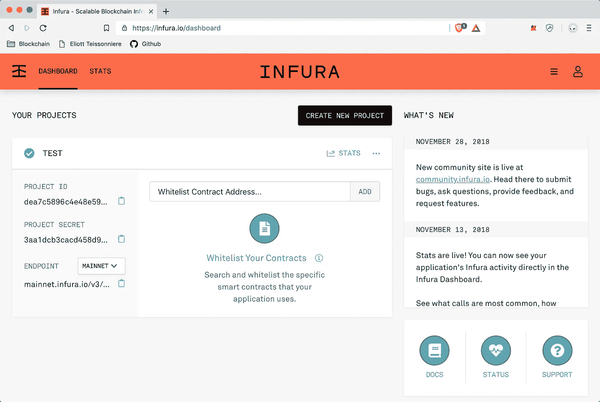
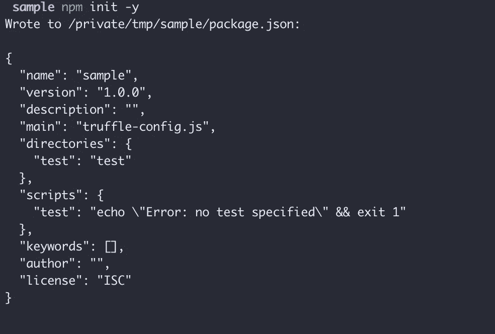
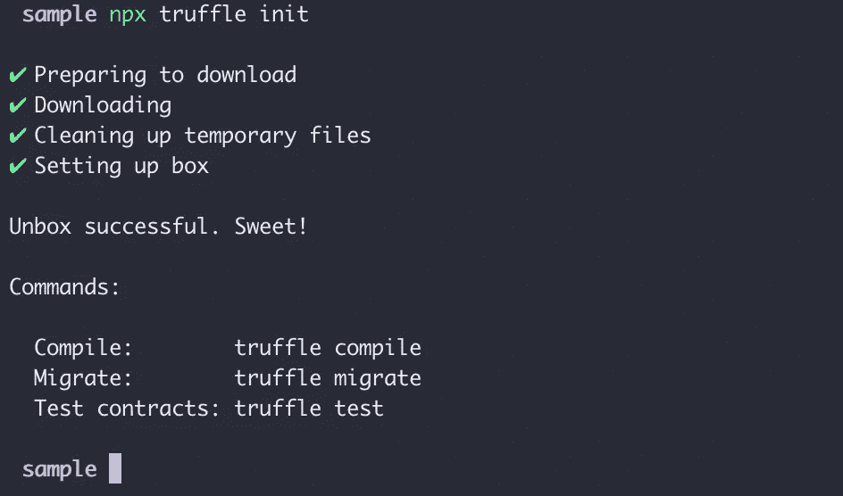
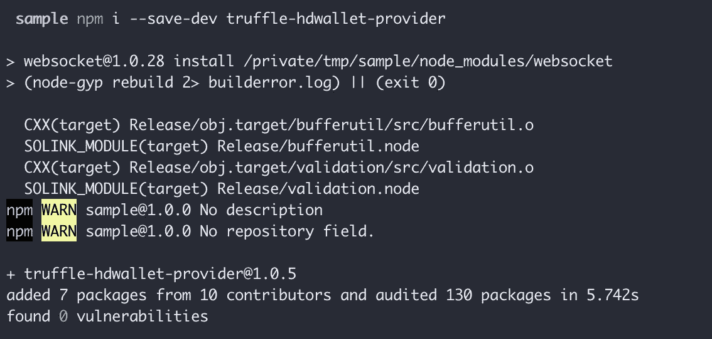

# 配置 Truffle 以使用 Goerli 测试网

> 原文：<https://medium.com/coinmonks/configuring-truffle-to-use-the-goerli-testnet-70313e0a7459?source=collection_archive---------0----------------------->

[INFURA](https://medium.com/u/fe1564152eed?source=post_page-----70313e0a7459--------------------------------) 最近[宣布](https://blog.infura.io/announcing-g%C3%B6rli-testnet-support-ee887d75437a)它实现了对新的和令人敬畏的以太坊格利测试网的支持。让我们看看如何配置 Truffle 框架来支持它。

Deploying sample contracts on Goerli from truffle

首先，你必须在 [infura.io](http://infura.io) 上创建一个项目，以便获得一个 API 密钥，这是我的配置:

Infura project

然后，我们启动一个新的 NPM 项目来跟踪依赖性:

NPM init

我们可以通过*NPM install-save-dev truffle*在本地安装 truffle。

然后，我们初始化我们的项目:

npx truffle init

我们可以添加一些依赖项(*truffle-HD wallet-provider*)来处理助记符种子:

npm i — save-dev truffle-hdwallet-provider

厉害！现在我们所要做的就是对*networks**部分中的 *truffle-config.js* 文件进行如下操作。*

*然后我们就可以走了！如果您需要部署到 gorli testnet，只需使用类似于*MNEMONIC = " your seed " in fura _ API _ KEY = " in fura KEY " npx truffle migrate—network goerli*的东西。*

*现在是最简单的方法:我做了一个 truffle box 来帮助你启动任何 solidity 项目，它支持所有现有的主网络和测试网络，并添加了一些漂亮的东西！去 https://github.com/ETeissonniere/TruffleStarter 看看吧。*

> *[直接在您的收件箱中获得最佳软件交易](https://coincodecap.com/?utm_source=coinmonks)*

**