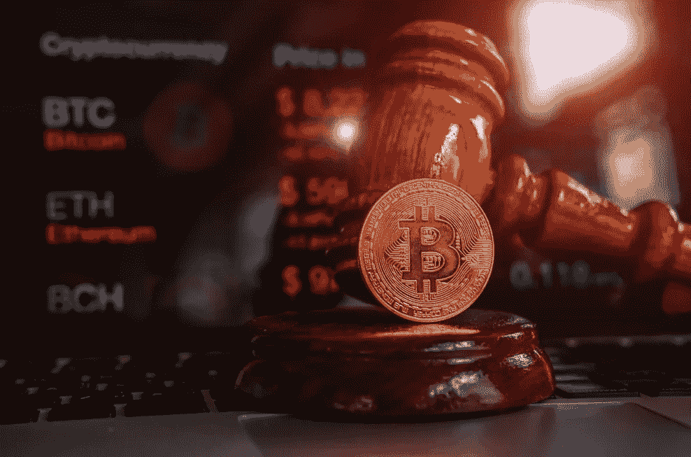
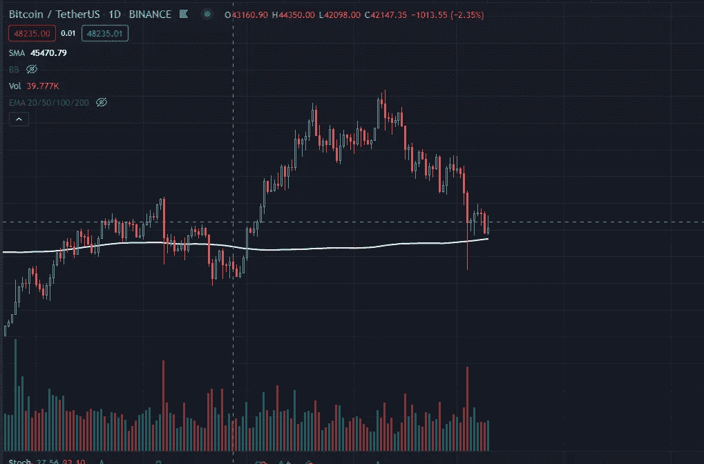
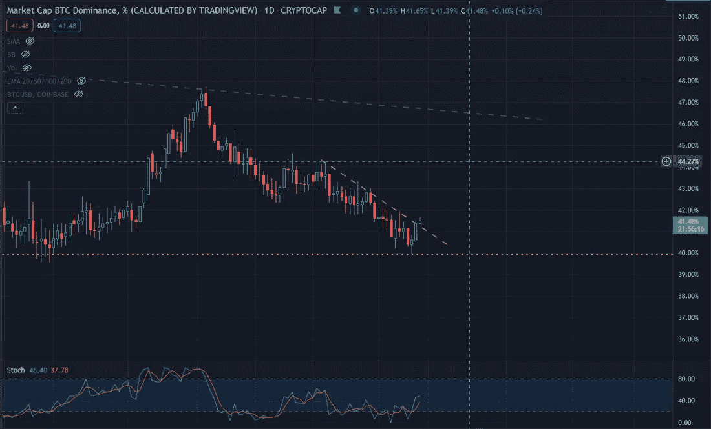
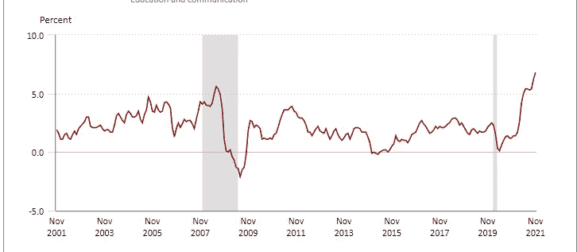
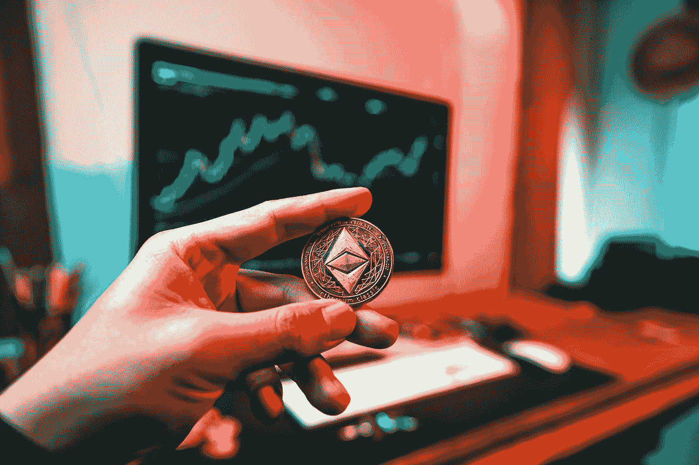
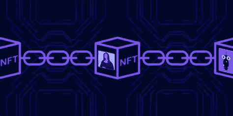

# 国会秘密听证会结束

> 原文：<https://medium.com/coinmonks/congressional-crypto-hearings-wrap-up-7014d3e376f2?source=collection_archive---------3----------------------->

## 每日加密更新和投资报告 12.10

技术分析|通胀数据|国会听证会|新手:什么是 NFT？角。2

# 概观

*   加密市场洞察:200 EMA |比特币统治地位|国会听证会
*   主要秘密新闻
*   新手每日一课:什么是不可替换的令牌(NFT)

# 市场洞察力

随着交易量开始失去动力，比特币继续测试 48-50k 的支持。这一关键支撑可能会在未来几天进行多次重新测试。该支撑与 200 指数移动平均线(EMA)一致，该指数移动平均线在历史上是整体市场趋势的指标。(上图-牛，下图-熊)。如果比特币持有 200 均线，在长期下跌期间，在散户头寸被强烈驱逐后，可能会出现长期积累。下图中 200 均线用白线表示。

BTC 1D Chart 200 SMA

**比特币霸主地位**

看看比特币的统治地位是否会创下新低，或者它是否会决定打破其下降趋势，这将是一件有趣的事情。人们普遍预计，在不确定的市场条件下，市场主导地位会上升，但最近的情况并非如此。在这种情况下，投资者越来越习惯于持有以太币等替代货币。主导地位目前为 41.49%。

BTC 1D Dominance

**通货膨胀数据**

美国劳工统计局今天上午发布的消费者物价指数数据显示，美国过去 12 个月的通货膨胀率为 6.8%。CPI 衡量美国消费者为商品和服务支付的价格。通货膨胀处于 1982 年以来的最高水平。

Inflation Data 2002–2021

过去一年，美联储印刷了 40%的美元，并将于 12 月 14 日和 15 日举行会谈，讨论债券购买缩减和加息。加密投资者应该密切关注会议的结果。加密被广泛认为是一种投机资产，将受到美联储政策变化的强烈影响。另一个相关因素是 Covid 病例数量的增加，随着美国进入冬季，情况可能只会变得更糟。大约在 2020 年锁定开始时，美联储开始实施积极的货币政策。

**国会听证会**

据与会者称，周三的国会听证会取得了成功，其中包括 crypto 中的一些关键人物，如 FTX 首席执行官萨姆·班克曼-弗里德、Circle 首席执行官杰里米·阿莱尔和 Bitfury 首席执行官布莱恩·布鲁克。除了几个国会议员，还有一种进步的情绪。首席执行官们表示支持加密货币的新监管平台，该平台不会破坏加密货币在美国的进展。Bitfury 的布莱恩·布鲁克斯是听证会的最有价值球员。[听证会亮点](https://www.youtube.com/watch?v=ux6CmsrOFeo)。

参议员代表布拉德·舍蒙似乎为错误类型的听证会做好了准备，他给这一事件增添了一些喜剧色彩。手表分钟 2:30。

# 主要秘密新闻

Photo by [Art Rachen](https://unsplash.com/@artrachen?utm_source=medium&utm_medium=referral) on [Unsplash](https://unsplash.com?utm_source=medium&utm_medium=referral)

Meta 的 Whatsapp 将试用 Novi 数字钱包。对于元拥有的平台来说，这是一个令人惊讶的举动。人们普遍认为 Meta 的目的是传播他们自己的数字资产生态系统。

[周四早上，索拉纳的网络出现了一次拥堵，导致高速网络运行缓慢，并开始引发对可靠性的质疑。](https://www.coindesk.com/tech/2021/12/10/solana-validators-engineers-grapple-with-blockchain-slowdown-on-public-call/)

[国际货币基金组织(IMF)是一家专注于维护全球金融稳定的金融机构，它概述了对加密监管采取“全球方法”的必要性。](https://www.coindesk.com/policy/2021/12/10/imf-outlines-need-for-global-approach-to-crypto-regulation/)

加密钱包制造商 Ledger 为美国和一些欧洲国家推出加密借记卡。

# 新手的每日一课

## 什么是不可替代的令牌(NFT)

*结合昨天的* [*报告*](/coinmonks/the-practical-future-of-nfts-5bfb1cab4e4e) 阅读

非功能性测试的特征:

*   不可替代
*   独特的
*   不能被改变
*   将永远存在于区块链
*   区块链代币

**不可替代且独一无二**

这个星球上的所有物品都是可替代的或不可替代的。一条面包是可以替换的。当一个人购买一条三明治面包时，他们会选择哪一条并没有什么不同。另一方面，一个不可替代项目的例子是一个著名的雕塑。这座雕塑可以复制，但永远不会有原作的价值。

**不可更改**

当你创造一个 NFT 并在区块链铸造它时，它就处于一个完整的状态。它再也不会被改变了。想象一下在一个不可摧毁的盒子里的蒙娜丽莎。

**将永远存在于区块链上**

就像比特币或任何其他加密货币一样，一旦一块数据被铸造，它将永远存在于区块链上。

**一个令牌**

比特币、以太坊、仓鼠币、NFT 都是代币。NFT 是这一类的唯一象征。

我希望你享受你的周末，并感谢阅读！

# TraderGabi

*如果您想将这份免费日报直接发送到您的邮箱，请订阅:*

> *加入 Coinmonks [电报频道](https://t.me/coincodecap)和 [Youtube 频道](https://www.youtube.com/c/coinmonks/videos)了解加密交易和投资*

## *也阅读*

* [## 杠杆代币[多头代币]终极指南

### 杠杆化令牌是具有杠杆化风险敞口的 ERC20 令牌，不考虑保证金、要求、管理…

medium.com](/coinmonks/leveraged-token-3f5257808b22)  [## 最佳加密交易所| 2021 年十大加密货币交易所

### 加密货币交易所的加密交易需要了解市场，这可以帮助你获得利润。之前…

blog.coincodecap.com](https://blog.coincodecap.com/crypto-exchange)  [## 2021 年最佳加密交换平台| CoinCodeCap

### 如果我们看看今天的场景，许多加密货币交换平台提供了广泛的功能和深度…

blog.coincodecap.com](https://blog.coincodecap.com/best-swap-platforms)  [## 如何在印度购买比特币？2021 年购买比特币的 7 款最佳应用[手机版]

### 如何使用移动应用程序购买比特币印度

medium.com](/coinmonks/buy-bitcoin-in-india-feb50ddfef94)  [## 加密税务软件——五大最佳比特币税务计算器[2021]

### 不管你是刚接触加密还是已经在这个领域呆了一段时间，你都需要交税。

medium.com](/coinmonks/best-crypto-tax-tool-for-my-money-72d4b430816b)  [## 存储比特币的最佳加密硬件钱包[2021] | CoinCodeCap

### 保管您的数字资产很容易，但找到正确的存储方式却是一项繁琐的任务。在线钱包有一个风险…

blog.coincodecap.com](https://blog.coincodecap.com/best-hardware-wallet-bitcoin)  [## Pionex 评论 2021 |免费加密交易机器人和交换

### Pionex 是为交易自动化提供工具的后起之秀。Pionex 上提供了 9 个加密交易机器人…

medium.com](/coinmonks/pionex-review-exchange-with-crypto-trading-bot-1e459d0191ea)  [## 仙境提供了 83，412%的 APY 赌注:仙境是一个骗局吗？CoinCodeCap

### 仙境是雪崩网络的第一个基于时间令牌的分散储备货币协议。一篮子…

blog.coincodecap.com](https://blog.coincodecap.com/wonderland-offers-an-83412-apy-on-staking-is-wonderland-a-scam)  [## 天秤座货币——脸书的加密货币

### 自 2018 年马克·扎克伯格决定致力于改善区块链以来，关于天秤座货币的传言就一直存在…

blog.coincodecap.com](https://blog.coincodecap.com/libra-currency-a-cryptocurrency-by-facebook)*