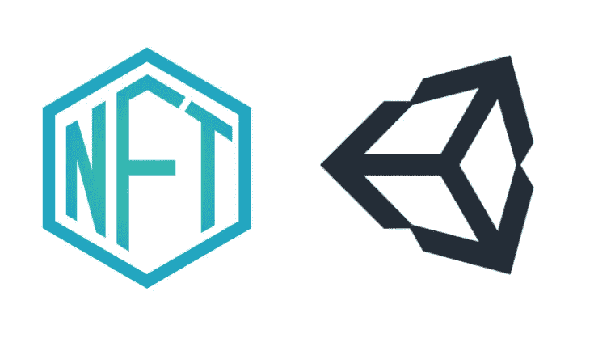
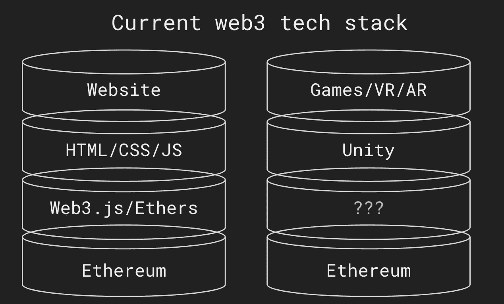
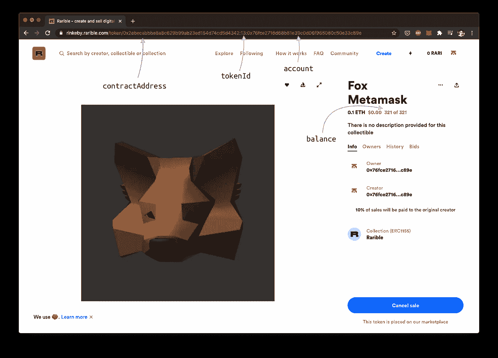
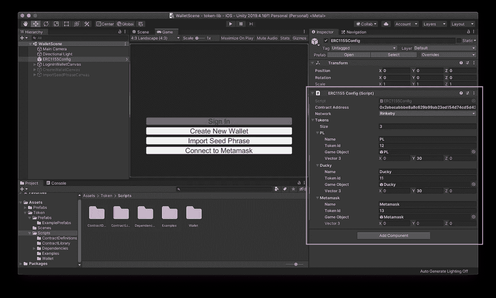

# 10 分钟内连接任何 ERC-1155 令牌+ Unity

> 原文：<https://medium.com/coinmonks/connect-any-erc-1155-token-unity-in-10-minutes-95fbdb73e178?source=collection_archive---------0----------------------->

将任何 Unity 项目连接到 ERC1155 令牌的平台。

*免责声明:本项目有链锯族！ChainSafe 非常高兴 Leon 加入我们，成为游戏主管。他的 Unity SDK 现在在 ChainSafe 的 Github* [*这里*](https://github.com/ChainSafe/web3.unity) *上公开，作为 Web3。Unity library，在那里它将继续得到发展。请查看我们的* [*公告文章*](https://bit.ly/3zgdQnF) *了解更多*

# 概观

不可替代代币正在崛起。我们已经在数字艺术和收藏品中看到了它。我们现在开始在游戏、VR 和 AR 中看到它。但是有一个问题…用来建立网站的技术不同于游戏。

# 市场

当你观察加密领域时，排名前 25 位的数据加密比市场上的其他数据加密要快一个数量级。这些游戏的收入是 10 万到 100 万美元。是什么让这些游戏如此引人注目？

> 前 25 名中，
> 
> 10 使用 Unity 的游戏引擎。

构建一个游戏不同于一个网站。区分这些顶级游戏的是它们对工具的正确使用。他们设法将他们的 Unity 项目与和 stack wei 联系起来。

拥有他们的工具并与前 25 名 dGames 竞争会很好吗？(这不是反问句)。

# 技术(不需要密码知识)

编写智能合同和开发游戏有一个陡峭的学习曲线。将两者联系起来很有挑战性。

Unity 的美妙之处在于它能够抽象出许多复杂的东西来填空和拖放。

简单地复制到这里

粘贴到这里

一切都会在幕后连接。

对于更懂技术的用户来说，平衡应该是这样的:

# 演示

对于工作演示:

 [## Unity WebGL 播放器| Unity-1155

### 编辑描述

ipfs.io](https://ipfs.io/ipfs/QmXJv1QiKwe3r28oY9Y69N5cHm7aYGnHSMX8jFzw5oEp6u/) 

要购买这些项目:

达克:

 [## 达克 1155

### 创建和销售与区块链安全的数字收藏品

app.rarible.com](https://app.rarible.com/token/0xd07dc4262bcdbf85190c01c996b4c06a461d2430:105326:0x72b8df71072e38e8548f9565a322b04b9c752932) 

Metamask Fox:

 [## 福克斯 Metamask 1155

### 创建和销售与区块链安全的数字收藏品

app.rarible.com](https://app.rarible.com/token/0xd07dc4262bcdbf85190c01c996b4c06a461d2430:105342:0x72b8df71072e38e8548f9565a322b04b9c752932) 

协议实验室:

 [## 协议实验室

### 创建和销售与区块链安全的数字收藏品

app.rarible.com](https://app.rarible.com/token/0xd07dc4262bcdbf85190c01c996b4c06a461d2430:105344:0x72b8df71072e38e8548f9565a322b04b9c752932) 

示例交易

[https://ethers can . io/tx/0x a 18 f 92 b 9 e 57 a 888 bebc 203 ea 9 f 79 effcdac 17 e 9 f 03 e 79 bb 9 ad 3c e 30091d 354 DD](https://etherscan.io/tx/0xa18f92b9e57a888bebc203ea9f79effcdac17e9f03e79bb9ad3ce30091d354dd)

# 希腊字母的第一个字母

如需提前获取信息和通知，请直接通过 [Discord](https://discord.gg/zsZFAP5fWx) 联系我们。

## 另外，阅读

*   [了解以太坊和网络 3](https://blog.coincodecap.com/go/learn)
*   [加密交易机器人](/coinmonks/crypto-trading-bot-c2ffce8acb2a)
*   [3 商业评论](/coinmonks/3commas-review-an-excellent-crypto-trading-bot-2020-1313a58bec92)
*   [AAX 交易所评论](/coinmonks/aax-exchange-review-2021-67c5ea09330c) |推荐代码、交易费用、利弊
*   [Deribit 审查](/coinmonks/deribit-review-options-fees-apis-and-testnet-2ca16c4bbdb2) |选项、费用、API 和 Testnet
*   [FTX 密码交易所评论](/coinmonks/ftx-crypto-exchange-review-53664ac1198f)
*   [n 零审核](/coinmonks/ngrave-zero-review-c465cf8307fc)
*   [Bybit 交换审查](/coinmonks/bybit-exchange-review-dbd570019b71)
*   [3Commas vs Cryptohopper](/coinmonks/cryptohopper-vs-3commas-vs-shrimpy-a2c16095b8fe)
*   最好的比特币[硬件钱包](/coinmonks/the-best-cryptocurrency-hardware-wallets-of-2020-e28b1c124069?source=friends_link&sk=324dd9ff8556ab578d71e7ad7658ad7c)
*   [密码本交易平台](/coinmonks/top-10-crypto-copy-trading-platforms-for-beginners-d0c37c7d698c)
*   最佳 [monero 钱包](https://blog.coincodecap.com/best-monero-wallets)
*   [莱杰纳米 s vs x](https://blog.coincodecap.com/ledger-nano-s-vs-x)
*   [bits gap vs 3 commas vs quad ency](https://blog.coincodecap.com/bitsgap-3commas-quadency)
*   最好的[加密税务软件](/coinmonks/best-crypto-tax-tool-for-my-money-72d4b430816b)
*   [最佳加密交易平台](/coinmonks/the-best-crypto-trading-platforms-in-2020-the-definitive-guide-updated-c72f8b874555)
*   最佳[加密贷款平台](/coinmonks/top-5-crypto-lending-platforms-in-2020-that-you-need-to-know-a1b675cec3fa)
*   [莱杰纳米 S vs 特雷佐 one vs 特雷佐 T vs 莱杰纳米 X](https://blog.coincodecap.com/ledger-nano-s-vs-trezor-one-ledger-nano-x-trezor-t)
*   [block fi vs Celsius](/coinmonks/blockfi-vs-celsius-vs-hodlnaut-8a1cc8c26630)vs Hodlnaut
*   Bitsgap 评论——一个轻松赚钱的加密交易机器人
*   为专业人士设计的加密交易机器人
*   [PrimeXBT 审查](/coinmonks/primexbt-review-88e0815be858) |杠杆交易、费用和交易
*   [Altrady 评论](https://blog.coincodecap.com/altrady-reivew)
*   [埃利帕尔泰坦评论](/coinmonks/ellipal-titan-review-85e9071dd029)
*   [SecuX Stone 点评](https://blog.coincodecap.com/secux-stone-hardware-wallet-review)
*   [BlockFi 评论](/coinmonks/blockfi-review-53096053c097) |从您的密码中赚取高达 8.6%的利息
*   [面向开发人员的最佳加密 API](/coinmonks/best-crypto-apis-for-developers-5efe3a597a9f)
*   [最佳区块链分析工具](https://bitquery.io/blog/best-blockchain-analysis-tools-and-software)
*   [加密套利](/coinmonks/crypto-arbitrage-guide-how-to-make-money-as-a-beginner-62bfe5c868f6)指南:新手如何赚钱
*   最佳[加密制图工具](/coinmonks/what-are-the-best-charting-platforms-for-cryptocurrency-trading-85aade584d80)
*   了解比特币最好的[书籍有哪些？](/coinmonks/what-are-the-best-books-to-learn-bitcoin-409aeb9aff4b)

> [直接在您的收件箱中获得最佳软件交易](/coinmonks/newsletters/coinmonks)

