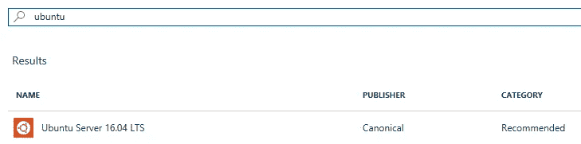
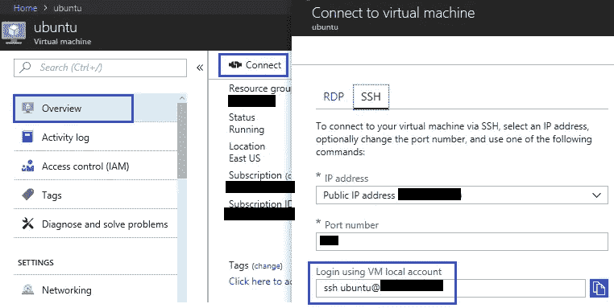
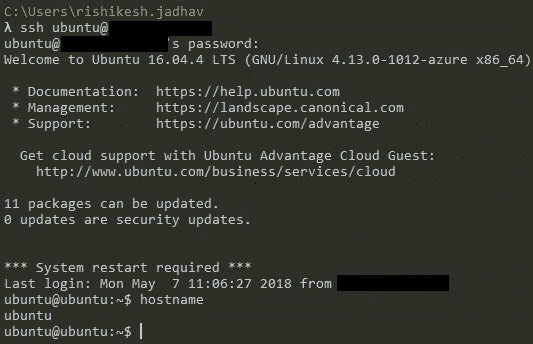
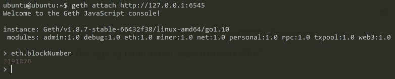

# Azure 虚拟机上的以太坊 Ropsten 测试网

> 原文：<https://medium.com/coinmonks/connecting-to-ethereum-ropsten-test-net-on-azure-vm-ubuntu-server-16-04-lts-5cd9c6b5c666?source=collection_archive---------8----------------------->

## Ubuntu Server 16.04

当在以太坊上创建一个 DAPP 时，我们经常需要在可用的以太坊[测试网](https://testnet.etherscan.io/)上测试我们的 DAPP。

很少有像[松露](http://truffleframework.com/)这样的优秀框架可以用于 DAPP 开发，这让开发者的生活变得简单了。truffle 也支持使用 [Solidity](https://solidity.readthedocs.io/en/v0.4.23/) 编写、编译和部署智能合约。

然而，如前所述，一旦开发完成，我们需要一些测试环境来验证我们新创建的 DAPP 的工作，在这篇文章中，我们将看到如何使用 Azure VM (Ubuntu Server 16.04 LTS)连接到 Ropsten Test Net。

## 步骤 1:创建 Azure 虚拟机(Ubuntu Server 16.04 LTS 版)

在你的 Azure 订阅上创建一个虚拟机，详情你可以参考这个[链接](https://docs.microsoft.com/en-us/azure/virtual-machines/linux/quick-create-portal)，这篇文章我们将选择 Ubuntu Server 16.04 LTS



Search for Ubuntu Server 16.04 LTS

按照“*创建虚拟机*刀片”下的步骤，对于此示例，我们选择了大小为“*标准 D2s v3 (2 个虚拟 CPU，8 GB 内存)*”的刀片，并进行部署。

## 步骤 2: SSH 进入 Azure VM

成功部署虚拟机后，您可以导航到其“*概述*”部分，并复制 SSH 命令以连接到虚拟机



Create VM and get SSH address

打开控制台，使用上面复制的 SSH 命令连接，输入您的密码，您应该能够成功连接到您的机器



SSH into VM

## 第三步:在 Azure 虚拟机上安装[监控器](http://supervisord.org/introduction.html)

Supervisor 是一个客户机/服务器系统，它允许用户在类似 UNIX 的操作系统上控制许多进程。要安装 supervisor，请在 ssh 控制台上粘贴以下命令，

```
$ sudo apt-get install supervisor
```

## 第四步:安装 [GETH](https://geth.ethereum.org/)

GETH 是以太坊协议的官方 GO 实现。要安装 GETH，请在 ssh 控制台上按给定顺序粘贴以下命令，

```
$ sudo apt-get install software-properties-common
$ sudo add-apt-repository -y ppa:ethereum/ethereum
$ sudo apt-get update
$ sudo apt-get install geth
```

## 步骤 5:配置 supervisor 来运行 GETH

现在我们将为 supervisor 创建一个配置文件来运行 GETH，我们将为此使用 nano editor，

```
$ sudo nano /etc/supervisor/conf.d/geth.conf
```

上面的命令将在 ssh 控制台中用 geth.config 打开编辑器，粘贴下面的代码并保存文件(**注** : —下面是两个破折号'-')，

```
[program:geth]
command=/usr/bin/geth — testnet — fast — rpc — rpcaddr 127.0.0.1 — rpcport 6545 — rpccorsdomain * — rpcapi admin,db,eth,debug,miner,net,shh,txpool,personal,web3
autostart=true 
autorestart=true 
stderr_logfile=/var/log/supervisor/geth.err.log 
stdout_logfile=/var/log/supervisor/geth.out.log
```

## 步骤 6:重新启动 supervisor 来启动 GETH

一旦正确添加了配置文件，我们现在将重启 supervisor 来启动 GETH，在 ssh 控制台上粘贴下面的命令，

```
$ sudo supervisorctl reload
```

这将启动 GETH，节点将开始同步到 Ropsten 测试网，我们将需要 ***耐心*** 在这里，因为 GETH 将同步 Ropsten 测试网，最新的当前块是 ***3191876*** ，检查[这里](https://ropsten.etherscan.io/) ***。***

## 步骤 7:测试，将控制台连接到 GETH 实例

一旦同步完成，如何检查这一点？

通过连接一个控制台连接到 GETH，在 ssh 控制台中粘贴下面的命令，

```
$ geth attach [http://127.0.0.1:6545](http://127.0.0.1:6545)
```

这将打开 GETH 控制台，按如下方式检查最新的块号，

```
$ > eth.blockNumber
```



Attaching to GETH console

如果 blockNumber 和步骤 6 中的 block number 相同，GETH 就完成了同步。

## 步骤 8:通过检查日志和输出进行故障排除

我们可以在下面两个文件中检查日志和输出，

```
$ sudo nano /var/log/supervisor/geth.err.log
$ sudo nano /var/log/supervisor/geth.out.log
```

## 步骤 9:在 Ropsten 测试网上部署智能合约和 DAPP

现在，我们有了完全同步的节点，它连接到 Ropsten TestNet。现在，您可以部署智能合同、创建帐户、部署 dapps、使用 GETH 控制台。

## 结论

我们可以使用 Azure VM 轻松地为 Ropsten TestNet 设置一个测试节点，我们可以在 Ropsten TestNet 上部署和测试我们的 dapps，然后再将其部署到以太坊 MAINNET。