# 使用 WSL 连接到 Windows 上的 Libra TestNet

> 原文：<https://medium.com/coinmonks/connecting-to-libra-testnet-on-windows-with-wsl-45bdfd23150a?source=collection_archive---------1----------------------->


我们都对脸书宣布推出 [**Libra 区块链**](https://github.com/libra/libra) 感到兴奋。我知道我是，如果你对区块链的未来不感到兴奋，你就不会在这里。所以我开始深入了解它是如何工作的，以及它内置了什么样的编程语言。对我来说，首先要做的是尝试用提供的命令行界面客户端与 Libra TestNet 进行交互。

检查文档时，他们假设只有 Linux 和 macOS 用户会使用该系统🙄。我当时就想，WINDOWS 用户怎么办！！！别担心，微软为我们提供了 Linux 的 Windows 子系统。

如果您尚未安装 WSL [**，请按照本安装说明安装 Windows Subsystem for Linux**](https://docs.microsoft.com/en-us/windows/wsl/install-win10)。

> 在您的 windows 系统上应该有一个类似的终端

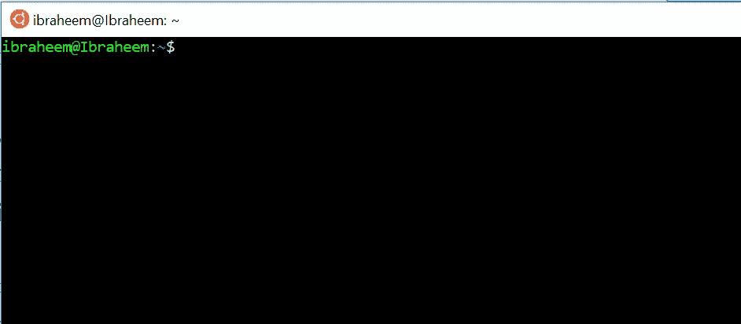

运行以下命令来更新和升级您的发行版。

```
sudo apt-get update && sudo apt-get upgrade && sudo apt-get dist-upgrade
```

接下来让我们用下面的命令克隆 Libra 核心存储库

```
git clone https://github.com/libra/libra.git
```

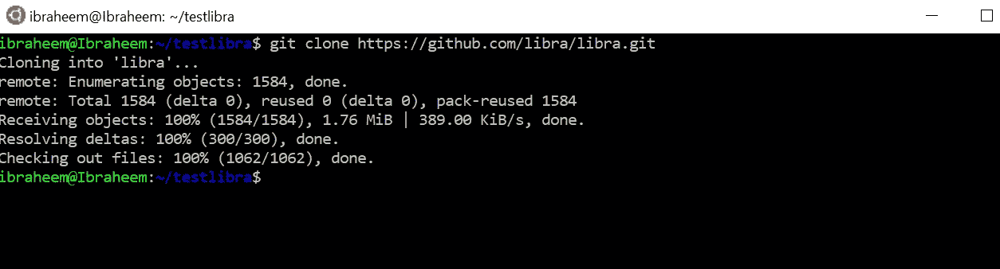

要安装 Libra Core，转到`libra`目录并运行安装脚本来安装依赖项，如下所示

```
cd libra
./scripts/dev_setup.sh
```

安装脚本安装 rustup、CMake、protoc 和 Go。

此时，您可能会遇到 rustup 和您的 protocol 版本的问题，它需要 protocol 3 . 6 . 0 以上的版本。

在终端运行`rustup update`，如果没有找到命令，将`$HOME/.cargo/bin`导出到路径 in。bashrc

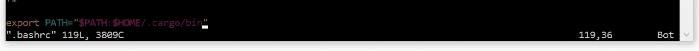

您可以使用`source .bashrc`来重新加载它，这样您就不必注销和登录。

> [现在让我们更新协议](http://google.github.io/proto-lens/installing-protoc.html)，复制下面的每一行并将其粘贴到您的终端中，以安装协议版本 3.7.1

```
PROTOC_ZIP=protoc-3.7.1-linux-x86_64.zip
curl -OL https://github.com/google/protobuf/releases/download/v3.7.1/$PROTOC_ZIP
sudo unzip -o $PROTOC_ZIP -d /usr/local bin/protoc
sudo unzip -o $PROTOC_ZIP -d /usr/local include/*
rm -f $PROTOC_ZIP
```

如果您在安装`protoc`时遇到`unzip` 的问题，请使用此命令`sudo apt install unzip`安装 unzip。

完成后，再次运行设置脚本`./scripts/dev_setup.sh`，此时你应该不会再遇到任何设置问题。

> 构建 Libra 客户端并连接到 TestNet。

要连接到 Libra testnet 上运行的验证器节点，运行如下所示的客户端。

```
./scripts/cli/start_cli_testnet.sh
```

这个命令利用 cargo (Rust 的包管理器)构建并运行客户机，并将客户机连接到 testnet 上的验证器节点。

客户端节点连接后，您应该会看到以下内容。

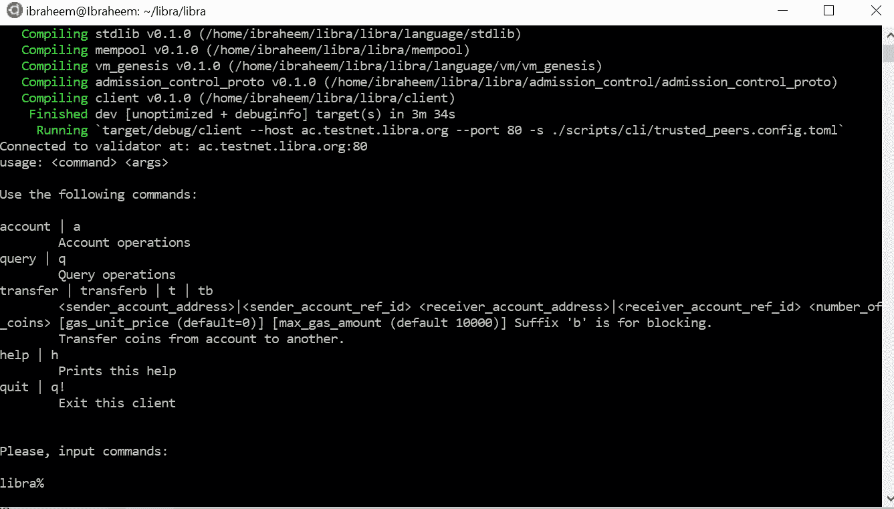

感觉真好！

> 让我们提交第一笔交易

在提交我们的交易之前，让我们创建几个我们将使用的帐户。谢天谢地，有 CLI 命令来创建帐户很容易。要查看关于帐户的帮助信息，请输入如下所示的`account` 。

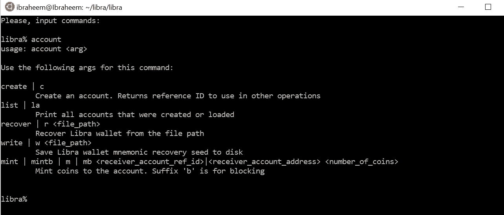

输入命令`account create`创建一个账户。

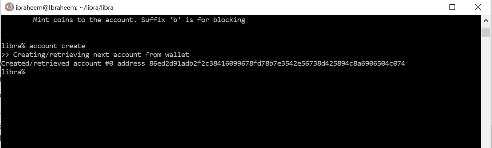

使用相同的命令创建第二个帐户。

让我们看看用`account list`命令创建的账户列表

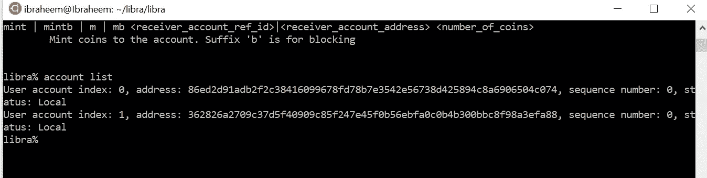

帐户索引是本地 CLI 索引，可在其他 CLI 命令中使用，以便用户方便地引用他们创建的帐户。该指数对区块链毫无意义。

账户的[序列号](https://developers.libra.org/docs/reference/glossary#sequence-number)表示从该账户发出的交易数量。

> 让我们添加天秤座硬币到我们在 TestNet 上创建的帐户

薄荷天秤座，并添加到我们的帐户与`account mint 0 100`

*   0 是创建的第一个帐户的索引
*   100 是要加入账户的 Libra 的金额

第二笔帐`account mint 1 20`

*   1 是否创建了第二帐户的索引
*   20 是天秤座要加到账户上的金额

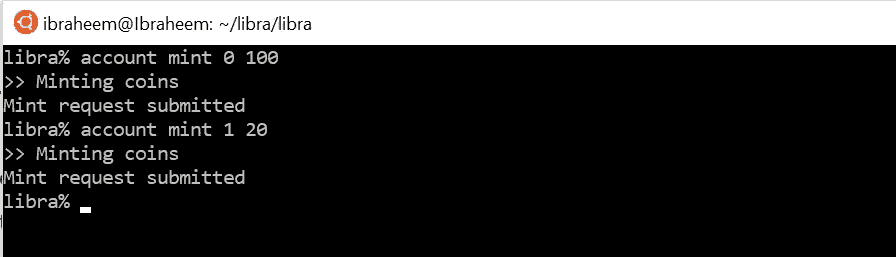

注意，当请求被提交时，意味着它已经被成功地添加到了 mempool(testnet 上的一个验证器节点的 mempool)中。并不一定意味着会圆满完成。稍后，我们将查询帐户余额以确认铸造是否成功。

一个成功的帐户薄荷命令也将创建我们在区块链的帐户。

要检查我们账户中的余额，请输入以下命令:`query balance 0`

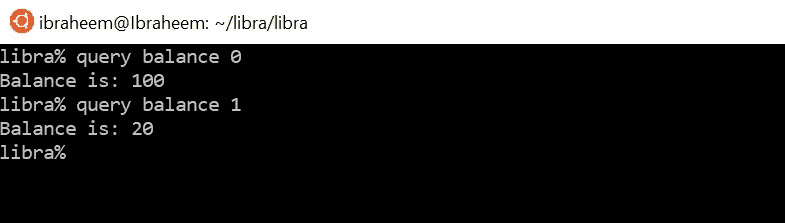

让我们用下面的命令转移我们的钱`transfer 0 1 25`

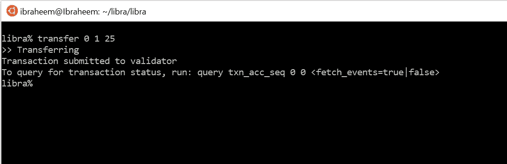

*   0 是创建的第一个帐户的索引
*   1 是否创建了第二帐户的索引
*   25 是天秤座要转移的数字。

转账完成后，让我们检查一下我们的账户余额。

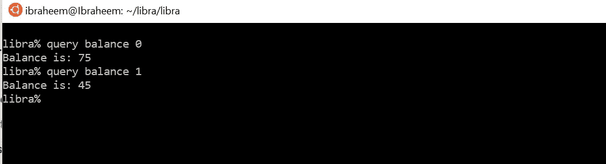

耶！我们已经在 Libra TestNet 上成功提交了我们的第一笔交易。

如果你有任何问题，请在评论区告诉我。我对未来充满期待。

更多详情请查看[我的第一笔交易](https://developers.libra.org/docs/my-first-transaction)

# **编辑:Golang 客户端:**

我刚刚创建了 [Go Libra 客户端](https://github.com/codemaveric/libra-go)它有基本的功能来生成地址，从测试水龙头铸币，并获得帐户状态。这是一项正在进行的工作，仍在进行重大开发。通过公开问题或公共关系的自由贡献。

[](https://github.com/codemaveric/libra-go) [## codemaveric/libra-go

### 与 Libra 区块链交互的 Go 客户端。通过创建帐户为 codemaveric/libra-go 开发做出贡献…

github.com](https://github.com/codemaveric/libra-go) 

> [在您的收件箱中直接获得最佳软件交易](https://coincodecap.com/?utm_source=coinmonks)

[](https://coincodecap.com/?utm_source=coinmonks)