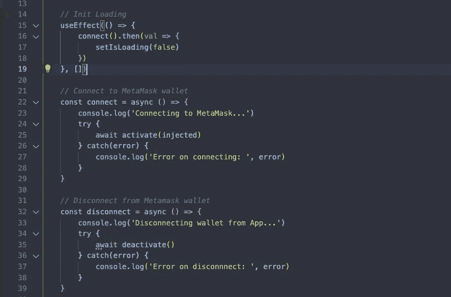
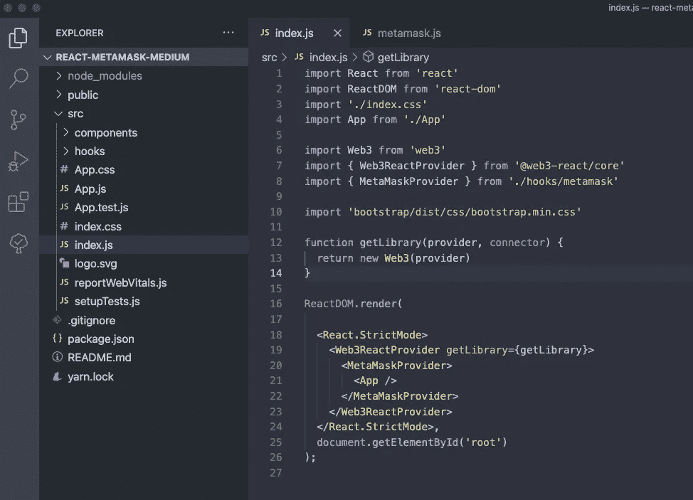
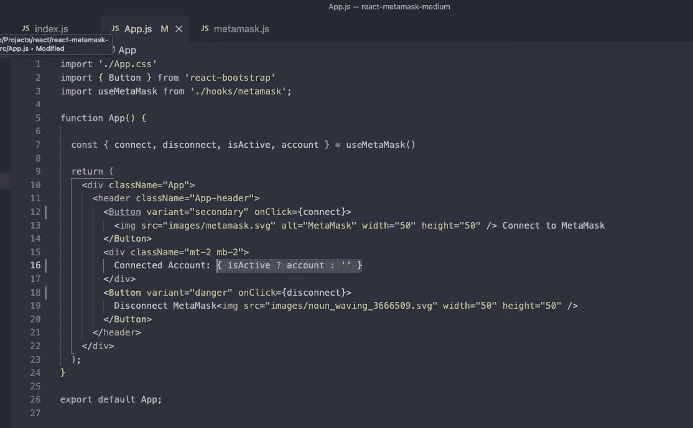

# 连接到 MetaMask +React.js +自定义钩子+状态管理

> 原文：<https://medium.com/coinmonks/connecting-to-metamask-react-js-custom-hook-state-management-2f1f3203f509?source=collection_archive---------0----------------------->

Photo by [DrawKit Illustrations](https://unsplash.com/@drawkit?utm_source=medium&utm_medium=referral) on [Unsplash](https://unsplash.com?utm_source=medium&utm_medium=referral)

将您的 dApp 连接到 MetaMask 是让您的应用程序为 Web3 带来无限可能性的重要一步。创建一个自定义钩子相当简单，可以在整个应用程序中实现这个钩子来处理 MetaMask。

我们希望为这个项目实现 3 件事。

1.  将元掩码连接到 React.js 应用程序
2.  创建一个自定义钩子来跟踪使用元掩码的应用程序的状态
3.  在应用程序周围包装一个 Web3 提供者，以便将来与您选择的 ETH 链进行交易

最终结果看起来会像这样:

我们还将包括一个选项，如果这是用户想要做的，可以从 MetaMask 断开你的应用程序。

我们走吧！

让我们首先用 React 创建一个新的应用程序。我用的是`npx create-react-app`。我在本教程中也使用了 VS 代码，只是注意一下。

`npx create-react-app react-metamask-medium && cd react-metamask && code .`

好了，可以走了！您应该有一个简单的 react 应用程序，如果您打开 **App.js** ，它应该是这样的:

让我们做一点清洁，把我们不需要的东西都搬走。我将删除`<header></header>`之间的所有内容，并将我的新内容放在那里。我将使用现有的 CSS 来居中放置新内容:

现在让我们添加几个包，为内容添加一些按钮。我还将添加一个 MetaMask 标志和 hand wave svg，如果你感兴趣，这里有下载链接: [metamask.svg](https://github.com/blakewood84/react-metamask/blob/main/public/images/metamask.svg) 。 [hand.svg](https://github.com/blakewood84/react-metamask/blob/main/public/images/noun_waving_3666509.svg)

`yarn add react-bootstrap bootstrap@5.1.3`

让我们将`import ‘bootstrap/dist/css/bootstrap.min.css’`添加到我们的 **index.js** 文件中，并删除一些额外的代码。您的 index.js 应该如下所示:

现在让我们将按钮添加到应用程序中，这样我们就可以连接到 MetaMask。

现在我们需要创建一个自定义钩子，我们可以用它来调用这些按钮上的连接和断开。这个自定义挂钩还将跟踪我们的应用程序的状态，并分发我们需要的任何数据，如**帐户信息**或**余额**。

我们应该创建一个名为 **hooks** 的文件夹，并为自定义钩子放入 **useMetaMask.js** ，这样我们的文件夹结构看起来像这样:**src/hooks/usemetamask . js**

为了在整个应用的生命周期中跟踪这个钩子的状态，我们必须利用 React 的 **createContext**

这有点难以分解，但是对于我们将要填充的简单锅炉板，请参见下面的代码:

对于这个组件，我们将需要来自 React、 **useState、useEffect、useMemo 和 useCallback** 的以下内容

我们还需要使用`@web3-react/core`的 **useWeb3React** 钩子，并创建一个名为 **injected 的新组件。**该注入组件将利用 web3-react/injected-connector 将支持的链连接到应用程序和元掩码。

让我们运行以下代码:

`yarn add @web3-react/injected-connector @web3-react/core`

接下来，让我们开始填写我们的新 useMetaMask 挂钩，以配合我们的应用程序。为此，我们将把所有代码放到 **MetaMaskProvider** 组件中。

首先，我们想添加 useWeb3React 钩子来收集一些重要的资源，以便与 MetaMask 连接。

`const { activate, account, library, connector, active, deactivate } = useWeb3React()`

我还开始创建一些我想要跟踪的特定状态，比如**活动**和**正在加载。**

**isLoading** 将有助于判断 useMetaMask 钩子何时正在加载，以读取它与 MetaMask 的连接。 **isActive** 将有助于判断 MetaMask 当前是否通过我允许的应用内部的适当链连接到应用。

`const [isActive, setIsActive] = useState(false)`

`const [isLoading, setIsLoading] = useState(true)`

要查看这个自定义挂钩的完整代码，请[单击此处](https://github.com/blakewood84/react-metamask/blob/main/src/hooks/metamask.js)

接下来，我应该创建我的注入组件，该组件将用于将元掩码连接到我希望在我的应用程序中使用的特定链。

我将创建一个名为**src/components/wallet/injected . js**的文件夹来存放注入的组件文件。代码很简单:

`import { InjectedConnector } from ‘@web3-react/injected-connector’`

`export const injected = new InjectedConnector({ supportedChainIds: [1, 42, 1337] })`

**supportedChainIds** 将有助于确保元掩码连接到我的应用程序正在使用的正确链，否则它不会在我们的自定义钩子中显示活动。

有关更多支持链 id，请参见[https://chainlist.org/](https://chainlist.org/)

1 =以太坊主网
42 = Kovan Testnet——我将在以后的文章中使用 Web3 和 [Infura](https://infura.io/) 来连接它，它将处理简单的事务来测试我的应用程序

1337 =本地主机链。为此，我使用 [Ganache](https://www.trufflesuite.com/ganache) 创建了一个本地链，并连接到我的 MetaMask 钱包。

现在回到我们的**使用 MetaMask** 钩子。

我们希望使用没有依赖关系的 **useEffect** ，它将在钩子初始化时运行一次。在这个 **useEffect** 的内部，钩子将会放在一个 **connect()** 函数上，以便在应用首次运行时初始化与应用和元掩码的连接:

这些函数在被调用时将帮助连接和断开钱包与应用程序的连接。我将它们用作 useCallback 函数，因为我不希望它们在应用程序中只在被调用时重新渲染超过需要的内容。

接下来，让我们创建一个 **handleIsActive** 函数来检查 MetaMask 当前是否连接到我们的应用程序。为此，我将使用一个 **useCallback** ，并从我们的 **useWeb3React** 挂钩中加入 **active** 属性，作为一个依赖项，以便在 MetaMask 与我们的应用程序连接和断开时更新我们的挂钩。这通常是因为用户在 MetaMask 上为一个未连接到我们的应用程序的链切换帐户:

我还创建了一个 useEffect 钩子，它将依赖于 **handleIsActive** ，并且仅当 **active** 在 **handleIsActive** 回调中发生变化时才运行这个函数。这将在**激活**时更新我们的应用程序，对还是错。从我们的应用断开 MetaMask 也会导致**活动**为假。

最后，为了确保 useMetaMask 自定义钩子在它的任何依赖关系改变时相应地更新我们应用程序的其余部分，我们将使用 **useMemo** 来相应地改变钩子的属性。我们这样做是为了让应用程序的其余部分能够判断出**是活动的**还是正在加载的**被更新了。这也将访问我们的**连接**和**断开**功能，加上我们的**账户。**他们只会在我们需要的依赖关系改变时重新评估，比如**是活动的**和**正在加载**:**

酷，现在可以走了。要查看这个定制钩子[的完整源代码，请点击这里](https://github.com/blakewood84/react-metamask-medium/blob/main/src/hooks/metamask.js)

最后一步是在我们现有的应用程序周围使用 **Web3ReactProvider** ，同时使用我们的 **MetaMaskProvider** 来包装应用程序，这样我们就可以让我们的定制钩子的状态一直存在。

我们需要最后添加最后一个依赖项:

`yarn add web3`

一旦我们将应用程序包装在 **index.js** 中，并使用它应该看起来像这样:

包装 app 的原因如下 **Web3ReactProvider** 是我们的 **useWeb3React** hook 所依赖的，它也为使用 **Web3** 和与我们的 app 进行交易铺平了道路。

在我们的`<App />`周围使用 **MetaMaskProvider** 使我们能够在整个应用程序中保持自定义钩子的状态。

接下来我们可以回到我们的 **App.js** ，使用我们创建的自定义钩子。

将以下内容放入我们的应用程序:

`const { connect, disconnect, isActive, account } = useMetaMask()`

此外，我们应该在关联账户旁边注明以下信息:

`{ isActive ? account : ‘’ }`

这将告诉我们的应用程序，如果帐户连接，然后显示帐户信息。如果不是，则显示一个空字符串。

我们还应该连接我们的按钮，以便从 useMetaMask 挂钩连接和断开功能。

最终结果将如下所示:

这是我们的应用程序运行时的样子:

好极了。感谢你和我一起编码！请点击[https://github.com/blakewood84/react-metamask-medium](https://github.com/blakewood84/react-metamask-medium)查看完整的源代码

如果您对项目或谈论代码感兴趣，请随时在 LinkedIn 上联系我！[https://www.linkedin.com/in/blakewoodjr/](https://www.linkedin.com/in/blakewoodjr/)

非常感谢！祝福

> 加入 Coinmonks [电报频道](https://t.me/coincodecap)和 [Youtube 频道](https://www.youtube.com/c/coinmonks/videos)了解加密交易和投资

## 也阅读

 [## 杠杆代币[多头代币]终极指南

### 杠杆化令牌是具有杠杆化风险敞口的 ERC20 令牌，不考虑保证金、要求、管理…

medium.com](/coinmonks/leveraged-token-3f5257808b22)  [## 最佳加密交易所| 2021 年十大加密货币交易所

### 编辑描述

blog.coincodecap.com](https://blog.coincodecap.com/crypto-exchange)  [## 2021 年最佳加密借贷平台| 6 大比特币借贷平台

### 获得比特币和其他加密货币的最佳贷款利率

medium.com](/coinmonks/top-5-crypto-lending-platforms-in-2020-that-you-need-to-know-a1b675cec3fa)  [## 2021 年最佳免费加密交易机器人

### 2021 年币安、比特币基地、库币和其他密码交易所的最佳密码交易机器人。四进制，位间隙…

medium.com](/coinmonks/crypto-trading-bot-c2ffce8acb2a)  [## 最佳 4 个加密交易信号电报通道

### 这是乏味的找到正确的加密交易信号提供商。因此，在本文中，我们将讨论最好的…

medium.com](/coinmonks/best-crypto-signals-telegram-5785cdbc4b2b)  [## 5 个最佳社交交易平台[2021] | CoinCodeCap

### 编辑描述

blog.coincodecap.com](https://blog.coincodecap.com/best-social-trading-platforms)  [## BlockFi 评论 2021:利弊和利率| CoinCodeCap

### 编辑描述

blog.coincodecap.com](https://blog.coincodecap.com/blockfi-review)  [## 如何在印度购买比特币？2021 年购买比特币的 7 款最佳应用[手机版]

### 如何使用移动应用程序购买比特币印度

medium.com](/coinmonks/buy-bitcoin-in-india-feb50ddfef94)  [## 加密税务软件——五大最佳比特币税务计算器[2021]

### 不管你是刚接触加密还是已经在这个领域呆了一段时间，你都需要交税。

medium.com](/coinmonks/best-crypto-tax-tool-for-my-money-72d4b430816b)  [## 存储比特币的最佳加密硬件钱包[2021] | CoinCodeCap

### 编辑描述

blog.coincodecap.com](https://blog.coincodecap.com/best-hardware-wallet-bitcoin)  [## Pionex 评论 2021 |免费加密交易机器人和交换

### Pionex 是为交易自动化提供工具的后起之秀。Pionex 上提供了 9 个加密交易机器人…

medium.com](/coinmonks/pionex-review-exchange-with-crypto-trading-bot-1e459d0191ea)