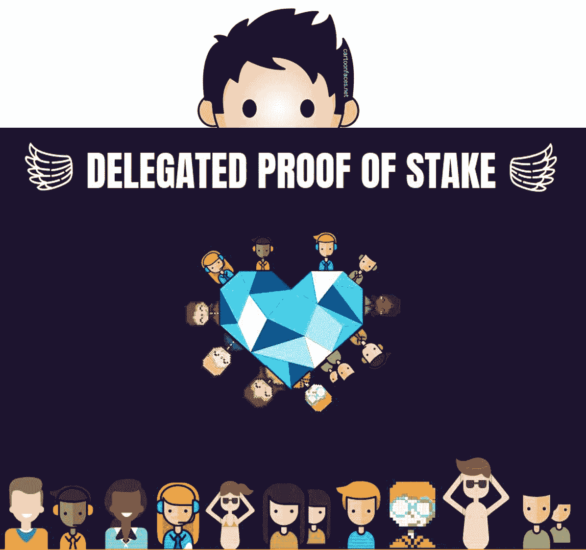
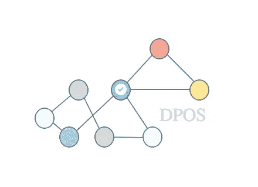

# 共识之战:理解授权的利害关系证明

> 原文：<https://medium.com/coinmonks/consensus-battles-understanding-delegated-proof-of-stake-3968a8dbcd6e?source=collection_archive---------7----------------------->

最近，关于共识模型的争论是区块链生态系统的前沿和中心。这场辩论主要由两大学派主导:工作证明(PoW)纯粹主义者和利害关系证明(PoS)。最近，我写了一篇关于混合共识模型的文章，试图在两种主流思想流派之间找到一个中间地带。今天，我想探索一些我最喜欢的区块链项目背后的另一种选择:委托阶段证明(DPoS)。

dpo 背后的思想可以追溯到 [Dan Larimer 在 2013 年](https://bitsharestalk.org/index.php?topic=1138.msg13602#msg13602)发表的一篇论文，该论文探索了一些替代方案，以解决 PoW 网络中共识模型的局限性。该算法最初是为拉里默在 BitShares 中的工作设计的，后来在 Steem 上得到完善。如今，该协议正在推动市场上一些最具创新性的区块链计划，包括 Larimer 自己的 EOS 以及 Golos、Ark、Lisk、PeerPlays、Nano(以前的 Raiblocks)和 Tezos、Cosmos/Tendermint、Cardano。

# DPOS？

DPoS 将共识模型分为两个基本部分:选举一组块生产者和安排生产。并非 DPoS 网络中的每个人都可以生成块来验证事务。在 DPoS 世界中，持有代币的参与者能够投票选举区块生产者；选票根据选民的股份进行加权，获得最多选票的区块生产者候选人是那些生产区块的候选人。从这个角度来看，DPoS 模仿了企业环境中的许多治理模型的概念，在这种环境中，某个级别的一组人可以决定谁应该执行特定的任务，而另一组人则评估任务的结果。

考虑 dpo 的另一个有用方法是公证人和证人在合同签署过程中扮演的角色。公证人和证人都不是合同本身的一部分，但他们是能够证明文件法律效力的相关方。在 DPoS 世界里，你可以把利益相关者想成公证人，把区块生产者想成见证人。

使用 DPoS consensus，利益相关者可以选择任意数量的见证来生成块，这些块实质上是一组更新数据库状态的事务。每个账户允许每个证人每股一票，这个过程被称为[批准投票](http://en.wikipedia.org/wiki/Approval_voting)。选择通过总批准的前 N 名证人。见证人的数量(N)被定义为至少 50%的投票利益相关者认为有足够的权力下放。当利益相关者表达他们想要的见证人数量时，他们也必须投票支持至少这么多的见证人。利益相关者不能投票支持比他们实际投票支持的见证人更多的权力下放。证人每生产一个积木，就会得到报酬。他们的薪酬由利益相关者通过他们选出的代表(将在后面讨论)确定。如果一个证人不能出示一个区块，那么他们没有报酬，并可能在未来被淘汰。

dpo 最显著的特征之一是块生产者的数量受到明确限制。例如，EOS 将块生产者的数量保持在 21。这种约束防止了网络中各种潜在的暴力攻击。尽管有这样的限制，DPoS 实现仍然保留了一个可用的块生产者池，以防现有的块生产者表现出恶意行为。

# DPoS 的优势

DPoS 的实施仍处于相对早期的阶段，尽管其中一些如 BitShares 或 Steem 已经在区块链领域取得了有意义的进展。dpo 的最初实现已经展现了该协议的一些关键优势。以下是我最喜欢的一些:

a) **关注点分离:** DPoS 将砌块生产商的选举与砌块生产本身分离开来，这为更具创造性的模型打开了大门，以孤立地解决这两个问题。

b) **令牌持有者控制:**显然，块生产者的选举保证了令牌持有者保持对网络的控制，这是去中心化的关键原则。

c) **可伸缩性:**DPoS 的早期实现表明，它解决了传统 PoW 和 PoS 模型的一些可伸缩性限制。

d) **链上治理:**DPoS 方法为在区块链应用程序中实现有趣的治理模型提供了基础。在某种意义上，dpo 可以被视为一种流动性的代议制民主形式，投票权可以分配给其他参与者，投票可以随时更改。

e) **避免无关紧要问题:** DPoS 解决了 PoS 网络中著名的无关紧要问题，在 PoS 网络中，一小组验证者可以控制网络。dpo 中令牌验证器数量的固定以及动态选举模型防止了这个问题的发生。