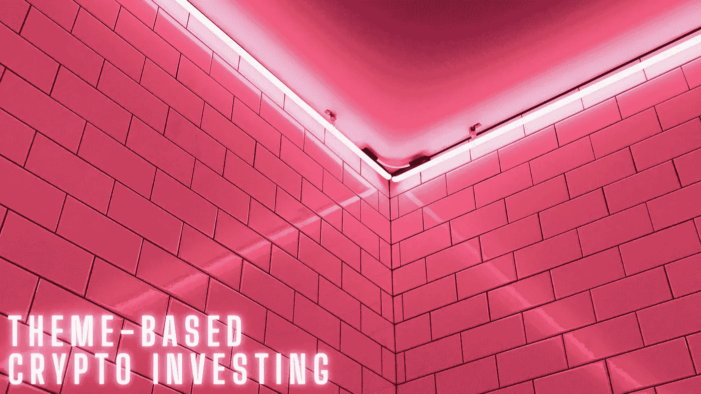
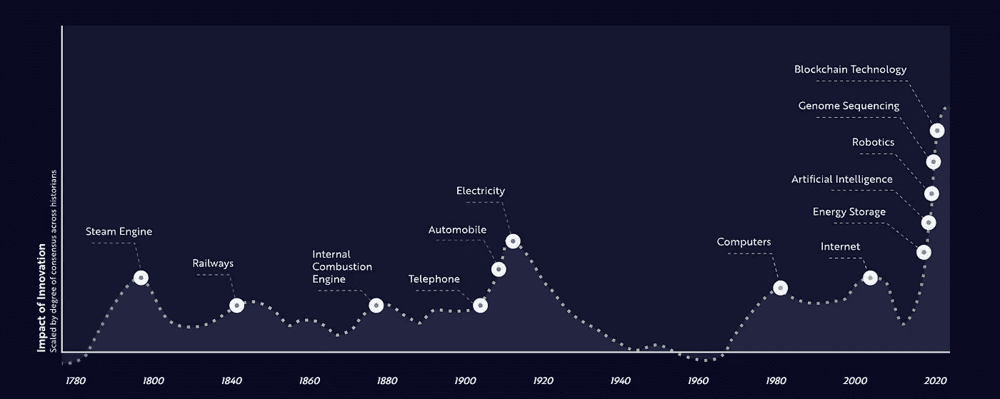
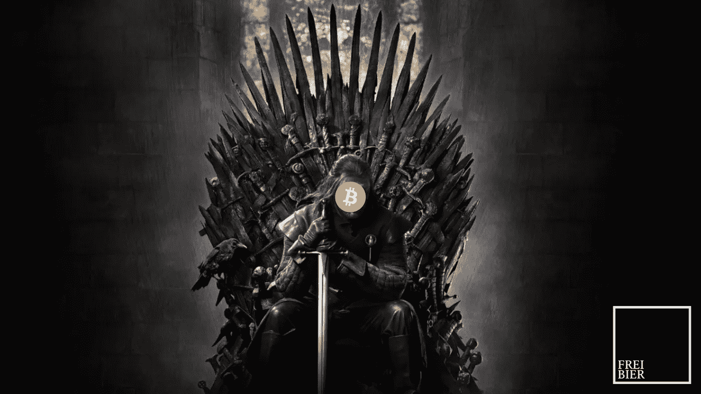
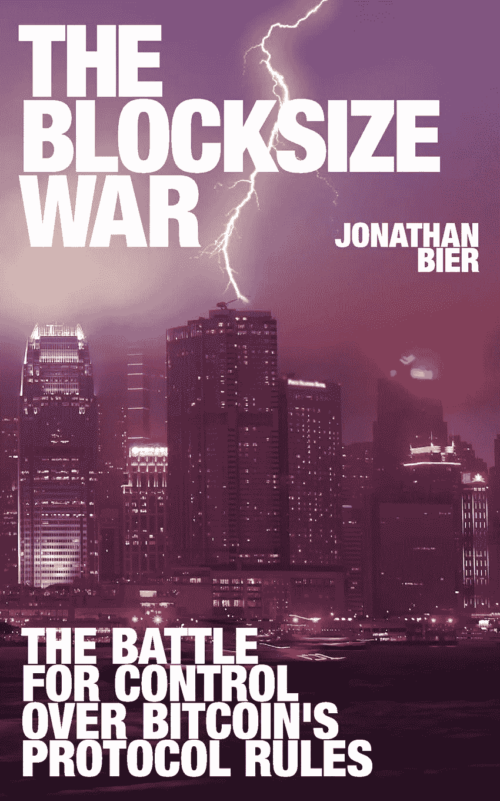
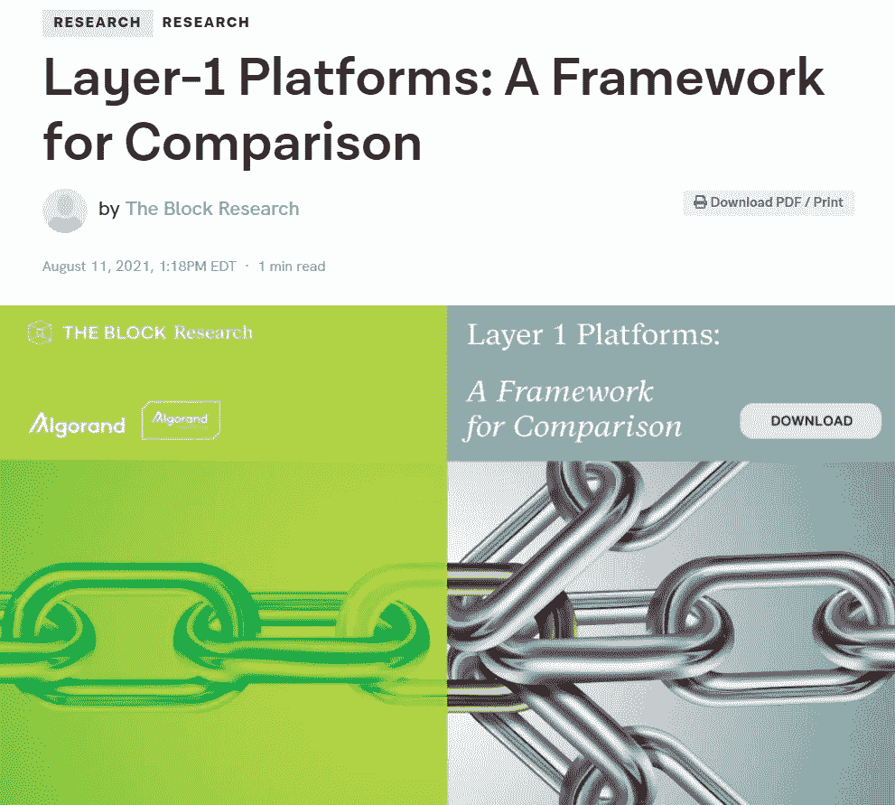
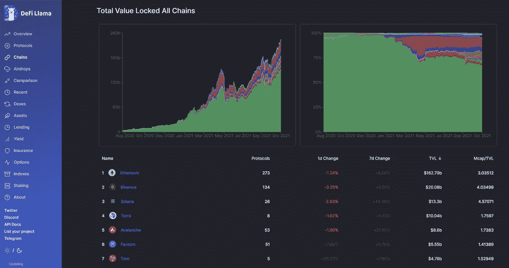
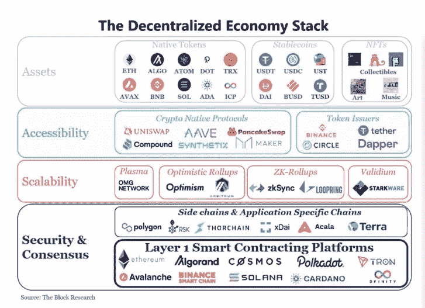

# 构建基于主题的加密组合—第 1 部分

> 原文：<https://medium.com/coinmonks/constructing-a-theme-based-crypto-portfolio-part-1-a2c76de1cc54?source=collection_archive---------14----------------------->

未来不会到来，它已经在这里了。因此，我对**凯西·伍兹、**[**方舟投资**](https://ark-invest.com/) **、****的创始人、首席执行官兼首席信息官非常着迷，他认为由于五个创新平台同时发展，全球经济正在经历历史上最大的技术变革。这五大创新平台分别是:**基因组测序、机器人、储能、人工智能、区块链技术**。**

****

**Source: Ark Invest**

**同样，**真实视觉**制作了一部特别的 5 集迷你剧:**[**指数时代**](https://www.realvision.com/the-exponential-age-mini-series) 。我链接了三个视频，你可以在 YouTube 上找到，在这方面绝对令人震惊。核心论点是，我们已经进入了一个时代，在这个时代，数字和物理路径最终汇聚，一切都被打乱了。****

****这些你一定要看！此外，如果你对学习加密货币感兴趣，你绝对应该注册 **Real Vision Crypto** 。这是免费的。****

****这是一个相当长的介绍，我有点偏离了真正的愿景——我的错。我的观点是，基于创新的投资组合相当不错，因此将这一概念借用到我们的加密投资组合中可能是个好主意。**截至 2021 年 9 月，已有超过 6500 种加密货币存在，对其中一些加密货币进行分类是有意义的，以便更好地对加密空间进行概念化。在构建加密组合时，这种方法也可以很好地为我们服务。因此，让我们深入研究一下一些常见的类别。******

# ******比特币******

********

****Bitcoin is king!****

******比特币是加密货币之王，因此它在自己的类别中占据至高无上的地位——恭喜你，上帝保佑你**！简单地说，这是你不能乱用的硬钱。不应该有争论。没有人控制它。没有政府，没有公司，没有中央银行，没有印钞机。这是一场和互联网一样大的革命。它像玻璃一样透明，像破碎球一样精细。我已经令人厌烦地探索了这个想法，它不需要进一步的阐述或证明。****

****请注意，有无数个直接或间接源自比特币主链的硬分叉。将加密货币区块链中的分叉概念化的最简单方法是想象该分叉为比特币引入了一套新的规则。****

****从这个角度来看，莱特币、比特币现金(BCH)和比特币黄金(BTG)几乎肯定会出现在脑海中。对于你们这些书虫和历史迷来说，我推荐阅读*乔纳森·比尔*的**《大块战争**》(好姓氏。德语 btw 中也有啤酒的意思)。****

********

****以下是来自**莱克斯·弗里德曼播客**的关于比特币核心价值、分层缩放和区块大小辩论的细致入微的讨论。****

******为了您的方便，请随意忽略比特币叉子。依我拙见，他们是在浪费时间。在这一点上，我完全站在比特币 maxi 阵营。我看不出它们有什么价值，因此我从来没有费心去阅读它们。浪费时间——在交易这些好东西时可能会有争论，但那不是我的茶。******

# ****智能合约平台****

********

****比特币(BTC)无疑已经改变了我们对金钱的看法。它从根本上改变了我们对谁控制它、如何控制它以及谁可以使用它的观念。**但比特币是更广泛的新兴去中心化经济的一部分，尽管是非常重要的一部分。如果说数字现金的引入打开了这一经济的大门，以太坊的智能合约则打开了大门。******

****那么什么是智能合约呢？**它们是指在区块链网络上部署和执行的计算机程序。它们正被用于促进各种功能，从分散的资产交换到分散的贷款，再到基于区块链的资产发行和令牌化。它们最初是由计算机科学家和密码学家 Nick Szabo 在 20 世纪 90 年代提出的。******

****在我让自己尴尬之前:聪明的合同很复杂，所以最好自己去读一读。**Block**有一篇关于第 1 层平台的出色[报告](https://www.theblockcrypto.com/post/114225/layer-1-platforms-a-framework-for-comparison)，这不仅是一篇出色的阅读材料，还将帮助你对这个领域的一些重要人物进行概念化。****

********

******足以说以太坊为王。目前是市值第二大的硬币，仅次于比特币。这里有一些视频可能会帮助你更好地理解以太坊的潜力。到目前为止，这应该是相当明显的，但让我们只是加倍，以防有人错过了机会。******

****然而，故事并没有在以太坊结束。随着以太坊的崛起，数十个智能签约平台相继推出。一些公司正在寻求提供一种易于采用的以太坊替代方案，挑战以太坊作为发布分散式应用程序的事实平台的地位。其他公司正在采取不同的方法，主要是让开发商在构建自己的区块链和创建基础设施以促进跨区块链的通信方面拥有最高水平的灵活性。****

****这就引出了一个问题:有人能废黜智能合约王以太坊吗？可以肯定的是，以太坊仍然是第一名，在过去的 30 天里稳定增长了 22%。然而，随着天然气费用似乎永远居高不下，其他区块链正在获得牵引力。**索拉纳**(索尔)以 36%的总锁定价值(TVL)从第五位攀升至第三位。 **Avalanche** (AVAX)和 **Fantom** (FTM)继续使用慷慨的激励措施来融化人脸，以超越落后的 **Polygon** (MATIC)。所有伟大的项目都有自己的权利，所以一定要去 DYOR。****

********

****Source: Defi Llama****

****[**Defi Llama**](https://defillama.com/) 是一个查看 Defi(分散金融)协议排名和指标的有用网站。因此，如果你去 **Defi Llama** 点击 chains，你将能够找到一大堆有前途的智能合同项目。附言:我非常看好，也就是说，或许有点愚蠢的是，索拉纳(SOL)、雪崩(AVAX)、T21(AVAX)、范顿(Fantom)、阿尔格兰德(Algorand)、ALGO()等。不用说，我错过了索拉纳的火车——我买得太晚了，但我认为从长远来看，它仍有巨大的好处。****

****下面是在**无银行播客**中关于索拉纳的微妙讨论。****

****来自[模块](https://www.theblockcrypto.com/post/114225/layer-1-platforms-a-framework-for-comparison)的下图进一步澄清了事情。请注意底部的第 1 层智能签约平台，这是我们关注的主题。忘了提**波尔卡多特** (DOT)和**卡尔达诺** (ADA)。后一个链仍在工作中，但一旦 Cardano 的智能合同平台启动并运行，它可能会非常成功，但他们的大规模社区围绕着富有远见的查尔斯·霍斯金森**，他是以太坊的共同创始人。******

********

****Source: The Block****

****查尔斯·霍金森是个有趣的人物。他的许多追随者喜欢他，其他人喜欢恨他。这是一个关于莱克斯·弗里德曼播客的史诗般的讨论，所以一定要下定决心。****

****我应该把这个包起来。这个帖子越来越失控了——没人想读一本没完没了的小说。**总之，我们关注了两个加密类别:比特币和第一层智能签约平台。重点学习的是比特币为王！以太坊是一个怪物，你最好在其他一些智能合约平台上 DYOR。随着传统的模拟世界进入数字领域，有巨大的优势，你最好相信这种转变正在到来。宏观、技术和数字资产同时融合。这影响到了 T4 的一切——这让股票市场看起来像是一场杂耍。******

****在下一篇文章中，我将关注 **DeFi** 和 **stablecoins** 。也许我会扔硬币进去。****

****祝你们分类愉快。****

****Frei Bier /推特:@FreiBIER13****

****声明:我的作品仅仅反映了我的学习之旅和我划分隐文的尝试。我正在大声地学习，所以请随意纠正我或不同意我的观点。这不是投资建议，但我希望你能在我的一些链接和想法中找到价值。作为一名前学者，我也意识到我需要提高我的解释和引用技巧。****

> ****加入 Coinmonks [电报频道](https://t.me/coincodecap)和 [Youtube 频道](https://www.youtube.com/c/coinmonks/videos)了解加密交易和投资****

## ****另外，阅读****

*   ****[如何购买 Monero](https://blog.coincodecap.com/buy-monero) | [IDEX 评论](https://blog.coincodecap.com/idex-review) | [BitKan 交易机器人](https://blog.coincodecap.com/bitkan-trading-bot)****
*   ****如何在 Bitbns 上购买柴犬(SHIB)币？ | [币安](https://blog.coincodecap.com/binance-in-india)****
*   ****[币安 vs 比特邮票](https://blog.coincodecap.com/binance-vs-bitstamp) | [比特熊猫 vs 比特币基地 vs Coinsbit](https://blog.coincodecap.com/bitpanda-coinbase-coinsbit)****
*   ****[如何购买 Ripple (XRP)](https://blog.coincodecap.com/buy-ripple-india) | [非洲最好的加密交易所](https://blog.coincodecap.com/crypto-exchange-africa)****
*   ****[非洲最佳密码交易所](https://blog.coincodecap.com/crypto-exchange-africa) | [胡交易所评论](https://blog.coincodecap.com/hoo-exchange-review)****
*   ****[eToro vs robin hood](https://blog.coincodecap.com/etoro-robinhood)|[MoonXBT vs Bybit vs Bityard](https://blog.coincodecap.com/bybit-bityard-moonxbt)****
*   ****[Stormgain 回顾](https://blog.coincodecap.com/stormgain-review) | [Bexplus 回顾](https://blog.coincodecap.com/bexplus-review) | [币安 vs Bittrex](https://blog.coincodecap.com/binance-vs-bittrex)****
*   ****[Bookmap 评论](https://blog.coincodecap.com/bookmap-review-2021-best-trading-software) | [美国 5 大最佳加密交易所](https://blog.coincodecap.com/crypto-exchange-usa)****
*   ****[如何在 FTX 交易所交易期货](https://blog.coincodecap.com/ftx-futures-trading) | [OKEx vs 币安](https://blog.coincodecap.com/okex-vs-binance)****
*   ****[如何在势不可挡的域名上购买域名？](https://blog.coincodecap.com/buy-domain-on-unstoppable-domains)****
*   ****[印度的秘密税](https://blog.coincodecap.com/crypto-tax-india) | [altFINS 审查](https://blog.coincodecap.com/altfins-review) | [Prokey 审查](/coinmonks/prokey-review-26611173c13c)****
*   ****[布洛克菲 vs 比特币基地](https://blog.coincodecap.com/blockfi-vs-coinbase) | [比特坎评论](https://blog.coincodecap.com/bitkan-review) | [币安评论](/coinmonks/binance-review-ee10d3bf3b6e)****
*   ****[Coldcard 评论](https://blog.coincodecap.com/coldcard-review) | [BOXtradEX 评论](https://blog.coincodecap.com/boxtradex-review)|[uni swap 指南](https://blog.coincodecap.com/uniswap)****
*   ****[阿联酋 5 大最佳加密交易所](https://blog.coincodecap.com/best-crypto-exchanges-in-uae) | [SimpleSwap 评论](https://blog.coincodecap.com/simpleswap-review)****
*   ****[购买 Dogecoin 的 7 种最佳方式](https://blog.coincodecap.com/ways-to-buy-dogecoin) | [ZebPay 评论](https://blog.coincodecap.com/zebpay-review)****
*   ****[iTop VPN 审查](https://blog.coincodecap.com/itop-vpn-review) | [曼陀罗交易所审查](https://blog.coincodecap.com/mandala-exchange-review)****
*   ****[美国最佳加密交易机器人](https://blog.coincodecap.com/crypto-trading-bots-in-the-us) | [变化回顾](https://blog.coincodecap.com/changelly-review)****
*   ****[A-Ads 审查](https://blog.coincodecap.com/a-ads-review) | [Bingbon 审查](https://blog.coincodecap.com/bingbon-review) | [Mudrex 投资](https://blog.coincodecap.com/mudrex-invest-review-the-best-way-to-invest-in-crypto)****