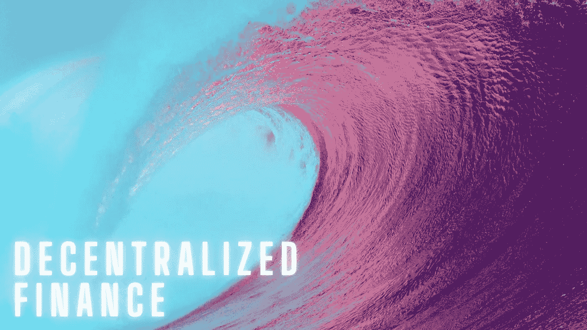
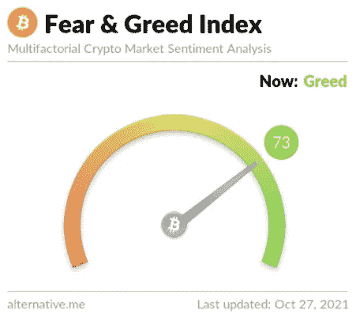
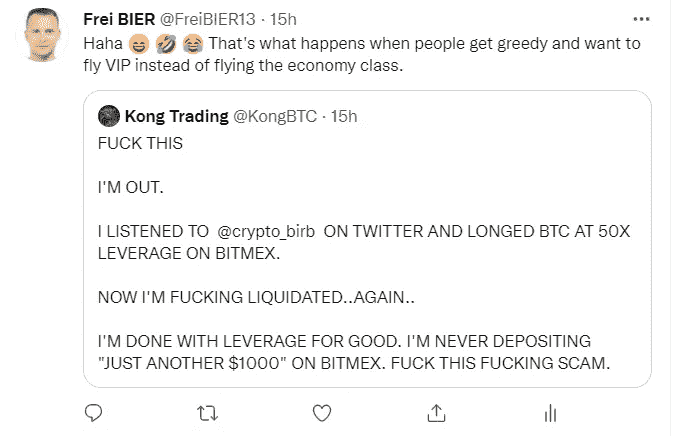
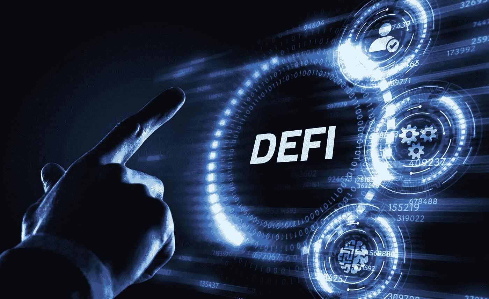
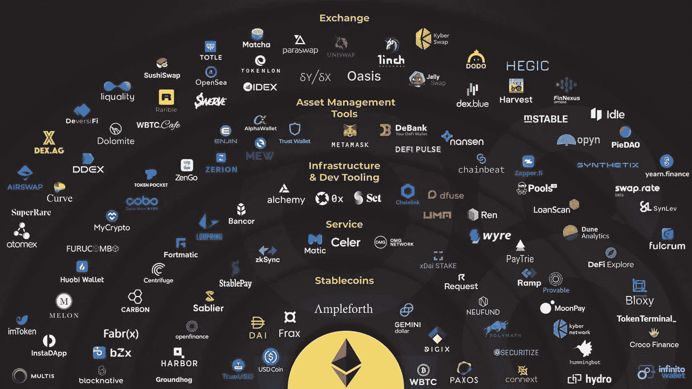
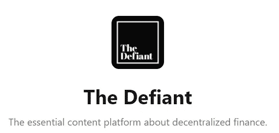
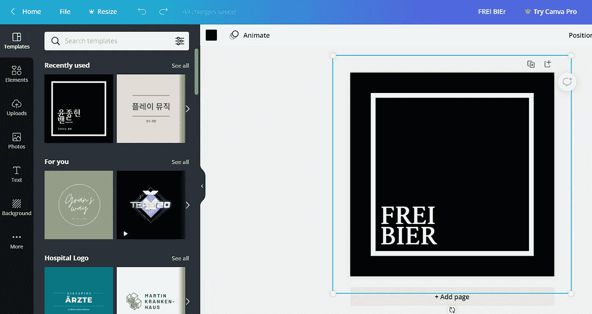
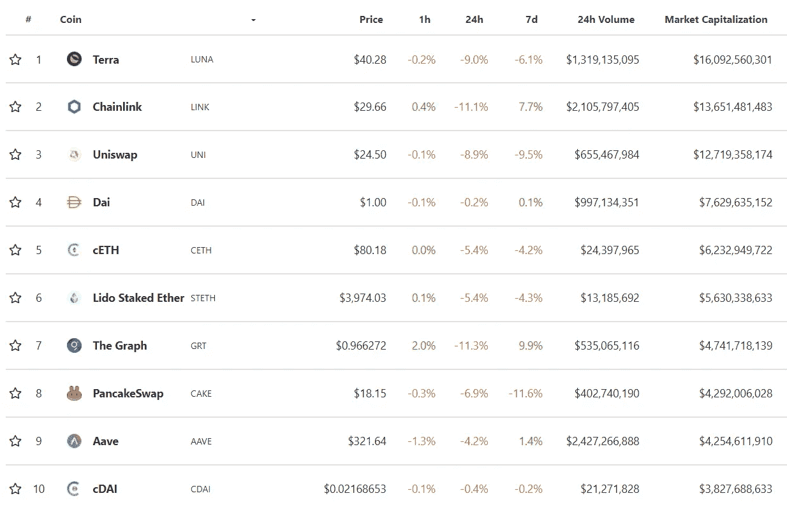

# 构建基于主题的加密组合—第 2 部分

> 原文：<https://medium.com/coinmonks/constructing-a-theme-based-crypto-portfolio-part-2-48dde3f288b7?source=collection_archive---------6----------------------->

DeFi’ing the Wave of Change

加密市场非常不稳定，因此参与者可能表现得非常情绪化。当市场上涨时，人们往往会变得贪婪，这导致了 FOMO。此外，人们经常在看到红色数字时做出不理智的反应，卖掉他们的硬币。我最近发现了 [**恐惧和贪婪指数**](https://alternative.me/crypto/fear-and-greed-index/) ，这是一些投资者用来衡量市场的工具。目前，市场情绪为 73，表明贪婪盛行。

Greed & Fear Index

在秘密牛市中，肆无忌惮的贪婪会导致股票被哄抬到远远高于其应有价值的水平。这反过来又吸引了杠杆，这本质上既不好也不坏——只是在大多数情况下会导致大规模清算。这可能需要进一步的解释。

那么什么是杠杆？本质上，杠杆交易平台允许其“用户”用借来的现金进行交易。( [**旁注**](https://www.ted.com/talks/manoush_zomorodi_how_boredom_can_lead_to_your_most_brilliant_ideas/transcript?language=en)**——Mano ush Zomorodi 正确地指出，称客户为“用户”的人只有毒贩和技术人员)。**杠杆化允许交易者在加密资产中持有比其通常持有量更大的头寸。

在最好的情况下，这可以让交易者获得天文数字的收益。然而，在少数情况下，杠杆交易会导致清算。这是为什么呢？

匹配交易技术很好地解释了这一点。想象一下，你用 50%的保证金花 5000 美元现金购买 100 个价值 50 美元的加密令牌。一个月后，这些代币每张价值 70 美元。这意味着你的资产现在价值 7000 美元；如果你卖了，你的利润是 2000 美元。如果没有利润，你的利润会减少 50%。

但是如果你用 5000 美元的杠杆头寸购买 100 个价值 50 美元的加密令牌，而它们的价格缩水了 30%，那会怎么样呢？你持有的股票现在价值 3000 美元，你损失了 2000 美元，是没有保证金时的两倍。

为了防止这种极端损失，大多数加密交易所都实施了一套“卖出触发器”，以确保交易者能够偿还债务。换句话说，当资产价格过低时，平台会自动清算用户持有的资产。

这正是昨天(2021 年 10 月 28 日)发生的事情，比特币在闪电崩盘后跌破 59000 美元，比本周早些时候的交易水平下跌了 5000 多美元。

**长话短说，非专业人士请勿杠杠。**这是我的一条微博——**幸灾乐祸**最精彩的部分。

最好是坚持基于主题的加密投资组合，使你能够在特定主题或故事上**利用**，而不是仅仅因为它在社交媒体上流行就跳到最新的 FOMO 硬币上。你听懂**双关语**了吗？

在 [**构建基于主题的加密投资组合—第 1 部分**](https://freibier.medium.com/constructing-a-theme-based-crypto-portfolio-part-1-a2c76de1cc54) 中，我们研究了比特币、以太坊和其他智能工具—智能合约平台。如果你更保守，而不是一个**堕落者**(退化者**的简写**——一个经常自我应用的术语，指具有高风险偏好的加密用户，他们从事投机交易)，那么你应该持有比特币(BTC)、以太坊(ETH)和一篮子其他硬币，如 Polkadot (DOT)、Cardano (ADA)、Solana (SOL)等。**小百分比可以也应该去一些德根项目放狗出来。**去拿那 100000 倍的回报吧——恭喜你！

今天，我们将探索分散金融(DeFi)的迅猛发展。女士们先生们，现在开始。

# 分散融资

DeFi 是一种总部位于区块链的金融形式，它不依赖经纪公司、交易所或银行等中央金融中介来提供传统的金融工具，而是利用区块链的智能合约，最常见的是以太坊。

更具体地说，DeFi 指的是一种系统，通过这种系统，写在区块链上的软件使买方、卖方、贷款人和借款人能够进行对等互动，或者与严格基于软件的中间人进行互动，而不是通过公司或机构来促进交易。

Source: [Cool Wallet](https://www.coolwallet.io/what-is-defi-guide-to-decentralized-finance/)

简而言之，DeFi 就是没有银行的金融应用生态系统**。当然，现在我们在谈了。DeFi 让我很兴奋，因为我现在正处于一种疯狂的状态。这里有一段视频会让你兴奋不已，让你想带着头套和燃烧弹去银行。由 **Peter McCormack** 、 **Simon Dixon** 和 **Bill Barhydt** 就 [**比特币做了什么播客**](https://www.whatbitcoindid.com/) 进行的非常有趣的讨论。**

**事实上，帮你自己一个忙——看看西蒙·迪克森的 YouTube 频道。他的内容很棒。也可以在 YouTube 上搜索对**比尔·巴尔海德特**的采访，比尔·巴尔海德特是一位连续创业者，也是加密货币投资应用[T5【凯西】T7【的创始人兼首席执行官。普埃金！这是比尔和迈克尔·塞勒一起做的视频。](https://www.abra.com/)**

**简而言之，财富管理、借贷、高收益和投资都将是以密码为中心的。银行当心了——赤字即将到来，比尔正确地指出，他看不到任何银行不完蛋的情景；他们只是还不知道。同意！**

> **对我来说，这看起来就像 1995 年在互联网上被干的那些人，他们只是不知道而已。**比尔·巴尔海德****

**进修课程——大约 20 年前，当 Amazon.com 卖出第一本书时，Borders Books & Music 是一个繁荣的零售帝国，年销售额约为 16 亿美元。今天，边界只不过是一个记忆，被亚马逊领导的电子商务革命带入了坟墓。**

**对于那些想更深入了解 DeFi 基础知识的人，我推荐 **The Defiant** [网站](https://thedefiant.io/defi-101/)。他们有你熟悉这个新兴行业所需的一切。当然，他们对事情的解释比我清楚得多。这里有一段吉姆·比安科的视频，他可以很好地解释这个问题。：**

> **我试着告诉人们 DeFi 它会来到这里，把你彻底压扁。吉姆·比安科**

**此外，让我们快速解决房间里的大象。我刚刚注意到，挑衅的标志是类似于我的。**

****

**我要说的是，英雄所见略同——向《挑战》杂志的人致敬。我真的不知道，因为我使用了提供模板的****。不应该有任何版权问题，因为我的读者可以指望一方面反正。******

************

******DeFi 正在吞噬世界，有太多的 DeFi 项目在争夺世行的午餐。我不能列出或讨论所有的 DeFi 项目，因为它们太多了。请随便吃。如果你是风险厌恶者，而不是德根，那么只需放大 10 大 DeFi 项目。你可以在 Coingecko 上找到它们。******

************

******Source: Coingecko******

******用这个列表作为跳板，掉进 DeFi 世界的兔子洞。我建议看看 **The Bankless Podcast，Real Vision Crypto，或 The Unchained Podcast，**开始你的旅程。******

****我提供了三个链接，可以让你了解 **Uniswap (UNI)** 、 **Chainlink (LINK)** 和 **Aave (AAVE)** 。****

****总之， **DeFi 是一个总括术语，涵盖了在没有任何中介(如银行、保险或票据交换所)的情况下运行的金融系统的愿景。**自 2020 年以来，DeFi 正以惊人的速度增长，已经向生态系统投入了数十亿美元。**毫无疑问，DeFi 将成为传统金融解决方案的替代品。因此，任何基于主题的加密组合都应该包含一些 DeFi 项目。******

****我将给你们留下最后的评论，即视频。吉姆·比安科(Jim Bianco)是一位传统的金融老手，他明白这一点。**所以不要相信我的话，但请听一位经验丰富的专业人士谈论 DeFi。这应该给你足够的思想食粮——或者更糟，让你掉进兔子洞。******

****祝你们快乐。****

****Frei Bier /推特:@FreiBIER13****

****声明:我的作品仅仅反映了我的学习之旅和我划分隐文的尝试。我正在大声地学习，所以请随意纠正我或不同意我的观点。这不是投资建议，但我希望你能在我的一些链接和想法中找到价值。作为一名前学者，我也意识到我需要提高我的解释和引用技巧。****

> ****加入 Coinmonks [电报频道](https://t.me/coincodecap)和 [Youtube 频道](https://www.youtube.com/c/coinmonks/videos)了解加密交易和投资****

## ****也阅读****

**** [## 最佳加密交易所| 2021 年十大加密货币交易所

### ICON _ PLACEHOLDEREstimated 预计阅读时间:28 分钟加密货币交易所的加密交易需要知识…

blog.coincodecap.com](https://blog.coincodecap.com/crypto-exchange)  [## 2021 年 10 大最佳加密贷款平台| CoinCodeCap

### 当谈到加密货币贷款时，大量因素等同于良好的收入状况。此外，借款的一部分…

blog.coincodecap.com](https://blog.coincodecap.com/crypto-lending)  [## 2021 年最佳免费加密交易机器人

### 2021 年币安、比特币基地、库币和其他密码交易所的最佳密码交易机器人。四进制，位间隙…

medium.com](/coinmonks/crypto-trading-bot-c2ffce8acb2a)  [## 最佳 4 个加密交易信号电报通道

### 这是乏味的找到正确的加密交易信号提供商。因此，在本文中，我们将讨论最好的…

medium.com](/coinmonks/best-crypto-signals-telegram-5785cdbc4b2b)  [## BlockFi 评论 2021:利弊和利率| CoinCodeCap

### 今天，我们提出了一个全面的 BlockFi 评论，这是一个成立于 2017 年的加密贷款平台，拥有其…

blog.coincodecap.com](https://blog.coincodecap.com/blockfi-review)  [## 如何在印度购买比特币？2021 年购买比特币的 7 款最佳应用[手机版]

### 如何使用移动应用程序购买比特币印度

medium.com](/coinmonks/buy-bitcoin-in-india-feb50ddfef94)  [## 加密税务软件——五大最佳比特币税务计算器[2021]

### 不管你是刚接触加密还是已经在这个领域呆了一段时间，你都需要交税。

medium.com](/coinmonks/best-crypto-tax-tool-for-my-money-72d4b430816b)****