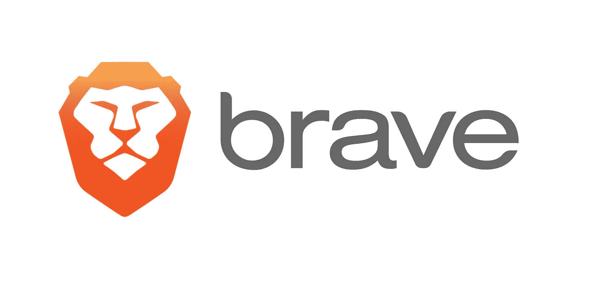

# 勇敢浏览器的建设性反馈

> 原文：<https://medium.com/coinmonks/constructive-feedback-for-the-brave-browser-9f08b422a05?source=collection_archive---------3----------------------->

# 更新 2019

这篇文章中的大部分内容与基于 Chromium 的最新版本的 Brave 不再相关。现在这款浏览器和 Chrome 一样可靠，但是没有谷歌的追踪器，也没有广告。[现在就下载](https://brave.com/download/)吧。

# 介绍

为了支持去中心化，我决定尝试一下勇敢的浏览器。玩了 2 个星期后，我现在既感动又失望。

简单地说，销售和体验是相似的。你确实可以获得无广告浏览，算法足够智能，可以避开那些“请禁用广告拦截器”的横幅。

然而，有几个小问题加在一起迫使我切换回 Chrome。让我们从正反两方面来看看。

# 赞成的意见

## 分散

最大的好处！这个项目周围有一个很大的社区，他们做得非常出色，我迫不及待地想看看 [BAT](https://www.basicattentiontoken.org/) 对观看广告的奖励。

## 设计为私有

勇敢还可以防止机器人跟踪你。你可以控制自己的隐私。

## 无广告

比普通广告拦截器好 10 倍，因为没有额外的扩展，它避免了麻烦的横幅。

## 稍微快一些

这仅仅是基于经验证据，但我注意到加载时间略有减少。

# 骗局

## 偶尔冻结

很多时候，当我启动一个新的标签，勇敢只是停止工作。超过 5 秒钟没有识别到点击或击键。这在其他浏览器上不会发生，因为我有足够的内存(16GB)。

## 扩展ˌ扩张

没有对所有其他 Chrome 扩展的原生支持，你必须遵循特定的教程来添加另一个。我没有足够的时间做那件事+有更多的熵通常意味着更多的错误。

## 固定标签新窗口

新窗口包括以前固定的标签页！这是相当恼人的，因为当我研究一个完全不同的主题(与当前窗口没有任何联系)时，我不想把我的电子邮件等放在那里。

有一个 GitHub [问题](https://github.com/brave/browser-laptop/issues/12614)正在追踪这个问题，不幸的是，在勇敢核心发布之前它不会被修复。

## 锁定标签重新排序

在 Chrome 上，我把我经常使用的网络应用钉在左上角(收件箱、LinkedIn 等)。这在 Brave 中也是可行的，但是在排序算法中有严重的错误。

有时，你甚至不能重新排序它们，而其他时候，它只是错误地放弃了引脚。

这个特定的骗局听起来可能有点强迫症，但我的反应是根深蒂固的，我需要能够点击第一个标签，从那里打开我的电子邮件。

## **媒体会话(使用 Twitter 登录)**

迄今为止最重大的问题！我在 Medium 上登录 Twitter 后，会话在下一次页面刷新时被关闭。

作为一个媒体超级用户，一直鼓掌和做笔记对我的认知健康至关重要。

# 结论

我很期待再次使用 Brave，但目前(截至 2018 年 6 月)弊大于利，至少对我来说是这样。

总之，很多👏为团队到目前为止所做的一切！！如果你想查看浏览器，从[这里](https://brave.com/)获取。

> 这篇文章的范围是为 Brave 提供建设性的批评，因为我是他们使命的忠实信徒。去中心化的浏览器可能会为过多的酷 dApps 铺平道路。

想聊天就在 [**Twitter**](https://twitter.com/PaulRBerg) 或者 [**Keybase**](https://keybase.io/PaulRBerg) 上找我。