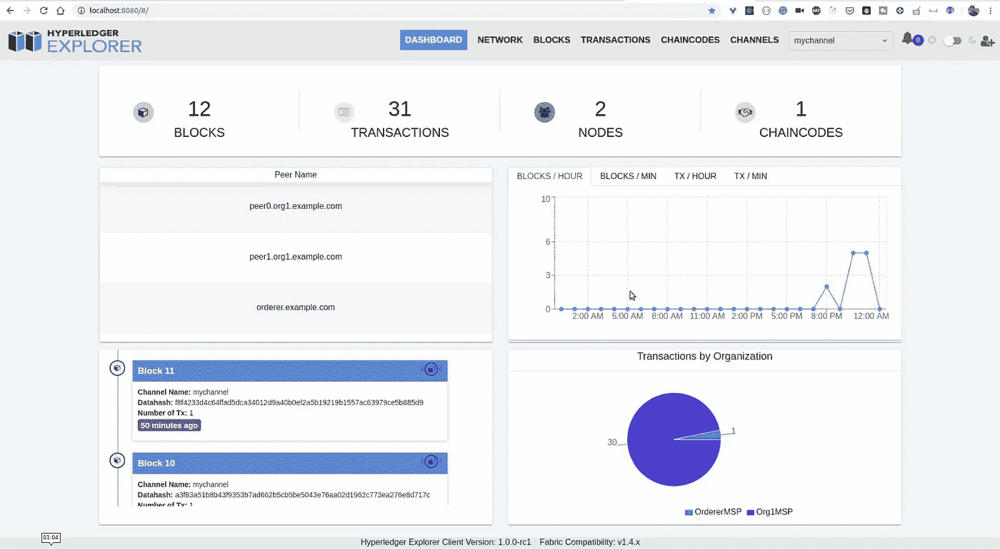

# 将区块链浏览器容器化，并与现有的 Hyperledger 结构网络集成。

> 原文：<https://medium.com/coinmonks/containerizing-blockchain-explorer-and-integrate-with-existing-hyperledger-fabric-network-50a0737b7a81?source=collection_archive---------1----------------------->

Photo by [Launchpresso](https://unsplash.com/@launchpresso?utm_source=unsplash&utm_medium=referral&utm_content=creditCopyText) on [Unsplash](https://unsplash.com/s/photos/hyperledger--blockchain?utm_source=unsplash&utm_medium=referral&utm_content=creditCopyText)

在不同的机器上设置本地网络是一项非常具有挑战性的任务，这里我们将使用 docker 的强大功能创建一个 docker 映像，然后在任何地方运行。

在本文中，我们将创建一个区块链 explorer 映像，并将其与现有的区块链网络集成。我假设你已经知道如何创建一个工作的 Hyperledger 结构网络，如果没有，你可以通过我的 youtube 系列。

这个街区会很短很简单，因为我们不需要照顾很多东西。我们开始吧。

我创建了 Youtube 视频集装箱区块链探险家，并与您自己的结构网络集成。

从[克隆 git repo 到这里](https://github.com/adhavpavan/ContainerisingBlockchainExplorer.git)。

打开 docker-compose 文件，如下图所示。

这里我们为
1 定义了两个服务。区块链探索者
2。一种数据库系统

我们唯一需要添加的是安装卷。

1.  配置. json

这里我们定义了 profile: fabric-network.json，它位于 connection-profile 文件夹中。

2.fabric-net . JSON

在此文件夹中，我们提到了连接结构网络所需的配置。这里我们将从 peer0 获取数据。如果您想要获取任何其他对等体的数据，您可以根据每个对等体的配置进行必要的更改。

**从你工作的光纤网络中复制加密配置文件夹，并粘贴到回购协议中。您可以替换现有文件夹。**

注意:请提供具有正确名称的组织管理私钥。对于不同版本的加密二进制文件，其生成如下:
1。1 bebc 656 f 198 efb 4b 5 bed 08 ef 42 cf 3 b 2d 89 AC 86 f 0 a6b 928 e7a 172 FD 823 df0a 48 _ sk

2.priv_sk

转到主文件夹(存储库)并运行以下命令

> docker-撰写向上-d

这个命令将启动两个服务，根据您导出的端口，您可以访问 localhost:8080 上的 UI

如果在 localhost:8080 上看不到任何正在运行的东西，请用下面的命令检查容器的日志。

> 码头工人日志 explorer.mynetwork.com-f

请根据错误日志，在特定文件中进行必要的更改。

清洗网络:运行以下命令停止并移除两个容器

> docker-向下合成

如果你遇到任何问题，请告诉我，我很乐意帮助你。你可以通过 linked in 或 Instagram 与我联系。
https://www.instagram.com/pavanadhavofficial/
https://www.linkedin.com/in/pavan-adhav/

谢谢你。

# 参考

*   [https://github.com/hyperledger/blockchain-explorer](https://github.com/hyperledger/blockchain-explorer)
*   [https://hyperledger-fabric . readthedocs . io/en/release-1.4/prereqs . html](https://hyperledger-fabric.readthedocs.io/en/release-1.3/prereqs.html)
*   https://www.postgresql.org/

> [在您的收件箱中直接获得最佳软件交易](https://coincodecap.com/?utm_source=coinmonks)

