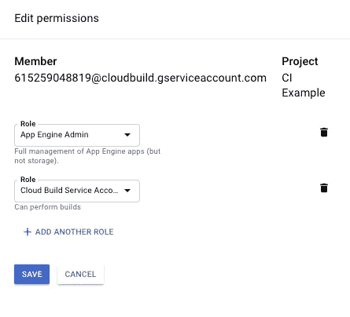

# 与 Google 应用引擎和 Travis 的持续集成

> 原文：<https://medium.com/coinmonks/continuous-integration-with-google-application-engine-and-travis-d822b751fb47?source=collection_archive---------0----------------------->


本文旨在帮助开发人员将应用程序部署到 Google Application Engine，期望如下:

*   Github 存储库(在我们的例子中是 Typescript express 应用程序)
*   可以使用 Docker 在本地构建和运行应用程序
*   使用 Travis 执行 PR 合并检查(lint/测试)
*   使用主==生产和开发==集成的分支策略(目前没有 QA 或阶段)
*   谷歌云开发账户

带着以上的期望，我们开始吧。

## 设置和验证

*确保你已经安装了* [*谷歌云 SDK*](https://cloud.google.com/sdk/docs/quickstart-macos) *并且功能正常*

在 Google Cloud 控制台中创建一个项目，并记下项目 id


您将需要派生示例存储库，以便您能够在这个 repo 的后面触发构建。导航至[https://github.com/cipherzzz/vertigo-cicd-example](https://github.com/cipherzzz/vertigo-cicd-example)并点击*分支*链接。


```
 # Clone your forked example application repo
git clone [https://github.com/<git user>/<](https://github.com/cipherzzz/vertigo-cicd-example)repo name>cd <repo name>#Verify that everything runs locally
npm install && npm run build
npm run start
```

转到 [http://localhost:8080](http://localhost:8080) ，您应该会看到类似这样的内容


继续停止这个革命性的 web 应用程序，让我们验证我们的 docker 配置和构建是好的

```
# Locally build and tag
docker build -t local .# Run locally and verify 'errbody tipsy'
docker run -p 8080:8080 local
```

假设上面的一切进展顺利，让我们继续手动部署应用程序的默认版本，作为第一步。

*这样做可以设置一个服务帐户和一些其他参数，我们必须在谷歌控制台中完成。此外，项目必须有一个名为“default”的服务，作为部署到它的第一个服务。耸肩。*

## 默认服务的手动部署

尽管我们正在为我们的项目设置 CI/CD 环境，但是部署到我们的 App Engine 项目的第一个服务必须是 name *default。*我们现在就去做，并验证结果。

```
# Login to Google Cloud from the CLI
gcloud auth login# From our app's home dir
gcloud config set project <project-id(mine: ci-example-218319)># Manually deploy the default version per gae's requirement
gcloud app deploy app.yaml
```

部署应该需要 5-10 分钟，在结束时，如果您转到**App Engine =>Services**，您应该会看到如下内容


*请注意，点击“默认”将打开应用*

既然我们已经部署了这个默认服务，并且已经验证了它运行正常，那么我们需要准备使用云部署 API。

*   您需要启用**云构建** API( *搜索‘云构建’*)
*   您还需要通过转到**IAM&Accounts =>Service Accounts**来验证您是否拥有具有部署功能的**服务帐户**


现在我们已经启用了 API，服务账户也开始工作了，我们可以设置我们的**构建触发器**来构建您的分叉库。

## 设置配置项环境

我们将设置云部署来监控分支机构，并在提交后开始构建。这是一个非常有用的服务，因为它发生在云实例上，所以您不需要将任何导出的安全密钥放入 travis 或 jenkins 实例中。

*有趣的是——我对自己的凭证很宽松，有人用它们购买了 150 美元的谷歌广告，所以我强烈建议不要部署在谷歌云之外。*

**建造触发器**

1.  导航到*云构建= >构建触发器= >创建触发器*
2.  选择 *Github* 并完成 OAuth 过程
3.  选择您的分叉存储库
4.  输入*名称，*选择*分支*，输入*主控*
5.  选择 *cloudbuild* 作为*构建配置*
6.  输入*/ci/prod/cloud build . YAML*作为位置
7.  *制造*的导火索


现在，在新创建的触发器上点击*运行触发器*。


点击*云构建*和*链接*到你的运行构建。如果您看到如下所示的错误，导航到给定的 url，单击 *Enable* ，并像以前一样再次手动触发构建。

```
ERROR: (gcloud.app.deploy) User [615259048819@cloudbuild.gserviceaccount.com] does not have permission to access app [ci-example-218319] (or it may not exist): App Engine Admin API has not been used in project 615259048819 before or it is disabled. Enable it by visiting https://console.developers.google.com/apis/api/appengine.googleapis.com/overview?project=615259048819 then retry. If you enabled this API recently, wait a few minutes for the action to propagate to our systems and retry.
```

如果您仍然收到类似下面的错误，您需要向您的云构建服务帐户添加应用引擎部署权限。

```
ERROR: build step 0 "gcr.io/cloud-builders/gcloud" failed: exit status 1
ERROR
ERROR: (gcloud.app.deploy) Permissions error fetching application [apps/ci-example-218319]. Please make sure you are using the correct project ID and that you have permission to view applications on the project.
```

导航到 IAM & accounts，找到具有*云构建服务帐户*角色的帐户。


编辑该帐户，并向其添加*应用引擎= >应用引擎管理员*角色



再次尝试构建…应该会成功，5-10 分钟后，您应该会看到一个新的服务出现。我们有意地检查了这些错误条件，以向您展示如何理解部署 api 权限问题，这是我自己第一次开始处理这个问题时的一个问题。

在我们的构建历史中，我们看到了两件与这个触发的构建相关的事情。我们可以看到创建的工件(docker ),以及部署的应用程序。


这里我们看到了来自我们的*主*构建触发器的已部署的*产品*服务


## 再做一次

既然我们已经有了主分支的构建和部署，我们需要为开发分支创建另一个构建触发器。

1.  导航到*云构建= >构建触发器= >创建触发器*
2.  选择 *Github* 并完成 OAuth 过程
3.  选择您的分叉存储库
4.  输入*名称，*选择*分支*，输入*制定*
5.  选择 *cloudbuild* 作为*构建配置*
6.  输入*/ci/dev/cloud build . YAML*作为位置
7.  *创建*触发器

现在，在新创建的触发器上点击*运行触发器*。构建成功后，您应该会看到以下内容。


## 超时…

## 我们做了什么？

到目前为止，我们已经完成了以下工作:

*   安装了 Google Cloud SDK，并在我们的应用引擎项目中部署了默认的应用版本
*   从我们新创建的构建触发器中手动启动生产和集成构建

## 我们还剩下什么？

我们仍然需要做以下工作:

*   配置我们的 *Github* 项目来使用 *Travis*
*   配置我们的 *Github* 项目，在所有*拉请求(PR)* 的基础上运行 *Travis* 构建，作为合并的先决条件

## 特拉维斯。

帮你自己一个忙，在 https://travis-ci.org/[为 travis 创建一个账户](https://travis-ci.org/)。进入主屏幕后，单击*我的存储库*旁边的+


然后找到您的存储库并打开它


现在转到这个回购的新 travis 构建，手动触发构建来测试它。请注意，它可能需要一段时间才能启动—放松，这是免费的。


我们的 travis 构建检查以下内容:

*   我们的 docker 构建是功能性的(应用引擎使用 Docker 容器，所以这很重要)
*   我们的代码通过了 lint 检查、编译和测试

这是我们的 *travis.yml*


在我们的仪表板中，一个成功的构建应该是这样的


现在我们已经配置了 travis，让我们配置 github 项目，在所有 PR 和 merge 活动中自动运行 travis。

## 开源代码库

在开发和母版上配置一个类似于下图的规则。您可以根据自己的喜好进行调整，但最终我们希望对我们分支的所有代码更改都经过代码审查。请注意，在底部，我们已经检查了 *Travis CI* 来运行推送分支和拉取请求。


添加规则后，您应该会看到以下内容:


现在，从 develop 中创建一个特性分支，做一个小的改变，并推动特性分支来观察新的行为

```
git checkout develop && git pull origin develop
git checkout -b travis# Make the logic.ts => getTestPayload() return 'nobody' instead of 'errbody'git commit -am "small change to test travis"
git push origin travis
```

现在，您应该在 github repo 中看到以下内容


点击*比较和拉动请求*并创建拉动请求。我的 travis 测试失败了，因为我的代码更新了，但我的测试没有更新。


修复*逻辑规格*后，PR 看起来像这样


请注意，我们的 travis 构建正在通过！我没有任何人可以审查我的公关，所以我将使用我的管理权限，并将其与前一个图像中显示的按钮合并。一旦这种合并发生，我们应该有一个由 Google Cloud 中监视开发分支的构建触发器启动的集成构建。


我们做到了！这将最终完成，并添加一个新版本到我们的应用程序引擎上部署的集成服务，没有人会喝醉。


## 我们学到了什么？

这是一篇很长的文章，但是我们现在已经有了一个基本的*持续集成/开发*管道，包括 *Github、Travis 和 Google App Engine* 。希望你已经学到了足够的知识，可以用这些信息来改进你的下一个项目或现有的项目。作为复习，这些是我们学过的高级项目

*   安装了 Google Cloud SDK，并在我们的应用引擎项目中部署了默认的应用版本
*   在*云部署*中为*主*和*开发*分支创建构建触发器，并手动验证构建
*   配置我们的 Github 项目来使用 Travis
*   配置我们的 *Github* 项目，在所有*拉请求(PR)* 的基础上运行 *Travis* 构建，作为合并的先决条件
*   已验证开发或主控合并是否会触发成功的*云部署*构建

> [直接在您的收件箱中获得最佳软件交易](https://coincodecap.com/?utm_source=coinmonks)

[](https://coincodecap.com/?utm_source=coinmonks)