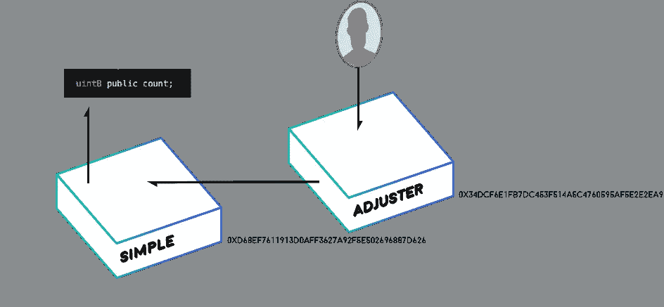

# 合同对合同通信

> 原文：<https://medium.com/coinmonks/contract-to-contract-communication-a98a708960ef?source=collection_archive---------0----------------------->



这篇文章建立在上一篇文章[中部署的**简单**合同的基础上，将智能合同部署到以太坊](/@austin_48503/deploying-a-smart-contract-to-ethereum-86daed0ff69)。

合同对合同的通信是任何区块链舰队的重要组成部分。正如在[合同谱系章节](https://concurrence.io/abstract/contractlineage/)中所讨论的，以太坊上的复杂项目应该使用一组更小的微服务来构建，以避免复杂性。

我们还将探索智能合约的其他一些特性，如所有权和事件。

让我们分析第二个契约，我们称之为**调整器**，它将与我们的**简单**契约接口:

**调整器**契约具有 **adjustTo()** 功能，该功能将添加到**简单**契约的计数中，以将其调整为**_ 目标**值。

还有一个**所有者** *地址*的概念。这是在合同部署中设置的，当调用 **adjustTo()** 时，我们检查以确保**消息发送者**是**所有者**。

还有一个名为 **Adjusted** 的*事件*，当 **adjustTo()** 函数改变**计数**时，该事件被触发。事件仅在链外可见，但它们对于调试、触发链外动作，甚至相对廉价的存储非常有用。

我们可以用以下代码编译**调节器**:

```
node compile Adjuster
```

我们还需要加入一个 **dependencies.js** 来包含 **Simple.sol** :

```
const fs = require('fs'); 
module.exports = {   
 'Simple.sol': fs.readFileSync('Simple/Simple.sol', 'utf8') 
}
```

然后我们用以下工具展开**调节器**:

```
node deploy Adjuster
```

这份合同比上一份稍微大一点，所以部署成本稍微高一点:

```
==ETHER COST: 0.005155854000000001 $1.8045489000000006
```

**调节器**rops ten 上的地址:

```
0x34dcf6e1fb7dc453f514a5c4760595af5e2e2ea9
```

现在让我们编写几个脚本来与这个契约进行交互。首先，我们希望一个名为 **getOwner.js** 的脚本能够看到**的所有者**是谁:

```
module.exports = (contract,params,args)=>{  
 contract.methods.owner().call().then((owner)=>{     
   console.log("OWNER:"+owner)   
 }) 
}node contract getOwner AdjusterOWNER:0xA3EEBd575245E0bd51aa46B87b1fFc6A1689965a
```

在 testnet 上查看我们的本地帐户，这是我们的第二个帐户，或索引 1:

```
> eth.accounts ["0x4ffd642a057ce33579a3ca638347b402b909f6d6", "0xa3eebd575245e0bd51aa46b87b1ffc6a1689965a"]
```

另一个需要的脚本是 **adjustTo.js** 。这允许我们只使用 **add()** 函数将**简单**契约的**计数**调整到一个特定的数字，只要我们是**调整器**契约的所有者。

```
module.exports = (contract,params,args)=>{   
 console.log("**== adjusting Simple contract at "+args[5]+" to "+args[6]+" using account "+params.accounts[args[7]])   
 return contract.methods.adjustTo(args[5],args[6]).send({     
  from: params.accounts[args[7]],     
  gas: params.gas,     
  gasPrice:params.gasPrice   
 }) 
} 
```

让我们回到上一节中的**简单的**契约函数来获得当前的**计数**:

```
node contract getCount SimpleCOUNT:0
```

现在，让我们使用帐户索引 1(即**调整者**的**所有者**)使用**简单**契约的地址将其调整为 128:

```
node contract adjustTo Adjuster null 0xD68eF7611913d0AfF3627a92F5e502696887D626 128 1
```

现在，如果我们得到一个**计数**，我们将看到:

```
COUNT:128
```

让我们编写一个快速脚本来读取事件链外:

```
module.exports = (contract,params,args)=>{  
 contract.getPastEvents('Adjusted', {       
   fromBlock: params.blockNumber,       
   toBlock: 'latest'   
 }, function(error, events){     
   console.log(events);   
 }) 
}
```

如果我们现在运行它，我们应该会看到到目前为止所有契约交互:

```
{   
 address: '0x34DCF6E1fB7DC453F514a5C4760595af5e2E2Ea9',   
 transactionHash: '0xcdc8bb4b1fe7267bf4ded620c7501befb749301b7c42a4b1cb3cb5738dad4c13',   
 returnValues:    
  Result {      
   '0': '0xD68eF7611913d0AfF3627a92F5e502696887D626',      
   '1': '128',      
   '2': '128',      
   _contractAddress: '0xD68eF7611913d0AfF3627a92F5e502696887D626',
   _target: '128',      
   _amount: '128' 
  },   
  event: 'Adjusted',   
  signature: '0xafa2c40f4442ec5731ad257412e46d0e88b0d8f8398f575db15a4c9192d19e29' }
```

我们可以看到，如果最初的**计数**为 0，而**_ 目标**为 128，那么达到 _ **目标**所需的**_ 数量**为 128。

彻底地测试每一个条件，并尝试用任何东西来达到你的合同总是好的，因为一个好的黑客也会这样做。显然，这个契约的安全性并不重要，因为简单的 T21 契约已经完全开放供操纵，但它有助于说明简单的测试方法。对于生产层面的合同，随着开源和广泛的审计，我们将需要有一整套的测试。

现在，让我们确保当我们 **add()** 超过 255 时，它会正确溢出。

```
node contract adjustTo Adjuster null 0xD68eF7611913d0AfF3627a92F5e502696887D626 16 1COUNT:16
```

我们还要确保不能使用非所有者帐户运行 **adjustTo()** 函数。我们将使用帐户索引 0 而不是 1 来模拟一个试图运行 **adjustTo()** 函数的外国帐户:

```
node contract adjustTo Adjuster null 0xD68eF7611913d0AfF3627a92F5e502696887D626 32 0
```

**计数**保持不变:

```
COUNT:16
```

关于契约到契约的通信，最后要提到的是，当一个契约访问另一个契约的函数时，被访问契约上的 **msg.sender** 是访问契约的，而不是触发交互的帐户。这意味着我们可以安全地编码，其中只有特定的契约可以被允许在另一个契约上运行某些功能。这一点以后会很重要。

> [直接在您的收件箱中获得最佳软件交易](https://coincodecap.com/?utm_source=coinmonks)

[](https://coincodecap.com/?utm_source=coinmonks)

*注意:按照同样的思路，*[*delegate call*](https://github.com/ethereum/EIPs/blob/master/EIPS/eip-7.md)*是一个“将发送者和值从父作用域传播到子作用域”的操作码。*

这是从[合同到](https://concurrence.io/exploration/contracttocontract/)合同勘探的摘录。

请访问 [https://concurrence.io](https://concurrence.io) 了解有关并发 Oracle 网络的更多信息。