# 凸面(曲线)=曲线+🚀

> 原文：<https://medium.com/coinmonks/convex-curve-curve-d7e28cd6c1d9?source=collection_archive---------0----------------------->

Turkey 2020, skipping out on the worst crypto event ever and enjoying the streets.

披露:我拥有 CVX，这不是财务建议，而仅仅是周六的爱好。

# 介绍

自 2021 年 5 月推出以来，Convex 在 DeFi 社区获得了极大的关注。在 4-5 个月的时间内，该协议吸引了价值约 100 亿美元的资产投资于该系统；截至发稿时，该项目的 TVL 排名第七，仅次于 Compound。

Convex 旨在建立曲线流动性提供者和关注收益率的 CRV 投资者之间的合作关系。在这种关系中，曲线流动性提供者通过 Convex 在曲线计量系统中间接下注他们的 LP 令牌，从他们的头寸中获得增加的回报。被锁定的 CRV 投资者提供了提振所需的 veCRV，作为回报，他们分享了流动性提供者创造的超额回报。

对 CRV 的需求一直是几个产量优化协议之间竞争的中心，这些协议的核心命题是曲线。就 CRV 的收购和部署而言，向往金融是 Convex 最显著的竞争对手。这是因为提供给流动性提供者的直接回报通常取决于协议(Convex，向往等)托管的 CRV 的投票数量。)能够部署以提高收益。除了池的增加，CRV 的控制也转化为曲线协议的治理，需求已经增加到重要的水平。更高层的应用程序正在积极寻求获得对 Curve 协议的影响力，而 Curve 协议正是他们的主张所依赖的基础设施。

本报告的目的是探索当前的环境，并更好地理解这个可组装性很强的子行业中存在的机会。试图利用有限的数据开发一个模型，作为评估 CVX(Convex 背后的治理标志)的基础。通过评估当前和潜在的收入，有可能确定可能破坏和创造重大价值的项目路线图。这个研究机会也被用来捕捉 DeFi 协议背后的复杂博弈理论以及它们之间潜在的相互依赖。这通常会导致超出其基本功能可组合性的共生或寄生类型关系。

**本报告仅供研究之用，并非财务建议**

# 什么是 DeFi 原语？

与 Web2.0 FinTech 应用相比，DeFi 最具创新性的方面是行业的直接可组合性，这是历史上该方法首次从构建专有技术发展到利用公共可访问的基础设施。

应用程序的核心组件可以在应用程序本身被概念化之前很久就被开发和测试。为了创建一个强大的分散金融体系，一些服务必须形成更广泛行业的核心层；这些基本上作为核心构件的协议被称为 DeFi 原语。迄今为止，市场已经采用了促进借贷、交换和发行的各种类型的原语。

# 曲线金融

按锁定的总价值计算，曲线金融是最大的 DeFi 协议，并通过[自动化做市商(AMM](/multi-io/automated-market-makers-amm-breakdown-d3338f027230) )市场设置提供低滑点稳定的资产交易，证明了自己是最重要的基础之一。这是在 Curve Finance 引入了 [stableswap 不变量](https://curve.fi/files/stableswap-paper.pdf)时实现的，该变量允许协议将流动性集中在特定价格附近，并极大地减少滑点。通过这样做，Curve 成为稳定资产最重要的分散交易所(DEX ),如不同持有工具中的稳定资产或不稳定资产池。交易 [renBTC 换 wBTC](https://curve.fi/ren) (不同版本的令牌化比特币)。本质上，该协议允许以相同的价格进行有效的资产交易，这是一种防滑交易。

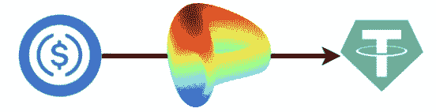

虽然 Curve 团队最近宣布，V2 将允许创建波动性资产之间的交易池，与 Uniswap 和 Balancer 等公司竞争，但该协议的核心功能仍将是低滑点稳定的资产交易。这一重要角色与我们在协议中看到的低水平自动化相结合，就是 Curve 被视为 DeFi 原语的原因。低水平的自动化为专注于为流动性提供者和曲线生态系统中的 CRV 投资者最大化收益和回报的产品创造了机会。

## Curve 曲线的道符

Curve Finance 是一个社区拥有和管理的协议，其核心是 Curve DAO token (CRV)。CRV 的高层目的是激励曲线金融生态系统中的流动性提供者，并让尽可能多的成员参与协议的管理。流动性池不成比例地受到 CRV 通胀的激励，这是由当前 CRV 持有者控制的协议治理机制决定的。

目前，CRV 的三个活跃用途是投票、下注和助推。简而言之，CRV 提供了一部分在 Curve 协议中收取的费用，以及在协议治理中的投票权。

## veCRV —投票锁定 CRV

用户必须锁定 CRV 的时间，才能享受令牌的全部好处。时间锁定是在一段设定的时间内(一周到四年)将 CRV 令牌锁定在曲线内的过程，作为回报，一个人将获得投票托管的 CRV (veCRV)。

veCRV 是不可转让的，时间锁不能逆转，这意味着一旦你把 CRV 转换成 veCRV，你就暂时被困住了。

值得注意的是，对于使用 veCRV 的外部协议，Curve 社区必须通过投票批准该协议，以将其包含在[白名单](https://gov.curve.fi/t/cip-57-whitelist-the-convex-protocol/1654)合同中。

# 曲线协议参与者

在曲线生态系统中，基本上有三种类型的参与者:交易者(在资产之间互换的用户)、流动性提供者(市场促进者)和 CRV 利益相关者(所有者)。这份报告不涉及交易者。

## 流动性提供者

有限合伙人将资产注入交易池，交易池创建了一个具有 AMM 结构的高效交易机制，以便用户能够在资产之间进行交易。作为回报，有限合伙人从交易费用中获得收益(以 CRV 的形式)，这取决于特定池的计量重量。一个标准重量决定了一个特定的池接受多少每日 CRV 通货膨胀。

值得注意的是，一些项目，如 Alchemix 和 Lido，也向流动性提供者空投了他们自己的代币。这样做通常是为了增加某些泳池的吸引力，但也有其他原因。

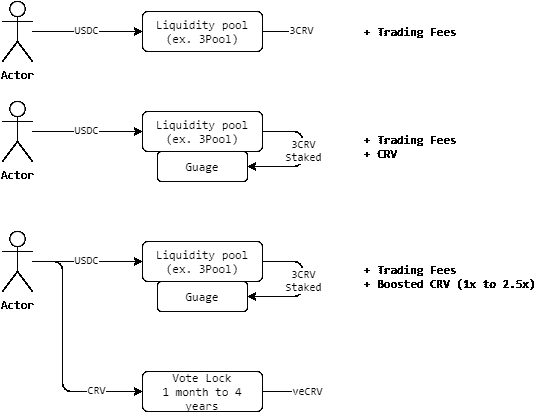

## CRV 赌注

一旦标桩，veCRV 持有人有权:

*   曲线道的投票权
*   曲线平台交易费用的 50%分成
*   CRV 对**自有**流动性拨备的回报提高了 2.5 倍。

## 曲线参与者困境

流动性是 DeFi 协议的生命线，开发者试图创造一定程度的资本粘性。曲线开发者试图通过令牌机制将有限合伙人和 CRV 持有者这两个群体合并，从而鼓励有限合伙人做出长期协议承诺。这可以从以下事实中观察到:只要流动性和有限合伙人在 CRV(一种投机性资产)得到回报，veCRV 持有者/ CRV 投资者就有机会提高他们的**。**

# **凸金融**

**Convex 是曲线用户的中间层，为两种类型的参与者提供灵活性，并在流动性提供商通过 Convex 将 [LP 令牌](https://coinmarketcap.com/alexandria/glossary/liquidity-provider-tokens-lp-tokens)注入曲线，而 CRV 持有者通过 Convex 基本锁定时，创建一种更具共生性的关系。**

**通过这个中间层，可以分离并最大化最终收益率和治理，这是不可能通过与 Curve 的直接交互实现的，因为它是围绕粘性流动性的吸引力而设计的。**

**这种方法巩固了共生关系，即 CRV 股东依靠有限合伙人产生额外收入，而有限合伙人依靠 CRV 股东以最大提升系数维持流动性池。对于希望直接在曲线规中下注 LP 令牌的 LP 或直接投票托管其 CRV 的 CRV 持有者来说，情况并非如此。**

## **凸面中的流动性提供者**

**通过在 Convex 上下注有限合伙人代币，有限合伙人能够获得增加的 CRV 奖励、交易费和流动性挖掘奖励，而不必锁定 CRV 来增加他们的准备金。**

**这一点很重要，因为它可以创造出一个对 CRV 没有长期兴趣的关注收益的用户。**

**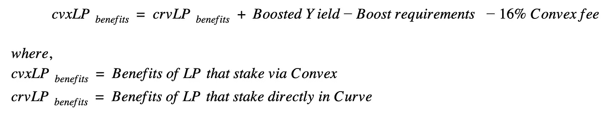**

## **凸形的 CRV 桩**

**Convex 对 CRV 持有者(曲线成功的投资者)的价值增加是 veCRV 的治理和收益部分的分离。**

**使用 Convex 的 CRV 赌注者将获得一部分由 Convex 的有限合伙人获得的提升 CRV 奖励，以从本质上促进提升，以及 Convex 治理令牌奖励。反过来，veCRV 提供的治理权被传递给 Convex 协议和它自己的治理。**

**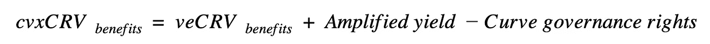**

****cvxCRV****

**当用户(或协议)将 CRV 存入 Convex 时，协议将这些持有量转换为 veCRV，并以接近 1:1 的比率将 cvxCRV 记入存款人的贷方。**

**重要提示:将 CRV 转化为 cvxCRV 是不可逆的(永久的，没有时间限制)。cvxCRV 是可转让的(与 veCRV 不同),流动性可通过第三方 dex 获得。由于这种设计，存在 CRV 到凸面的单向流动。**

## **CVX**

**CVX 是凸背后的治理令牌。令牌通过 Convex 和所有 cvxCRV 持有者发放给持有股份的有限合伙人。此外，CVX 在提供 cvxCRV/CRV 交易作为奖励的 dex 上奖励给有限合伙人。这些激励措施对于确保 CRV 股东能够进入流动性市场并出售 cvxCRV 至关重要。**

**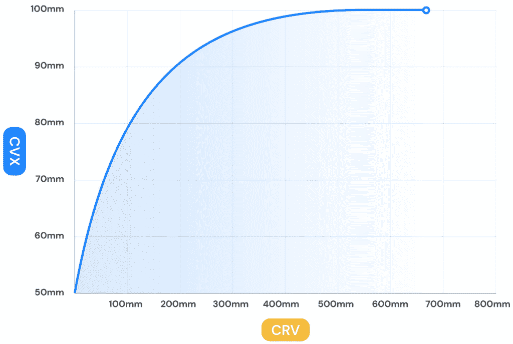**

**总供应量上限:1 亿 CVX**

**排放时间表:每铸造 100，000 个 CVX，CVX 与 CRV 的排放比例就会降低。**

****vlCVX****

**为了获得令牌的全部好处，需要投票锁定。CVX 被锁定大约 16 周零 3 天，因此可以分享协议利润和治理。**

**虽然投票锁定，但利益相关者有权分享流动性提供商获得的协议 CRV 收入，该收入在 cvxCRV 中分配。cvxCRV 无法解绑回 CRV 的事实导致 Convex 养殖的所有 CRV 被捕获并永久锁定在协议内。即使没有额外的 CRV 沉积，这也机械地增加了 veCRV 的总量。**

## **提升即服务**

**Convex 的收入来自有限合伙人通过使用 Convex 协议获得的收益份额。有限合伙人被收取 16%的平台费，从 CRV 奖励中扣除。这项费用目前的分配情况如下。**

*   **CRV 中**形式的 cvxCRV 的 10%****
*   **cvx CVR 的**形式的 vlCVX 的 5%****
*   **1%给收割机**

**收割函数调用者(收割机)是系统的操作工蜂。**

**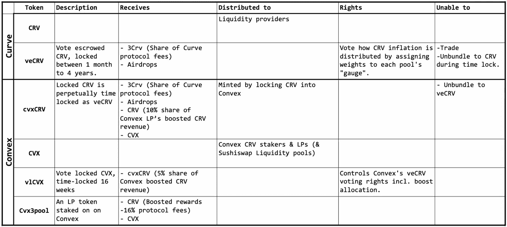**

**Token Summary**

# **凸和曲线博弈论关系**

**Convex 被设计为完全在 Curve Finance 之上运行，并且与它协同工作，人们可以将 Convex 视为一种元协议。如果我们要理解凸的价值，我们必须理解参与者博弈理论**

**Convex 正在经历一个正反馈循环，参与者(有限合伙人和 CRV 股东)不仅为自己，也为他人和整个 Convex 生态系统积累了额外的价值。这是通过象征经济学创造的共生关系实现的，而 Convex 的目标是增加系统中锁定的总流动性和总 veCRV。**

**当有限合伙人进入系统时，分配给 cvxCRV & vlCVX 的费用增加，这吸引了更多的 CRV 被锁定在系统中，这反过来允许系统进一步提高通过 Convex 提供的流动性的收益率。循环重复。**

**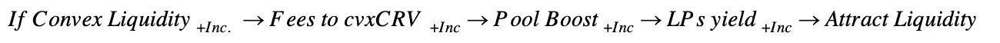**

**vlCVX 持有者从循环中受益，通过增加流动性的价值流，这也导致费用流向代币。**

****

# **治理是一种商品**

**由于所有流经 cvxCRV 的曲线治理权都被 Convex 吸收，并最终被 vlCVX 持有者控制，我们能够计算和比较直接持有 veCRV 与 vlCVX 的投票成本比率。**

****

**假设所有 CVX 都押在 vlCVX 上，每个令牌将控制 8.40 倍的投票权，相当于最近锁定 4 年的 veCRV 单位的投票权。**

**由于在曲线生态系统中为 veCRV 投票权锁定 CRV 的时间可变，投票权将随着锁定的结束而减少。这不是凸的永久锁系统的情况下，这是另一个增值 CRV 桩。**

**这证实了 Convex 采取的治理与产出分离的方法。**

**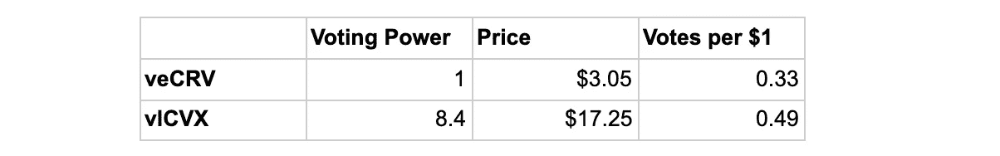**

**如上所述，对于使用 veCRV 的协议，它必须被 Curve governance 列入白名单，这是通过 veCRV 的投票来实现的。这就给希望进入太空的协议制造了一个先有鸡还是先有蛋的问题。**

**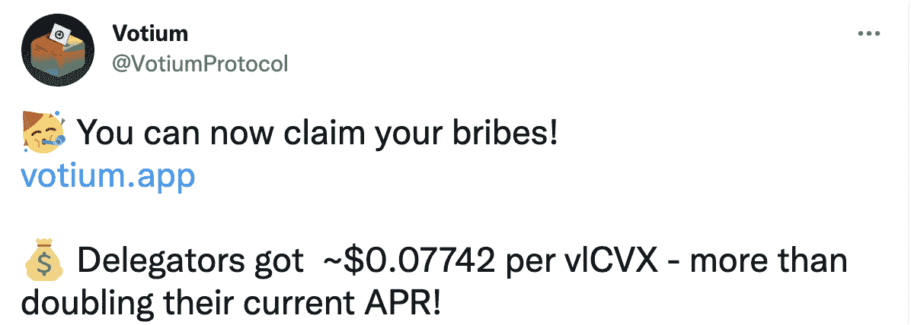**

**直到最近，治理权还很难估值，但“买一票”协议的出现让我们发现了市场价格。这些协议包括[贿赂](https://bribe.crv.finance/)和[贿赂](https://votium.app/)。这种考虑构成了潜在估价模型的一部分。**

# **竞争环境**

**除了 Convex 之外，其他几个项目也大量使用了 Curve。它们提供了利用共享基础设施的替代方法，甚至在某种程度上，协议已经成为曲线上流动性的最大贡献者，而不是直接的用户。这些竞争对手协议中的大部分都是产量聚合器，并与 Convex 直接竞争，因为必须持有 CRV 才能有效地将 Curve 集成到他们的协议中。**

**竞争对手包括 StakeDAO 和 Harvest，但与凸金融最相关的竞争对手是向往金融。向往是规模最大、历史最悠久的自动化基金经理之一。在过去的几个月里，Convex 和向往一直在竞相收购急需的 veCRV，以及未来的 CRV 分销，以最大限度地提高奖励，这是他们最重要的服务产品。**

**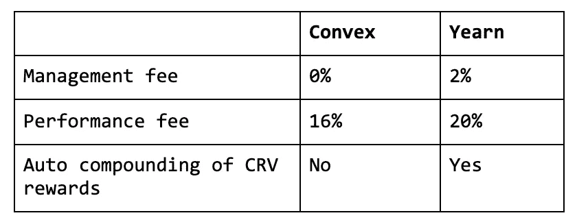**

**early 和 Convex 的根本区别在于，作为收益聚合器的 early 是一个生态系统不可知的协议，它具有令牌组学和策略，以使用户从所呈现的机会中受益，而 Convex 则专注于最大化曲线生态系统机会。CRV 奖的管理方式最好地解释了这一点。“渴望”通常会自动复利回报(出售 CRV 以获得利息 LP 代币)，最大限度地减少对治理代币或类似类型资产的风险敞口。考虑到所有这些，重要的是要注意到，渴望是高度暴露于曲线生态系统。**

**在治理方面，包括直接用户和控制 CRV 的协议在内的曲线社区受到激励，以防止 CRV 销售压力扩大。治理会将渴望型项目视为寄生项目。**

**另一点需要注意的是，使用 Yearn 作为中间层的相关费用很高，其中最相关的是 2%的管理费。尽管 Convex 收取的费用完全用于参与者，但 early 管理费旨在补偿 early 的金库策略师，这与将资产配置到 Curve 的简单收益率策略不太相关。**

**这些因素促成了 Convex 的崛起及其对 CRV 的相当大的控制。**

**对 veCRV 的竞争被加密社区称为曲线战争。一方面，我们有 Convex 的 cvxCRV boost 机构，也有 earning 的 yvBoost。最根本的区别在于，通过强制所有金库将 CRV 收入的 10%存入助推机制，earn 在玩追赶游戏。**

**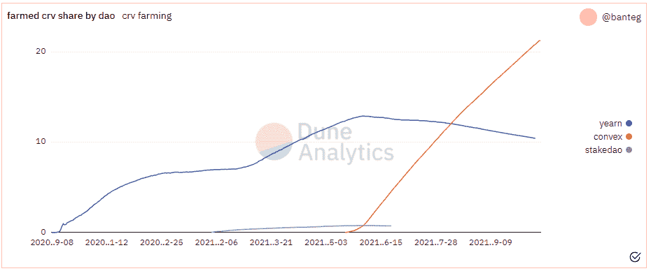**

**凸已建立了强大的领先优势，确保 CRV 捕获。基于为获得未来 CRV 排放量的最大值而制定的累积策略，这是一个高度可防御的基础。**

*   **曲线收益率更高**
*   **通过能够影响协议白名单过程来防御曲线内的灰尘。**
*   **与曲线的共生关系**
*   **有吸引力的费用结构**
*   **注重激励的象征经济学有利于曲线生态系统的长寿，而不是机会主义。**

**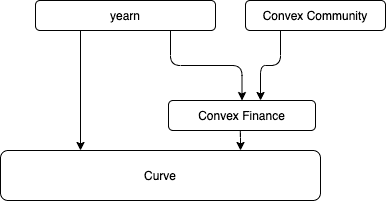**

**为了对抗这种方法，earn 采用了凸面基础设施作为其多策略方法的一部分，并随后获得了部分 CVX 排放量。这一策略在 6 月中旬达到顶峰，当时，该公司控制了全 CVX 21%的股份，目前该公司持有约 13%的股份。**

**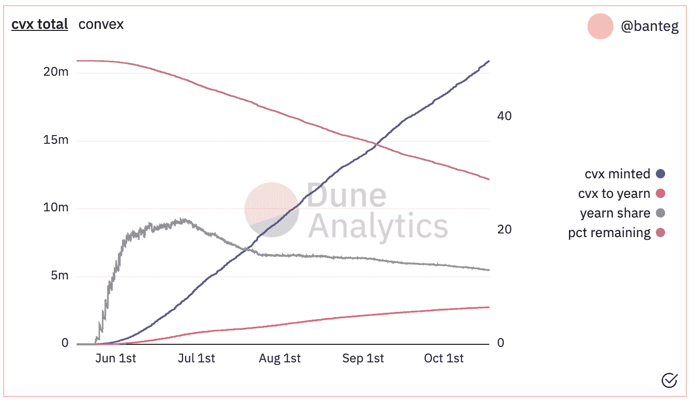**

**向往的方法侧重于 Convex 中的比例治理权，而不是用 CVX 持有者最终控制的 veCRV 来提升自己的池的能力。**

**在一种关系中，当渴望通过 Convex 转向利用曲线基础设施时，渴望和 Convex 之间将形成互补关系，而不是纯粹的竞争关系。这是基于这样一个事实，即在支付 16%的费用后，渴望可以通过 Convex 获得更高的收益率。此外，渴望的竞争性质要求将 CRV 锁定在他们的 yveBoost 协议中，这减少了 CRV 的销售压力。**

# ****简单估价考虑事项****

**任何评估 CVX 的尝试都需要来自曲线协议的大量输入。最重要的是，人们必须考虑 CRV 的价格，因为 Convex 的收入是在 CRV 赚取的。**

**对于该模型，应考虑以下因素。**

*   **凸优势将会增长，供应将会减少，因为产量聚合器(渴望)赚取相对较少的 CRV，必须出售。**
*   **仅考虑 CRV 收入，不考虑投票激励和所有其他因素。**
*   **恒 CRV 锁定了**的 76%****

**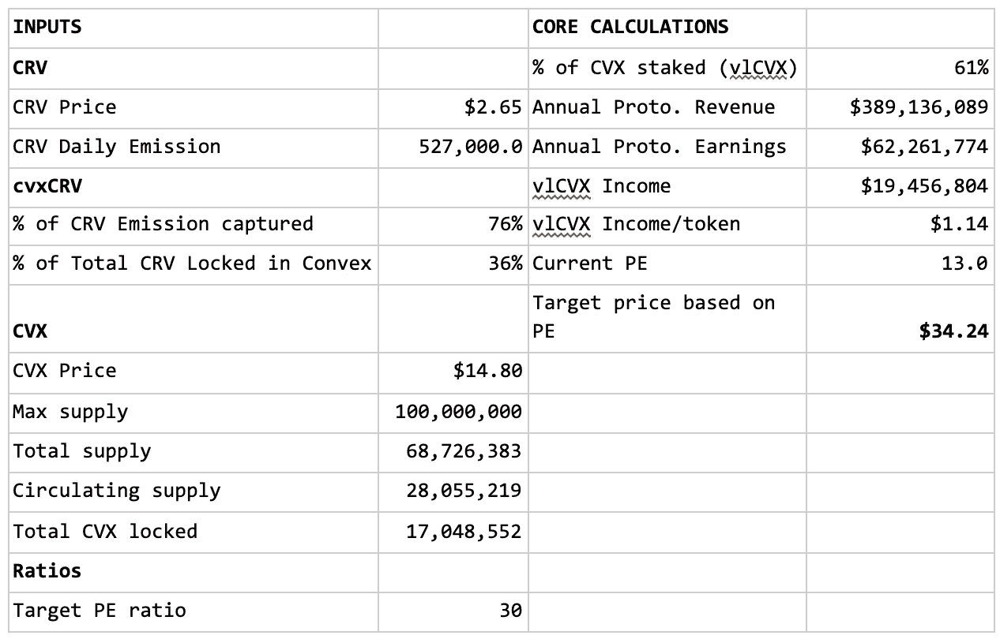**

## **观察**

*   **考虑到当前协议的收入和收益，可以得出结论，在当前的 CVX 比率和 CVX 和的价格下。CVX 的市盈率为 20 倍**
*   **基于 x30 的目标市盈率，我们可以得出结论，CVX 股价应该在**25.52 美元****

# **曲线生态系统角色论题**

**重申一下，Convex 为 CRV 持有者和流动性提供者提供了以互利的方式提高双方回报的能力。这种关系从根本上形成了曲线贡献者的“工人”联盟。**

**该联盟能够确定哪些集合被添加到曲线中，以及分配给所述集合的 CRV 排放量的相对部分。这使得 Convex 处于这样一个位置:进入曲线的有效市场是由 Convex 社区控制的，并且需要项目(即。Stablecoin 项目)支付他们的访问权限。**

**当可以行使重大投票权时，veCRV 持有人控制不同曲线池的 CRV 通胀的治理权极其重要*。* Convex 作为目前最大的 CRV 持有者，在决定通货膨胀方面具有相当大的影响力，并且基本上能够将 CRV 奖励分配给对 Convex 最有利的资产池，从而损害其竞争对手的利益。**

# **可能的估价模型**

**最后，给出了一个更详细的评估，它考虑了这些主题和 Convex 核心模型之外的收入生成。**

**估值特别包括投票激励。最新一轮奖金奖励总计约 200 万美元。未来，随着更多曲线池的出现，投票激励可能会继续发挥作用，并具有货币价值。值得注意的是，贿赂和 Votium 之间的区别在于，前者将奖励分配给所有 vlCVX 持有人，而后者分配给那些在平台上委托持有人。**

*   **我们假设所有的投票授权奖励都流向了 clCVX 持有者，尽管事实并非如此。**
*   **平均投票授权费基于两轮历史投票和一轮即将到来的投票。**

**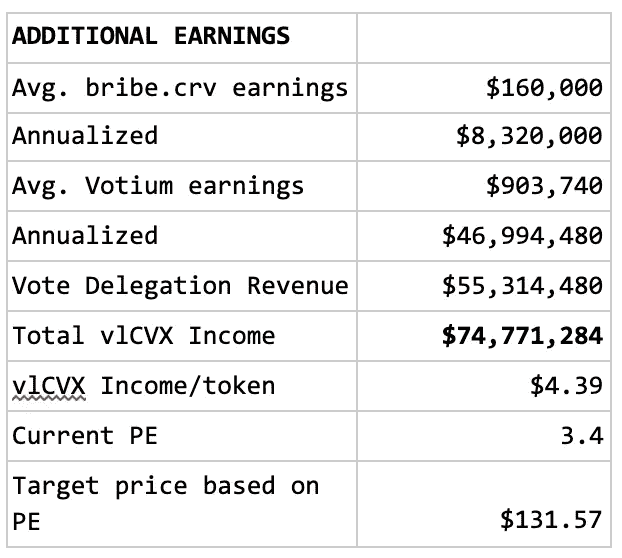**

# **观察**

*   **通过将投票激励视为净收入，Convex 的总收入大幅增加了 3.8 倍**
*   **在考虑投票激励时，CVX 被低估了**

# **结论**

**竞争对手已经建立了广泛利用曲线系统的模型，并在这样做的效率上进行竞争，Convex 通过商品化曲线增强和获得对协议的相当大的控制，而不是通过出售 CRV 的自动复合，建立了与曲线的护城河。**

**Convex 目前看到每月有价值 6800 万美元的 CRV 被锁定在协议中。截至发稿时，价值约 3.52 亿美元的 CRV 股票已经被套牢。这导致该协议控制了 Curve 生态系统中最大的单一投票权来源。**

**作为 Curve Finance 背后的用户-所有者联盟，Convex 有望成为最重要的 DeFi 项目之一。有效地影响并向 DeFi 的支柱之一推销治理。**

**感谢 Convex 社区的大力帮助和 [Ape Froman](https://medium.com/u/2f9325818a4a?source=post_page-----d7e28cd6c1d9--------------------------------) 所做的工作。**

> **加入 Coinmonks [电报频道](https://t.me/coincodecap)和 [Youtube 频道](https://www.youtube.com/c/coinmonks/videos)了解加密交易和投资**

## **也阅读**

** [## 最佳加密交易所| 2021 年十大加密货币交易所

### ICON _ PLACEHOLDEREstimated 预计阅读时间:28 分钟加密货币交易所的加密交易需要知识…

blog.coincodecap.com](https://blog.coincodecap.com/crypto-exchange)  [## 2021 年 10 大最佳加密贷款平台| CoinCodeCap

### 当谈到加密货币贷款时，大量因素等同于良好的收入状况。此外，借款的一部分…

blog.coincodecap.com](https://blog.coincodecap.com/crypto-lending)  [## 2021 年最佳免费加密交易机器人

### 2021 年币安、比特币基地、库币和其他密码交易所的最佳密码交易机器人。四进制，位间隙…

medium.com](/coinmonks/crypto-trading-bot-c2ffce8acb2a)  [## 最佳 4 个加密交易信号电报通道

### 这是乏味的找到正确的加密交易信号提供商。因此，在本文中，我们将讨论最好的…

medium.com](/coinmonks/best-crypto-signals-telegram-5785cdbc4b2b)  [## BlockFi 评论 2021:利弊和利率| CoinCodeCap

### 今天，我们提出了一个全面的 BlockFi 评论，这是一个成立于 2017 年的加密贷款平台，拥有其…

blog.coincodecap.com](https://blog.coincodecap.com/blockfi-review)  [## 如何在印度购买比特币？2021 年购买比特币的 7 款最佳应用[手机版]

### 如何使用移动应用程序购买比特币印度

medium.com](/coinmonks/buy-bitcoin-in-india-feb50ddfef94)  [## 加密税务软件——五大最佳比特币税务计算器[2021]

### 不管你是刚接触加密还是已经在这个领域呆了一段时间，你都需要交税。

medium.com](/coinmonks/best-crypto-tax-tool-for-my-money-72d4b430816b)  [## 存储比特币的最佳加密硬件钱包[2021] | CoinCodeCap

### 保管您的数字资产很容易，但找到正确的存储方式却是一项繁琐的任务。在线钱包有一个风险…

blog.coincodecap.com](https://blog.coincodecap.com/best-hardware-wallet-bitcoin)**