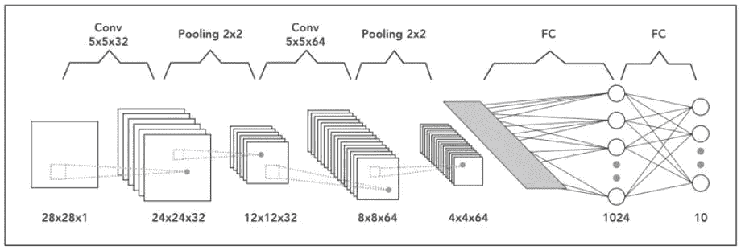

# 卷积神经网络-简而言之

> 原文：<https://medium.com/coinmonks/convolutional-neural-network-in-a-nut-shell-107b5b9364ab?source=collection_archive---------9----------------------->

# **常规神经网络的局限性**

在常规神经网络中，输入通过一系列具有多个神经元的隐藏层进行转换。每个神经元都连接到上一层和下一层中的所有神经元。这种排列称为全连接层，最后一层是输出层。在输入是图像的计算机视觉应用中，我们使用[卷积神经网络](https://engmrk.com/convolutional-neural-network-3/)，因为常规的全连接神经网络效果不佳。这是因为如果图像的每个像素都是一个输入，那么当我们添加更多的层时，参数的数量会呈指数增长。

考虑一个例子，其中我们使用大小为 1 百万像素(1000 高 X 1000 宽)的三色通道图像，那么我们的输入将具有 1000 X 1000 X 3 (3 百万)个特征。如果我们使用具有 1000 个隐藏单元的完全连接的隐藏层，那么权重矩阵将具有 30 亿(300 万×1000)个参数。因此，常规神经网络对于图像分类来说是不可扩展的，因为处理如此大的输入在计算上非常昂贵并且不可行。另一个挑战是大量的参数会导致过度拟合。然而，当涉及到图像时，两个位置相近的单个像素之间似乎没有什么关联。这就引出了卷积的思想。

# 什么是卷积？

**卷积**是两个函数的数学运算，产生第三个函数，表示一个函数的形状如何被另一个函数修改。术语*卷积*既指结果函数，也指计算它的过程[1]。在神经网络中，我们将对输入图像矩阵执行卷积运算，以减少其形状。在下面的例子中，我们将一个 6×6 的灰度图像与一个 3×3 的叫做过滤器或内核的矩阵进行卷积，得到一个 4×4 的矩阵。首先，我们将获取过滤器和图像矩阵的前 9 个元素之间的点积，并填充输出矩阵。然后，我们将在图像上从左到右、从上到下滑动过滤器一个方块，并执行相同的计算。最后，我们将生成一个二维的激活图，它给出了该滤波器在输入图像矩阵的每个空间位置的响应。

# 卷积带来的挑战

**1-收缩输出**

卷积的一个大挑战是，如果我们在多层中执行卷积运算，我们的图像会不断缩小。比方说，如果我们的深层神经网络中有 100 个隐藏层，并且我们在每一层中都执行卷积运算，那么在每一个卷积层之后，我们的图像大小都会缩小一点。

**2-图像角落的数据丢失**

第二个缺点是，来自图像角落的像素仅在少数输出中使用，而中间区域的像素贡献更多，因此我们丢失了原始图像角落的数据。例如，左上角像素仅涉及一个输出，但是中间像素参与至少 9 个输出。

# 填料

为了解决输出收缩和图像角部数据丢失的问题，我们用称为零填充的附加零边界来填充图像。零填充的大小是一个超参数。这允许我们控制输出图像的空间大小。因此，如果我们将 F 定义为滤波器的大小，S 定义为步幅，N 定义为图像的大小，P 定义为所需的填充量，则图像输出大小由下式给出。

Convolution on 6 x 6 image with zero padding = 1

我们可以看到，通过使用零填充作为 1，我们保留了原始图像的大小。填充有两种常见的选择。当我们使用 P = 0 时,“有效”意味着根本没有填充，而当选择 P 值使得输出图像的大小等于输入图像的大小时,“相同”。就过滤器尺寸“F”而言，建议选择奇数。常见的选择有 1，3，5，7…等。

# RGB 图像上的卷积

前面我们看到了灰度图像(6 X 6)的卷积运算。如果我们的图像是 RGB，那么尺寸将是 6 X 6 X 3，其中 3 表示颜色通道的数量。为了检测 RGB 图像中的特征，我们使用具有 3 维的过滤器，其中第 3 维将总是等于通道的数量。

# 单层卷积网络

在卷积网络的一个单层中，我们通过用不同的滤波器卷积我们的图像来检测多个特征。每个卷积运算生成不同的二维矩阵。我们给每个矩阵加上偏置，然后应用非线性。然后将它们全部堆叠在一起，形成一个三维输出。最终输出的第三维将等于卷积运算中使用的滤波器的数量。

## 卷积网络的维数

我们将比较卷积层和常规神经网络层，以计算参数和维数的数量。

Dimension of Convolutional Layer Parameters

# 汇集层

虽然我们的网络的总参数在卷积后减少了，但是我们仍然需要进一步压缩表示的空间大小，以减少网络中的参数和计算的数量。Pooling layer 为我们做了这项工作，加快了计算速度，并使一些功能更加突出。在池层中，我们有两个超参数过滤器大小和步幅，它们只固定一次。下面是两种常见的池层类型。

## 最大池:

让我们考虑一个 4×4 的图像矩阵，我们想把它缩小到 2×2。我们将使用步长为 2 的 2×2 块。我们将从每个块中获取最大值，并将其捕获到新的矩阵中。

Max Pooling

## 平均池:

在平均池中，我们取每个方块的平均值，而不是四个方块的最大值。

Average Pooling

# 卷积神经网络的体系结构

具有一个或多个卷积层的[神经网络](https://engmrk.com/module-14-artificial-neural-network/)称为卷积神经网络(CNN)。让我们考虑一个用于图像分类的深度卷积神经网络的例子，其中输入图像大小是 28 x 28 x 1(灰度)。在第一层中，我们用 32 个 5 x 5 的滤波器进行卷积运算，因此我们的输出将变成 24 x 24 x 32。然后，我们将应用 2 x 2 过滤器池，以减少大小为 12 x 12 x 32。在第二层中，我们将对 64 个大小为 5×5 的滤波器应用卷积运算。输出尺寸将成为 8 x 8 x 64，我们将应用 2 x 2 过滤器的池层，大小将减少到 4 x 4 x 64。最后，我们将通过两个完全连接的层来将我们的图像矩阵转换为分类矩阵。

The architecture of Convolutional Neural Network

# 最后的话

我们学习了卷积层、池化和全连接层。现在的问题是如何将这些层组合起来解决计算机视觉问题。它实际上是一门艺术，可能因问题而异。人们做了大量的研究，提出了许多 CNN 架构，如 LeNet-5、AlexNet、VGG、ResNet 等。首先将这些架构应用到您的问题上，然后根据直觉和结果做出必要的改变，这是一个很好的实践。在下一篇文章中，我们将使用 Keras 实际上[实现一个 CNN。](https://engmrk.com/module-22-implementation-of-cnn-using-keras/)

**参考文献**

1.  [https://en.wikipedia.org/wiki/Convolution](https://en.wikipedia.org/wiki/Convolution)
2.  吴恩达的卷积神经网络。(coursera.org)
3.  神经网络和卷积神经网络基本训练(LinkedIn.com/learning)

本文原载于[*engmrk.com*](https://engmrk.com/convolutional-neural-network-3/)

> [直接在您的收件箱中获得最佳软件交易](https://coincodecap.com/?utm_source=coinmonks)

