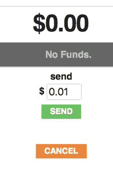

# 酷炫加密——通过链接发送值

> 原文：<https://medium.com/coinmonks/cool-crypto-sending-value-with-a-link-b6cf7277c15d?source=collection_archive---------4----------------------->


Photo by [Roman Mager](https://unsplash.com/photos/5mZ_M06Fc9g?utm_source=unsplash&utm_medium=referral&utm_content=creditCopyText) on [Unsplash](https://unsplash.com/?utm_source=unsplash&utm_medium=referral&utm_content=creditCopyText)

最近我一直在帮忙开发由 [Austin Thomas Griffith](https://medium.com/u/610daeab315b?source=post_page-----b6cf7277c15d--------------------------------) 创建的开源一次性钱包应用。背后的[想法](/gitcoin/ethereum-in-emerging-economies-b235f8dac2f2)是尝试创建一个可以使用移动网络浏览器交换价值的应用程序。它权衡了存储私钥、下载应用程序等的复杂性和最佳实践，只是为了制作一些应该易于上手和易于使用的东西。

我发现最有趣的功能之一是发送一些值的能力，在这个例子中是 [xDai](/poa-network/poa-network-partners-with-makerdao-on-xdai-chain-the-first-ever-usd-stable-blockchain-65a078c41e6a) ，给使用链接的人(在这里试用应用)。这种方法背后的功能非常酷，并且利用了大量的 web3/crypto 基础知识。我觉得深究起来很有意思，觉得值得分享。

## 开始

首先，Dapp 并没有真正“发送”xDai，它更像是一种存款/索赔模式，使用一些很酷的加密技术来确保只有拥有正确信息的人(由发送者通过链接提供)才能索赔。

其次有两个部分 web Dapp 和区块链上的智能合约。web Dapp 实际上只是与智能合约交互的一种很好的方式。

## 逐步地

一步一步的描述帮助我理解了它。请注意，我没有在这里显示代码的所有细节，它更多的是一个高层次的描述，以显示概念。

## 发送

使用 Dapp,“发送者”输入他们想要发送的金额，然后点击发送。



App Send Screen

点击 send 后，Dapp 会在后台做一些工作，以获取智能合约设置所需的输入。

Dapp 使用 [web3.js](https://web3js.readthedocs.io/en/1.0/web3-utils.html#sha3) 散列一些随机数据:

```
let randomHash = web3.utils.sha3("" + Math.random());
```

现在，Dapp 使用 web3.js 生成一个随机帐户，该帐户将有一个私钥和一个公钥:

```
let randomWallet = web3.eth.accounts.create();
```

然后，使用随机钱包私钥对随机散列数据进行[签名](https://web3js.readthedocs.io/en/1.0/web3-eth-accounts.html#sign)(有关签名等的更多细节，请参见下文):

```
let sig = web3.eth.accounts.sign(randomHash, randomWallet.privateKey);
```

Dapp 向区块链智能合约发送一个交易，其值等于与签名和散列数据一起发送的金额:

```
Contract.send(randomHash, sig.signature), 140000, false, value ...
// This is just a pseudo code to give the gist, see the [repo](https://github.com/austintgriffith/burner-wallet) for the full code
```

智能合约包含资金结构到字节 32 ID 键的映射:

```
struct Fund {
    address sender;
    address signer;
    uint256 value;
    uint256 nonce;
    bool claimed;
}

mapping (bytes32 => Fund) public funds;
```

当 Dapp“发送”该值时，智能合约创建新的资金结构，签名者字段被设置为由 Dapp 创建的随机钱包的公钥。该字段很重要，因为它在提出索赔时用作检查:

```
newFund = Fund({
    sender: msg.sender,
    **signer: randomWallet.publicKey,**
    value: msg.value,
    nonce: nonce,
    claimed: false
})
```

现在使用 randomHash 值作为键来映射 newFund:

```
funds[**randomHash**] = newFund;
```

来自发送者的 xDai 现在已经被发送到智能合约，并准备好由具有所需信息的任何人来认领。

最后，Dapp 使用 randomHash 和随机钱包私钥作为链接参数来生成链接:

```
Link Format: xDai.io/randomHash;privateKey
```

然后可以复制链接，并通过 WhatsApp、短信等发送。

**索赔:**

这里可能值得注意的是，这个链接实际上只是一个分享申请 xDai 所需的重要信息的好方法。Dapp 还做了与区块链智能合约交互的艰苦工作。

当链接被访问时，Dapp 从链接中解析 randomHash 和 privateKey。

然后，它使用链接中的私钥对消息进行签名:

```
let accountHash = web3.utils.sha3(claimAccount);
let sig = web3.eth.accounts.sign(accountHash, privateKey);
```

现在，使用签名和原始数据调用智能合同索赔函数:

```
Contact.claim(accountHash, sig, randomHash, claimAccount)
```

Solidity ecrecover 函数用于从签名中获取公共地址(这就是神奇之处，参见下面的信息):

```
address signer = recoverSigner(accountHash, sig);
```

最后，智能合约使用与 randomHash 匹配的密钥检查资金，random hash 的“签名者”等于从签名中恢复的地址。如果是，那么它可以将值发送到索赔者的帐户:

```
if(funds[randomHash].signer == signer && funds[randomHash].claimed == false){    
    funds[randomHash].claimed = true;
    claimAccount.send(funds[randomHash].value);
}
```

唷，就是它！这看起来像是发生了很多事情，但基本的是，这是用户在智能合同中存储价值的一种智能方式，该智能合同只能使用正确的信息来声明，而不显示公共区块链上的信息是什么。

# 酷炫的加密技术

签名，ecrecover，呃什么？？有些事情可能值得更详细地探讨一下。

## 钱包、账户等

用`web3.eth.accounts.create()`生成的帐户有自己的私钥和公钥。更多信息可在[文档](http://ethdocs.org/en/latest/account-management.html?highlight=address#keyfiles)和[中找到，点击这里](https://ethereum.stackexchange.com/questions/33171/ethereum-address-vs-public-key)。私钥和公钥通过具有签名和验证属性的算法链接在一起。

## 签名和验证

以下是对[这篇有帮助的帖子](/@angellopozo/ethereum-signing-and-validating-13a2d7cb0ee3)的一个非常简短的总结。

签名是用户“签署”任何人都可以验证来自该用户的数据的行为。

签名函数将接收私钥和数据。输出将是作为签名的另一个字符串。

为了验证签名来自私钥的所有者，需要签名、原始数据和公钥。

运行从签名数据中恢复公钥的验证器功能。

然后将恢复的公钥与原始公钥进行比较，如果两者相同，则签名有效。

## ecrecover

在这种情况下，Solidity[e Recover](https://solidity.readthedocs.io/en/latest/units-and-global-variables.html#mathematical-and-cryptographic-functions)(椭圆曲线恢复)函数用于恢复与公钥相关的地址。智能合约代码中的 [recoverSigner](https://github.com/austintgriffith/burner-wallet/blob/master/contracts/Links/Links.sol) 函数展示了一个如何做到这一点的示例，而[这个](https://blog.ricmoo.com/verifying-messages-in-solidity-50a94f82b2ca)函数则很好地解释了正在发生的事情。

我认为这是一个非常棒的加密应用的例子！

> [直接在您的收件箱中获得最佳软件交易](https://coincodecap.com/?utm_source=coinmonks)

[](https://coincodecap.com/?utm_source=coinmonks)[](http://bit.ly/2G71Sp7)

[**Click to read today’s top story**](http://bit.ly/2G71Sp7)