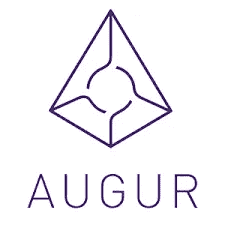

# 花密码的酷方法

> 原文：<https://medium.com/coinmonks/cool-ways-to-spendcrypto-4ba89d2bdc99?source=collection_archive---------7----------------------->

> 如需 Python、Unix 或任何计算机科学方面的帮助，请与我预约时间，学习 [EXL 技能](http://bit.ly/2DloYVM)

当然，比特币是一种很好的价值储存手段，但加密货币背后的真正价值在于如何消费，而不是储蓄。

在加密货币游戏的早期阶段，绝大多数代币从投机中获得价值，而不是使用。随着大多数区块链仍在认真发展，许多技术里程碑将在未来两到五年内到来，可以肯定地说，最好的还在后头。

然而，所有这一切并不意味着可以使用加密货币的区块链应用不存在——因为它们存在，而且正在成倍增加。

> 然而，所有这一切并不意味着可以使用加密货币的区块链应用不存在——因为它们存在，而且正在成倍增加。

如果你的密码开始在你的钱包里烧出一个洞，那么请继续阅读，看看一些最好的去中心化应用程序，让你可以消费和使用加密货币。

## #1 预兆

Augur 是一个用于创建用户生成的预测市场的协议。这句俏皮话能告诉你什么是真正的预兆吗？也许是这样，但用外行人的话来说，Augur 本质上是一个运行在以太坊区块链上的分散式博彩应用程序。

用户可以围绕“谁将赢得 2018 年 NFL 超级碗”这样的问题创建自己的市场—其他用户可以通过下注代币来下注。被下注的代币是 auger 自己的 REP 代币，它使下正确赌注的用户，或 auger 称之为*预测*的用户，有权从 ETH 支付的奖金中分得一杯羹。如果你下了一个不正确的预测，那么你就失去了你下注的销售代表的数量。

更大的情况是，在足够多的预测市场被创造出来，并且正在讨论的事件发生后，占卜平台将能够开始预测未来的事件。REP 有助于激励用户参与到平台中，并随着时间的推移生成可用的数据。

## IDEX

如果你想使用加密货币，那么看看 IDEX 就知道了，这是一个基于智能合约的去中心化交易所。

智能合约是轻量级的条件位代码，允许构建实时运行的应用程序，而无需中央授权。银行需要从分行的柜员到董事会的层级结构，而在智能合约上运行的分布式应用程序只需要智能合约本身和用户给它们命令。

IDEX 在没有中间人的情况下促进基于以太坊的代币(ERC-20)的买卖。交易所用户只需将自己对应的钱包插入交易所，直接与其他用户进行买卖。

作为一个去中心化的应用程序，IDEX 是一个大赢家，在任何给定的时间，成千上万的用户之间的日交易量有时超过 100 万美元。

## 分散土地

分散的土地是一个充满虚拟经济的虚拟现实世界，允许用户建立并过完全沉浸的第二人生。

在以太坊区块链的顶部运行，分散的土地让用户能够通过 VR 头戴设备在 3D 领域内创建、购买和销售他们能想到的任何东西。所有交易都使用以太坊记录，让用户在交易和土地所有权的不变性和安全性方面放心。

在分散土地上买卖的所有资产中，土地成了最热门的卖家。分散地的加密货币名为 MANA，用于买卖财产。最近完成的一笔价值 270 万马纳(21.5 万美元)的 127 块虚拟土地交易显示了虚拟房地产市场变得有多热，随着更多用户来到该平台，几个投机者尽可能多地收购分散的房地产。

## 特龙贝特

Tron 从第一天开始就是一个有争议的项目，主要是因为该网络直言不讳的首席执行官贾斯汀·孙。尽管有些人可能会对孙和他花哨的公众形象有所看法，但有一个事实是清楚的:Tron 的交易量已经在几个场合超过了以太坊网络，并且它的许多分散应用程序都有很高的使用率。

一个这样的 DApp 是 Tronbet，一个运行在 Tron 区块链上的赌博应用程序。为了玩，用户需要一个 TronLink 钱包，里面有一点 TRX，这是 Tron 网络的基础货币。登录 Tronbet.io 网站后，用户可以在 TRX 下注并掷骰子。

掷骰子由智能合约随机产生，并自动向赢家支付 TRX。截至撰写本文时，已支付超过 35 亿 TRX(7700 万美元)的奖金。

> [在您的收件箱中直接获得最佳软件交易](https://coincodecap.com/?utm_source=coinmonks)

