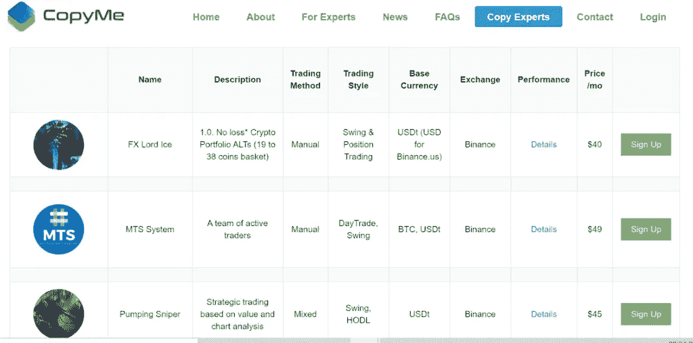

# CopyMe 评论| Copy 专家加密交易者

> 原文：<https://medium.com/coinmonks/copyme-review-copy-expert-crypto-traders-bc7b0302de29?source=collection_archive---------1----------------------->

在这篇文章中，我们将回顾 [CopyMe](https://blog.coincodecap.com/go/copyme) ，它帮助交易者[实时复制来自专家交易者的加密交易](/coinmonks/top-10-crypto-copy-trading-platforms-for-beginners-d0c37c7d698c)策略。他们的总部设在美国密歇根州，并在怀俄明州注册成立。CopyMe 可以帮助您提高交易绩效。

您可以直接连接到交易所的 API，以便快速、安全地执行订单交易。没有利润分享。

## 摘要

*   [CopyMe](https://blog.coincodecap.com/go/copyme) 不需要安装任何额外的软件或 API，就可以从专家那里复制交易策略。
*   复印机必须支付每月或每年的订阅费，从专家那里复制投资策略。您可以选择多个专家。订单会自动执行。
*   所有资金均在您的控制范围内，并安全地存储在受支持的 exchange 中。
*   CopyMe 通过观察交易专家的表现来仔细挑选他们。专家可以自行设定个人认购成本，赚取被动收入。没有利润分享。
*   CopyMe 支持安全、快速的订单执行和低延迟。
*   此外，他们还提供广泛的客户支持。

## 拷贝专家交易员

[CopyMe](https://blog.coincodecap.com/go/copyme) 通过考察交易员在一段时间内的表现，仔细挑选他们。经验丰富的交易员可通过提交相关证明予以考虑。

每个交易者都有他们的业绩页面，以便更好地了解他们的交易策略。

您可以设定每月及每年的订阅费。他们允许你与成千上万的交易者或投资者分享你的交易活动，成倍增加你的交易收入。

您不必安装任何软件或与任何 API 集成。

CopyMe Review: Copy Experts Traders

## 复印机

你可以复制交易活动，以改善你的投资策略。复印机在云端运行，所有订单都自动完成。复印机的平均延迟为 30%，正常运行时间为 99%，复印成功率为 100%。

## 如何复制交易？

你需要添加你的交易所，分配资金，并只是选择战略，你想复制。一旦完成，该战略将被复制和交易将开始。

1.  您必须设置您的 exchange API 密钥。
2.  你必须将一定比例的资金分配给一位或多位专家。
3.  你不应该忘记启用实时交易。
4.  现在交易策略将自动复制。

专家的交易活动受到持续监测。一旦执行了交易活动，则 [CopyMe](https://blog.coincodecap.com/go/copyme) 将代表您执行交易活动。

你应该有足够的基础货币用于交易。建议您至少拥有 10%或更高的基础货币，以避免错过交易。您正在交易的交易所的最低订单金额应得到满足。

独立购买的 BTC、瑞士法郎和 USDT 等基础交易对以外的加密货币将不受影响。

## 抄袭定价

你必须为专家支付每月的订阅费。安装、维护、交易费、佣金或利润分成都是免费的。

## 支持的交换

[CopyMe](https://blog.coincodecap.com/go/copyme) 支持币安、美国币安和 [Bitmex](https://blog.coincodecap.com/go/bitmex) 。

## 客户支持

[CopyMe](https://blog.coincodecap.com/go/copyme) 提供广泛的客户支持。你可以通过实时聊天与他们联系。

您也可以通过[【电子邮件保护】](https://blog.coincodecap.com/cdn-cgi/l/email-protection#f1828481819e8385b1929e81889c94df989e)给他们写信。他们也可以在推特上找到。

此外，它们还有一个活动的[电报](https://t.me/copymetelegram)通道。

## 抄袭评论:利弊

**优点**

1.  您不必安装任何软件或与任何 API 集成。
2.  交易者或投资者可以无缝地复制专家的交易者。
3.  所有交易都是绝对安全的。你所有的资金都存在交易所里。
4.  专家可以自己定价，成倍增加交易收入。
5.  快速订单执行。
6.  用户友好平台。
7.  你可以完全控制你的资金

**缺点**

1.  这是一个相对较新的平台。
2.  没有免费试用。
3.  他们只支持三个交换。

## CopyMe 审查:结论

总之， [CopyMe](https://blog.coincodecap.com/go/copyme) 可以让你复制专家的投资策略。该平台有助于连接交易者和投资者。

专家可以设定他们的月费和年费。复印机可以让专家自动管理他们的资金。没有利润分成，资金完全由你掌控。

## 常见问题(FAQ)

使用 CopyMe 安全吗？

你可以完全控制你的资金。它们被安全地存储在支持的交换中。所有的交易都是完全安全和保密的。

有免费试用吗？

不，CopyMe 目前不提供任何免费试用。

**CopyMe 支持哪些交换？**

CopyMe 支持币安，[币安美国](https://www.binance.us/en/home)，以及 [Bitmex](https://blog.coincodecap.com/go/bitmex) 。

CopyMe 公司在哪里？

CopyMe 总部位于美国密歇根州，在怀俄明州注册成立。

> 加入 Coinmonks [Telegram group](https://t.me/joinchat/EPmjKpNYwRMsBI4p) 并了解加密交易和投资

## 另外，阅读

*   [学习以太坊和 Web3 开发](http://blog.coincodecap.com/go/learn)
*   最好的[密码交易机器人](/coinmonks/crypto-trading-bot-c2ffce8acb2a)
*   [3 商业评论](/coinmonks/3commas-review-an-excellent-crypto-trading-bot-2020-1313a58bec92)
*   [Pionex 审查](/coinmonks/pionex-review-exchange-with-crypto-trading-bot-1e459d0191ea)
*   [AAX 交易所评论](/coinmonks/aax-exchange-review-2021-67c5ea09330c) |推荐代码、交易费用、利弊
*   [德里比特评论](/coinmonks/deribit-review-options-fees-apis-and-testnet-2ca16c4bbdb2) |选项、费用、API 和测试网
*   [FTX 密码交易所评论](/coinmonks/ftx-crypto-exchange-review-53664ac1198f)
*   [n 零审核](/coinmonks/ngrave-zero-review-c465cf8307fc)
*   [Bybit 交换评论](/coinmonks/bybit-exchange-review-dbd570019b71)
*   [3Commas vs Cryptohopper](/coinmonks/3commas-vs-pionex-vs-cryptohopper-best-crypto-bot-6a98d2baa203)
*   最好的比特币[硬件钱包](/coinmonks/the-best-cryptocurrency-hardware-wallets-of-2020-e28b1c124069?source=friends_link&sk=324dd9ff8556ab578d71e7ad7658ad7c)
*   [密码本交易平台](/coinmonks/top-10-crypto-copy-trading-platforms-for-beginners-d0c37c7d698c)
*   [莱杰 nano s vs x](https://blog.coincodecap.com/ledger-nano-s-vs-x)
*   [Vauld 审查](https://blog.coincodecap.com/vauld-review)
*   最好的[加密税务软件](/coinmonks/best-crypto-tax-tool-for-my-money-72d4b430816b)
*   最佳[密码借贷平台](/coinmonks/top-5-crypto-lending-platforms-in-2020-that-you-need-to-know-a1b675cec3fa)
*   [莱杰纳米 S vs 特雷佐 one vs 特雷佐 T vs 莱杰纳米 X](https://blog.coincodecap.com/ledger-nano-s-vs-trezor-one-ledger-nano-x-trezor-t)
*   [block fi vs Celsius](/coinmonks/blockfi-vs-celsius-vs-hodlnaut-8a1cc8c26630)vs Hodlnaut
*   [Bitsgap 评论](/coinmonks/bitsgap-review-a-crypto-trading-bot-that-makes-easy-money-a5d88a336df2)——一个轻松赚钱的加密交易机器人
*   为专业人士设计的加密交易机器人
*   [共同追踪审查](/coinmonks/cointracking-review-a-reliable-cryptocurrency-tax-software-5114e3eb5737)
*   [优霍德勒评论](/coinmonks/youhodler-4-easy-ways-to-make-money-98969b9689f2)
*   [埃利帕尔泰坦评论](/coinmonks/ellipal-titan-review-85e9071dd029)
*   [SecuX Stone 评论](https://blog.coincodecap.com/secux-stone-hardware-wallet-review)
*   [BlockFi 评论](/coinmonks/blockfi-review-53096053c097) |从您的密码中赚取高达 8.6%的利息
*   [共同规则审查](https://blog.coincodecap.com/coinrule-review-a-perfect-trading-bot)
*   l [DEX Explorer](https://explorer.bitquery.io/ethereum/dex) 和[区块链 API](https://explorer.bitquery.io/graphql)
*   [加密套利](/coinmonks/crypto-arbitrage-guide-how-to-make-money-as-a-beginner-62bfe5c868f6)指南:新手如何赚钱
*   最佳[加密制图工具](/coinmonks/what-are-the-best-charting-platforms-for-cryptocurrency-trading-85aade584d80)
*   了解比特币的[最佳书籍有哪些？](/coinmonks/what-are-the-best-books-to-learn-bitcoin-409aeb9aff4b)

> [直接在您的收件箱中获得最佳软件交易](/coinmonks/newsletters/coinmonks)

*原载于 2021 年 1 月 14 日 https://blog.coincodecap.com***。**