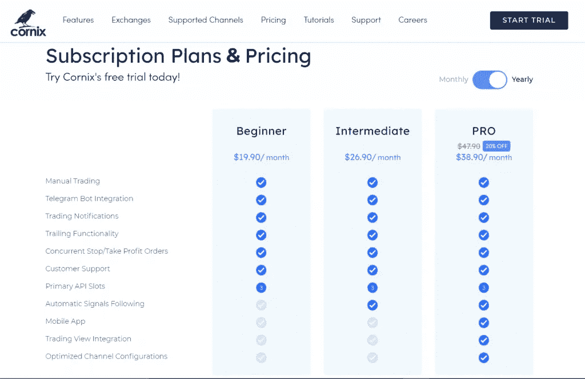

# Cornix 评论 2022—它是最好的加密电报机器人吗？

> 原文：<https://medium.com/coinmonks/cornix-review-1300f8dc3dff?source=collection_archive---------1----------------------->

本文将回顾 [**Cornix**](https://blog.coincodecap.com/go/cornix) 交易 bot 这个机器人允许你自动化基于电报的[密码信号](https://blog.coincodecap.com/what-are-crypto-trading-signals)。您可以使用 API 密钥将机器人连接到您的交易平台，然后单击信号下方的 follow 按钮来完成交易。

# 摘要

*   [密码信号电报通道](https://blog.coincodecap.com/free-crypto-signals)提供买入区间，止盈，止损。
*   Cornix 是一个电报[加密交易机器人](/coinmonks/crypto-trading-bot-c2ffce8acb2a)，使用 API 密钥工作。
*   大多数加密信号电报信道使用 [Cornix](https://blog.coincodecap.com/go/cornix) 来自动化它们的信号。
*   你可以开始使用 [**Cornix**](https://blog.coincodecap.com/go/cornix) 进行 14 天的试用，然后选择一个最适合你的方案。
*   [Cornix](https://blog.coincodecap.com/go/cornix) 支持几乎所有的热门交易所，你可以 24*7 联系到他们的支持。

> 使用 code FREE 在 Cornix 上获得折扣。

# 什么是加密交易信号？

加密交易信号帮助你获得回报，同时了解加密市场。他们为你提供了一个基于专业交易者的研究制定交易策略的机会。加密信号电报通道为你提供买入范围，止盈，止损来完成交易。要了解更多，请阅读[最佳加密交易信号电报渠道](https://blog.coincodecap.com/best-crypto-signals-telegram)。

然而，电报加密交易机器人领先一步，为你进行交易。那么现在让我们来了解一下 Cornix 交易机器人。

# 什么是 Cornix？

Cornix trading bot 为你提供了一个自动化电报加密信号的机会。它还根据你的交易策略提供交易视图提醒。无论您是手动交易还是自动交易，都可以利用 Cornix 交易机器人的尖端交易功能来降低风险。

此外，Cornix 有其移动应用程序和电报机器人来服务于这一目的。你所要做的就是下载并连接 Cornix 到[电报加密信号信道](https://blog.coincodecap.com/best-crypto-signals-telegram)，它的机器人就会从你的账户进行交易。然而，与其他 bot 提供商(如**[**Bitsgap**](https://blog.coincodecap.com/go/bitsgap)等)相比，配置 Cornix 有时可能具有挑战性。**

****

# **Cornix 是如何工作的？**

**[**Cornix**](https://blog.coincodecap.com/go/cornix) 是一个加密交易电报 bot 因此，它完全通过[电报](https://telegram.org/)进行操作。Cornix 的主要目的是简化新手的交易。因此，bot 使用 API 密钥连接您的交易交易所。所以你的资产总是留在你的钱包里，机器人只代表你下订单。**

**在大多数情况下，您可以使用 Telegram 简单地设置 bot。在加入加密信号电报通道时，您可能有权使用 Cornix，具体取决于信号提供商。要跟踪一个信号，你只需点击特定信号下方的跟踪按钮。此后，Cornix 机器人将为你做一切。**

# **Cornix 评论:功能**

**[**Cornix**](https://blog.coincodecap.com/go/cornix)trading bot 附带了一系列功能，让我们来了解一下这些功能:**

*   ****交易**:你可以通过 Cornix 查看、管理、检查历史，深入研究你的交易的风险比率和回报。**
*   ****投资组合**:跟踪你的投资组合的表现，分析你的资产在不同交易所的分布，用 [**Cornix**](https://blog.coincodecap.com/go/cornix) 了解硬币的市场价值。**
*   ****通知:**通过电报和推送通知获得你的交易和活动的所有更新。**
*   ****配置**:机器人还为您提供定制的交易配置。通过这个，你可以为你的每个加密交易信号电报通道获得最佳配置。**

# **康尼克斯评论:电报机器人**

**[**Cornix**](https://blog.coincodecap.com/go/cornix) 电报机器人提供了一种直接跟踪电报频道中发布的加密信号的方法。机器人代表你下订单，可以做多笔交易，有不同的止盈止损。您可以按照以下步骤设置 Cornix trading bot:**

# **使用 Cornix 进行交易的步骤**

*   **去[官网 **Cornix**](https://blog.coincodecap.com/go/cornix) 。**
*   **获得 Cornix 的 14 天免费试用，然后点击开始。**
*   **Cornix 机器人会引导你通过；点击开始。**
*   **机器人会要求你启用电报通知。**
*   **现在，您必须向 Cornix bot 添加一个客户端。一个客户就是你的交易平台，例如[币安](https://blog.coincodecap.com/go/binance)。**
*   **该机器人将要求您输入您选择的交易所的 API 密钥。完全按照机器人告诉你的去做，否则你可能不得不重复这个过程。**
*   **现在将要求您选择一个频道。该机器人将显示您订阅的频道列表以及该机器人支持的频道列表。您可以通过访问 [Cornix 合作伙伴部分](https://cornix.io/partners)查看支持的渠道列表。**
*   **选择一个渠道后，启用该渠道的自动交易。**
*   **现在导航到 Bot 配置>交易>客户名称>一般>每次交易的金额，并决定每次交易的投资金额。但是，作为默认设置，该机器人会自动打开 5%。**

****

# **如何在 Cornix 上发布信号？**

**你可以在你的电报频道上发布交易信号，并让你的用户使用 [Cornix 交易机器人](https://blog.coincodecap.com/go/cornix)跟踪它们。有两种方法可以做到这一点:**

1.  **最简单的方法是直接在文本空间中键入原始文本，然后原封不动地发布。但是，您必须遵循特定的格式；否则，机器人不会识别它。要了解指定的格式，请访问 [Cornix 信号发布](https://cornix.zendesk.com/hc/en-us/articles/360049182674-Signal-Posting)部分。**
2.  **在发布信号的第二种方式中，您必须浏览机器人的主菜单，并在 signals 选项卡下，单击 publish 按钮。在这里你会发现两个选项:引导文本和自由文本。点击向导选项，信号向导会帮你创建交易信号，然后发布到通道。访问 [Cornix 信号发布](https://cornix.zendesk.com/hc/en-us/articles/360049182674-Signal-Posting)部分了解更多信息。**

# **Cornix trading bot 可以和哪些交易所合作？**

**了解您正在使用的交换机或您的信号提供商是否受 Cornix bot 的支持是非常重要的。因此，以下是 Cornix 上所有可用交易所的列表:**

*   **[币安](https://blog.coincodecap.com/go/binance)**
*   **[Bybit](https://blog.coincodecap.com/go/bybit)**
*   **[德里比特](https://blog.coincodecap.com/go/deribit)**
*   **[库币](https://blog.coincodecap.com/go/kucoin)**
*   **[火币](https://blog.coincodecap.com/go/huobi)**
*   **[Bitmex](https://blog.coincodecap.com/go/bitmex)**
*   **[Bittrex](https://blog.coincodecap.com/go/bittrex)**

**除此之外，您还可以从 [Cornix 合作伙伴部分](https://cornix.io/partners)看到 Cornix 上支持的频道列表。**

# **Cornix 评论:安全性和可靠性**

**Cornix 是加密交易行业中一个可靠且安全的交易机器人。到目前为止， [Cornix](https://blog.coincodecap.com/go/cornix) 还没有面临任何安全威胁。此外，Cornix 使用 API 密钥与您的交易平台连接。因此，您的资金始终保存在您的交易所的钱包中，bot 没有权限进行提款。**

# **Cornix 帮助**

**Cornix 通过电报聊天提供全天候帮助。你可以访问 [**的官方网站 Cornix**](https://blog.coincodecap.com/go/cornix) ，在导航选项卡下，你会找到跳转到支持聊天的选项。您可以在那里键入您的问题，也可以提供与问题相关的详细信息。支持团队将尽快给您回复。**

# **Cornix 的订阅计划**

**Cornix 有三种不同的订购计划，初级、中级和专业版。您可以选择按月或按年订阅；但是，选择年度计划可以享受 20%的折扣。要了解每个计划的更多信息，请参考下图:**

****

# **科尼克斯评论:利弊**

****优点**随时随地自动化交易。在设置 [Cornix bot](https://blog.coincodecap.com/go/cornix) 和优化您的回报时，在某些情况下会出现问题。该机器人自动使用电报你的密码交易信号。有助于降低风险和增加利润。**

# **康尼克斯评论:结论**

**[**Cornix trading bot**](https://blog.coincodecap.com/go/cornix) 就是为你做这份苦差事的。这是一个更好的选择，特别是如果你是一个密码交易的初学者。Cornix trading bot 帮助您使用一键跟踪选项自动加密交易信号。您可以从 Cornix 交易机器人的 14 天免费试用开始，并通过使用其所有功能来学习优化您的交易策略。**

# **常见问题**

****哪个是最好的 Cornix 替代品？****

**[**Cornix**](https://blog.coincodecap.com/go/cornix) 交易机器人最适合加密信号电报通道。然而，当谈到它的替代品时，你可以使用 CryptoHopper 电报交易机器人。要了解更多信息，请阅读 Cryptohopper 加密信号电报机器人。**

****Cornix 安全吗？****

**Cornix 是最可靠的电报加密交易机器人之一。几乎所有的加密交易信号提供商都使用 Cornix 交易机器人，包括 [VCT](https://blog.coincodecap.com/go/verifiedcryptonews) 、[通用加密信号](https://blog.coincodecap.com/go/universalcryptosignals)等。**

**Cornix 交易机器人对不和谐有作用吗？**

**Cornix 仅通过[电报](https://telegram.org/)提供服务，目前未向[不一致](https://discord.com/)提供服务。**

*   **什么是加密交易信号？【解释 2021】**
*   **[最佳 6 个密码交易信号电报通道](https://blog.coincodecap.com/best-crypto-signals-telegram)**
*   **[4 个最佳免费加密信号|顶级加密交易信号电报频道](https://blog.coincodecap.com/free-crypto-signals)**
*   **比特币和黄金——这是正确的比较吗？**

****披露—包括附属链接****

> **加入 [Coinmonks 电报频道](https://t.me/coincodecap)，了解加密交易和投资**

## **另外，阅读**

*   **[尤霍德勒 vs 科恩洛安 vs 霍德诺特](/coinmonks/youhodler-vs-coinloan-vs-hodlnaut-b1050acde55a) | [Cryptohopper vs 哈斯博特](https://blog.coincodecap.com/cryptohopper-vs-haasbot)**
*   **[币安 vs 北海巨妖](https://blog.coincodecap.com/binance-vs-kraken) | [美元成本平均交易机器人](https://blog.coincodecap.com/pionex-dca-bot)**
*   **[如何在印度购买比特币？](/coinmonks/buy-bitcoin-in-india-feb50ddfef94) | [WazirX 审核](/coinmonks/wazirx-review-5c811b074f5b) | [BitMEX 审核](https://blog.coincodecap.com/bitmex-review)**
*   **[比特币主根](https://blog.coincodecap.com/bitcoin-taproot) | [Bitso 评论](https://blog.coincodecap.com/bitso-review) | [排名前 6 的比特币信用卡](/coinmonks/bitcoin-credit-card-bc8ab6f377c6)**
*   **[双子座 vs 比特币基地](https://blog.coincodecap.com/gemini-vs-coinbase) | [比特币基地 vs 北海巨妖](https://blog.coincodecap.com/kraken-vs-coinbase) | [硬币罐 vs 硬币点](https://blog.coincodecap.com/coinspot-vs-coinjar)**
*   **[印度加密交易所](/coinmonks/bitcoin-exchange-in-india-7f1fe79715c9) | [比特币储蓄账户](/coinmonks/bitcoin-savings-account-e65b13f92451) | [Paxful 审核](/coinmonks/paxful-review-4daf2354ab70)**
*   **[杠杆令牌](/coinmonks/leveraged-token-3f5257808b22) | [最佳密码交易所](/coinmonks/crypto-exchange-dd2f9d6f3769) | [密码交易机器人](https://blog.coincodecap.com/best-crypto-trading-bots)**
*   **[Godex.io 审核](/coinmonks/godex-io-review-7366086519fb) | [邀请审核](/coinmonks/invity-review-70f3030c0502) | [BitForex 审核](/coinmonks/bitforex-review-c4bb28d9e271) | [HitBTC 审核](/coinmonks/hitbtc-review-c5143c5d53c2)**
*   **[Crypto.com 费用](/coinmonks/binance-fees-8588ec17965) | [僵尸加密审查](/coinmonks/botcrypto-review-2021-build-your-own-trading-bot-coincodecap-6b8332d736c7) | [替代品](https://blog.coincodecap.com/crypto-com-alternatives)**
*   **[MXC 交易所评论](/coinmonks/mxc-exchange-review-3af0ec1cba8c) | [Pionex vs 币安](https://blog.coincodecap.com/pionex-vs-binance) | [Pionex 套利机器人](https://blog.coincodecap.com/pionex-arbitrage-bot)**
*   **[我的密码交易经验](/coinmonks/my-experience-with-crypto-copy-trading-d6feb2ce3ac5) | [比特币基地评论](/coinmonks/coinbase-review-6ef4e0f56064)**
*   **[加密货币储蓄账户](/coinmonks/cryptocurrency-savings-accounts-be3bc0feffbf) | [赌注加密](https://blog.coincodecap.com/staking-crypto) | [窃取 x 评论](/coinmonks/stealthex-review-396c67309988)**
*   **[BigONE 交易所评论](/coinmonks/bigone-exchange-review-64705d85a1d4) | [CEX。IO 审查](https://blog.coincodecap.com/cex-io-review) | [交换区审查](/coinmonks/swapzone-review-crypto-exchange-data-aggregator-e0ad78e55ed7)**
*   **[最佳比特币保证金交易](/coinmonks/bitcoin-margin-trading-exchange-bcbfcbf7b8e3) | [Bityard 保证金交易](https://blog.coincodecap.com/bityard-margin-trading) | [Prokey 审核](/coinmonks/prokey-review-26611173c13c)**
*   **[加密保证金交易交易所](/coinmonks/crypto-margin-trading-exchanges-428b1f7ad108) | [赚取比特币](/coinmonks/earn-bitcoin-6e8bd3c592d9) | [Mudrex 投资](https://blog.coincodecap.com/mudrex-invest-review-the-best-way-to-invest-in-crypto)**
*   **[WazirX vs coin dcx vs bit bns](/coinmonks/wazirx-vs-coindcx-vs-bitbns-149f4f19a2f1)|[block fi vs coin loan vs Nexo](/coinmonks/blockfi-vs-coinloan-vs-nexo-cb624635230d)**
*   **[BlockFi 信用卡](https://blog.coincodecap.com/blockfi-credit-card) | [如何在币安购买比特币](https://blog.coincodecap.com/buy-bitcoin-binance) | [网格交易机器人](https://blog.coincodecap.com/grid-trading)**
*   **[加密副本交易平台](/coinmonks/top-10-crypto-copy-trading-platforms-for-beginners-d0c37c7d698c) | [五大 BlockFi 替代方案](https://blog.coincodecap.com/blockfi-alternatives)**
*   **[CoinLoan 审核](/coinmonks/coinloan-review-18128b9badc4)|[Crypto.com 审核](/coinmonks/crypto-com-review-f143dca1f74c) | [火币保证金交易](/coinmonks/huobi-margin-trading-b3b06cdc1519)**
*   **[顶级付费加密货币和区块链课程](https://blog.coincodecap.com/blockchain-courses) | [币安评论](/coinmonks/binance-review-ee10d3bf3b6e)**
*   **[在美国如何使用 BitMEX？](https://blog.coincodecap.com/use-bitmex-in-usa) | [BitMEX 回顾](https://blog.coincodecap.com/bitmex-review) | [币安 vs Bittrex](https://blog.coincodecap.com/binance-vs-bittrex)**
*   **[最佳免费加密信号](https://blog.coincodecap.com/free-crypto-signals) | [YoBit 评论](/coinmonks/yobit-review-175464162c62) | [Bitbns 评论](/coinmonks/bitbns-review-38256a07e161) | [OKEx 评论](/coinmonks/okex-review-6b369304110f)**
*   **[比特币基地跑马圈地](https://blog.coincodecap.com/coinbase-staking) | [Hotbit 点评](/coinmonks/hotbit-review-cd5bec41dafb) | [KuCoin 点评](https://blog.coincodecap.com/kucoin-review) | [期货交易机器人](/coinmonks/futures-trading-bots-5a282ccee3f5)**
*   **[最佳加密交易信号电报](/coinmonks/best-crypto-signals-telegram-5785cdbc4b2b) | [MoonXBT 评论](/coinmonks/moonxbt-review-6e4ab26d037)**

***原载于 2021 年 6 月 25 日 https://blog.coincodecap.com***。****